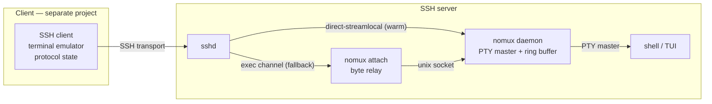
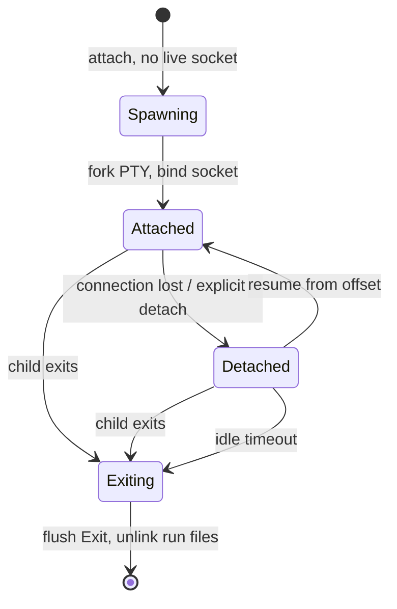
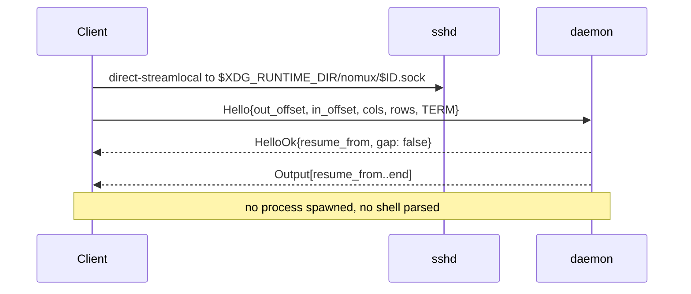

# nomux — Design

`nomux` is a single static Linux binary that runs **on an SSH server**. It owns a
PTY and a bounded output buffer so a terminal session survives the loss of the SSH
connection that created it.

Low-level details: [IMPLEMENTATION.md](IMPLEMENTATION.md).

## 1. Problem

Mobile SSH connections drop constantly — WiFi↔cellular handoff, NAT rebind, radio
sleep, Doze, app eviction. Plain SSH loses the shell and everything it held.

The existing fix is a multiplexer (`tmux`, `screen`). That works, but costs a prefix
key, a rewritten `TERM`, a second copy-mode, broken host scrollback, and OSC
passthrough bugs — a large visible surface for one property.

## 2. Scope

This repo is **the server binary only**. The SSH client and terminal emulator are a
separate project — but one written by the same author.

That matters more than it sounds. The two ship as a unit, so:

- The wire protocol is **private**. No negotiation, no extension points, no third-party clients, no stability guarantee. Enums are exhaustive; an unknown value is a bug, not a forward-compatibility case.
- Behaviour may be split across the boundary wherever it is cheapest, not wherever it is most "correct" for a hypothetical other consumer. Emulator reset on gap recovery lives client-side because the client already has the emulator.
- Version skew has exactly one real case (§6.4), and it is bounded rather than designed around.

Nothing here aims to be a general terminal tool.

| In scope | Out of scope |
| --- | --- |
| PTY ownership, session persistence | Multiplexing: panes, windows, prefix key, status bar |
| Output ring buffer + replay | Session sharing, read-only mirrors, collaboration |
| Resume protocol over stdio | Replacing the SSH transport |
| Self-bootstrap onto a host | Client-side UI, key management, terminal emulation |

## 3. Key properties

### Byte-stream replay, not screen-state sync

The daemon buffers raw PTY bytes with monotonic offsets and replays from the
client's last acknowledged offset. It does **not** model the screen.

- Perfect fidelity: sixel, OSC 52, hyperlinks, mouse, bracketed paste all pass through untouched.
- Scrollback survives, because scrollback is just earlier bytes.
- No terminal emulator on the server — the client already has one, and a second, lossier one is pure liability.
- Cost: a long disconnect can overflow the buffer. Handled explicitly as a *gap* (§6.3), not papered over.

Contrast: mosh syncs screen state, which forces a server-side emulator, discards
scrollback, and needs explicit support for every new escape sequence.

### Carry the resume channel over a fresh SSH connection, not a side channel

Resume is a new SSH connection running one command, or one
`direct-streamlocal@openssh.com` channel. There is no nomux-owned socket on the
network.

- Inherits ProxyJump, certificates, 2FA, agent forwarding, `authorized_keys` restrictions, and the host's audit configuration for free.
- Works through bastions and captive corporate networks.
- Cost: a full SSH handshake per resume. Acceptable — on mobile that latency is dominated by radio wake anyway, and we are not chasing mosh's sub-second roaming feel.

Contrast: Eternal Terminal opens its own TCP port; mosh needs a UDP range.

### Zero server-side install

The client carries the binary and pushes it on first use. Nothing is installed by
an administrator, no package exists, no root is required.

This is the adoption property. Every other persistence tool needs a binary put on
the host first — by an administrator, or by you, once per host and once per upgrade.
That step is why people fall back to `tmux`: it is at least already on the box.
`nomux` does it for you, on a host you were handed access to five minutes ago.

### No new ports, no new crypto

No network listener, no key exchange, no cipher selection, no certificate handling.
What the daemon does listen on is the filesystem: a unix socket at mode `0600`
inside a `0700` directory per session, and a second one beside it — `<id>.agent` —
for the sessions that opted into agent forwarding (§5.4).

There is nothing new for a firewall to block, and what a security team has to review
is the local surface enumerated in §8 rather than a protocol. All confidentiality and
authentication is SSH's, unchanged.

## 4. Architecture



Five modes of one binary, in four groups — `kill` and `list` are one surface with
one contract:

| Mode | Lifetime | Role |
| --- | --- | --- |
| `nomux daemon` | Outlives connections | Owns the PTY master, child process, ring buffer, and unix socket. Speaks the wire protocol. |
| `nomux attach` | One connection | Dumb byte relay between stdio and the unix socket. No protocol awareness. Skipped entirely when `direct-streamlocal` is available. |
| `nomux probe` | One-shot | Reports OS, architecture, and resolved install path for bootstrap. |
| `nomux kill` / `nomux list` | One-shot | Frozen control surface. Acts on the run directory — the five files per session listed in [IMPLEMENTATION.md § 6.6](IMPLEMENTATION.md#66-frozen-control-surface) — never on the session protocol, so any build can manage any daemon regardless of version. |

The protocol is spoken end-to-end between the client and the daemon. `attach` is
deliberately dumb so protocol logic exists in exactly one place.

## 5. Session lifecycle



The daemon keeps draining the PTY while detached — otherwise the child blocks on
write and the session appears frozen on reattach.

### 5.1 Identity

**One session per client tab.** The client mints an opaque id when a tab is created;
session identity *is* tab identity. There is no naming UI, no session picker, and no
id ever shown to the user — they see tabs.

Consequences:

- The daemon never interprets an id. It is a filename component and nothing else, so it is validated strictly against path traversal (see [IMPLEMENTATION.md § 6.3](IMPLEMENTATION.md#63-socket)).
- Opaque ids do not survive loss of client state. After a reinstall the daemons are still running but the app no longer knows which tab each was. A human-readable label is therefore stored beside the socket, so `nomux list` stays meaningful and orphans are recoverable rather than anonymous.
- Concurrency is capped at 8 sessions per host, enforced client-side. The daemon does not enforce it; each daemon owns exactly one PTY and knows nothing of its siblings.

Rejected alternatives: one implicit session per host (survives app reinstall, but no
second terminal for a build alongside an editor) and user-named sessions (solves
both, at the cost of the session-list UI this project exists to avoid).

### 5.2 Reaping

A detached session exits on its own after a long idle period — 7 days, not
currently tunable — measured as **time since last detach**. A session that never
saw its first client is reaped after 30 s instead.

Output volume is not usable as the signal: it cannot distinguish a multi-hour build
that must survive from a `tail -f` that could run forever, and a shell sitting at a
prompt is indistinguishable from an abandoned one. Time-since-detach is the only
tractable rule, so the default is generous.

This matters more with per-tab ids than it would with one session per host: every
abandoned tab is a shell holding memory, file descriptors and possibly locks on
someone else's server.

### 5.3 Transparency

A session runs exactly what a plain `ssh host` would have run: the user's login
shell, dash-prefixed, with the environment sshd already established. nomux starts
*inside* an SSH session, so this is inheritance rather than reconstruction — see
[IMPLEMENTATION.md § 6.1.1](IMPLEMENTATION.md#611-what-the-child-runs).

The limit is that the environment is captured from the connection that created the
session and frozen for its lifetime. A running process's environment cannot be
mutated, so anything a later reconnect brings with it — a different `DISPLAY`, other
`AcceptEnv` values — is invisible to the child. This is inherent to persistence and
applies equally to `tmux` and `screen`.

The one case worth solving is solved outright: see §5.4.

### 5.4 Agent forwarding

A forwarded `ssh-agent` socket belongs to one SSH connection and is unlinked when it
closes, so a persistent session loses the agent on first reconnect — `git push` and
nested `ssh` break for the rest of the session's life. It is the most-complained-about
`tmux` behaviour, and inheriting it would undercut §5.3.

nomux forwards the agent **itself** instead of borrowing sshd's socket. The daemon
listens on a socket it owns for the session's whole life and proxies each connection
to the client as a protocol sub-channel; the client answers from its own key store.
Nothing dangles, nothing needs refreshing, and no environment has to be re-read —
which matters because the warm resume path (§6.1) runs no process on the server and
so has no environment to read.

Consequences:

- The protocol gains sub-channels ([IMPLEMENTATION.md § 6.7](IMPLEMENTATION.md#67-agent-forwarding)). This is the one place the design multiplexes, and it is a deliberate, bounded exception.
- It works **without** `ForwardAgent`, bypassing a deliberate user decision. So it is opt-in per host, off by default, never enabled silently.
- Because the client sees every request, it *can* prompt per signature or name the asking session — something plain `ssh -A` can never do.

## 6. Connection paths

### 6.1 Warm resume

Steady state, and the path that runs on every network change:



### 6.2 Cold bootstrap

First contact with a host, or after a version bump:

```mermaid
sequenceDiagram
  participant C as Client
  participant S as sshd
  participant D as daemon
  C->>S: exec: exec $p/nomux-$VER attach $ID ; echo "NOMUX-BOOTSTRAP $(uname -s) $(uname -m) $p"
  S-->>C: NOMUX-BOOTSTRAP Linux aarch64 /home/u/.local/share/nomux
  C->>S: exec: cat to tmp, chmod, mv, then exec nomux-$VER attach $ID
  S->>D: spawn daemon, connect socket
  D-->>C: HelloOk{resume_from: 0}
```

Two round trips cold, zero extra warm — the `exec` replaces the shell on success, so
the probe line is only reached on failure. Details in
[IMPLEMENTATION.md § Bootstrap](IMPLEMENTATION.md#5-bootstrap).

### 6.3 Gap

The buffer is bounded. If a disconnect outlasts it, the oldest bytes are gone and
resuming mid-escape-sequence would corrupt the client's emulator. This is reported
as an explicit `Gap` frame rather than silently truncating: the client resets its
emulator and the daemon triggers a repaint from the child. See
[IMPLEMENTATION.md § Gap handling](IMPLEMENTATION.md#43-gap-handling).

### 6.4 Version skew

Because the version is in the binary's filename, old binaries persist on the server
and an old daemon can still be holding a live session when a newer client connects.
This is the only compatibility case that exists.

Policy: the client records which version created each session and keeps invoking
that path. It carries the previous release's codec as well as the current one. Older
than that, it reports the session as unreachable and offers to kill it — cheaper
than an unbounded compatibility matrix for a protocol nobody else speaks.

One release of grace is enough for the client to be proactive: on update, sessions
still reachable on the old codec are offered a restart *while they are still
reachable*. The window closes only if two releases are skipped with a session alive
throughout.

This is safe only because reaping never uses the session protocol. `kill` and `list`
act on the run directory, so a client that cannot speak a session's protocol can
still clean it up — the fallback is never an orphaned shell. See
[IMPLEMENTATION.md § 6.6](IMPLEMENTATION.md#66-frozen-control-surface).

The daemon carries none of this. It only ever speaks its own version and rejects a
mismatched `Hello.protocol` outright. All skew handling is client-side, which is where
it belongs: the daemon is the size-constrained binary being uploaded over cellular.

## 7. Degradation

The feature must be invisible when unavailable. Every failure below falls back to a
plain SSH session and is cached per-host so it is not re-probed on every connect.

| Condition | Behaviour |
| --- | --- |
| `uname -s` is not `Linux` | Linux only by construction — the daemon uses Linux syscall and `/proc` interfaces directly. Plain SSH. |
| Unknown architecture | Plain SSH. |
| Exec fails with format error | Retry next-best architecture once, then plain SSH. |
| Home is `noexec` or read-only | Plain SSH. Detected by exec failing, never by parsing mounts. |
| `AllowStreamLocalForwarding no` | Warm path unavailable; use the `attach` relay. |
| Restricted shell / no `uname` | Plain SSH. |
| `KillUserProcesses=yes`, no linger | Daemon dies at logout. Detected and surfaced; session is best-effort. |

## 8. Security model

- **No new *network* attack surface.** No listening TCP or UDP port, nothing for a firewall to open. Locally there is new surface and it is enumerated below: a unix socket per session, an optional agent socket, and a process that outlives the login. The uploaded binary is not among it — anyone who can write `~/.local/share/nomux/` can already edit `.bashrc`.
- **That last equivalence is for the same user only.** The install directory is not checked the way the run directory is — no `O_NOFOLLOW`, no uid check, no refusal of a group- or other-writable parent ([IMPLEMENTATION.md § 5.2](IMPLEMENTATION.md#52-upload-and-attach-in-one-round-trip) has the one-liner that creates it; [§ 6.3](IMPLEMENTATION.md#63-socket) has the rigour it lacks). So under a lax umask, or with `$XDG_DATA_HOME` pointed into a shared directory, *another* user can replace the binary that every connection taking the exec path runs ([IMPLEMENTATION.md § 5.1](IMPLEMENTATION.md#51-probe-and-attach-in-one-round-trip)) — which is code execution as the victim, and not something they could already do. Closing it is the client's work, since the client is what sends that command line; recorded here so the rigour of § 6.3 is not read into § 5 by mistake.
- **No new secrets.** No keys, no tokens, no crypto. Authentication is the unix socket's filesystem permissions (`0600` in a `0700` directory) plus SSH itself.
- **No abstract sockets.** They are namespace-scoped, not permission-scoped, and would be reachable by any local user.
- **Agent forwarding is a real capability expansion — the only one here.** The daemon serves an `ssh-agent` socket of its own, so a session reaches the user's keys on a connection that never set `ForwardAgent`, which is a deliberate decision being bypassed (§5.4). It is therefore opt-in per host, off by default, never enabled silently, and bound only for sessions created with the flag set. What it buys back is that the client sees every request, so it can prompt per signature — something `ssh -A` cannot.
- **Auditability.** A persistent shell can outlive the login session that spawned it. On hosts with session recording this is a policy question, not a technical one; it is why the feature is opt-in per host.
- **File integrity monitoring** (AIDE, tripwire, osquery) will flag a new executable in a home directory. Expected, documented, not worked around.

## 9. Prior art

Each layer has precedent; the assembly is what is new.

| Layer | Existing work | Difference |
| --- | --- | --- |
| Detach/attach daemon | `dtach`, `abduco`, `shpool` | Those require server-side install, and reattaching resumes the terminal rather than the byte stream — output produced while you were disconnected is not replayed. |
| Byte-stream resume | Eternal Terminal | Opens its own TCP port with its own crypto. |
| Roaming | mosh | UDP range, server-side emulator, no scrollback or port forwarding. |
| Self-bootstrap over SSH | VS Code Remote-SSH, JetBrains Gateway, `sshuttle`, `xxh` | Not terminal-persistence tools. |

The combination — zero-install, no new ports, byte-exact — does not exist today.
`dtach`'s `-r winch|ctrl_l` repaint strategy is adopted directly for gap recovery.

## 10. Open questions

- Default ring capacity: 4 MiB covers a multi-hour idle disconnect but not `yes` for ten seconds. `NOMUX_RING_BYTES` already makes it tunable per daemon, so the open question is only what the *default* should be — fixed, or client-negotiated in `Hello`? Now multiplied by the §5.1 cap — eight sessions at 4 MiB is 32 MiB resident on a host whose administrator never agreed to any of this.
- Optional server-side screen snapshot on overflow, to replace the SIGWINCH repaint heuristic with a redraw that does not depend on the child cooperating. What it would buy is determinism, not exactness: the snapshot matches the client's screen only where the server's model of the stream agrees with the client's emulator, and by default those are two different programs. So it trades a repaint the child may ignore for one that always happens and may be quietly wrong — the second, lossier server-side emulator §3 rejects, admitted for one frame and on purpose — and it reconstructs the visible screen only, scrollback below the gap being gone either way. Which engine matters less than whether it is *the client's* engine, since the divergence disappears only where both ends interpret the stream identically. Against any of them: a 400 KiB cap the largest target already fills a bit over half of, and — for `libvterm`, or for a Zig-built core sharing Ghostty's — the first C object in a tree that has none, which costs the no-cross-toolchain property that makes four musl targets build from `rustup target add` alone ([IMPLEMENTATION.md § 8](IMPLEMENTATION.md#8-build)). Deferred until the heuristic proves insufficient.
- Cross-device handover (start on desktop, resume on mobile). Deferred. It needs no new concurrency — takeover ([IMPLEMENTATION.md § 6.4](IMPLEMENTATION.md#64-multiple-clients)) is already the right primitive, since handover is serial — but it does need three things: a `u64::MAX` "tell me" sentinel for `Hello.in_offset` mirroring the output side, a rule that clients never auto-reconnect after `Error{TAKEOVER}` (otherwise two resilient clients evict each other forever), and geometry-conditional replay, because scrollback carries absolute cursor positioning computed for the old width.
