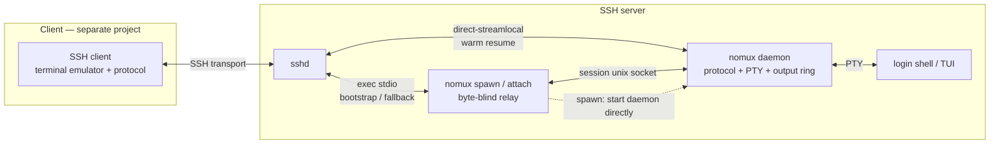
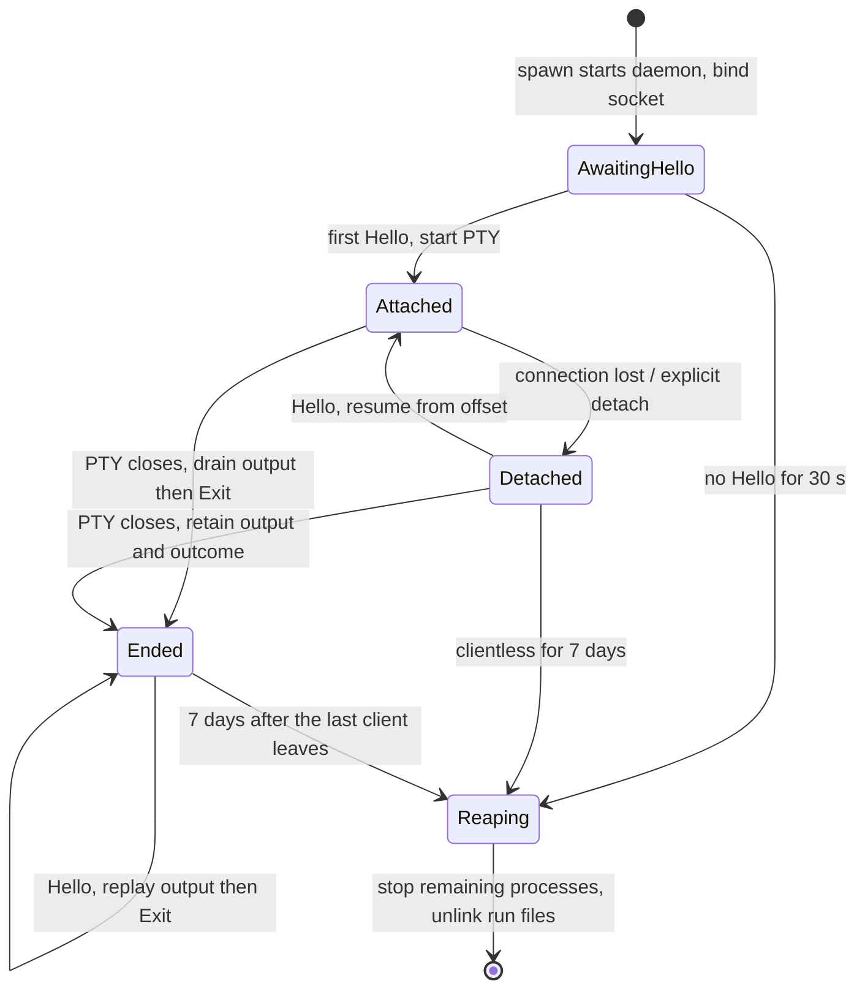

# nomux — Design

`nomux` is a single static Linux binary that runs **on an SSH server**, owning a PTY
and a bounded output buffer so a terminal session survives the loss of the SSH
connection that created it. Low-level detail: [IMPLEMENTATION.md](IMPLEMENTATION.md).

## 1. Problem

Mobile SSH connections drop constantly — WiFi↔cellular handoff, NAT rebind, radio
sleep, Doze, app eviction — and plain SSH loses the shell with everything it held. A
multiplexer (`tmux`, `screen`) fixes that at the cost of a prefix key, a rewritten
`TERM`, a second copy-mode, broken host scrollback and OSC passthrough bugs: a large
visible surface for one property.

## 2. Scope

Nothing here aims to be a general terminal tool, and the client that drives this binary
versions as one unit with it, so:

- The wire protocol is **private**: no negotiation, no extension points, no stability guarantee. Enums are exhaustive, so an unknown value is a bug rather than a forward-compatibility case; nothing is on the wire that nothing reads; and nothing here is published, a crates.io version being a promise of stability that nothing here intends to keep.
- Behaviour goes to whichever side it is cheapest on: emulator reset on gap recovery is the client's because the client already holds the emulator, and either end can tell there was a gap by comparing offsets ([IMPLEMENTATION.md § 4.2](IMPLEMENTATION.md#42-attach-with-from--base)).
- Version skew has exactly one real case (§6.4), bounded and not designed around.

| In scope | Out of scope |
| --- | --- |
| PTY ownership, session persistence | Multiplexing: panes, windows, prefix key, status bar |
| Output ring buffer + replay | Session sharing, read-only mirrors, collaboration |
| Resume protocol over stdio | Replacing the SSH transport |
| Self-bootstrap onto a host | Client-side UI, key management, terminal emulation |

## 3. Key properties

### Byte-stream replay, not screen-state sync

Raw PTY bytes with monotonic offsets, replayed from the client's last acknowledged
offset; the screen is never modelled. Sixel, OSC 52, hyperlinks, mouse and bracketed
paste pass through untouched, scrollback survives because scrollback is just earlier
bytes, and no second lossier emulator runs on the server. Cost: a long disconnect can
overflow the buffer, which is a *gap* (§6.3) rather than silent truncation.

### Carry the resume channel over a fresh SSH connection, not a side channel

One command over a new SSH connection, or one `direct-streamlocal@openssh.com`
channel; no nomux-owned socket on the network. ProxyJump, certificates, 2FA, agent
forwarding, `authorized_keys` restrictions, bastions, captive corporate networks and
the host's audit configuration all come free. Cost: a full handshake per resume,
dominated on mobile by radio wake anyway.

### Zero server-side install

The client carries the binary and pushes it on first use — no administrator, no
package, no root. This is the adoption property: every other persistence tool wants a
binary on the host first, which is why people fall back to the `tmux` already there.

### No new ports, no new crypto

No network listener, no key exchange, no cipher selection, no certificate handling —
nothing new for a firewall to block, and confidentiality and authentication stay SSH's
unchanged. Cost: what the daemon listens on is the filesystem instead, a local surface
whose permissions are the whole of the authentication (§8).

## 4. Architecture

Five modes of one binary, in three groups:

| Mode | Lifetime | Role |
| --- | --- | --- |
| `nomux daemon` | Outlives connections | Owns the PTY master, child process, ring buffer, and unix socket. Speaks the wire protocol. |
| `nomux spawn` / `nomux attach` | One connection | Dumb byte relay between stdio and the unix socket, with no protocol awareness. `spawn` creates and attaches in one `exec` (§6.2) and refuses an id something already answers for; `attach` refuses one nothing answers for, and never the reverse. |
| `nomux kill` / `nomux list` | One-shot | Frozen control surface. Acts on the run directory — the `<id>.*` files per session described in [IMPLEMENTATION.md § 6.6](IMPLEMENTATION.md#66-frozen-control-surface) — never on the session protocol, so any build can manage any daemon regardless of version. |

The protocol runs end-to-end between client and daemon: logic lives in one place, and
the relay parses no frame and is never bumped.

## 5. Session lifecycle

The daemon keeps draining the PTY while detached — otherwise the child blocks on write
and the session appears frozen on reattach.

### 5.1 Identity

**One session per client tab.** The client mints an opaque id when a tab is created, so
session identity *is* tab identity: no naming UI, no session picker, no id ever shown.

- The daemon never interprets an id. It is a filename component and nothing else, validated strictly against path traversal ([IMPLEMENTATION.md § 6.3](IMPLEMENTATION.md#63-socket)).
- Opaque ids do not survive loss of client state: after a reinstall the daemons still run but the app no longer knows which tab each was. A human-readable label therefore sits beside the socket, so `nomux list` stays meaningful and orphans are recoverable. It is also why `attach` refuses an id nothing answers for instead of creating one (§4).
- Concurrency is *intended* to cap at 8 per host, which is the terminals one person has open at once, and the cap is wholly the client's: only the side that knows a tab was opened can hold the real one, so nothing holds it today. The daemon enforces no count of its own — a limit it held would refuse the user's next terminal on the strength of names on disk, which is the wrong side to decide from.

### 5.2 Reaping

A clientless session is reaped a generous while after the last detach, not currently
tunable; one that never started a PTY goes much sooner, which removes a daemon nobody ever
reached ([IMPLEMENTATION.md § 6.5](IMPLEMENTATION.md#65-shutdown) has both deadlines and
what a client arriving late is handed). The child having exited is not a second rule
beside it: a session that has served somebody stays on the same clock whatever became of
its shell. Output volume cannot be the signal — nothing in it separates a multi-hour build
from an endless `tail -f` — so the clock is time since detach, paid for in abandoned tabs
holding memory on someone else's server.

### 5.3 Transparency

A session runs exactly what a plain `ssh host` would have run: the user's login shell,
dash-prefixed, with the environment sshd already established. That is inheritance, not
reconstruction, because nomux starts *inside* an SSH session
([IMPLEMENTATION.md § 6.1.1](IMPLEMENTATION.md#611-what-the-child-runs)). A running
process's environment cannot be mutated, so what the creating connection brought is
frozen for the session's lifetime and a later reconnect's `DISPLAY` or `AcceptEnv` is
invisible to the child: inherent to persistence, `tmux`'s too, and §5.4 is the one case
worth solving. It wants solving on *both* sides of the opt-in: with §5.4 off, a session
created over `ForwardAgent` freezes a path sshd will unlink, and that warning is the
client's.

### 5.4 Agent forwarding

A forwarded `ssh-agent` socket belongs to one SSH connection and is unlinked when it
closes, so a persistent session loses the agent on first reconnect — `git push` and
nested `ssh` break for the rest of its life, the most-complained-about `tmux` behaviour
and one that would undercut §5.3. nomux forwards the agent **itself**: the daemon owns
a socket for the session's whole life and proxies one connection at a time to the client
over the session's own stream, answered from the client's own key store. Nothing dangles
or needs refreshing, and no environment has to be re-read — which the warm path (§6.1)
could not do anyway, running no process on the server.

- The agent is a **single serialized pipe**, not a sub-channel: one peer served at a time, the next left waiting in the listen backlog, so §2's refusal to multiplex takes no exception here. What that costs a peer at the back of the queue is [IMPLEMENTATION.md § 6.7](IMPLEMENTATION.md#67-agent-forwarding)'s.
- It works **without** `ForwardAgent`, bypassing a deliberate user decision, so it is opt-in per host and off by default.
- Because the client sees every request it *can* prompt per signature or name the asking session, which plain `ssh -A` can never do.
- It **loses** OpenSSH's destination constraints: `ssh-add -h` binds a key to a hop and `ssh(1)` enforces that with `session-bind@openssh.com` down each forwarded agent connection, but the daemon here is an opaque byte pipe and the client re-originates against the real agent, so without a synthesised binding for the session's hop a constrained key is refused outright or used with its constraint silently unapplied ([IMPLEMENTATION.md § 6.7](IMPLEMENTATION.md#67-agent-forwarding)). The per-host opt-in is the compensating control.

## 6. Connection paths

### 6.1 Warm resume

Steady state, run on every network change, and always a resume: the socket *is* the
session, so a `direct-streamlocal` channel opened straight to it finds one or finds
nothing — creation needs a process, and this path runs none. `Hello` in, the fixed server
preamble followed by `HelloOk` and the replay out; no process spawned, no shell parsed.

### 6.2 Cold bootstrap

First contact with a host, or after a version bump: a probe `exec` that runs the binary
where it is already present, then an upload and a second `exec` where it is not. Two
round trips cold, zero extra warm; `$MODE` is `spawn` or `attach` and the client always
knows which. The relay remains byte-blind: the client discards any login-shell stdout
before the fixed server preamble, then decodes the response frames
([IMPLEMENTATION.md § 5](IMPLEMENTATION.md#5-bootstrap)).

### 6.3 Gap

§3 prices the overflow; the `Gap` frame and the repaint that answers it are
[IMPLEMENTATION.md § 4.3](IMPLEMENTATION.md#43-gap-handling)'s.

### 6.4 Version skew

The version is in the binary's filename, so old binaries persist on the server and an
old daemon can still hold a live session when a newer client connects — the only
compatibility case there is. Retention is keyed to the protocol revision and the client
keeps every revision it has ever shipped: app stores batch updates, so a user can go
from release 5 to release 8 without ever running 6 or 7, and an N-1 window assumes the
client runs under every release, while revisions are append-only integers and a codec
is a few hundred lines, so keeping them all costs nothing.

Safe because `kill` and `list` never speak the session protocol (§4), so the fallback is
never an orphaned shell. The daemon carries none of it, speaking only its own version and
rejecting a mismatched `Hello.protocol`.

## 7. Degradation

The feature must be invisible when unavailable: every terminal failure falls back to a plain
SSH session, cached per host where the failure describes a host boundary, on the conditions
in [IMPLEMENTATION.md § 5.3](IMPLEMENTATION.md#53-client-decisions). Relay stderr supplies the
stable class that decision needs, so nothing has to parse prose
([IMPLEMENTATION.md § 10](IMPLEMENTATION.md#10-exit-codes)).

## 8. Security model

- **No new *network* attack surface** (§3). The local surface is what follows: a unix socket per session, an optional agent socket, and a process outliving the login. The uploaded binary is not part of it — anyone who can write `~/.local/share/nomux/` can already edit `.bashrc`.
- **That equivalence holds for the same user only.** The run directory and every ancestor are held to this uid before use; [IMPLEMENTATION.md § 6.3](IMPLEMENTATION.md#63-socket) has the rules. The install path is part of the account's trusted environment ([§ 5.2](IMPLEMENTATION.md#52-upload-and-launch-in-one-round-trip)): shell bootstrap cannot check it and later execute through it without a rename race. A host where another uid can replace an ancestor is unsupported, not repaired by a client-side path check.
- **No new secrets** (§3). `SO_PEERCRED` is checked in both directions besides: the daemon refuses an accepted connection whose uid is not its own, and a `connect` refuses a socket bound by anybody else ([IMPLEMENTATION.md § 6.3](IMPLEMENTATION.md#63-socket)) — defence in depth for a host whose modes do not hold, rather than a second authenticator.
- **No abstract sockets.** They are namespace-scoped, not permission-scoped, and would be reachable by any local user.
- **Agent forwarding is a real capability expansion — the only one here**, and the only item on this list that reaches past what the login already had (§5.4).
- **Auditability.** A persistent shell can outlive the login session that spawned it. On hosts with session recording that is a policy question, not a technical one, and it is why the feature is opt-in per host.
- **File integrity monitoring** (AIDE, tripwire, osquery) will flag a new executable in a home directory. Expected, documented, not worked around.

## 9. Prior art

| Layer | Existing work | Difference |
| --- | --- | --- |
| Detach/attach daemon | `dtach`, `abduco`, `shpool` | Need a server-side install, and reattaching resumes the terminal rather than the byte stream: output produced while you were away is not replayed. |
| Byte-stream resume | Eternal Terminal | Opens its own TCP port with its own crypto. |
| Roaming | mosh | UDP range, server-side emulator, no scrollback or port forwarding. |
| Self-bootstrap over SSH | VS Code Remote-SSH, JetBrains Gateway, `sshuttle`, `xxh` | Not terminal-persistence tools. |

Each layer has precedent; the combination — zero-install, no new ports, byte-exact —
does not. `dtach`'s `-r winch|ctrl_l` repaint strategy is adopted directly for gap
recovery.

## 10. Rejected alternatives

Each of these was considered and refused. They are recorded here so nobody rediscovers
one as a gap.

- **Per-host or user-named identity.** One implicit session per host survives the loss
  of client state, but leaves no second terminal for a build alongside an editor.
  User-named sessions fix both and cost the session-list UI this project exists to
  avoid (§5.1).
- **Negotiating the ring capacity in `Hello`.** `NOMUX_RING_BYTES` already tunes it, and
  the default is the whole question: raise it and every session reserves address space
  no administrator agreed to, lower it and a twenty-minute disconnect loses a build.
- **Compressing the output ring.** Measured on the `measurement/ring-compression` tag,
  whose commit message holds the tables: `lz4_flex` buys a median 4.6× more scrollback for
  6–8 KiB of binary and costs 21× on the PTY push path, 2.8 ms a MiB on the x86_64 the
  throughput was taken on. It trades memory for CPU, and a larger default ring buys the
  same scrollback for neither.
- **Draining the PTY to `EAGAIN`.** A *reattaching* client is served the same bytes either
  way — the ring holds the last `capacity` bytes however the reading is spelled — so a
  drain buys no scrollback, and what it costs is fairness: every other step of a pass runs
  a bounded number of times, `write_pty` at most twice and `read_client` at most three,
  where a drain has no bound in the daemon and ends only when the producer pauses, which
  during a flood is never. Ctrl-C reaches the child through `write_pty` alone, so interrupt
  latency becomes the length of the drain, in exactly the situation a person is reaching
  for Ctrl-C — the hazard `Conn::fill` already answers with one 64 KiB read per call
  ([IMPLEMENTATION.md § 4.1](IMPLEMENTATION.md#41-backpressure)) and against the master by
  nothing at all. What reopens it: a measurement showing the per-pass `poll` is a material
  fraction of flood throughput, together with a bound below both `MAX_PENDING_WRITE` and
  the ring capacity.
- **A server-side screen snapshot on overflow.** This is the second, lossier emulator §3
  rejects: deterministic but not exact, and the visible screen only. `libvterm` would
  also be the first C object in a tree whose musl targets build from `rustup target add`
  alone ([IMPLEMENTATION.md § 8](IMPLEMENTATION.md#8-build)).
- **Scrubbing `SSH_AUTH_SOCK` in the child.** The server-side answer to the stale forwarded
  path §5.3 ends on, and the daemon cannot tell sshd's socket from a stable local one —
  `gpg-agent --enable-ssh-support`, gnome-keyring, `keychain` — so scrubbing would break
  exactly the users whose agent lives on the server and survives every reconnect. Only the
  client knows both what it forwarded and what it asked nomux for, which is why §5.3 leaves
  the warning there; the variable is inherited untouched
  ([IMPLEMENTATION.md § 6.1.1](IMPLEMENTATION.md#611-what-the-child-runs)).
- **Placing the daemon in a systemd user scope.** Built, measured, and then removed. A
  `setsid`ed daemon stays in sshd's `session-N.scope`, so `KillUserProcesses=yes` ends the
  session at the final logout; a transient `systemd-run --user --scope` escaped that, but
  only where a *lingering* user manager was there to own the scope, and establishing that
  cost a bus connection, a `loginctl` call and two executable probes on every session
  creation, plus an environment the scope rewrote and nomux then had to put back. The
  launch is now always direct, which is the same ground `tmux` and `screen` stand on and
  survivable for the same reason — `KillUserProcesses=no` is the shipped default nearly
  everywhere. A strict host is a host policy question: `loginctl enable-linger` and a scope
  belong to whoever administers or drives that host, and the client versions with this
  binary (§2) so it can hold that per host without a wire change. What reopens it: strict
  hosts turning out to be common enough that every user meets one
  ([IMPLEMENTATION.md § 6.2](IMPLEMENTATION.md#62-terminal-detachment-and-logout-policy)).
- **Automatic cross-device handover.** The wire now supplies the two safe primitives:
  unconditional takeover and `Hello.if_detached`, whose occupied-slot refusal lets a client
  ask the user before retrying. Automating a handover still needs product policy for when to
  displace a peer; `Error{TAKEOVER}` remains terminal so two clients cannot reconnect-fight
  each other ([IMPLEMENTATION.md § 6.4](IMPLEMENTATION.md#64-multiple-clients)).
