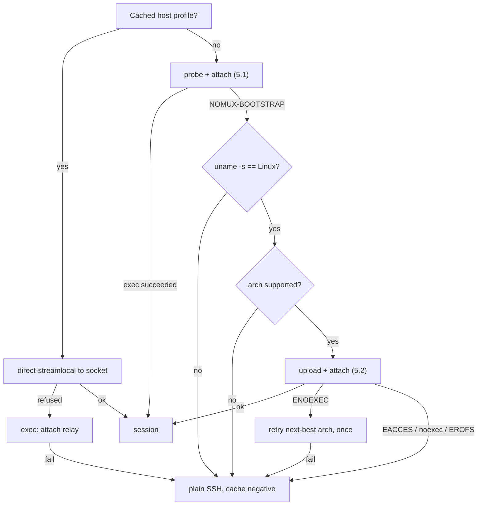

# nomux — Implementation

Low-level detail. Rationale and properties: [DESIGN.md](DESIGN.md).

1. [Layout and conventions](#1-layout-and-conventions) — [environment](#environment)
2. [Wire protocol](#2-wire-protocol) — [framing](#21-framing), [messages](#22-messages), [flags](#23-flags)
3. [Offsets and exactly-once input](#3-offsets-and-exactly-once-input)
4. [Ring buffer](#4-ring-buffer) — [backpressure](#41-backpressure), [attach below the base](#42-attach-with-from--base), [gap handling](#43-gap-handling)
5. [Bootstrap](#5-bootstrap) — [probe](#51-probe-and-attach-in-one-round-trip), [upload](#52-upload-and-attach-in-one-round-trip), [decision tree](#53-decision-tree)
6. [Daemon](#6-daemon) — [PTY and child](#61-pty-and-child), [detachment](#62-detachment-from-the-login-session), [socket](#63-socket), [multiple clients](#64-multiple-clients), [shutdown](#65-shutdown), [**frozen control surface**](#66-frozen-control-surface), [agent forwarding](#67-agent-forwarding)
7. [Attach relay](#7-attach-relay)
8. [Build](#8-build)
9. [Testing](#9-testing)
10. [Exit codes](#10-exit-codes)
11. [Diagnostics](#11-diagnostics)

**Building something against nomux?** §6.6 is the only frozen contract here and the
only one a third party may rely on: the five filenames, their permissions, the
pidfile's format, what `list` prints. Everything else describes a version, not a promise.

## 1. Layout and conventions

```
crates/nomux-proto/   wire protocol: framing, codec, offsets. No I/O, no unsafe.
crates/nomux/         the binary: daemon, attach relay, control surface.
```

`nomux-proto` is split out because the client project reimplements or links the same
codec; keeping it I/O-free makes it portable and property-testable in isolation, and it
is the half that can carry `#![forbid(unsafe_code)]`. What belongs there is what is on the
wire — session id validation (§ 6.3) and the agent socket's one-at-a-time rule (§ 6.7)
are daemon policy. Neither crate is published, for the reason
[DESIGN.md § 2](DESIGN.md#2-scope) gives.

- Edition 2024, MSRV 1.97.1 (`rust-toolchain.toml`).
- Lints: `[workspace.lints]` in `Cargo.toml` is the list. The deny is `-D warnings` on the
  clippy hook in `.pre-commit-config.yaml`, which gates this tree rather than any build of
  it; test relaxations live in `clippy.toml`.

### Environment

Everything nomux reads from the environment, with the section that owns each behaviour
beside it. `NOMUX_DEBUG` and `NOMUX_UPDATE_BASELINE` are tested for exactly `1`.

| Variable | Read by | Effect |
| --- | --- | --- |
| `XDG_RUNTIME_DIR` | every mode | First choice of run directory: `$XDG_RUNTIME_DIR/nomux` (§6.3) |
| `XDG_STATE_HOME` | every mode | Second choice: `$XDG_STATE_HOME/nomux/run` (§6.3) |
| `HOME` | every mode | Third choice: `$HOME/.local/state/nomux/run`. Also the child's working directory (§6.1.1) |
| `SHELL` | daemon | The child's login shell, ahead of the password database and `/bin/sh` (§6.1.1) |
| `USER`, `LOGNAME` | daemon | Login name for the linger check, in that order, and only where the password database has no line for this uid (§6.2) |
| `NOMUX_RING_BYTES` | daemon | Ring capacity in bytes. Unparseable or zero falls back to the 4 MiB default; anything above 1 GiB is clamped (§4) |
| `NOMUX_CHAOS_SEED` | the chaos suite | Disconnect-point seed; unset is a fixed default, so a failure reproduces (§9) |
| `NOMUX_DEBUG` | `scripts/build-release.sh` | Also build the unstripped companions (§8) |
| `NOMUX_UPDATE_BASELINE` | `scripts/build-release.sh` | Rewrite `scripts/size-baseline` from this build and skip the growth gate (§8) |

The first three are subject to §6.3's absolute-path rule. Going the other way, the
daemon sets `TERM` from `Hello`, `NOMUX_SESSION=<id>` and — where forwarding is on —
`SSH_AUTH_SOCK` in the child, and takes `NOMUX_BOOTSTRAP` back out (§6.1.1).

## 2. Wire protocol

Spoken end-to-end between client and daemon (§7 relay is transparent). Private, with no
negotiation, no reserved space for extensions and nothing carried that nothing reads
([DESIGN.md § 2](DESIGN.md#2-scope)). `Hello.protocol` is the only revision on the wire:
it rejects a mismatched peer at once, in the bounded skew case of
[DESIGN.md § 6.4](DESIGN.md#64-version-skew), and by the time `HelloOk` is sent the number
is agreed. `HelloOk` carries no winsize for the same reason — the arriving `Hello`'s is
authoritative — and `Ping`/`Pong` carry no nonce, the stream being ordered.

### 2.1 Framing

```
 0        1                     4                        4+len
 +--------+---------------------+------------------------+
 | type   | len      (u24 BE)   | payload                |
 | u8     | 3 bytes             | len bytes              |
 +--------+---------------------+------------------------+
```

`len` caps at `MAX_PAYLOAD` (256 KiB); larger is a protocol error. All integers big
endian. The header is fixed at 4 bytes so the reader is a two-stage `read_exact`.
*winsize* is four `u16`s — cols, rows, xpixel, ypixel — everywhere it appears.

### 2.2 Messages

| Type | Dir | Name | Payload |
| --- | --- | --- | --- |
| `0x01` | C→D | `Hello` | `u16` protocol, `u8` flags, `u64` out_offset, winsize, `u16` term_len, UTF-8 term bytes |
| `0x02` | D→C | `HelloOk` | `u64` resume_from, `u64` in_applied, `u8` linger (0 unknown, 1 disabled, 2 enabled), `u8` flags |
| `0x03` | C→D | `Input` | `u64` offset, bytes |
| `0x04` | D→C | `InputAck` | `u64` applied_through |
| `0x05` | D→C | `Output` | `u64` offset, bytes |
| `0x06` | C→D | `Resize` | `u16` cols, `u16` rows, `u16` xpixel, `u16` ypixel |
| `0x07` | D→C | `Gap` | `u64` new_base_offset |
| `0x08` | D→C | `Exit` | `i32` status, `u8` kind (0 = exited, 1 = signalled), `u32` since_exit_secs |
| `0x09` | C→D | `Detach` | — |
| `0x0a` | C→D | `Ping` | — |
| `0x0b` | D→C | `Pong` | — |
| `0x0c` | D→C | `Error` | `u16` code (1 protocol, 2 takeover, 3 version, 4 input_gap, 5 internal), UTF-8 message |
| `0x0d` | D→C | `AgentOpen` | — |
| `0x0e` | ↔ | `AgentData` | opaque `ssh-agent` bytes |
| `0x0f` | ↔ | `AgentClose` | — |

`Hello` carries the current revision, **7** — `PROTOCOL_VERSION` in `nomux-proto`, bumped
on any wire change, compatible ones included, since a change that left the number alone is
one `Hello.protocol` cannot catch. What each revision moved is `git log` on
`crates/nomux-proto/`.

The session id is **not** in `Hello`, being already fixed by the socket path (warm) or by
the id `spawn` and `attach` were handed (cold). Nor does anything in `Hello` say where the
client's *input* stream stands: `HelloOk`'s `in_applied` is authoritative and the client
fast-forwards to it (§3). `Hello.out_offset` of `u64::MAX` means *"I have no state, send
me whatever you have"*, used on a fresh app launch to recover scrollback.

`Hello.term_len` counts **bytes**, and a `TERM` past the `u16` ceiling is refused rather
than truncated. `Hello.term` may not contain a NUL, refused encoding as well as decoding:
U+0000 is valid UTF-8, so nothing else catches it, and let through it reaches the child's
environment (§6.1.1) where `execve` refuses it — the host blamed for what the client sent.

`Exit.since_exit_secs` counts whole seconds since the child let go of the terminal,
elapsed against a monotonic clock rather than stamped against a wall clock, and saturating
at a width no session reaches. It rides on `Exit` rather than on `HelloOk`, which goes out
on every attach of every session.

### 2.3 Flags

Both flag fields are exhaustive: an undefined bit is a protocol error, not a
forward-compatibility case ([DESIGN.md § 2](DESIGN.md#2-scope)), and the same holds for
every other closed set on the wire — `Error.code`, `Exit.kind`, `HelloOk.linger`.

`Hello.flags`:

| Bit | Name | Honoured |
| --- | --- | --- |
| 0 | agent forwarding (§6.7) | Only on the `Hello` that **creates** the session — `SSH_AUTH_SOCK` goes into the child's environment, which cannot be changed afterwards |
| 1 | repaint with `ctrl_l` rather than `winch` (§4.3) | Every attach; it costs nothing to restate, and only the client knows what is on the screen |

`HelloOk.flags`:

| Bit | Name |
| --- | --- |
| 0 | an agent socket is being served, so `AgentOpen` may arrive |

The linger state is a `u8` field of its own beside that byte rather than bits in it, so
its wire form is the discriminant §2.2 gives it. There is no `gap` bit either:
`resume_from > Hello.out_offset` is the same predicate, computed from a number the
client sent and a number it was just told (§4.2).

## 3. Offsets and exactly-once input

Both directions are byte streams with absolute `u64` offsets, not per-frame counters,
and an offset is that of the frame's **first** byte. Output is at-least-once and
idempotent: the client discards anything below the offset it has already consumed.

Input must be **exactly-once** — replaying a partially applied keystroke buffer into a
shell is how a truncated `rm -rf` gets executed. The daemon's `in_applied` is
authoritative and advances the moment the daemon takes ownership of the bytes, so an
`InputAck` lost with the connection costs nothing: the client is told `in_applied` again
in `HelloOk` and fast-forwards past what it thought was unsent.

- Daemon drops any `Input` fully below `in_applied`; trims a straddling one.
- `Input` above `in_applied` is a gap in the input stream → `Error` + close. The client must not skip.

Ownership, not durability: the master is non-blocking (§6.1), so a child that has stopped
reading leaves input queued indefinitely, and waiting for the write would stall the ack
behind it. The queue is the daemon's own memory, never re-applied and bounded by §4.1;
losing it means losing the daemon, which ends the session anyway. The other half of the
invariant is the client's: an `Input` frame written but not yet read is **not** safe, a
dropped client's buffered frames going undecoded, so a reconnecting client resends from
the daemon's `in_applied` and never from what it believes it sent.

## 4. Ring buffer

Fixed capacity, allocated once. `VecDeque<u8>`, drained via `as_slices` to write without
copying, with `Ring::base()` the oldest offset still retained and `Ring::end()` the newest
written. Capacity defaults to 4 MiB and is overridable per daemon with `NOMUX_RING_BYTES`
(§1); an unparseable or zero value falls back to the default rather than refusing to
start, and one past 1 GiB is clamped there, `VecDeque::with_capacity` answering a request
it cannot serve by aborting the process.

- The daemon always drains the PTY, attached or not. If the ring is full it advances the base, discarding the oldest bytes; a write larger than the whole ring discards everything retained as well as its own head, so the base accounts for both.
- A client is served `[max(from, base()) .. end()]`.
- Overflow is not a stored flag. Whether a *reader* lost anything depends on where that reader had reached, so it is derived per client by comparing its position against the base — which stays correct across any number of overflows, including ones that happened while it was away.
- Never trimmed to what a client has consumed. A full rolling window is the scrollback a fresh client gets.

### 4.1 Backpressure

The PTY drain must never block on a slow or absent client. Precedence: keep reading the
PTY, drop from the ring's head, so a stalled client causes a gap and never a frozen shell.
Four bounds, each enforced on its own queue:

| Constant | Value | Bound |
| --- | --- | --- |
| `MAX_PENDING_WRITE` | 1 MiB | Past this queued to the client, output stops being queued. The ring absorbs the PTY regardless, so a slow client costs a gap and never a blocked child |
| `ABANDON_PENDING_WRITE` | 8 MiB | Past this the client is not slow but gone, and is dropped; reattaching replays from the ring. The gap between the two figures is clear of the first plus one output chunk, so only the frames that answer a client — an `InputAck` per `Input`, a `Pong` per `Ping`, queued whatever the first bound says — can reach it |
| `MAX_PENDING_INPUT` | 1 MiB | Past this queued for a child that is not reading, the daemon stops **accepting** input: it stops decoding `Input` frames and stops asking the socket for more. Dropping is not available, `in_applied` being exactly-once (§3), and `Error{INPUT_GAP}` would accuse a client that had done nothing wrong. The bytes wait in the kernel's buffer, where the peer blocks on them — §6.7's argument for a saturated agent connection |
| `MAX_PENDING_READ` | 1 MiB | One connection's undecoded receive buffer, bounded by the daemon's own number rather than by whatever the peer set `SO_SNDBUF` to. On a stock host it never binds; [PLAN.md § P4](PLAN.md#p4--test-depth) has why no test pins it |

**The input cap is enforced where the queue grows**, between frames in the decode loop,
and never by the poll set: holding a client out of `POLLIN` throttles only the reads the
poll set drives, where §6.4.1's takeover reaches the same decode loop twice without
passing through it. So the queue overshoots by at most `MAX_PAYLOAD`, the one frame that
crossed the cap, and the declined frames wait in the receive buffers of at most two
connections. `Conn::fill`, `conn::compact` and `Daemon::watch_for` carry the rest: why no
complete frame is stranded there, why a held-back client stays in the poll set under an
*empty* mask instead of leaving it, and why each queue reclaims its consumed prefix on a
ratio rather than at a fixed size.

The cost is that a client's own `Ping`, `Resize` and `Detach` queue behind its own stalled
input, and that a takeover's final drain goes with the outgoing connection — accepted,
since those frames were never acknowledged and §3 has the client resending from
`in_applied`. A *new* connection is never held back by the input cap, being polled as
pending rather than as the client, so `list` and §6.3's spawn race are unaffected, and
`nomux kill` is a signal (§6.5).

**A detaching client's send queue is dropped rather than flushed.** `Daemon::drop_client`
pushes out what the socket takes and lets the rest go: it is all per-connection state a
reattach recomputes — `sent_through` rewinds to what the arriving client consumed (§4.2),
`exit_sent` clears (§6.5) — so what the client comes back to is the ring, not the queue.
Waiting would be the whole event loop blocked for `FINAL_FLUSH_TIMEOUT`, PTY drain
included, at exactly the moment the peer has stopped reading. Only the two departures with
nothing behind them keep the blocking flush: §6.4's eviction and §6.5's shutdown.

### 4.2 Attach with `from < base()`

```
resume_from = if out_offset == u64::MAX || out_offset < base() { base() }
              else                                             { min(out_offset, end()) }
gap         = resume_from > out_offset
→ HelloOk{resume_from}, then Output[resume_from..]
```

**The gap is that comparison, and nothing sends it.** Both ends compute it — the daemon
to decide the repaint it owes (§4.3), the client to reset its emulator — so a flag would
be the daemon restating a number the client can see. This is the *attach-time* gap; the
standalone `Gap` frame is for overflow mid-stream, while a client is attached.

`resume_from` is clamped at *both* ends, which is why the no-gap branch carries a `min`:
an `out_offset` above the end is a client claiming output the session never produced,
which unclamped would set `sent_through` past the end of the stream and leave the session
looking dead until the child caught up. Not a gap — nothing was dropped.

### 4.3 Gap handling

On a gap the byte stream is discontinuous and the client's emulator may be
mid-escape-sequence. Recovery, mirroring `dtach -r`:

1. Client resets its emulator locally — `ESC c` is correct but heavy-handed (drops scroll region and charset); `ESC [ ! p` + `ESC [ 2J` + `ESC [ H` is the softer default.
2. Daemon triggers a repaint from the child via a `TIOCSWINSZ` dance: set `cols-1`, then the real `cols`. The resulting two `SIGWINCH`es make most full-screen programs redraw. A terminal one column wide gets the second alone, there being no narrower size to go to, which leaves the repaint weaker there and is accepted.
3. Repaint policy is the client's, restated in each `Hello` (§2.3): `winch` (default) or `ctrl_l` (write `0x0c` to the PTY — better for a bare shell prompt, destructive inside an editor).

`ctrl_l` goes through the same queue as client input rather than straight to the master,
so it cannot overtake keystrokes already accepted or block on a full PTY buffer. It is
not client input, so `in_applied` does not move for it.

The repaint is *owed* at the gap and issued later, on the first pass that finds the
client holding the whole ring — one policy for both ways a gap is reached, §4.2's
`HelloOk` comparison and the mid-stream `Gap` frame, which holds a sustained overrun to
one repaint rather than one per gap, since a repaint issued mid-overflow paints into
bytes the next overflow discards. A client that never catches up is never repainted.
Neither step restores a plain shell's lost scrollback, inherent to byte-stream replay
([PLAN.md § Deferred by decision](PLAN.md#deferred-by-decision) weighs the `libvterm`
snapshot).

## 5. Bootstrap

### 5.1 Probe and attach in one round trip

```sh
p=${XDG_DATA_HOME:-$HOME/.local/share}/nomux
exec "$p/nomux-$VER" "$MODE" "$ID" 2>/dev/null
echo "NOMUX-BOOTSTRAP $(uname -s) $(uname -m) $p"
```

`exec` replaces the shell on success, so the `echo` is unreachable unless the binary is
missing or unrunnable. Warm cost: zero extra round trips. `$MODE` is `spawn` or `attach`
([DESIGN.md § 4](DESIGN.md#4-architecture)), a substitution rather than a second command,
the client knowing which because it knows whether it holds a session for this tab. The
fields are `uname`'s — `Linux`, `x86_64` — because `sh` emits the line before any binary
exists; confirming that an *uploaded* artifact runs is `--version`'s job, one line on
stdout and exit 0: `nomux <version> (protocol <revision>)`, the crate's version and the
`PROTOCOL_VERSION` of §2.2.

### 5.2 Upload and attach in one round trip

```sh
p=${XDG_DATA_HOME:-$HOME/.local/share}/nomux
mkdir -p -m 700 "$p" && set -C && cat > "$p/.up.$$" && chmod 755 "$p/.up.$$" \
  && mv -f "$p/.up.$$" "$p/nomux-$VER" && exec "$p/nomux-$VER" "$MODE" "$ID"
```

- Temp-then-`mv` is atomic within one filesystem and avoids `ETXTBSY` — you cannot write over a running binary.
- Version in the filename: an upgraded client cannot break sessions an older daemon still holds.
- Transfer over an **exec channel with `cat`**, not SFTP. `Subsystem sftp` gets disabled on hardened hosts, and modern `scp` is SFTP underneath. SSH channels are 8-bit clean, so no base64 tax.
- Enable `zlib@openssh.com` on this channel: a static binary compresses well, and it needs nothing on the remote.
- **`-m 700` rather than the ambient umask**, since a bare `mkdir -p` creates at `0777 & ~umask` and `umask 002` is the Debian-derived default: without the mode, the directory every later connection `exec`s out of is group-writable with nobody having pointed `$XDG_DATA_HOME` anywhere. It binds only where this call *creates* the directory.
- **`set -C` before the redirect**, `.up.$$` being a predictable name. Under noclobber `>` is `O_CREAT | O_EXCL`, which refuses a symlink — dangling or not — where a plain `cat >` follows it. In a directory another user can write to, that is the difference between one failed bootstrap and choosing where the uploaded bytes land: `~/.ssh/authorized_keys`, `~/.bashrc`, anything this uid can write.
- **The install directory is still created, not checked**, which is materially weaker than what §6.3 gives the *run* directory; what the two lines above do and do not close, and to whom, is [DESIGN.md § 8](DESIGN.md#8-security-model)'s to state.

### 5.3 Decision tree



`uname -m` lies on a 32-bit userland over a 64-bit kernel, hence the one ENOEXEC retry. A
`noexec` or read-only home is detected by exec failing, never by parsing mounts, and every
negative is cached per-host so a hardened box is not re-probed on each reconnect. Three
conditions off the tree reach the same fallback: a restricted shell with no `uname` is
plain SSH; `AllowStreamLocalForwarding no` costs only the warm path, leaving the exec
relay; and `KillUserProcesses=yes` without linger kills the daemon at logout, which the
daemon detects and reports (§6.2) rather than works around.

## 6. Daemon

### 6.1 PTY and child

Via `rustix` rather than raw `libc`, so almost none of this needs `unsafe`.

1. `openpt(O_RDWR | O_NOCTTY | O_CLOEXEC)`, `unlockpt`, `ptsname`.
2. Master is set non-blocking.
3. Parent opens the slave `O_RDWR | O_NOCTTY | O_CLOEXEC` and hands it to the child as all three stdio descriptors.
4. Parent sets the initial `TIOCSWINSZ` from `Hello`, before the child can observe it, so the shell's first prompt is already laid out correctly.
5. `fork`. In the child, before `exec`: `setsid()`, acquire the slave as controlling terminal via `ioctl_tiocsctty`, restore `SIGHUP` to `SIG_DFL` (§6.2 leaves it ignored in the daemon, and an ignored disposition survives `exec`). Only async-signal-safe calls, which is why the open is not among them.
6. Parent closes **its own** slave descriptors — the copy in this frame and the three the `Command` borrowed. The master reports `EIO`, which is how the session learns the child is gone, only once no descriptor onto the slave is left in this process.

`O_CLOEXEC` on both ends is what keeps them out of the child; without it every process
the user runs holds a writable descriptor onto its own PTY master. The child keeps its
stdio regardless, `dup2` onto 0/1/2 clearing the flag on the copies.

The event loop is `poll` over {master, listener, attached client, pending connection, the
stop-signal self-pipe (§6.5), agent socket, the one served agent connection}. The
*pending* entry is a connection accepted but not yet greeted, and it is what makes
"connecting is not attaching" (§6.4) work. The set is variable-length and each entry is
tagged with what it belongs to rather than read back by position.

The master **must** be non-blocking: a child that stops reading fills the PTY's input
buffer, and in raw mode the line discipline throttles rather than discarding, so a
blocking `write` would park the whole event loop in the kernel. Unwritten input waits in
the daemon's queue instead; the poll set asks for `POLLOUT` only while there is something
to write, and stops asking the client for `POLLIN` once that queue is full (§4.1).

**The SSH channel must not request a PTY.** nomux allocates its own; two line disciplines
stacked would give double echo, doubled `\r\n` translation and broken raw mode — which is
also why `TERM` arrives in `Hello` (§2.2) rather than from sshd.

#### 6.1.1 What the child runs

Whatever a plain `ssh host` would have run, nomux being *already inside* an SSH session:
PAM has run, and `HOME`, `USER`, `PATH` and `SSH_*` are already in the environment.

- **Login shell, dash-prefixed**: `execv(shell, ["-bash", ...])`, not `["bash", ...]`. That leading `-` is what sshd does for an interactive session and what causes `/etc/profile` and `~/.bash_profile` to be sourced.
- **Shell selection**: `$SHELL` as inherited, else the password database, else `/bin/sh`. The middle step parses `/etc/passwd` directly rather than calling `getpwuid`, which in a static musl binary is the same thing, NSS modules not being loadable. The cost is not seeing LDAP or NIS users, who fall through to `/bin/sh` as they would with `getpwuid` anyway.
- **Working directory**: `$HOME`, else the directory the attaching connection was in, else `/`. Set explicitly, the daemon itself having moved to `/` (§6.2).
- **Environment**: inherited wholesale, then `TERM` from `Hello`, `NOMUX_SESSION=<id>` and — when agent forwarding is enabled — `SSH_AUTH_SOCK=$RUNDIR/<id>.agent` (§6.7) are set and `NOMUX_BOOTSTRAP` is removed, nothing in this tree setting it and the scrub being there so a wrapper that exports it cannot reach the child. Nothing else changes, which leaves `NOMUX_RING_BYTES` (§1) visible to a child whose daemon was started with it.
- **No PAM.** It already ran for the SSH login, and the daemon is unprivileged.
- No client-supplied command in v1. A one-shot remote command has no reason to be persistent; it stays on plain SSH.

That environment is a snapshot of the connection that *created* the session, frozen for
its lifetime, so a later reconnect's agent socket, `DISPLAY` or `AcceptEnv` values are
invisible to the child. Indirection through the run directory (§6.6) is the only fix, and
only for variables that name a path.

### 6.2 Detachment from the login session

The `daemon` mode holds this itself rather than trusting whoever started it:

```
ignore SIGHUP
leads a session and holds no controlling terminal?  already detached; nothing to do
  else setsid            refused only if we lead a process group
    else fork → parent _exit, child setsid
...                      re-listen, stop signals, <id>.pid, <id>.label, drop the lock
chdir "/"
0/1/2 → /dev/null        last of all, so everything above still has a stderr
```

The test is **no controlling terminal**, not "leads a session" — a session leader may
still hold one — and it is put to `/dev/tty`, which *is* that terminal by definition.
`setsid` is asked before it is needed, so "already done" is told apart from "cannot be
done" and the ordinary path stays fork-free. `startup::leave_login_session` and
`startup::has_controlling_terminal` carry the argument, including why `ENXIO` is the only
definite no and why `TIOCNOTTY` is not used. `SIGHUP` is ignored ahead of all of it and is
load-bearing there: the manoeuvre provokes one at the forked child, still in the hung-up
terminal's foreground group for the few instructions before its own `setsid`.

The fork happens after the socket is bound, so a session that already exists is still
reported with an exit status somebody sees, and before the pidfile is written, so
`nomux kill` (§6.6) reads the pid of the process that survived. The survivor calls
`listen` again on the descriptor it inherited, `listen` installing a backlog rather than
keeping the one in force (§6.3); a failure there is discarded rather than propagated.

`spawn` arranges the first two lines for the daemon it starts — `setsid` in its own
`pre_exec`, stdin and stdout to `/dev/null` through `Stdio::null()` — because until its
own `setsid` a hangup would take the session with it, and until it redirects its stdio it
holds the *relay's* descriptors, where anything it writes lands mid-frame. Stderr is the
exception, `Stdio::piped()`: everything that fails before
`startup::release_startup_state` arrives at the `spawn` that created the session, and the
pipe reaching end of file says the daemon got past that point, after which it has syslog
(§11). `chdir "/"` and the `/dev/null` redirection are that same call, past the pidfile
and the spawn lock, and after the run-directory paths are resolved and the socket bound.
That redirection survives a hand-started `nomux daemon <id> 0<&- 1>&- 2>&-` only because
those three numbers were never free: the Rust runtime opens `/dev/null` onto any of them
`main` would have inherited closed, so the lowest number a `bind` here can be given is 3
and the `dup2`s cannot silence the listener.

Signal dispositions: `SIGHUP` ignored, and restored to `SIG_DFL` in the child before
`exec` (§6.1). `SIGTERM` and `SIGINT` handled rather than ignored (§6.5), armed after the
detachment above and before the pidfile is written, so the pid `nomux kill` reads never
names a process still on the default disposition. `SIGPIPE` ignored by the Rust runtime
and reset for spawned children. `SIGQUIT` is §6.5's.

`systemd-logind` with `KillUserProcesses=yes` kills the daemon at logout regardless, and
the only real fix is `loginctl enable-linger $USER`. The daemon detects the state and
reports it in `HelloOk.linger` (§2.3) rather than working around it, reading the files
`logind` itself reads — `/run/systemd/system`, then `/var/lib/systemd/linger/<user>` —
rather than `loginctl show-user -p Linger`, a D-Bus round trip that can block for its full
25-second timeout on a broken bus. Absence of the marker is a definite *disabled*; only a
lookup that fails otherwise is *unknown*, and the client must not warn on unknown. The
login name is the password database's first, then `$USER`, then `$LOGNAME`, and being
joined onto a system directory, an empty one or one holding `/`, NUL, `.` or `..` is
refused as *unknown*.

### 6.3 Socket

Session ids come from the client and are used directly as filename components, so
`rundir::is_valid_session_id` validates them before anything touches the filesystem —
with the layout rather than the codec, the id not being on the wire (§ 2.2):

```
1..=64 bytes, each of [A-Za-z0-9_-], and never a leading `-`
```

That rejects `..`, `/`, `.`, empty, NUL and non-ASCII, so path traversal is impossible by
construction. The leading `-` is the *command line's* bound rather than the filesystem's:
`main` reads any leading-`-` argument as an option before a mode sees it. Both ends
validate, and an invalid id is a hard error, never sanitised into something valid.

Path precedence, first **absolute** one winning:

1. `$XDG_RUNTIME_DIR/nomux/<id>.sock` — tmpfs, but removed on last logout unless linger is on.
2. `$XDG_STATE_HOME/nomux/run/<id>.sock`.
3. `$HOME/.local/state/nomux/run/<id>.sock`.

A source that names a relative or empty path is skipped; where none of the three names an
absolute one, every mode fails with that (§10). The resolved directory is held for the
session's whole life, §6.2 moving the process to `/` partway through it.

`SessionPaths::new` applies a second refusal that depends on which source the directory
came from. A `sun_path` is 108 bytes including its terminator, so the directory, a `/`,
the id and a six-byte suffix — `.label` and `.agent`, the joint longest of the five — have
to fit in 107: under `/run/user/1000` that allows an id of 80 and the 64-byte ceiling
binds first, while under the fallback the longest is `77 - len($HOME)`. **A refused id is
therefore not necessarily a bad id**, which is what §10 has to turn into an exit code and
what a client must not cache as a property of the id. Taking the bound there leaves
`<id>.sock` a byte shorter still, which is what lets §6.6's probe read every `connect`
failure it is not told about as a live session rather than an address it could not build.
The refusal lands there rather than at the `bind`, because `list` and `kill` read an
unbindable address as a *live* session whose files they must not unlink; the cost is that
files already sitting at such an id are beyond both modes
([PLAN.md § P1](PLAN.md#p1--known-gaps)).

Directory `0700`, socket `0600`, and the pidfile, lock and label `0600` too — exact
rather than upper bounds, the umask suppressed around each creating call, since a
`<id>.lock` created `0400` under `umask 0200` loses the mutex the control surface rests
on. Filesystem sockets only, never abstract ones
([DESIGN.md § 8](DESIGN.md#8-security-model)). The backlog is the host's ceiling: `-1`,
what `UnixListener::bind` passes on Linux, is a request `listen(2)` clamps to
`net.core.somaxconn`, and §6.2's re-listen must not restate it as a literal. An `AF_UNIX`
`connect` to a full backlog blocks rather than being refused, so every connect goes
through `rundir::connect_within` — 2 s for `kill` and the relay, 1 s for the daemon's own
stale-socket probe, and nothing at all for `list`, which acts only on the staleness a
first attempt already settles and would otherwise spend two seconds per wedged daemon to
print the same line. Going the other way, an `accept` that fails for anything but an empty
backlog or a signal takes the listener out of the poll set for `ACCEPT_BACKOFF`, 100 ms,
rather than propagating: a descriptor shortage leaves the connection queued, so the
descriptor stays readable and `poll` returns at once on every pass, and standing back is
the only way not to spin on it.

The run directory is *checked* rather than merely created, because on every run but the
first it already exists and that says nothing about what it is. Opened
`O_DIRECTORY | O_NOFOLLOW` and `fstat`ed, four things are refused outright: a symlink, a
non-directory, another uid's, and one group or other can write to. Every other mode is
*repaired* to exactly `0700` through that same descriptor, except one the owner cannot
*open*, there being no descriptor to `fchmod` through. Every mode checks before the first
name in the directory is resolved — `spawn` before its *first* `connect`, `attach` before
its own, `list` before it reads the directory, `kill` before it reads a pid, the daemon
before it binds — because with a socket already planted at the path, the relay hands the
user's keystrokes to whoever bound it. Only `spawn` and the daemon *create* it. The run
files are then opened by name, there being no `bindat(2)`; what stays open is a *parent*
somebody else can write to, where the whole directory can be swapped between the check
and the next `bind`.

Spawn race (two clients, one id): `flock(LOCK_EX)` on `<id>.lock`; the loser blocks, then
finds the socket the winner bound and is told the id is taken (§10). A stale socket is one
where `connect` returns `ECONNREFUSED` — unlink and respawn; `EACCES` is not staleness.
`SpawnLock`, `SessionPaths::acquire`, `removal_order` and `no_lock_here` in `rundir.rs`
argue each rule where the call is. What a second implementation of `list` or `kill` must
obey, in the order the rules bind:

- **Anything that unlinks takes the lock first and holds it to the end** — `list`'s sweep, `kill` (§6.6), and the daemon's own exit (§6.5).
- **The daemon takes it before it probes for a stale socket**, and never blocks for it: otherwise a sweep descheduled after the same probe unlinks what this daemon has bound since.
- **`spawn` holds it past the `connect` that succeeds, until `<id>.pid` exists.** The daemon binds before it writes that file (§6.2), so a `kill` landing in that window would find a live daemon and no pid to signal. The wait is bounded by the spawn timeout and is never fatal.
- **The daemon drops it the instant the pidfile exists.** One still holding it at `kill`'s 2 s deadline (§6.6) would be one nothing could stop.
- **Every acquirer confirms that what it locked is still the file at that path** — `fstat` against `stat`, device and inode — and goes back for the real one if it is not; `flock` attaches to an inode and `<id>.lock` is itself collected.
- **`<id>.lock` is unlinked last** of the five: from the moment its name is gone the caller's lock guards nothing, so a later unlink would land on a session somebody else has legitimately brought up.
- **A lock no process could obtain is proceeded past without one**, and the list is exactly `Errno::ACCESS`, `Errno::PERM` and `Errno::OPNOTSUPP` — each a property of the *file*, so a lock this caller cannot get is one no caller can be holding. Every other errno is a property of the moment and makes a caller wait, skip or refuse.

The daemon also counts the distinct session ids in the run directory and refuses to start
past **64**, `MAX_SESSIONS` — a backstop under the client-side cap
[DESIGN.md § 5.1](DESIGN.md#51-identity) argues for. It counts names and not siblings; its
own id never counts; a directory that will not read is not a refusal. The count is taken
inside the spawn lock's region, but that lock is a `try_lock`, so two starts can read the
same 63 and both proceed: **64 is a backstop a race can cross, not a ceiling.** Every
refusal returning from inside that region — the count above and the bind behind it —
unlinks the `<id>.lock` this process *created* and still holds, `session_id_of` counting a
bare lock as a session. Created is the whole of it: an id a live session already holds has
a lock of its own, and the `AddrInUse` refusal must leave it where it is.

### 6.4 Multiple clients

Exactly one attached client. A second `Hello` on a live session takes over; the
previous connection receives `Error{TAKEOVER}` and closes.

**The `Hello` is what takes over, not the `connect`.** A newly accepted connection waits
as *pending* and owns nothing until it greets: `list` probes every socket with a bare
`connect` (§6.6), as does the spawn race of §6.3, so if connecting counted as attaching,
listing sessions would evict the user from all of them — permanently, the client being
told never to auto-reconnect after `TAKEOVER`. A connection that greets with anything
other than `Hello` is refused on its own terms and the session keeps its client. Only one
connection may be pending at a time: the listener leaves the poll set while that slot is
taken, so a second waits in the backlog — where its `connect` completes, so `list`
reports the session throughout — until the incumbent greets, reaches end of file, or
misses its 5 s deadline.

**A `Hello` this daemon cannot answer is refused before the eviction, not after.** The
`Hello.protocol` check therefore runs on the pending connection rather than inside the
handshake, which only runs once the takeover has happened: deferred there, a newer
client's *failed* greeting threw the working client off with `Error{TAKEOVER}` and then
dropped the newcomer too, leaving nobody attached and no client permitted to reconnect.
The one place [DESIGN.md § 6.4](DESIGN.md#64-version-skew)'s skew story touches the daemon.

The eviction's final write is bounded by a deadline (§6.5's 500 ms), the connection being
replaced usually being one that has *stopped reading*; its queued output is dropped
first, and the arriving client replays it from the ring anyway. No read-only mirrors and
no session sharing — one client per session by construction.

#### 6.4.1 Event ordering

Within one `poll` iteration the client is serviced **before** the listener. A single
wakeup can report both a readable client and a pending connection; accepting first would
replace `self.client`, dropping the outgoing `Conn` while a frame it had delivered was
still unread in the socket buffer — input vanished whenever a reconnect landed in the
same iteration as a keystroke. The `Hello` handler drains the outgoing connection once
more just before the eviction, covering the window between the poll returning and the
greeting being parsed.

A failing client socket is **never** propagated out of the event loop: client I/O errors
detach the client and nothing more. Treating the `ECONNRESET` an unclean disconnect
produces as a daemon error terminated the session over exactly the case this project
exists to survive.

### 6.5 Shutdown

**The child's exit is not the daemon's.** `waitpid` → flush the ring to any attached
client → `Exit` frame → and the session goes on holding the status, the kind and the ring
until `last_detach + IDLE_TIMEOUT` reaps it, seven days from the departure that left it
alone. `Daemon::detach_deadline` is the only deadline there is, so a client that attaches,
reads the status and leaves starts a fresh seven days from *that* moment. Nothing is
written down for the interval, a tombstone being a sixth name in the layout §6.6 freezes
([DESIGN.md § 5.2](DESIGN.md#52-reaping)). The final unlink takes `<id>.lock` first (§6.3)
and leaves the whole set in place if it cannot: a `spawn` recovers from leftover files by
itself, but not from a mutex removed while it waits on one.

`waitpid` is not instantaneous here. Linux closes the child's descriptors in `do_exit`
*before* the task becomes reapable, so the PTY master reports end of file while `waitpid`
still answers "not yet" and resolving the status there would report `exit 3` as `exit 0`.
It stays unknown until `waitpid` yields it, retried each pass for up to 2 s
(`STATUS_GRACE`). **Past that deadline the daemon synthesises a status, and a client author
has to know which one:** `Exit{status: 0, kind: Exited}`, indistinguishable on the wire
from a real exit 0 and a *fabrication* — only a child that closed its terminal without
exiting reaches it, and that process may still be running.

The order is load-bearing and `pump_output` enforces it in one place: `Exit` is queued
only once *that* client's `sent_through` has reached the end of the ring, and a greeting
rewinds `sent_through` to where the client resumes and clears the per-connection
`exit_sent`. So a client that closes the tab on `Exit` never loses the transcript, and one
arriving a week later replays it and is *then* handed the status.

Idle reaping ([DESIGN.md § 5.2](DESIGN.md#52-reaping)) is self-inflicted: the daemon
stamps `last_detach` on losing a client and arms a `poll` timeout against it, then sends
`SIGHUP`, waits a grace period, sends `SIGKILL` and exits through the same path, naming
the rule that fired in syslog (§11). No cron, no supervisor. A session that never started
a PTY is reaped after 30 s instead — `Daemon::detach_deadline` tests `pty.is_none()` — a
daemon spawned by a connection that died mid-handshake having no client coming.

Both signals go out **twice**, neither reach alone covering the session: the child's
process group first, in a single syscall, then a walk of `/proc` over everything still in
its session, which reaches the backgrounded jobs a shell with job control has put in
groups of their own. Both address the child by *number* — a pgid and a session id are
pids — and both are guarded by the start time in field 22 of `/proc/<pid>/stat`, read when
the child is spawned: a number the kernel has reissued since must not be signalled.
`Pty::terminate` and `Pty::pid_reissued` carry the argument for each.

`SIGTERM` and `SIGINT` reach that same exit, so `nomux kill` (§6.6) collects the child and
unlinks the run files rather than dropping the daemon where it stands: a handler writes
one byte to a self-pipe in the poll set and the loop leaves on its next pass. A self-pipe
rather than `signalfd`, which reports only *blocked* signals and so wants a process-wide
`sigprocmask` surviving `exec` into the child; `poll` returning `EINTR` loses nothing.

Everything on the way out is bounded against `nomux kill`'s two seconds: a final flush to
the attached client for at most 500 ms — against the whole call, not per `write` — then
`SIGHUP`, 500 ms, `SIGKILL`, each to both reaches above. One flush, not several: the
iteration the signal lands in sets `stopping` at its top and still runs, so whatever the
client is owed is queued before the flush that delivers it, while the listener and the
pending connection are skipped from there on.

`SIGQUIT` is deliberately left at its default: a core dump is the only way left to get a
snapshot out of a daemon that has wedged (§8), and `SIGKILL` already means "go away now"
for anyone who does not want one.

### 6.6 Frozen control surface

`nomux kill <id>` and `nomux list` must work against a daemon of *any* version, including
one older than the binary invoking them: they are the escape hatch that makes
[DESIGN.md § 6.4](DESIGN.md#64-version-skew)'s codec retention safe, a client that cannot
speak a session's protocol still being able to collect it. The contract is therefore the
**on-disk layout**, not a protocol subset:

```
$RUNDIR/<id>.sock    unix socket   0600
$RUNDIR/<id>.pid     daemon pid, ASCII, newline-terminated, 0600
$RUNDIR/<id>.lock    flock target for spawn races, 0600
$RUNDIR/<id>.label   UTF-8 display label, no newline, <= 256 bytes, 0600
$RUNDIR/<id>.agent   ssh-agent socket, 0600 (§6.7)
```

The two plain files either mode reads by hand — `<id>.pid` and `<id>.label` — go through
one bounded helper (`rundir::read_prefix`), which reads to the file's end or to that bound
and never past it, looping because one `read` is not a whole body on every filesystem, and
opens `O_NONBLOCK | O_NOFOLLOW` against a FIFO or a symlink left at either name. The two
ends are deliberately asymmetric: a label that reaches its bound is truncated and costs a
column, where a pid body reaching **32 bytes is refused outright**, a prefix ending
mid-number being a smaller, plausible, live pid rather than the number on disk.

- Both establish first that the run directory is this user's alone (§6.3), before any name in it is read, connected to or signalled. Neither creates it: on a host that has never run a session, `list` prints nothing and exits 0, and `kill` reports the "no such session" that already holds.
- `list` reads the directory and probes each socket with `connect`; `ECONNREFUSED` — or a socket no longer there at all — means stale, and stale entries are unlinked. The probe is safe because connecting is not attaching (§6.4).
- Unlinking happens under `<id>.lock`, with the probe repeated once it is held, that being the only point at which the answer cannot change between being read and acted on. An entry whose lock somebody else holds is skipped, being a session started rather than garbage; one whose lock is not *obtainable at all* is collected anyway, per §6.3 — a collector that stops collecting because of the mutex protecting it leaks under exactly the conditions it exists for.
- `kill` takes `<id>.lock` first and holds it to the end, so nothing can spawn into the id it is removing; then probes the socket, identifies the daemon as **Identification** below has it, sends `SIGTERM`, waits up to 2 s, then `SIGKILL`, and unlinks every `<id>.*` once the session has stopped answering, the lock last. It waits up to 2 s for that lock, which is what makes it *win* the race against a `spawn` — a budget that has to cover a `fork`, an `exec`, a `bind` and the stale-socket probe in front of it (§6.3).
- **A live session's files are never unlinked.** Where the socket answers and the pidfile will not say which process serves it, `kill` exits non-zero and leaves all five alone: removing them takes the socket away from a daemon still holding the user's shell, and frees the id for a second daemon to bind over.
- `kill` exits non-zero rather than reporting a "no such session" it did not establish. Four states do that: identification coming back with nothing, where the refusal prints the number, where it came from and what `/proc` said, and recommends nothing, the repair that suggests itself being the catastrophic one half the time; a socket that could not be *probed*, which §6.3 makes evidence of neither death nor life; a session still answering half a second after `SIGKILL`, so the pid signalled is not the process serving it; and a lock still held at the 2 s deadline. **That last arm also swallows a real failure:** `EROFS` is not one of §6.3's three "nobody can hold this" errnos, so on a read-only run directory the lock reads as *held* and `kill` blames another process for what is the filesystem. The refusal to unlink is still correct; only the account of why is wrong.
- One further non-zero exit is the one case where the session really did stop: the unlink itself failing. Absence is success, but an `EIO`, an immutable `<id>.lock`, or a filesystem remounted read-only since the lock was taken is reported rather than swallowed — a surviving `<id>.lock` is a session `list` rediscovers and tries to collect on every run from then on. Every path is still attempted, so one stubborn file does not strand the other four.

#### Identification

**One witness: `<id>.pid`**, the number the daemon published. Read on its own it is not
evidence — a daemon that died without unlinking leaves its number behind and the kernel
is free to reissue it — so two questions are asked of it in order:

1. **Does it still name a live process this user may signal?** A number naming nothing is discarded outright, and there is no second candidate to fall back to.
2. **Is that process a `nomux daemon <id>`?** Put to `/proc/<pid>/cmdline`, and *parsed* rather than searched: a labelled daemon runs `nomux daemon <id> --label <text>`, so caller-supplied text sits in that same argv and a search for both words would accept `--label "daemon sess"` from a stranger. The rule, `control::names_daemon_for`, is four steps over the NUL-separated argv: skip `argv[0]`; require `argv[1]` to be exactly `daemon`; skip `--label` **and the argument after it**, anything spelled `--label=…`, and anything else beginning with `-`; the first argument left is the id, which must equal `<id>`. The relay modes fail at step two.

The second question has **three** answers, and keeping the last two apart is the
load-bearing part: *is*, *is not*, and *could not tell* — `hidepid`, or a command line
that ran past the buffer. Only a positive *is not* declines the pid, since refusing on
*could not tell* would strand every session behind `hidepid` while accepting costs only
the case where `/proc` is unreadable **and** the number has been reissued. Truncation is
asymmetric for the same reason: a match inside a truncated read is authoritative, and
only a *failure* to match leaves truncation deciding.

**What is signalled is a process, not a number.** A descriptor onto the pid is
opened **before** question 2 is put, and both `SIGTERM` and `SIGKILL` go through that
descriptor: each reaches the process whose command line was read, or fails `ESRCH` —
never a stranger the kernel handed the number to in between. A pid reissued *before* the
open is caught by question 2, which the impostor fails, and nothing is signalled at all.
Only a host with no `pidfd_open` to call — `ENOSYS` below Linux 5.3, `EINVAL` or `EPERM`
from a sandbox — signals the number itself, and there the reuse is unclosed and
unclosable: the pidfile is frozen as a number, so the daemon published no baseline to
compare against ([PLAN.md § P1](PLAN.md#p1--known-gaps)). An `ESRCH` from the open is
never read as that host, being the one condition — a process already reaped — that makes
its number somebody else's.

| `<id>.pid` | `/proc` | Result |
| --- | --- | --- |
| a live pid | *is*, or *could not tell* | signalled; `list` prints it |
| a live pid | positively *is not* | `kill` refuses; `list` prints `?` |
| a number naming no live process | not asked | `kill` refuses; `list` prints `?` |
| missing, or created but not yet filled | not asked | §6.2's publish window: re-read for up to 2 s, then refused if it still says nothing |
| unreadable, not a number, or past 32 bytes | not asked | refused at once — waiting cannot change any of the three |

What is deliberately **not** asked is which process holds the socket's descriptor:
matching a `sockfs` inode means parsing `/proc/net/unix` on the one surface that has to
keep working anywhere, and the case it would resolve — a second `nomux daemon <id>` —
§6.3's bind already makes unreachable. `list` and `kill` run the identical weighing, so
the number a user reads is the number `kill` would signal.

#### `list` output

Three tab-separated columns per session, one line each, no header:

```
<id>\t<pid>\t<label>\n
```

- **Order is ascending by id**: `rundir::session_ids` sorts and dedups what `read_dir` hands back, which is neither sorted nor stable.
- **`<pid>` is a literal `?`** wherever the identification above yields no pid.
- **`<label>` is empty** where there is no label or it could not be read. Bytes that are not valid UTF-8 arrive as U+FFFD rather than emptying the field, a read cut at the bound being able to split a character the daemon wrote whole. The trailing tab is still written, so a line always has three fields and a consumer can split on the count.
- **Dead sessions are collected, not printed.** An entry whose socket refuses is unlinked during the sweep and never reaches stdout, so what `list` prints is the live set.
- **Exit 0 is not "sessions exist."** No run directory, an empty one, or one `read_dir` could not open prints nothing and exits 0 (§10 has the rest of the table).
- `EPIPE` on stdout — `nomux list | head` — stops the printing but **not** the sweep, so a stale session is never left behind because the reader went away.

#### `<id>.label`

Ids are opaque per-tab identifiers ([DESIGN.md § 5.1](DESIGN.md#51-identity)), so a
client that has lost its state would otherwise see only UUIDs. Written once at session
creation and advisory — never parsed, never used for lookup, a missing or malformed one
degrading `list` and nothing else. It arrives as `nomux spawn <id> --label <text>` or
`nomux daemon <id> --label <text>`, `--label=<text>` accepted as well and a second of
either refused (§10): the two modes that create a session are the two that take one.
`attach` *refuses* it rather than ignoring it, and `kill` parses and ignores one. A
command-line flag rather than a `Hello` field, the writer being part of a layout that
exists to outlive the protocol.

The daemon strips **control characters** (`Cc`), **bidi overrides** (`Cf`: U+061C,
U+200E/F, U+202A–U+202E, U+2066–U+2069) and **tag characters** (U+E0000–U+E007F), then
truncates to 256 bytes on a character boundary and trims: `list` writes the value straight
to a terminal, so all three are the Trojan Source hazard in three spellings. The rest of
`Cf` stays — ZWJ and ZWNJ are how Indic scripts and emoji sequences are spelled. Both ends
sanitise, the writing daemon being any version, and the same filter guards syslog (§11).

Neither mode opens a session, sends a frame, or reads `PROTOCOL_VERSION`. **These five
names, their permissions and the pidfile's format may never change.** The set is *not*
sealed against growth, which is free only because discovery and collection glob `<id>.*`
rather than enumerate the extensions they know. One rule reads a filename: the id is the
part **before the first `.`** — the first rather than the last is what keeps `sess.sock`
and `sess2.sock` two sessions — and only if `is_valid_session_id` accepts it. So a stray
file matching `<valid-id>.<anything>` is discovered as that session and, nothing
listening, collected; acceptable because this directory is nomux's own. Corollary: a
*new* binary can reap an *old* daemon.

### 6.7 Agent forwarding

The daemon **listens** on `$RUNDIR/<id>.agent`, announces each connection with `AgentOpen`
and pipes `AgentData` both ways until either end closes it; the client answers from its own
key store. Why it owns the socket rather than borrowing sshd's:
[DESIGN.md § 5.4](DESIGN.md#54-agent-forwarding). Mechanics:

- **One connection at a time**, so there is nothing to address and no frame here carries an id — the pipe is as unmultiplexed as the PTY stream beside it ([DESIGN.md § 2](DESIGN.md#2-scope)). A second peer is left in the listen backlog rather than accepted or refused: the daemon drops the listener out of its poll set while one is served, exactly as §6.3's does while the pending slot is taken, and greets what waited when the slot frees. An `ssh-agent` client sends a request and waits for the reply, so what serialising costs is a bounded wait.
- `AgentOpen` carries nothing yet is not redundant: it is the boundary between one peer's exchange and the next, which is what the client opens its own upstream connection on, and without it a peer that connects and closes without writing crosses the wire as nothing at all. It is optimistic — no ack. A client that cannot serve replies `AgentClose`.
- **Idle connections are given up after 60 s** with no byte moving in *either* direction, and the client is told. The daemon parses no agent protocol, so it cannot tell a peer stalled mid-request from one legitimately waiting on a slow reply — and the client may be putting a signature in front of a human to approve, which is why the window is a generous minute rather than the sub-second an exchange takes. It is measured from the last byte, not from the accept: `ssh(1)` holds one connection across a whole authentication and issues several requests down it. Without it, one peer that connects and never closes holds every later agent user off for the life of the session.
- Payloads are opaque — the daemon never parses the agent protocol, which is what puts `session-bind@openssh.com` on the client ([DESIGN.md § 5.4](DESIGN.md#54-agent-forwarding)): a byte pipe cannot know which SSH hop the session is on.
- **While detached, connections are accepted and closed immediately**, so a `git push` with no client attached fails fast with the same error as a missing agent rather than hanging until reattach. The same the moment a client leaves or is taken over: the served connection is dropped, nothing being able to answer a signature request.
- No flow control of its own, but two hard bounds. While the client's write queue is saturated the daemon stops reading the agent socket, leaving the bytes in the kernel's buffer where the peer blocks on them; and a connection whose local peer has stopped reading is closed as soon as a frame *would* take its queue past 256 KiB. The bound is tested before the bytes are taken, so 256 KiB is the peak — a quarter of the default ring, held for one connection rather than for the session. An agent exchange is a few hundred bytes.
- A transient `accept` failure — `EMFILE`, `ECONNABORTED` — costs that one connection and nothing else; only a bind failure is permanent, and dropping the listener on a passing error would leave `SSH_AUTH_SOCK` pointing at a socket nobody serves. It does cost the listener its place in the poll set for `ACCEPT_BACKOFF`, exactly as § 6.3's does and for that section's reason. The two are held out separately: an agent's descriptor shortage must not take the session's listener with it.
- The socket is bound when the session is created, and only then — turning forwarding on later would mean changing `SSH_AUTH_SOCK` in a running process. A socket that cannot be bound is not fatal: the session starts without forwarding and `HelloOk` says so.
- Security, the two consequences this side of the boundary: the socket is `0600` inside the `0700` run directory, the same permissions as sshd's forwarded socket but a longer window, since sshd's dies with the connection and this one lives as long as the session — which is why forwarding is opt-in per host. And where sshd forwarding is also active, `SSH_AUTH_SOCK` is set by sshd and then overwritten by the daemon (§6.1.1): ours wins.

## 7. Attach relay

`nomux spawn <id>` and `nomux attach <id>` when `direct-streamlocal` is unavailable —
one relay and two answers to an id nothing is serving
([DESIGN.md § 4](DESIGN.md#4-architecture)). Deliberately dumb:

- `poll` on stdin/stdout and the socket, moving bytes with `splice(2)` and falling back to a userspace copy.
- No frame parsing. A small userspace buffer per direction, used where `splice` is unavailable and again on any transient failure of it; nothing protocol-shaped is ever held.
- Connects to the session's socket. Where nothing answers, `spawn` starts the daemon (§6.3) and waits for it, and `attach` refuses (§10).
- Half-close propagation: EOF on stdin → `shutdown(SHUT_WR)` on the socket, keep draining the other direction.

Protocol logic exists only in the daemon. The relay must never need a version bump.

`splice` needs one end of each pair to be a pipe, which under sshd our stdio is on some
builds and not others, so it is discovered by trying — one refused syscall per direction,
latched off for the rest of the run. The two paths cannot interleave: `splice` is
attempted only while that direction's buffer is empty and never puts anything into it.
`SPLICE_F_NONBLOCK` applies only to the pipe end of the pair, so the socket has to be
non-blocking too, or a splice into a full socket parks the whole relay in the kernel.

## 8. Build

Targets:

| Triple | Covers |
| --- | --- |
| `x86_64-unknown-linux-musl` | Most servers |
| `aarch64-unknown-linux-musl` | ARM servers, Apple-silicon VMs, most SBCs |

Two, and the rule for a third is that somebody asks for it: every target is a build, a
baseline entry and a companion to carry for as long as it ships.

Size matters because the cold upload happens over cellular. Release profile:
`opt-level = "z"`, `lto = "fat"`, `codegen-units = 1`, `panic = "abort"`,
`strip = "symbols"`. Budget **≤ 400 KiB per arch**, and a growth gate at **3%** against
the per-target baseline in `scripts/size-baseline`, the budget alone having once passed a
commit that grew a target by nearly half in one step. `scripts/build-release.sh` builds
both targets, writes `SHA256SUMS`, prints the signed delta beside each size, and exits
non-zero on either gate; `NOMUX_UPDATE_BASELINE=1` rewrites the baseline and skips the
growth gate, putting an accepted size change in the diff a reviewer reads. **No size
table is kept here** — `scripts/size-baseline` is what a build writes and the gate reads.

**No cross toolchain.** `rust-lld` links both, including the host target, and each
`rust-std` component ships the musl CRT objects and `libc.a` beside it in
`self-contained/`, so `rustup target add` is the entire setup: no gcc, no zig, no sysroot.
This works only because the tree is pure Rust — rustix is on its `linux_raw` backend, so
nothing links a C object. `zig cc` produces smaller binaries and is rejected anyway,
pinning no musl version of its own; it remains the fallback for the day a dependency needs
a real C compiler. `crt-static` is passed explicitly rather than left to each target's
spec, which `riscv64gc` did not default to while it shipped.

**The released standard library does not fit.** Both musl targets overrun the budget
against a precompiled `std`, the panic machinery — formatting, backtrace symbolisation,
`gimli`, `addr2line` — being most of it. `-Z build-std` **alone earns little**;
`-Cpanic=immediate-abort` is the entire win, so it is the only configuration that ships.
The cost is a nightly compiler and panics that abort without a message, acceptable because
§1's lint wall stands against `unwrap`, `expect`, `panic` and `indexing_slicing`.

Builds are reproducible, three `--remap-path-prefix` flags — `$CARGO_HOME`, the sysroot,
the checkout — making them so, rustc otherwise baking absolute paths into panic location
strings; `scripts/build-release.sh` checks that by grepping each artifact for those three
paths, two clean builds on one machine being byte-identical either way. That is the
producing half of a check whose consuming half does not exist: **the client is meant to
pin a SHA-256 per architecture and verify it after upload, and nothing does that today**
([PLAN.md § P3](PLAN.md#p3--release-process)). A `v*` tag publishes `SHA256SUMS` in the
format `sha256sum -c` reads. Release builds pin a **dated** nightly, a floating one moving
the bytes that hash is taken over: `scripts/nightly-version` is the only place a compiler
is named, and a tree whose `scripts/size-baseline` was measured by another is refused.

**Debug companions.** A stripped binary gives § 6.5's `SIGQUIT` core no function names,
so `NOMUX_DEBUG=1` asks the build for `nomux-<target>.debug` per target — a *second*
build with `-Cstrip=none`, since stripping does not commute and deriving one from the
other would change what ships. Off by default because it doubles the build and needs
`llvm-tools`; CI sets it for everything but a pull request. They are published with their
own `SHA256SUMS.debug`, and their correspondence is checked rather than assumed:
identical `.text` at an identical address, per target, per build.

## 9. Testing

What each layer asserts is in the doc comment on the test that asserts it, where it
cannot go stale; every test file opens with the map from a property to itself. The two
invariants that matter: **no duplicated input, ever**, and **no lost output unless a
`Gap` was reported**.

**Both runners have to pass**, which is a constraint on the tests: `cargo nextest` gives
every test a process, `cargo test` gives all the unit tests one, so any process-wide
singleton — the umask `rundir::with_umask` sets around a create, the standard descriptor
numbers — is shared by threads that know nothing about each other, and each such case has
to be serialised or forked into a child. A `fork` duplicating another test's descriptors
is the same rule, which is why every process goes through `harness::launch`.

The chaos suite covers what a shell transcript does not: a byte lost inside a CSI or
sixel sequence changes the meaning of everything after it, so the escape-heavy case
compares the reconstructed stream against the exact bytes the child wrote. Its emitter
pauses briefly every few hundred rounds, without which the child outruns the client and
the daemon coalesces the run into two or three maximum-size frames, leaving almost
nowhere for a disconnect to land. Seeds come from `NOMUX_CHAOS_SEED` and every failure
message carries the one that produced it.

A regression test that cannot fail is not a test. §6.4.1's event ordering can no longer
be reverted by hand, so the pre-fix ordering lives behind `--cfg nomux_fault_injection` —
a `const` rather than a `#[cfg]` block, so both orderings stay type-checked and the
shipped binary is unaffected — and `scripts/verify-takeover-guard.sh` asserts that the
guard *fails* under it. The bug only bites when the input and the `Hello` that evicts its
sender land in one wakeup, so `--cfg nomux_fault_settle` forces that interleaving alone
and the script runs the guard under both.

## 10. Exit codes

`nomux spawn` and `nomux attach` share one table, being one relay (§7) that differs
only in which of these codes each can produce and never in what one means. It reports
the fate of *the relay*, not of the child:

| Code | Meaning |
| --- | --- |
| 0 | The relay ended cleanly: the client detached, the session ended and the `Exit` frame was delivered, the daemon refused the greeting and closed — the relay is frame-blind, so it drains to EOF and reports nothing — or the relay's own stdout was closed by its reader |
| 64 | Malformed invocation (`EX_USAGE`), `--label` on `attach` included, or an id this run directory has no room for — the smaller table below has the difference |
| 126 | This mode cannot have the session: `spawn` found the id already taken, `attach` found one it could not join (permissions), either mode met a socket that would not answer at all — a full backlog, an `EACCES`, a descriptor limit — since a probe that establishes neither death nor life is evidence *of* a session and never of a missing one (§6.3), or the run directory itself was refused (§6.3) — group-writable, another uid's, unopenable, or not resolvable at all — where no session is involved and neither mode gets as far as one |
| 127 | No such session: `attach` on an id nothing answers for — a `connect` refused, or a socket no longer there at all, the two probe results that say the daemon is gone — or a `spawn` whose daemon never started |

The child's own status is **not** propagated through this exit code, and the `128+n`
convention is the client's to apply; the status arrives in the `Exit` frame (§2.2), which
the relay cannot read without parsing frames (§7).

Two conventions meet in that table, and only 64 is `sysexits.h`'s: 126 and 127 are the
*shell's* exec codes — "found but not executable" and "not found" — applied to a session
rather than a command. A client runs these over an SSH exec channel, so they collide with
a shell's deliberately: a missing binary also exits 127 and a `noexec` home also exits
126, and §5.1's `NOMUX-BOOTSTRAP` line on stdout is what tells those apart.

`daemon`, `list` and `kill` share a smaller table:

| Code | Meaning |
| --- | --- |
| 0 | The postcondition holds: for `kill`, that there is no such session — whether it was stopped and its files removed, or already gone before the command ran |
| 64 | An id that could not name a session here (`EX_USAGE`) — the sole source is `SessionPaths::new`, which refuses both an id outside the character rule and one too long for this run directory's `sun_path` (§6.3) |
| 1 | Everything else |

Only the first of the 64's two refusals is a property of the id: an id outside
`[A-Za-z0-9_-]`, one starting with `-`, or one past 64 bytes fails on every host, where
one that overruns `sun_path` fails against *this run directory* alone (§6.3). So the code
says the id cannot name a session in the directory this command found, never that the id
is malformed, and the stderr line carries the directory and both byte counts.

That last row is deliberately coarse — §6.6's `kill` states, §6.3's run-directory refusals
from all three modes, and `daemon`'s session ceiling all reach it. What a client wants
from a non-zero `kill` is whether the session is still alive, and `list`, the same frozen
surface, answers that better than a code could.

## 11. Diagnostics

The daemon redirects its own stdio to `/dev/null` as the last thing startup does (§6.2),
so from there on it writes to **syslog** and nowhere else, tagged `nomux`: `user.err` for
failures, `user.info` for a session beginning or ending. What fails *before* that point
arrives at the `spawn` that tried to start the session, over the stderr pipe §6.2 holds
open. On a systemd host:

```sh
journalctl -t nomux           # everything nomux has said
journalctl -t nomux -f        # follow, while reproducing something
journalctl -t nomux -p err    # failures only
```

Elsewhere it lands in the host's system log under whatever name that host keeps; a host
with no syslog gets no logging and starts regardless.

**Session ids are logged; labels and terminal bytes never are.** Ids are opaque and are
what `list` and `kill` take, where syslog is a host-wide sink and a session whose whole
footprint is otherwise `0600` files inside a `0700` directory does not announce a tab
title to everyone who can read it. One case stays silent whatever the sink: the shipping
build compiles panics down to a bare trap (§8), so `SIGQUIT`'s core is what is left
(§6.5).
