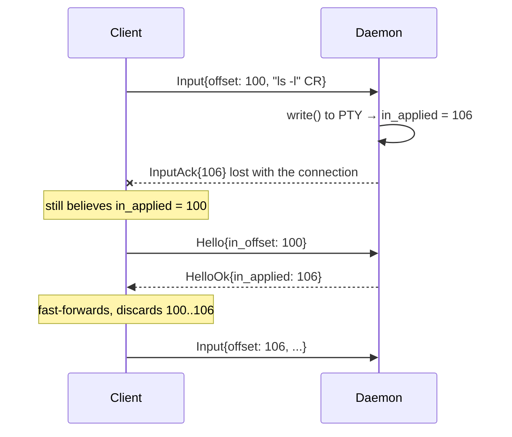
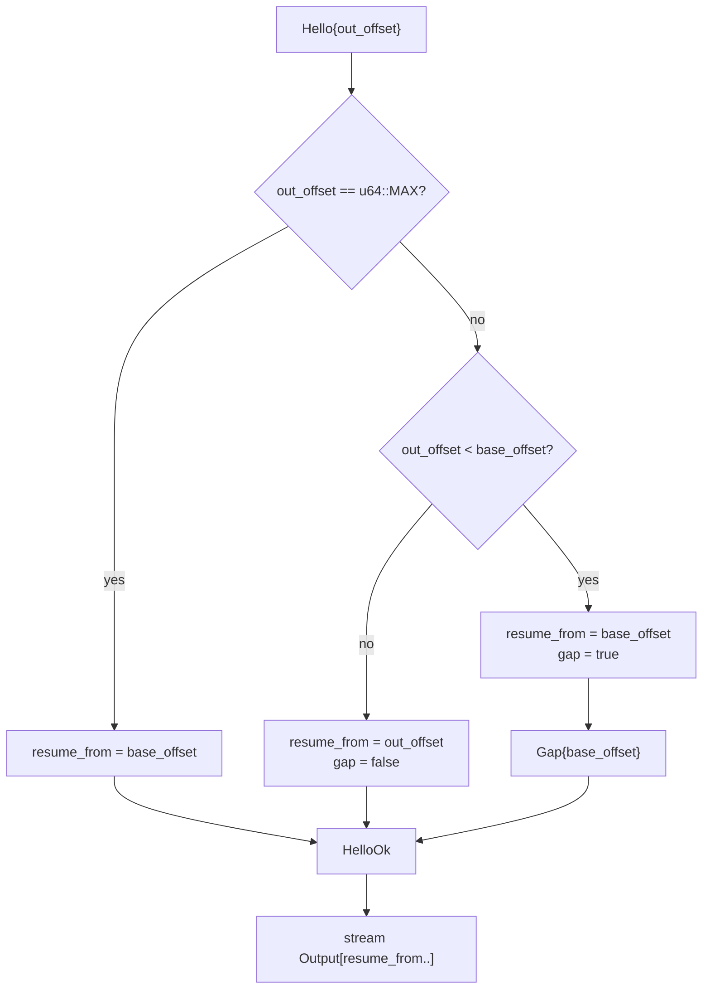
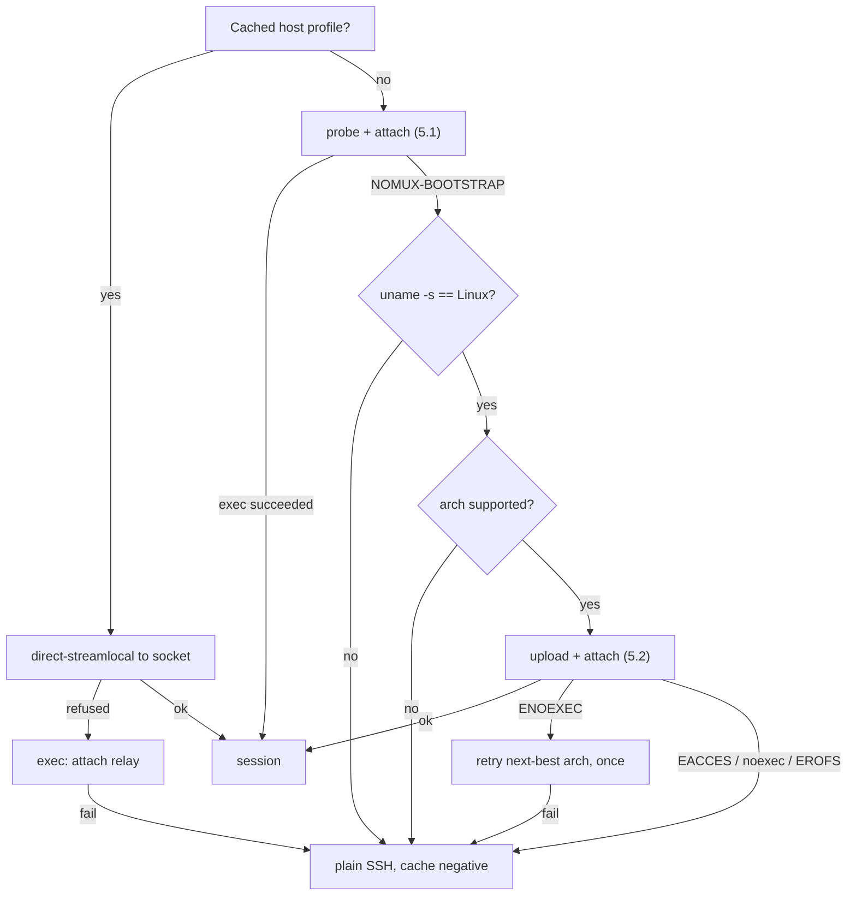
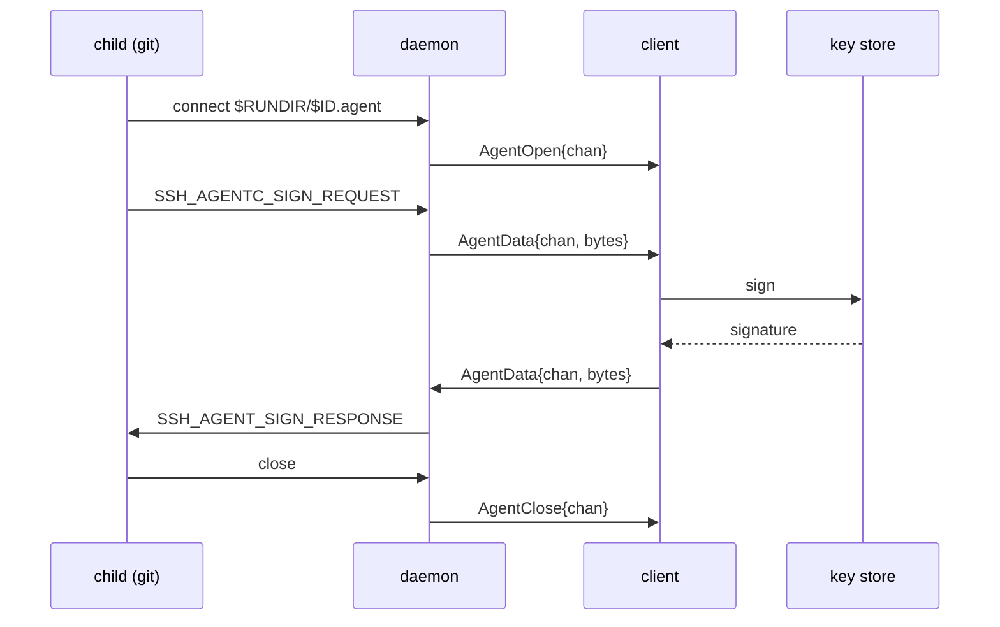

# nomux — Implementation

Low-level detail. Rationale and properties: [DESIGN.md](DESIGN.md).

## 1. Layout

```
crates/nomux-proto/   wire protocol: framing, codec, offsets. No I/O, no unsafe.
crates/nomux/         the binary: daemon, attach relay, probe.
```

`nomux-proto` is split out because the client project reimplements or links the same
codec; keeping it I/O-free makes it portable and property-testable in isolation.

- Edition 2024, MSRV 1.97.1 (`rust-toolchain.toml`).
- Workspace lints: `clippy::pedantic` + `nursery` + `cargo`, plus `unwrap_used`,
  `expect_used`, `panic`, `indexing_slicing`, `undocumented_unsafe_blocks`.
  Test relaxations live in `clippy.toml`.

## 2. Wire protocol

Spoken end-to-end between client and daemon (§7 relay is transparent).

Private protocol: client and daemon ship as one unit ([DESIGN.md § 2](DESIGN.md#2-scope)).
There is no negotiation and no reserved space for extensions. `Hello.proto` exists
solely to reject a mismatched peer immediately, which happens only in the bounded
skew case of [DESIGN.md § 6.4](DESIGN.md#64-version-skew).

### 2.1 Framing

```
 0        1                     4                        4+len
 +--------+---------------------+------------------------+
 | type   | len      (u24 BE)   | payload                |
 | u8     | 3 bytes             | len bytes              |
 +--------+---------------------+------------------------+
```

`len` caps at `MAX_PAYLOAD` (256 KiB); larger is a protocol error. All integers big
endian. Header is fixed 4 bytes so the reader is a two-stage `read_exact`.

### 2.2 Messages

| Type | Dir | Name | Payload |
| --- | --- | --- | --- |
| `0x01` | C→D | `Hello` | `u16` proto, `u16` flags, `u64` out_offset, `u64` in_offset, `u16` cols, `u16` rows, `u16` term_len, term bytes |
| `0x02` | D→C | `HelloOk` | `u16` proto, `u64` resume_from, `u64` in_applied, `u16` cols, `u16` rows, `u8` flags (bit0 = gap) |
| `0x03` | C→D | `Input` | `u64` offset, bytes |
| `0x04` | D→C | `InputAck` | `u64` applied_through |
| `0x05` | D→C | `Output` | `u64` offset, bytes |
| `0x06` | C→D | `OutputAck` | `u64` consumed_through |
| `0x07` | C→D | `Resize` | `u16` cols, `u16` rows, `u16` xpixel, `u16` ypixel |
| `0x08` | D→C | `Gap` | `u64` new_base_offset |
| `0x09` | D→C | `Exit` | `i32` status, `u8` kind (0 = exited, 1 = signalled) |
| `0x0a` | C→D | `Detach` | — |
| `0x0b` | ↔ | `Ping` | `u64` nonce |
| `0x0c` | ↔ | `Pong` | `u64` nonce |
| `0x0d` | D→C | `Error` | `u16` code, UTF-8 message |
| `0x0e` | D→C | `AgentOpen` | `u32` chan |
| `0x0f` | ↔ | `AgentData` | `u32` chan, opaque `ssh-agent` bytes |
| `0x10` | ↔ | `AgentClose` | `u32` chan |

The session id is **not** in `Hello` — it is already fixed by the socket path
(warm) or the `attach <id>` argument (cold).

`Hello.out_offset` of `u64::MAX` means *"I have no state, send me whatever you have"*
— used on a fresh app launch to recover scrollback.

## 3. Offsets and exactly-once input

Both directions are byte streams with absolute `u64` offsets, not per-frame
counters. Offsets are the offset of the frame's **first** byte.

Output is at-least-once and idempotent: the client discards anything below its
`next_expected` offset.

Input must be **exactly-once** — replaying a partially applied keystroke buffer into
a shell is how a truncated `rm -rf` gets executed. The daemon's `in_applied` is
authoritative, advanced only after `write(2)` to the PTY master returns:



Had the client blindly resent its unacked buffer, `ls -l\r` would run twice. The
absolute offset lets the daemon drop the overlap precisely — a partial overlap is
trimmed, not rejected.

Rules:
- Daemon drops any `Input` fully below `in_applied`; trims a straddling one.
- `Input` above `in_applied` is a gap in the input stream → `Error` + close. The client must not skip.
- `OutputAck` is advisory. It never trims the ring (§4); it exists so a reconnecting client that lost its own state can be told where it was.

## 4. Ring buffer

Fixed capacity (default 4 MiB), allocated once. `VecDeque<u8>`, drained via
`as_slices` to write vectored without copying.

```
        base_offset                              end_offset
             |                                        |
             v                                        v
   ..........[========== retained bytes ==============]
   dropped                  capacity
```

- Writer (PTY reader task) always drains the PTY, attached or not. If full, it advances `base_offset`, discarding oldest bytes, and sets `gap_pending`.
- Reader (client writer task) serves `[max(from, base_offset) .. end_offset]`.
- Never trimmed on ack. A full rolling window is the scrollback a fresh client gets.

### 4.1 Backpressure

The PTY drain must never block on a slow or absent client. Precedence: keep reading
the PTY, drop from the ring's head. A stalled client causes a gap, never a frozen
shell.

### 4.2 Attach with `from < base_offset`



### 4.3 Gap handling

On `gap = true` the byte stream is discontinuous and the client's emulator may be
mid-escape-sequence. Recovery, mirroring `dtach -r`:

1. Client resets its emulator locally — `ESC c` is correct but heavy-handed (drops scroll region and charset); `ESC [ ! p` + `ESC [ 2J` + `ESC [ H` is the softer default.
2. Daemon triggers a repaint from the child via a `TIOCSWINSZ` dance: set `cols-1`, then the real `cols`. The resulting two `SIGWINCH`es make most full-screen programs redraw.
3. Repaint policy is per-session: `winch` (default) or `ctrl_l` (write `0x0c` to the PTY — better for a bare shell prompt, destructive inside an editor).

Neither restores a plain shell's lost scrollback. That is inherent to byte-stream
replay and accepted; see [DESIGN.md § 10](DESIGN.md#10-open-questions) for the
`libvterm` snapshot alternative.

## 5. Bootstrap

### 5.1 Probe and attach in one round trip

```sh
p=${XDG_DATA_HOME:-$HOME/.local/share}/nomux
exec "$p/nomux-$VER" attach "$ID" 2>/dev/null
echo "NOMUX-BOOTSTRAP $(uname -s) $(uname -m) $p"
```

`exec` replaces the shell on success, so the `echo` is unreachable unless the binary
is missing or unrunnable. Warm cost: zero extra round trips.

### 5.2 Upload and attach in one round trip

```sh
p=${XDG_DATA_HOME:-$HOME/.local/share}/nomux
mkdir -p "$p" && cat > "$p/.up.$$" && chmod 755 "$p/.up.$$" \
  && mv -f "$p/.up.$$" "$p/nomux-$VER" && exec "$p/nomux-$VER" attach "$ID"
```

- Temp-then-`mv` is atomic within one filesystem and avoids `ETXTBSY` — you cannot write over a running binary.
- Version in the filename: an upgraded client cannot break sessions an older daemon still holds.
- Transfer over an **exec channel with `cat`**, not SFTP. `Subsystem sftp` gets disabled on hardened hosts, and modern `scp` is SFTP underneath. SSH channels are 8-bit clean, so no base64 tax.
- Enable `zlib@openssh.com` on this channel: ~3× on a static binary, requiring nothing on the remote.

### 5.3 Decision tree



`uname -m` lies on a 32-bit userland over a 64-bit kernel, hence the one ENOEXEC
retry. All negative results are cached per-host so a hardened box is not re-probed
on every reconnect.

## 6. Daemon

### 6.1 PTY and child

Via `rustix` rather than raw `libc`, so almost none of this needs `unsafe`.

1. `openpt(O_RDWR | O_NOCTTY)`, `grantpt`, `unlockpt`, `ptsname`.
2. `fork`. In the child: `setsid()`, open the slave (acquiring it as controlling terminal), `ioctl_tiocsctty`, `dup2` slave → 0/1/2, close master and slave, `execv`.
3. Parent sets the initial `TIOCSWINSZ` from `Hello` before the first read.
4. Master is set non-blocking; the event loop is `poll` over {master, listener, client fds, self-pipe for `SIGCHLD`}.

**The SSH channel must not request a PTY.** nomux allocates its own; if sshd
allocated one too there would be two line disciplines stacked, giving double echo,
doubled `\r\n` translation and broken raw mode. The channel is a raw byte pipe and
nomux owns the only PTY — which is also why `TERM` arrives in `Hello` (§2.2) rather
than from sshd.

### 6.1.1 What the child runs

Whatever a plain `ssh host` would have run, because nomux is *already inside* an SSH
session and inherits its setup rather than reconstructing it. PAM has run, and
`HOME`, `USER`, `PATH` and `SSH_*` are already in the environment.

- **Login shell, dash-prefixed**: `execv(shell, ["-bash", ...])`, not `["bash", ...]`. That leading `-` is what sshd does for an interactive session and what causes `/etc/profile` and `~/.bash_profile` to be sourced. Omitting it yields a stunted environment that users correctly perceive as broken.
- **Shell selection**: `$SHELL` as inherited, else `getpwuid(getuid()).pw_shell`, else `/bin/sh`.
- **Environment**: inherited wholesale. Remove nomux scaffolding, set `TERM` from `Hello`, `NOMUX_SESSION=<id>`, and — when agent forwarding is enabled — `SSH_AUTH_SOCK=$RUNDIR/<id>.agent` (§6.7). Change nothing else.
- **No PAM.** It already ran for the SSH login, and the daemon is unprivileged.
- No client-supplied command in v1. A one-shot remote command has no reason to be persistent; it stays on plain SSH.

The environment is a snapshot of the connection that *created* the session, frozen
for its lifetime — a later reconnect may carry a different agent socket, `DISPLAY`
or `AcceptEnv` values that the child can never see, because a running process's
environment cannot be mutated. Indirection through the run directory (§6.6) is the
only available fix, and only for variables that name a path.

### 6.2 Detachment from the login session

```
fork → parent _exit
  setsid
  fork again            (cannot reacquire a controlling terminal)
    chdir "/"
    close inherited fds; 0/1/2 → /dev/null
    ignore SIGHUP, SIGPIPE
```

`systemd-logind` with `KillUserProcesses=yes` kills the daemon at logout regardless.
The only real fix is `loginctl enable-linger $USER`. Detect via
`loginctl show-user --value -p Linger` and report through `HelloOk` flags; do not
attempt to work around it.

Most distributions ship `KillUserProcesses=no`, where the double-fork alone suffices.

### 6.3 Socket

Session ids come from the client and are used directly as filename components, so
they are validated before touching the filesystem — `nomux_proto::is_valid_session_id`:

```
1..=64 bytes, each of [A-Za-z0-9_-]
```

This rejects `..`, `/`, `.`, empty, NUL and non-ASCII outright, so path traversal is
impossible by construction rather than by escaping. Both ends validate: the client
before minting, the daemon before use. An invalid id is a hard error, never sanitised
into something valid — silently rewriting an id would attach the user to the wrong
session.

Path precedence:

1. `$XDG_RUNTIME_DIR/nomux/<id>.sock` — tmpfs, but removed on last logout unless linger is on.
2. `$XDG_STATE_HOME/nomux/run/<id>.sock`, default `~/.local/state/nomux/run/`.

Directory `0700`, socket `0600`. Filesystem sockets only — never abstract sockets,
which are namespace- rather than permission-scoped and would be reachable by any
local user.

Spawn race (two clients attaching at once): `flock(LOCK_EX | LOCK_NB)` on
`<id>.lock`; the loser polls for the socket. A stale socket is one where `connect`
returns `ECONNREFUSED` — unlink and respawn. `EACCES` is not staleness.

### 6.4 Multiple clients

Exactly one attached client. A second `Hello` on a live session takes over; the
previous connection receives `Error{TAKEOVER}` and closes.

No read-only mirrors and no session sharing — there is one client per session by
construction, and the takeover case exists only to recover from a half-dead
connection the daemon has not yet noticed.

### 6.5 Shutdown

Child exit → `waitpid` → flush the ring to any attached client → `Exit` frame →
unlink run files → exit. Linger briefly (default 5 s) so a client reconnecting into
the race still collects the final output and status.

Idle reaping ([DESIGN.md § 5.2](DESIGN.md#52-reaping)) is self-inflicted, not
external: the daemon stamps `last_detach` on losing a client and arms a `poll`
timeout against it. On expiry it sends `SIGHUP` then `SIGKILL` to the child's process
*group* — not just the child, or backgrounded grandchildren survive — and exits
through the same path. No cron, no supervisor, nothing to install.

### 6.6 Frozen control surface

`nomux kill <id>` and `nomux list` must work against a daemon of *any* version,
including one older than the binary invoking them. They are the escape hatch that
makes the N-1 codec policy in [DESIGN.md § 6.4](DESIGN.md#64-version-skew) safe.

The contract is therefore the **on-disk layout**, not a protocol subset:

```
$RUNDIR/<id>.sock    unix socket   0600
$RUNDIR/<id>.pid     daemon pid, ASCII, newline-terminated
$RUNDIR/<id>.lock    flock target for spawn races
$RUNDIR/<id>.label   UTF-8 display label, no newline, <= 256 bytes
$RUNDIR/<id>.agent   ssh-agent socket, 0600 (§6.7)
```

- `list` reads the directory and probes each socket with `connect`; `ECONNREFUSED` means stale, and stale entries are unlinked.
- `kill` reads the pidfile, sends `SIGTERM`, waits up to 2 s, then `SIGKILL`, then unlinks all five files.

`<id>.label` exists because ids are opaque per-tab identifiers
([DESIGN.md § 5.1](DESIGN.md#51-identity)). Without it, a client that has lost its
state sees only UUIDs and cannot tell the user which session was which. It is
written once at session creation and is advisory — never parsed, never used for
lookup, and a missing or malformed label degrades `list` output but nothing else.

Neither opens a session, sends a frame, or reads `PROTOCOL_VERSION`. This layout is
frozen: filenames, permissions and pidfile format may never change. Everything
version-dependent lives behind the socket.

Corollary: a *new* binary can reap an *old* daemon, so recovery does not depend on
the old binary still being present on the host.

### 6.7 Agent forwarding

nomux forwards `ssh-agent` itself rather than borrowing sshd's forwarded socket.
The daemon **listens** on `$RUNDIR/<id>.agent` and proxies each connection to the
client as a sub-channel; the client answers from its own key store.



Why not refresh a symlink to sshd's socket on each attach: that requires reading the
new connection's environment, which means running a process, which the warm resume
path (§5.3) deliberately does not do. A socket the daemon owns is stable for the
session's whole life, never dangles, and needs no environment at all.

Mechanics:

- Channel ids are `u32`, allocated by the daemon — the only opener — monotonically and never reused within a session, so a close/open pair crossing in flight cannot alias.
- `AgentOpen` is optimistic: no ack. A client that cannot serve replies `AgentClose`.
- At most `MAX_AGENT_CHANNELS` (8) concurrent; beyond that the daemon closes immediately rather than queueing.
- Payloads are opaque. The daemon never parses the agent protocol — it is a byte pipe, exactly like the PTY stream.
- **While detached, connections are accepted and closed immediately.** A `git push` with no client attached fails fast with the same error as a missing agent, rather than hanging until reattach.
- No flow control. Agent exchanges are a few hundred bytes and serial in practice; `MAX_PAYLOAD` is the only bound.

Security:

- The socket is `0600` inside the `0700` run directory, so reachable only by the session's own user — the same exposure as sshd's forwarded socket.
- **It works without `ForwardAgent`**, which means it bypasses a deliberate user decision. It must therefore be opt-in per host, defaulting off, and the client must never enable it silently.
- If sshd forwarding is also active, `SSH_AUTH_SOCK` is set by sshd and then overwritten by the daemon (§6.1.1). Ours wins.
- Better than `ssh -A` in one respect: because the client holds the keys and sees each request, it *can* prompt per signature or show which session is asking. Plain agent forwarding is unconditionally silent.

## 7. Attach relay

`nomux attach <id>` when `direct-streamlocal` is unavailable. Deliberately dumb:

- `poll` on stdin/stdout and the socket; `splice(2)` on Linux to avoid userspace copies.
- No frame parsing, no buffering beyond the pipe.
- Spawns the daemon (§6.3) if the socket is absent, then connects.
- Half-close propagation: EOF on stdin → `shutdown(SHUT_WR)` on the socket, keep draining the other direction.

Protocol logic exists only in the daemon. The relay must never need a version bump.

## 8. Build

Targets:

| Triple | Covers |
| --- | --- |
| `x86_64-unknown-linux-musl` | Most servers |
| `aarch64-unknown-linux-musl` | ARM servers, Apple-silicon VMs, most SBCs |
| `armv7-unknown-linux-musleabihf` | Older SBCs |
| `riscv64gc-unknown-linux-musl` | Emerging |

`zig cc` as the cross linker keeps this to one host toolchain. `ppc64le` / `s390x`
are deliberately omitted until asked for.

Size matters because the cold upload happens over cellular. Release profile:
`opt-level = "z"`, `lto = "fat"`, `codegen-units = 1`, `panic = "abort"`,
`strip = "symbols"`. Target ≤ 400 KiB per arch. `-Z build-std` with
`panic_immediate_abort` roughly halves it again but requires nightly, so it stays an
opt-in CI profile and not the MSRV path.

Builds must be reproducible: the client pins a SHA-256 per arch and verifies after
upload.

## 9. Testing

| Layer | Approach |
| --- | --- |
| Codec | `proptest` round-trip; truncated and oversized frames must error, never panic. |
| Ring buffer | Model-based against a reference `VecDeque`, asserting `base_offset` monotonicity and that served ranges are byte-exact. |
| Exactly-once input | The §3 scenario, replayed across a simulated drop at every byte boundary. |
| Session | Spawn daemon → write → sever the socket mid-stream → reattach → assert the concatenated output is byte-identical to an unbroken run. |
| Gap | Capacity forced small; assert `Gap` is emitted and `base_offset` is exact. |
| Chaos | Randomised disconnect injection under `yes`, `vim`, and a sixel-emitting program. |

The two invariants that matter: **no duplicated input, ever**, and **no lost output
unless a `Gap` was reported**.

## 10. Exit codes

| Code | Meaning |
| --- | --- |
| 0 | Child exited 0, or clean detach |
| 1–125 | Child's own status, propagated |
| 126 | Session exists but is unattachable (permissions, protocol) |
| 127 | No such session and spawn failed |
| 128+n | Child killed by signal n |
