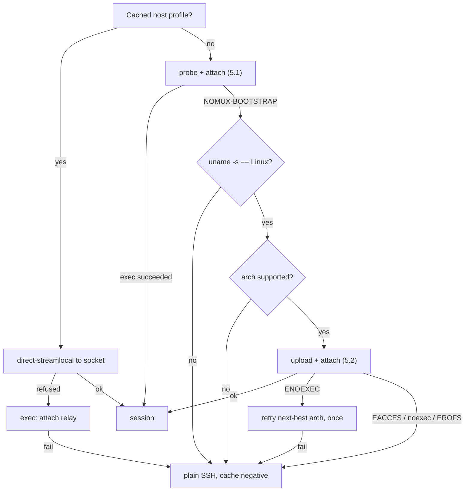

# nomux — Implementation

Low-level detail. Rationale and properties: [DESIGN.md](DESIGN.md).

**Building something against nomux?** §6.6 is frozen across versions and is the only part
a third party may rely on: the five filenames, their permissions, the pidfile's format,
what `list` prints. §2 is versioned instead — `Hello.protocol` refuses a peer built
against another revision — but it is what a second client is written against, with
`crates/nomux/tests/wire-vectors.txt` giving §2.2's table in bytes for a reader who parses
no Rust. Everything else here describes a version, not a promise.

## 1. Layout and conventions

```
crates/nomux/         one package, two targets:
  src/lib.rs          wire protocol: framing, codec, offsets. No I/O, no unsafe.
  src/main.rs         the binary: daemon, attach relay, control surface.
```

`main.rs` declares the rest and `lib.rs` one, each named for what it owns. Neither target
is published ([DESIGN.md § 2](DESIGN.md#2-scope)).

- Edition 2024, MSRV 1.97.1 (`rust-toolchain.toml`).
- Lints: `[workspace.lints]` in `Cargo.toml` is the list, every entry at `warn` bar one,
  which `Cargo.toml` names and argues. The deny is `-D warnings` on the clippy hook in
  `.pre-commit-config.yaml`, which gates this tree rather than any build of it; test
  relaxations live in `clippy.toml`.

### Environment

An index and not a second statement of the behaviour: each row names the section that owns
it, and what nomux *sets* is §6.1.1's. `NOMUX_DEBUG` and `NOMUX_UPDATE_BASELINE` are tested
for exactly `1`.

| Variable | Read by | Effect |
| --- | --- | --- |
| `XDG_RUNTIME_DIR` | every mode | First choice of run directory (§6.3) |
| `XDG_STATE_HOME` | every mode | Second choice (§6.3) |
| `HOME` | every mode | Third choice (§6.3), and the child's working directory (§6.1.1) |
| `SHELL` | daemon | The child's login shell (§6.1.1) |
| `USER`, `LOGNAME` | daemon | Login name for the linger check (§6.2) |
| `NOMUX_RING_BYTES` | daemon | Ring capacity in bytes (§4) |
| `NOMUX_CHAOS_SEED` | the chaos suite | Disconnect-point seed; unset is a fixed default, so a failure reproduces (§9) |
| `NOMUX_DEBUG` | `scripts/build-release.sh` | Also build the unstripped companions (§8) |
| `NOMUX_UPDATE_BASELINE` | `scripts/build-release.sh` | Rewrite `scripts/size-baseline` from this build (§8) |

Off the table, the toolchain's own. `scripts/build-release.sh` reads `CARGO_HOME` and
`CARGO_TARGET_DIR`, sets `RUSTUP_TOOLCHAIN` itself, and passes its own flags as
`CARGO_ENCODED_RUSTFLAGS` rather than `RUSTFLAGS` for the reason it gives about the paths
it interpolates (§8) — which is also why the job-wide `RUSTFLAGS` deny CI sets on its
`check` job is *not* set on the release one, `CARGO_ENCODED_RUSTFLAGS` making cargo ignore
`RUSTFLAGS` outright and a deny there silently absent. The
unit tests site scratch directories under `TMPDIR` via `env::temp_dir()`, the integration
tests under `CARGO_TARGET_TMPDIR` (§9).

## 2. Wire protocol

Spoken end-to-end between client and daemon (§7's relay is transparent). Private, with no
negotiation, no reserved space for extensions and nothing carried that nothing reads
([DESIGN.md § 2](DESIGN.md#2-scope)). `Hello.protocol` is the only revision on the wire,
and it refuses a mismatched peer at once, in the bounded skew case of
[DESIGN.md § 6.4](DESIGN.md#64-version-skew).

### 2.1 Framing

```
 0        1                     4                        4+len
 +--------+---------------------+------------------------+
 | type   | len      (u24 BE)   | payload                |
 | u8     | 3 bytes             | len bytes              |
 +--------+---------------------+------------------------+
```

`len` caps at `MAX_PAYLOAD` (256 KiB); larger is a protocol error. All integers big
endian. The header is fixed at 4 bytes, so a reader sizes the payload from the first four
and never has to scan for a boundary. *winsize* is four `u16`s — cols, rows, xpixel, ypixel — everywhere it appears.

### 2.2 Messages

| Type | Dir | Name | Payload |
| --- | --- | --- | --- |
| `0x01` | C→D | `Hello` | `u16` protocol, `u8` flags, `u64` out_offset, winsize, `u16` term_len, UTF-8 term bytes |
| `0x02` | D→C | `HelloOk` | `u64` resume_from, `u64` in_applied, `u8` linger (0 unknown, 1 disabled, 2 enabled), `u8` flags |
| `0x03` | C→D | `Input` | `u64` offset, bytes |
| `0x04` | D→C | `InputAck` | `u64` applied_through |
| `0x05` | D→C | `Output` | `u64` offset, bytes |
| `0x06` | C→D | `Resize` | `u16` cols, `u16` rows, `u16` xpixel, `u16` ypixel |
| `0x07` | D→C | `Gap` | `u64` new_base_offset |
| `0x08` | D→C | `Exit` | `i32` status, `u8` kind (0 = exited, 1 = signalled), `u32` since_exit_secs |
| `0x09` | C→D | `Detach` | — |
| `0x0a` | C→D | `Ping` | — |
| `0x0b` | D→C | `Pong` | — |
| `0x0c` | D→C | `Error` | `u16` code (1 protocol, 2 takeover, 3 version, 4 input_gap, 5 internal), UTF-8 message |
| `0x0d` | D→C | `AgentOpen` | `u32` generation |
| `0x0e` | ↔ | `AgentData` | `u32` generation, opaque `ssh-agent` bytes |
| `0x0f` | ↔ | `AgentClose` | `u32` generation |

`Hello` carries the current revision, **8** — `PROTOCOL_VERSION` in
`crates/nomux/src/lib.rs`, bumped on any wire change, compatible ones included.

The session id is *not* in `Hello`: the socket path fixes it warm, and the id handed to
`spawn` or `attach` fixes it cold. Nothing in `Hello` says where the client's *input*
stream stands either — `HelloOk.in_applied` is authoritative there (§3).
`Hello.out_offset` of `u64::MAX` means *"I have no state, send me whatever you have"*,
used on a fresh app launch to recover scrollback.

`Hello.term_len` counts **bytes**: a `TERM` past the `u16` ceiling is refused rather than
truncated, and one containing a NUL is refused encoding as well as decoding. Both `term`
and the agent-forwarding flag (§2.3) are read only on the `Hello` that **creates** the
session and ignored on one resuming it — the child's environment is frozen at spawn
(§6.1.1).

The agent generation names one *incarnation* of the single sub-channel §6.7 serves. The
daemon mints it per accepted connection and puts it on `AgentOpen`; the client echoes it
on everything it sends for that channel; the daemon discards any `AgentData` or
`AgentClose` naming a channel it no longer holds. It costs `AgentData` four of its
`MAX_PAYLOAD` bytes, which both ends subtract when they chunk. §6.7 has why an unnamed
channel would not do.

`Exit.since_exit_secs` counts whole seconds since the child let go of the terminal,
elapsed against a monotonic clock and saturating at `u32::MAX`.

### 2.3 Flags

Both flag fields are exhaustive: an undefined bit is a protocol error, not a
forward-compatibility case ([DESIGN.md § 2](DESIGN.md#2-scope)), and the same holds for
every other closed set on the wire — `Error.code`, `Exit.kind`, `HelloOk.linger`.

`Hello.flags`:

| Bit | Name | Honoured |
| --- | --- | --- |
| 0 | agent forwarding (§6.7) | Only on the `Hello` that **creates** the session (§6.1.1) |
| 1 | repaint with `ctrl_l` rather than `winch` (§4.3) | Every attach; it costs nothing to restate, and only the client knows what is on the screen |

`HelloOk.flags`:

| Bit | Name |
| --- | --- |
| 0 | an agent socket is being served, so `AgentOpen` may arrive |

There is no `gap` bit: both ends compute the same predicate instead (§4.2).

## 3. Offsets and exactly-once input

Both directions are byte streams with absolute `u64` offsets, not per-frame counters,
and an offset is that of the frame's **first** byte. Output is at-least-once and
idempotent: the client discards anything below the offset it has already consumed.

Input must be **exactly-once** — replaying a partially applied keystroke buffer into a
shell is how a truncated `rm -rf` gets executed. The daemon's `in_applied` is
authoritative and advances the moment the daemon takes ownership of the bytes, so an
`InputAck` lost with the connection costs nothing: the client is told `in_applied` again
in `HelloOk` and fast-forwards past what it thought was unsent.

- Daemon drops any `Input` fully below `in_applied`; trims a straddling one.
- `Input` above `in_applied` is a gap in the input stream → `Error` + close. The client must not skip.
- **Past the child's exit `in_applied` still advances and the `InputAck` still goes back, over bytes the daemon discards** rather than queues: there is no terminal left to write them to, and queueing them would refill what the exit emptied. Exactly-once is a promise that the client never sends a byte twice, never that a byte reached a shell — which is the same promise as for input queued for a child that has stopped reading, one paragraph down.

Ownership, not durability: the master is non-blocking (§6.1), so a child that has stopped
reading leaves input queued indefinitely, and waiting for the write would stall the ack
behind it. The queue is the daemon's own memory, never re-applied and bounded by §4.1;
losing it means losing the daemon, which ends the session anyway. The client owns the
other half of the invariant: an `Input` frame written but not yet read is *not* safe,
which is what the resend above is for.

## 4. Ring buffer

Fixed capacity, allocated once, with `Ring::base()` the oldest offset still retained and
`Ring::end()` one **past** the newest byte written — the total ever written, and the open
end of every range below. Capacity defaults to 4 MiB, overridable per daemon with
`NOMUX_RING_BYTES` (§1): an unparseable or zero value falls back to the default instead of
refusing to start, and one past 1 GiB is clamped there.

- The daemon always drains the PTY, attached or not. If the ring is full it advances the base, discarding the oldest bytes; a write larger than the whole ring discards everything retained as well as its own head, so the base accounts for both.
- A client is served `[max(from, base()) .. end()]`.
- Overflow is not a stored flag. Whether a *reader* lost anything depends on where that reader had reached, so it is derived per client by comparing its position against the base — which stays correct across any number of overflows, including ones that happened while it was away.
- Never trimmed to what a client has consumed. A full rolling window is the scrollback a fresh client gets.

### 4.1 Backpressure

The PTY drain must never block on a slow or absent client. Precedence: keep reading the
PTY, drop from the ring's head, so a stalled client causes a gap and never a frozen shell.
Four bounds, each enforced on its own queue:

| Constant | Value | Bound |
| --- | --- | --- |
| `MAX_PENDING_WRITE` | 1 MiB | Past this queued to the client, output stops being queued; the ring absorbs the PTY regardless |
| `ABANDON_PENDING_WRITE` | 8 MiB | Past this the client is not slow but gone, and is dropped; reattaching replays from the ring. The gap between the two figures is clear of the first plus one output chunk |
| `MAX_PENDING_INPUT` | 1 MiB | Past this queued for a child that is not reading, the daemon stops **accepting** input: it stops decoding `Input` frames and stops asking the socket for more. Dropping is not available, `in_applied` being exactly-once (§3), and `Error{INPUT_GAP}` would accuse a client that had done nothing wrong. The bytes wait in the kernel's buffer, where the peer blocks on them — §6.7's argument for a saturated agent connection |
| `MAX_PENDING_READ` | 1 MiB | One connection's undecoded receive buffer, bounded by the daemon's own number rather than by whatever the peer set `SO_SNDBUF` to. Past it the socket is not read at all, so the overshoot is one read buffer. Slowest of the four to fill, a stock host's send buffer being a fifth of it: the megabyte only accumulates across the passes in which the decode loop stopped short of what the pass before had read |

All four are chosen against each other and so live together in `daemon.rs`, which argues
the arithmetic. `Conn::send_output` is the only writer that consults `MAX_PENDING_WRITE` at
all: everything the daemon tells a client directly — `InputAck`, `Pong`, `Exit`, `HelloOk`,
`AgentOpen`, `AgentClose` — queues past it unmeasured, and what keeps the 7 MiB between the
two figures is that each of those is small and answers either a frame the client sent or an
event of the session's own, not that the set is closed. The consequence a client author
needs is that the input cap is enforced in the decode loop: **its own `Ping`, `Resize` and
`Detach` queue behind its own stalled input**, and a takeover's final drain goes with the
outgoing connection — accepted, since §3 has the client resending from `in_applied`. A new
connection is polled as pending and never held back by it, so `list` and §6.3's spawn race
are unaffected; `nomux kill` is a signal (§6.5).

**A detaching client's send queue is dropped, not flushed**: everything in it is
per-connection state a reattach recomputes from the ring (§4.2, §6.5). Only departures
with nothing behind them block on a final flush — §6.5's shutdown, and every close that
carries a final `Error`, §6.4's eviction among them.

### 4.2 Attach with `from < base()`

```
resume_from = if out_offset == u64::MAX || out_offset < base() { base() }
              else                                             { min(out_offset, end()) }
gap         = resume_from > out_offset
→ HelloOk{resume_from}, then Output[resume_from..]
```

**The gap is that comparison, and nothing sends it.** Both ends compute it — the daemon
to decide the repaint it owes (§4.3), the client to reset its emulator — so a flag would
be the daemon restating a number the client can see. This is the *attach-time* gap; the
standalone `Gap` frame is for overflow mid-stream, while a client is attached.

`resume_from` is clamped at *both* ends, which is why the no-gap branch carries a `min`:
an `out_offset` above the end is a client claiming output the session never produced,
which unclamped would set `sent_through` past the end of the stream and leave the session
looking dead until the child caught up. Not a gap — nothing was dropped.

### 4.3 Gap handling

On a gap the byte stream is discontinuous and the client's emulator may be
mid-escape-sequence. Recovery, mirroring `dtach -r`:

1. Client resets its emulator locally — `ESC c` is correct but heavy-handed (drops scroll region and charset); `ESC [ ! p` + `ESC [ 2J` + `ESC [ H` is the softer default.
2. Daemon triggers a repaint from the child via a `TIOCSWINSZ` dance: set `cols-1`, then the real `cols`. The resulting two `SIGWINCH`es make most full-screen programs redraw. A terminal one column wide gets neither: there is no narrower size to go to, and a resize to the size already in effect is short-circuited in the kernel instead of signalled.
3. Repaint policy is the client's, restated in each `Hello` (§2.3): `winch` (default) or `ctrl_l` (write `0x0c` to the PTY — better for a bare shell prompt, destructive inside an editor).

`ctrl_l` goes through the same queue as client input rather than straight to the master,
so it cannot overtake keystrokes already accepted or block on a full PTY buffer. It is
not client input, so `in_applied` does not move for it.

The repaint is *owed* at the gap and issued on the first pass that finds the client
holding the whole ring: one repaint for a sustained overrun, whether the gap came from
§4.2's `HelloOk` comparison or from a mid-stream `Gap`. A client that never catches up is
never repainted. Neither step restores a plain shell's lost scrollback, inherent to
byte-stream replay ([DESIGN.md § 10](DESIGN.md#10-rejected-alternatives)
weighs the `libvterm` snapshot).

## 5. Bootstrap

### 5.1 Probe and attach in one round trip

```sh
p=${XDG_DATA_HOME:-$HOME/.local/share}/nomux
exec "$p/nomux-$VER" "$MODE" "$ID" 2>/dev/null
echo "NOMUX-BOOTSTRAP $(uname -s) $(uname -m) $p"
```

`exec` replaces the shell on success, so the `echo` is unreachable unless the binary is
missing or unrunnable. Warm cost: zero extra round trips. `$MODE` is `spawn` or `attach`
([DESIGN.md § 4](DESIGN.md#4-architecture)), a substitution rather than a second command,
the client knowing which because it knows whether it holds a session for this tab. The
fields are `uname`'s — `Linux`, `x86_64` — because `sh` emits the line before any binary
exists; confirming that an *uploaded* artifact runs is `--version`'s job, one line on
stdout and exit 0: `nomux <version> (protocol <revision>)`, the crate's version and the
`PROTOCOL_VERSION` of §2.2.

### 5.2 Upload and attach in one round trip

```sh
p=${XDG_DATA_HOME:-$HOME/.local/share}/nomux
mkdir -p -m 700 "$p" && set -C && cat > "$p/.up.$$" && chmod 755 "$p/.up.$$" \
  && mv -f "$p/.up.$$" "$p/nomux-$VER" && exec "$p/nomux-$VER" "$MODE" "$ID"
```

- Temp-then-`mv` is atomic within one filesystem and avoids `ETXTBSY` — you cannot write over a running binary.
- Version in the filename: an upgraded client cannot break sessions an older daemon still holds.
- Transfer over an **exec channel with `cat`**, not SFTP. `Subsystem sftp` gets disabled on hardened hosts, and modern `scp` is SFTP underneath. SSH channels are 8-bit clean, so no base64 tax.
- Enable `zlib@openssh.com` on this channel: a static binary compresses well, and it needs nothing on the remote.
- **`-m 700` rather than the ambient umask**, since a bare `mkdir -p` creates at `0777 & ~umask` and `umask 002` is the Debian-derived default: without the mode, the directory every later connection `exec`s out of is group-writable with nobody having pointed `$XDG_DATA_HOME` anywhere. It binds only where this call *creates* the directory.
- **`set -C` before the redirect**, `.up.$$` being a predictable name. Under noclobber `>` is `O_CREAT | O_EXCL`, which refuses a symlink — dangling or not — where a plain `cat >` follows it. In a directory another user can write to, that is the difference between one failed bootstrap and choosing where the uploaded bytes land: `~/.ssh/authorized_keys`, `~/.bashrc`, anything this uid can write.
- **The install directory is still created, not checked** — materially weaker than what §6.3 gives the *run* directory. [DESIGN.md § 8](DESIGN.md#8-security-model) states what the two lines above do and do not close, and to whom.
- **Nothing here ever unlinks an uploaded binary.** Every release therefore leaves another artifact in every user's home on every host they have ever touched, and only the client — which knows each session's version — can tell a `nomux-*` that is neither current nor holding a live session from one that is.

### 5.3 Decision tree



`uname -m` lies on a 32-bit userland over a 64-bit kernel, hence the one ENOEXEC retry. A
`noexec` or read-only home is detected by exec failing, never by parsing mounts, and every
negative is cached per-host so a hardened box is not re-probed on each reconnect. Three
conditions off the tree reach the same fallback: a restricted shell with no `uname` is
plain SSH; `AllowStreamLocalForwarding no` costs only the warm path, leaving the exec
relay; and `KillUserProcesses=yes` without linger kills the daemon at logout, which the
daemon detects and reports (§6.2) rather than works around.

## 6. Daemon

### 6.1 PTY and child

`Pty::spawn` allocates the master, hands the slave to the child as all three stdio
descriptors, and sets `TIOCSWINSZ` from `Hello` before the child can observe it.
`Command::spawn` forks; its `pre_exec` closure calls `setsid`, takes the slave as
controlling terminal, and restores **`SIGHUP`, `SIGQUIT`, `SIGTSTP`, `SIGTTIN` and
`SIGTTOU`** to `SIG_DFL` — *every disposition this process may be ignoring*, not the one it
chose. `exec` resets a handled signal and preserves an ignored one, so § 6.2's own `SIGHUP`
would be shrugged off by the child § 6.5 sends it to, and an ignore this daemon never chose
arrives the same way: POSIX has a non-interactive shell set `SIGINT` and `SIGQUIT` to
`SIG_IGN` around a background job, so without the other four `nomux spawn work &` in a
script hands the user a shell — and everything that shell runs — ignoring `Ctrl-\` and
`Ctrl-Z` for the session's life. `SIGINT` and `SIGTERM` are absent: § 6.2 *handles* them by
then, and `exec` resets a handler.

**Both ends are opened `O_CLOEXEC`**, so the only descriptors that cross the `exec` are the
three the child is handed deliberately. What that keeps out is the master: a copy of it in
the child would hold the session's read end open for as long as the child lives, and end of
file on that read end is the whole of how § 6.5 learns the child let go of the terminal.
The slave is dropped in the spawning frame for the same reason — `std` only *borrows* the
descriptor for each `Stdio`, so `Command` holds all three until it is itself dropped, and a
copy outliving that would keep a terminal open with nobody on it.

**The SSH channel must not request a PTY.** nomux allocates its own; two stacked line
disciplines give double echo, doubled `\r\n` translation and broken raw mode. That is also
why `TERM` arrives in `Hello` (§ 2.2) and not from sshd.

The master is non-blocking, so input the PTY will not take waits in the daemon's queue,
where § 4.1's cap alone bounds it.

#### 6.1.1 What the child runs

Whatever a plain `ssh host` would have run, since nomux starts *already inside* an SSH
session: PAM has run, and `HOME`, `USER`, `PATH` and `SSH_*` are already set.

- **Login shell, dash-prefixed**: `execv(shell, ["-bash", ...])`, not `["bash", ...]`. That leading `-` is what sshd does for an interactive session and what causes `/etc/profile` and `~/.bash_profile` to be sourced.
- **Shell selection**: `$SHELL` where it names an **absolute** path, else `/bin/sh`. There is no password-database step. Absolute and not merely non-empty: a `SHELL=bash` would send `Command` looking down `PATH` — a pair std documents as ambiguous once a working directory is set too — and run whatever a writable `~/.local/bin` resolves it to. The cost is a session started by something that scrubbed the environment getting `/bin/sh` rather than the user's shell.
- **Working directory**: `$HOME`, else the directory the attaching connection was in, else `/`. Set explicitly, since the daemon has moved to `/` (§ 6.2).
- **Environment**: inherited wholesale, then `TERM` from `Hello`, `NOMUX_SESSION=<id>` and — with agent forwarding on — `SSH_AUTH_SOCK=$RUNDIR/<id>.agent` (§ 6.7) are set. **Nothing is scrubbed**, which leaves `NOMUX_RING_BYTES` (§ 1) visible to a child whose daemon was started with it.
- **No PAM.** It already ran for the SSH login, and the daemon is unprivileged.
- No client-supplied command in v1. A one-shot remote command has no reason to be persistent; it stays on plain SSH.

That environment is a snapshot of the connection that *created* the session, frozen for its
lifetime ([DESIGN.md § 5.3](DESIGN.md#53-transparency)). Indirection through the run
directory (§ 6.6) is the only fix, and only for variables that name a path.

### 6.2 Detachment from the login session

The `daemon` mode holds this itself instead of trusting whoever started it:

```
ignore SIGHUP
leads a session and holds no controlling terminal?  already detached; nothing to do
  else setsid            refused only if we lead a process group
    else fork → parent _exit, child setsid
...                      re-listen, stop signals, <id>.pid, <id>.label, drop the lock
chdir "/"
0/1/2 → /dev/null
```

The test is **no controlling terminal**, not "leads a session": a session leader may still
hold one. `startup::leave_login_session` carries the rest. The fork happens after the socket
is bound and before the pidfile is written, so an id already taken is reported with an exit
status somebody sees, and `nomux kill` (§ 6.6) reads the pid of the survivor. That second
gap is § 6.6's publish window.

Signal dispositions: `SIGHUP` ignored, and restored in the child with four others before
`exec` (§ 6.1). `SIGTERM` and `SIGINT` handled, not ignored (§ 6.5), armed before the
pidfile so the pid `kill` reads does not name a process on the default disposition —
best-effort, the arming resting on a `pipe2` whose failure the daemon swallows rather than
refuse a session over. `SIGPIPE` ignored by the Rust runtime and reset for spawned
children. `SIGQUIT`'s own disposition is § 6.5's; it is in § 6.1's list all the same.

`systemd-logind` with `KillUserProcesses=yes` kills the daemon at logout; the only fix is
`loginctl enable-linger $USER`. The daemon reports the state in `HelloOk.linger` (§ 2.3),
reading what `logind` reads: `/run/systemd/system`, then `/var/lib/systemd/linger/<user>`.
A missing marker is a definite *disabled*; only a lookup that fails otherwise is *unknown*,
and **the client must not warn on unknown**. The login name is `$USER`, then `$LOGNAME`, and
nothing else. **The test is applied to each source in turn, not to the answer**: a name that
is empty or holds `/`, NUL, `.` or `..` is not a single filename component, and one that
fails is skipped rather than fatal — a malformed `$USER` falls through to `$LOGNAME`, which
is what "in that order" has to mean. Only both failing is *unknown*.

### 6.3 Socket

Session ids become filename components, so `rundir::is_valid_session_id` validates them
before anything touches the filesystem:

```
1..=64 bytes, each of [A-Za-z0-9_-], and never a leading `-`
```

That rejects `..`, `/`, `.`, empty, NUL and non-ASCII, so path traversal is impossible by
construction; the leading `-` is the command line's bound. Both ends validate, and an
invalid id is a hard error, never sanitised into something valid.

Path precedence, first **absolute** one winning:

1. `$XDG_RUNTIME_DIR/nomux/<id>.sock` — tmpfs, but removed on last logout unless linger is on.
2. `$XDG_STATE_HOME/nomux/run/<id>.sock`.
3. `$HOME/.local/state/nomux/run/<id>.sock`.

A source naming a relative or empty path is skipped; where none names an absolute one,
every mode fails with that — 126 from the relay, 1 from the rest (§ 10).

A `sun_path` is 108 bytes including its terminator, so the directory, a `/`, the id and a
six-byte suffix — `.label` and `.agent`, the joint longest of the five — have to fit in
107. Under `/run/user/1000` that allows an id of 80 and the 64-byte ceiling binds first;
under the fallback the longest is `77 - len($HOME)`. **A refused id is therefore not
necessarily a bad id**, which § 10 turns into an exit code and a client must not cache as a
property of the id. The refusal lands before the `bind`, since `list` and `kill` read an
unbindable address as a *live* session whose files they must not unlink.

**Directory `0700`, everything in it `0600`, exact modes and not upper bounds.** This is
where those two numbers live; everywhere else in the tree that names them cites here.
Filesystem
sockets only, never abstract ones ([DESIGN.md § 8](DESIGN.md#8-security-model)). Every mode
checks the run directory — owner, type and mode — before it resolves the first name in it.
An `AF_UNIX` `connect` to a full backlog blocks instead of being refused, so every connect
is bounded: 2 s for `kill` and the relay, 1 s for the daemon's stale-socket probe, none for
`list`. `rundir.rs` has the rest.

A connection accepted on either of the session's two listeners — this one and § 6.7's agent
socket — is weighed by `SO_PEERCRED` before a byte is read, and one whose uid is not this
process's is closed unanswered and logged (§ 11). **Root gets no exemption**: a session
belongs to the user who started it. A peer the kernel will not describe is refused with it,
and nothing goes back on the wire.

Spawn race (two clients, one id): `flock(LOCK_EX)` on `<id>.lock`; the loser blocks, finds
the socket the winner bound and is told the id is taken (§ 10). A stale socket is one where
`connect` returns `ECONNREFUSED` — unlink and respawn. **`EACCES` is not staleness.** What a
second implementation of `list` or `kill` must obey, in the order the rules bind:

- **Anything that unlinks takes the lock first and holds it to the end** — `list`'s sweep, `kill` (§ 6.6), the daemon's own exit (§ 6.5).
- **The daemon takes it before probing for a stale socket**, and never blocks for it: a sweep descheduled after the same probe would unlink what this daemon has bound since.
- **`spawn` holds it past the successful `connect`, until `<id>.pid` exists**, since the daemon binds before it writes that file (§ 6.2) and a `kill` landing in that window would find a live daemon and no pid. Bounded by the spawn timeout, never fatal.
- **The daemon drops it once `<id>.pid` and the label are written.** One still holding it at `kill`'s 2 s deadline (§ 6.6) would be one nothing could stop.
- **Every acquirer confirms that what it locked is still the file at that path** — `fstat` against `stat`, device and inode — and re-takes it if not, `LOCK_ATTEMPTS` times in all: the take plus one re-take. Out of attempts it refuses and never proceeds unlocked.
- **`<id>.lock` is unlinked last**, after every other `<id>.*` name and not merely the four the layout freezes: once its name is gone the lock guards nothing, so a later unlink lands on somebody else's new session.
- **A lock nobody could hold is a refusal, never licence to go on.** Acquiring answers in three ways, and the last two are not one: *held*; *not held right now* — `EWOULDBLOCK`, `ENOLCK`, `EMFILE`, `ELOOP`, or the file replaced under it — which makes a caller wait, skip or retry and claims nothing; and *there is no lock to be had here*, which is an **error** and refuses the id. Two errnos reach that third answer and they are reported apart, because the repairs are nothing alike:
  - `EACCES`/`EPERM` opening `<id>.lock`, or `ENOTSUP` from `flock`: **this filesystem cannot serialise session startup.** Going ahead unlocked is how two daemons come to claim one id and unlink each other's live sessions. A mode is one `chmod` away; a filesystem with no `flock` is a run directory to point elsewhere with `XDG_RUNTIME_DIR`.
  - `EROFS` past the retry that asks again without `O_CREAT` (kind `ReadOnlyFilesystem`): **the run directory is read-only, so there is no session here to start and none to remove.** A fact about the mount and not about locking.
- **A caller with nobody to report to gives up the standing rather than the work**: the daemon publishing its own id, its exit, and `list`'s sweep meet both of the last two answers the same way — they go on with what needs no lock and skip what does. So a daemon on such a host still binds and serves, but scrubs no `<id>.lock` and unlinks nothing on the way out. Whoever the user is actually waiting on — `spawn`, `attach`, `kill` — is what turns it into a message and an exit code (§ 10).

The daemon refuses to start where the run directory already holds **64** other session ids
(`MAX_SESSIONS`), a backstop under the client-side cap
[DESIGN.md § 5.1](DESIGN.md#51-identity) argues for. It is counted inside the locked region
and before the bind, since taking the lock creates an `<id>.lock` the count would otherwise
score against the caller. But the lock is per-*id* and the count is per-*directory*, so two
starts on two ids hold a lock each and can read the same 63: **64 is a backstop a race can
cross, not a ceiling.**

### 6.4 Multiple clients

Exactly one attached client. A second `Hello` on a live session takes over; the previous
connection receives `Error{TAKEOVER}` and closes. Its queued output is dropped first
(§ 4.1) and the final write is bounded by § 6.5's 500 ms. No read-only mirrors and no
session sharing.

**The `Hello` is what takes over, not the `connect`.** A newly accepted connection waits as
*pending* and owns nothing until it greets, since `list` (§ 6.6) and § 6.3's spawn race both
probe with a bare `connect`: were connecting attaching, listing sessions would evict the
user from all of them, permanently, the client being told never to auto-reconnect after
`TAKEOVER`. A connection greeting with anything else is refused on its own terms and the
session keeps its client. Only one may be pending at a time; a second waits in the backlog,
where its `connect` completes and so `list` still reports the session, until the incumbent
greets, hits end of file, or misses its 5 s deadline.

**A `Hello` this daemon cannot answer is refused before the eviction, not after.** The
`Hello.protocol` check runs on the pending connection, ahead of the handshake. Deferred past
the takeover, a newer client's *failed* greeting threw the working client off and dropped
the newcomer too, leaving nobody attached and nobody permitted to reconnect
([DESIGN.md § 6.4](DESIGN.md#64-version-skew)).

**A client's end of file is not a departure.** The relay half-closes on stdin EOF and goes
on draining output (§ 7), so a peer that has stopped *sending* is still owed everything the
child has yet to say. Six things end an *established* connection without a refusal: a
queued write that fails; § 4.1's `ABANDON_PENDING_WRITE`; the `Exit` going out to a
half-closed peer with nothing left owed; `POLLHUP` or `POLLERR`; a read that fails before
end of file; and a `Detach` frame. The third is what ends `nomux attach <id> < script`: past
the child's exit the master leaves the poll set, so a ring read to its end stays read to its
end. Read as a departure, that end of file cost the script every byte its child produced
after it ran out. A half-closed client holds the session as an attached silent one does,
bounded by that same 8 MiB.

Beside those stand the seven refusals, each carrying a final `Error` — the takeover above,
three malformations, a version this daemon cannot answer, a shell that would not start, and
§ 3's input gap — and the session's own shutdown (§ 6.5), which closes whatever is attached
whether or not it did anything wrong.

**A second `Hello` on an established connection is one of those malformations.** Greeting
is what *makes* a connection the client, so one arriving on a connection that already is
would rewind both streams under a session that has been running against them:
`Error{Protocol}` and close. Taking over is a *new* connection's job, never a second
greeting on the one already attached.

### 6.5 Shutdown

The child's exit is not the daemon's. `waitpid` → flush the ring to any attached client
→ `Exit` frame → and the session goes on holding the status, the kind and the ring until
`last_detach + IDLE_TIMEOUT` reaps it, seven days from the departure that left it alone.
That is the only deadline there is, so a client that attaches, reads the status and leaves
starts a fresh seven days from *that* moment. A session that never started a PTY is reaped
after 30 s instead. Nothing is written down for the interval: a tombstone would be a sixth
name in the frozen layout ([DESIGN.md § 5.2](DESIGN.md#52-reaping)).

The status is not readable the instant the master reports end of file, so it stays unknown
for up to 2 s (`STATUS_GRACE`). **Past that the daemon synthesises one, and a client author
has to know which:** `Exit{status: 0, kind: Exited}`, indistinguishable on the wire from a
real exit 0 and a *fabrication*. Only a child that closed its terminal without exiting
reaches it, and that process may still be running.

**The order is load-bearing**: `Exit` is queued only once *that* client's `sent_through` has
reached the end of the ring, and a greeting rewinds `sent_through` to where the client
resumes and clears the per-connection `exit_sent`. So a client that closes the tab on `Exit`
never loses the transcript, and one arriving a week later replays it and is *then* handed
the status.

Reaping is self-inflicted — no cron, no supervisor. `SIGTERM` and `SIGINT` reach the same
exit, so `nomux kill` (§ 6.6) collects the child and unlinks the run files instead of
dropping the daemon where it stands. The final unlink takes `<id>.lock` first and leaves
the whole set in place if it cannot (§ 6.3). A later `list` collects it (§ 6.6), the same
recovery a crash gets.

Everything on the way out is bounded against `nomux kill`'s two seconds: one final flush to
the attached client for at most 500 ms — against the whole call, not per `write` — then
`SIGHUP`, 500 ms, `SIGKILL`, each pass skipped where there is nothing left to signal.
**Every signal goes out twice — to the child's process group, then to every live process a
`/proc` walk finds in the child's session, in that order.** Neither alone covers it:
`kill(2)` addresses a group and never a session, and the groups job control created are
exactly what nothing is tracking. Both reaches are guarded against pid reuse by the child's
start time, read at spawn and compared before any signal; where that comparison cannot be
made the group is left alone rather than `SIGKILL`ed on a recycled number.

`SIGQUIT` is left at its default: a core dump is the only way to get a snapshot out of a
wedged daemon (§ 8), and `SIGKILL` already means "go away now". The child has it restored
explicitly all the same (§ 6.1).

### 6.6 Frozen control surface

`nomux kill <id>` and `nomux list` must work against a daemon of *any* version, including
one older than the binary invoking them: they are the escape hatch that makes
[DESIGN.md § 6.4](DESIGN.md#64-version-skew)'s codec retention safe. The contract is
therefore the **on-disk layout**, not a protocol subset:

```
$RUNDIR/<id>.sock    unix socket   0600
$RUNDIR/<id>.pid     daemon pid, ASCII, newline-terminated, 0600
$RUNDIR/<id>.lock    flock target for spawn races, 0600
$RUNDIR/<id>.label   UTF-8 display label, no newline, <= 256 bytes, 0600
$RUNDIR/<id>.agent   ssh-agent socket, 0600 (§ 6.7)
```

The two plain files either mode reads by hand go through one bounded helper
(`rundir::read_prefix`), which reads to the file's end or to that bound and never past it,
and opens `O_NONBLOCK | O_NOFOLLOW` against a FIFO or a symlink left at either name. The two
ends are deliberately asymmetric: a label that reaches its bound is truncated and costs a
column, where a pid body reaching **32 bytes is refused outright**, a prefix ending
mid-number being a smaller, plausible, live pid and not the number on disk.

**The pidfile's trailing newline is enforced, not decorative.** A body that does not end in
one is refused whatever else it holds, which is what makes the format self-delimiting for
its one line: a short write leaving `3277` of `32770419\n` has no terminator and is rejected
rather than signalled as a live pid it never named. A second implementation must write the
newline.

- Both establish first that the run directory is this user's alone (§ 6.3), before any name in it is resolved. Neither creates it: on a host that has never run a session, `kill` reports the "no such session" that already holds and `list` prints nothing.
- `list` reads the directory and probes each socket with `connect`; `ECONNREFUSED` — or a socket no longer there at all — means stale, and stale entries are unlinked. The probe is safe because connecting is not attaching (§ 6.4).
- Unlinking happens under `<id>.lock`, with the probe repeated once it is held: only there can the answer not change between being read and acted on. An entry whose lock somebody else holds is skipped, that being a session started and not garbage; one whose lock **nothing** could hold is skipped too and the id refused, per § 6.3.
- `kill` waits up to 2 s for `<id>.lock` — which is what makes it *win* the race against a `spawn`. It then probes the socket, identifies the daemon as **Identification** below has it, sends `SIGTERM`, waits up to 2 s, then `SIGKILL`, and unlinks every `<id>.*` once the session has stopped answering, the lock last.
- **Those graces are not the wall-clock bound, and a client timing `nomux kill` should use the total.** Each stage's deadline is checked *after* the probe preceding it returns, so a stage overruns its grace by up to a whole `PROBE_TIMEOUT` — a `connect` to a full backlog spends all 2 s of it. Five stages compound against a wedged daemon: the lock wait, the publish grace and the `SIGTERM` grace — one `GRACE` of 2 s serving all three, as its own doc comment says — then `KILL_GRACE`'s 500 ms and the final probe under the lock, with only the lock wait spending no probe of its own: **≈14.5 s**, and a call that spends it is *always* a refusal, `bound_since` or `unprobeable` at that last probe. The one refusal that lands earlier is `still_answering`, one stage short at ≈12.5 s, having returned without ever reaching the lock's own probe. Nothing *succeeds* slowly: collection needs `Liveness::Stale`, and every ordinary `kill` settles that on the first probe it makes — a fraction of a second. The probe budget is deliberately *not* clamped to the grace remaining: a probe cut short reports `Unknown`, evidence of neither death nor life, so `kill` would refuse a session it could have collected.
- **A live session's files are never unlinked.** Where the socket answers and the pidfile will not say which process serves it, `kill` exits non-zero and leaves all five alone: the table below has why, and unlinking would free the id for a second daemon to bind over besides.

`kill` exits non-zero rather than report a "no such session" it did not establish. Five
states do that:

| State | What `kill` prints | Why it refuses |
| --- | --- | --- |
| The socket answers, identification yields nothing | the number, where it came from, what `/proc` said; no repair recommended | the repair that suggests itself — unlinking the files — takes a live session's socket away from the daemon holding the user's shell |
| The socket could not be *probed* | the errno, the one part anybody can act on | § 6.3 makes that evidence of neither death nor life; only an accepted connection says a session is running |
| Still answering half a second after `SIGKILL` — or with *neither* signal sent, `pidfd_open` having declined the process | which signals went out, or that none did and the errno that declined | the pid signalled is not the process serving the socket, or nothing established what is |
| The probe under the lock answers again | that a daemon bound the id since this call established it was gone | those files are that daemon's |
| `<id>.lock` still held at the 2 s deadline | that another process is starting or removing the session | the postcondition was never established |

One further non-zero exit is the case where the session really did stop: the unlink itself
failing. Absence is success, but an `EIO`, an immutable `<id>.lock`, or a filesystem
remounted read-only is reported and not swallowed — a surviving `<id>.lock` is a session
`list` rediscovers and tries to collect on every run from then on. Every path is still
attempted, so one stubborn file does not strand the other four.

#### Identification

**One witness: `<id>.pid`**, and on its own it is not evidence. Everything put to it, and
what each answer costs:

| `<id>.pid` | `/proc` | Result |
| --- | --- | --- |
| a live pid | *is*, or *could not tell* | signalled; `list` prints it |
| a live pid | positively *is not* | `kill` refuses; `list` prints `?` |
| a number naming no live process | not asked | `kill` refuses; `list` prints `?` |
| missing, or created but not yet filled | not asked | § 6.2's publish window: re-read up to 2 s, then refused |
| unreadable, not a number, missing its newline, or reaching 32 bytes | not asked | refused at once; waiting changes nothing |

The `/proc` column is one question — **is that process a `nomux daemon <id>`?** — put to
`/proc/<pid>/cmdline` and *parsed* rather than searched: caller-supplied text sits in that
same argv, so searching for both words would accept `--label "daemon sess"` from a stranger.
The rule, `control::names_daemon_for`, is four steps over the NUL-separated argv: skip
`argv[0]`; require `argv[1]` to be exactly `daemon`; skip `--label` **and the argument after
it**, anything spelled `--label=…`, and anything else beginning with `-`; the first argument
left is the id, which must equal `<id>`. The relay modes fail at step two.

**Keeping its last two answers apart is load-bearing.** Refusing on *could not tell* would
strand every session behind `hidepid`, so only a positive *is not* declines the pid. And
**truncation decides almost nothing**: a match inside a truncated read is authoritative, and
so is a *failure* to match wherever `argv[1]` arrived whole — the rule gives up on the mode
before the truncation could reach anything it reads, so a full buffer is still a definitive
*is not*. Only a read that stopped inside `argv[0]` or `argv[1]` says nothing at all. That
narrowness is the point: a recycled pid running `java -cp <20 KiB of classpath>` filled the
buffer, and read as *could not tell* it was signalled.

**What is signalled is a process, not a number.** A descriptor onto the pid is opened
**before** that question is put, and both signals go through it; a failure of that open, of
any kind, signals nothing and `kill` refuses naming the errno. `control::pin` has why there
is no falling back on the bare number.

Which process holds the socket's descriptor is deliberately *not* asked: that means
parsing `/proc/net/unix`, and the case it would resolve — a second `nomux daemon <id>` —
§ 6.3's bind already makes unreachable. `list` and `kill` run the identical weighing, so the
number a user reads is the number `kill` would signal.

#### `list` output

Three tab-separated columns per session, one line each, no header:

```
<id>\t<pid>\t<label>\n
```

- **Order is ascending by id**: `rundir::session_ids` sorts and dedups what `read_dir` hands back, which is neither sorted nor stable.
- **`<pid>` is a literal `?`** wherever the identification above yields no pid.
- **`<label>` is empty** where there is no label or it could not be read. Bytes that are not valid UTF-8 arrive as U+FFFD instead of emptying the field, since a read cut at the bound can split a character the daemon wrote whole. The trailing tab is still written, so a line always has three fields and a consumer can split on the count.
- **Dead sessions are collected, not printed.** The sweep above unlinks them, so what `list` prints is the live set.
- **An id this run directory cannot address is named on stderr**, never in the columns, and the exit stays 0. Its files are here and § 6.3 can form no socket address for them, so it is neither probed nor collected — and every id printed above is one a client may hand straight back to `attach`.
- **Exit 0 is not "sessions exist."** No run directory, an empty one, or one `read_dir` could not open prints nothing and exits 0 (§ 10 has the rest of the table).
- `EPIPE` on stdout — `nomux list | head` — stops the printing but **not** the sweep, so a stale session is never left behind because the reader went away.

#### `<id>.label`

Ids are opaque per-tab identifiers ([DESIGN.md § 5.1](DESIGN.md#51-identity)), so a client
that has lost its state would otherwise see only UUIDs. Written once at session creation and
advisory — never parsed, never used for lookup, and a missing or malformed one degrades
`list` and nothing else. It arrives as `nomux spawn <id> --label <text>` or
`nomux daemon <id> --label <text>`, `--label=<text>` accepted too and a second of either
refused (§ 10). `attach` *refuses* it instead of ignoring it; `kill` parses and ignores one.
A command-line flag and not a `Hello` field, the writer belonging to a layout that outlives
the protocol.

The daemon strips control characters and the `Cf` characters that let text say one thing and
mean another — `sanitize::is_deceptive` is the list — then truncates to 256 bytes on a
character boundary and trims: `list` writes the value straight to a terminal, so every one
of them is the Trojan Source hazard in another spelling. The rest of `Cf` stays; ZWJ and
ZWNJ are how Indic scripts and emoji sequences are spelled. **Both ends sanitise**, since
the writing daemon may be any version, and the same filter guards syslog (§ 11).

Neither mode opens a session, sends a frame, or reads `PROTOCOL_VERSION`. **These five names,
their permissions and the pidfile's format may never change.** The set is *not* sealed
against growth, which is free only because discovery and collection glob `<id>.*` instead of
enumerating the extensions they know. One rule reads a filename: the id is the part **before
the first `.`** — the first and not the last is what keeps `sess.sock` and `sess2.sock` two
sessions — and only if `is_valid_session_id` accepts it. So a stray file matching
`<valid-id>.<anything>` is discovered as that session and, with nothing listening, collected;
acceptable because this directory is nomux's own. Corollary: a *new* binary can reap an
*old* daemon.

### 6.7 Agent forwarding

The daemon **listens** on `$RUNDIR/<id>.agent`, announces each connection with `AgentOpen`
and pipes `AgentData` both ways until either end closes it; the client answers from its own
key store. Why it owns the socket instead of borrowing sshd's:
[DESIGN.md § 5.4](DESIGN.md#54-agent-forwarding). Mechanics:

- **One connection at a time.** A second peer waits in the listen backlog, neither accepted nor refused, and is greeted when the slot frees. An `ssh-agent` client sends a request and waits for the reply, so serialising costs a wait bounded per connection — and only per connection, which the idle-timeout bullet below prices.
- **Each connection is named**, by the `u32` generation § 2.2 governs. The daemon accepts local peers out of band from the client's stream, so the connections holding the one slot in turn are ambiguous in *time*: unnamed, frames still in flight for a peer that ended reach whoever took the slot next. Only the client→daemon direction strictly needs it, and a frame type has one layout in both.
- `AgentOpen` carries only that generation and is not redundant even so: it is the boundary between one peer's exchange and the next, which is what the client opens its own upstream connection on and what tells it what to stamp. Without it a peer that connects and closes without writing crosses the wire as nothing. Optimistic — no ack; a client that cannot serve replies `AgentClose`.
- **Idle connections are given up after 60 s** with no byte moving in *either* direction, measured from the last byte and not the accept, since `ssh(1)` holds one connection across a whole authentication. The client is told with an `AgentClose` — **unless it had already closed that connection itself**, in which case the slot returns silently and the undeliverable rest of the queue is dropped. A generous minute because the daemon parses no agent protocol and the client may be putting a signature in front of a human who is reaching for a hardware key: no shorter figure survives a live FIDO touch-to-sign. **The minute bounds one connection, not one peer's wait.** § 6.3's blocking `connect` puts a peer standing behind *n* stalled ones at *n* × 60 s — `git submodule update --jobs 8` behind one stalled connection is eight of these in series. Spending a slot nothing else can use is the cheaper thing.
- **A half-close is a close, and this is a known limitation.** `read() == 0` on the agent peer folds to end of file and the daemon ends the channel, so a peer that shuts down its own write side after sending a request and waits for the reply — the idiomatic Go `io.Copy` plus `CloseWrite` shape — is dropped rather than answered. `AgentClose` has no half-close spelling on the wire (§ 2.2), so there is nothing the daemon could report in its place. It has never cost anything because `ssh-agent` clients hold the connection open for the reply.
- Payloads are opaque, which is what puts `session-bind@openssh.com` on the client ([DESIGN.md § 5.4](DESIGN.md#54-agent-forwarding)): a byte pipe cannot know which SSH hop the session is on.
- **While detached, connections are accepted and closed immediately**, so a `git push` with no client attached fails fast with the same error as a missing agent instead of hanging until reattach. Likewise the moment a client leaves or is taken over.
- Two hard bounds and no flow control of its own. While the client's write queue is saturated the daemon stops reading the agent socket, leaving the bytes where the peer blocks on them; and a connection whose local peer has stopped reading is closed as soon as a frame *would* take its queue past 256 KiB, tested before the bytes are taken, so 256 KiB is the peak.
- The socket is bound when the session is created and only then — turning forwarding on later would mean changing `SSH_AUTH_SOCK` in a running process. A bind that fails is not fatal: the session starts without forwarding and `HelloOk` says so. A transient `accept` failure costs that one connection, and the listener then stands back for `daemon.rs`'s `ACCEPT_BACKOFF`, which is where that argument lives.
- **Nor is it turned off**, and it deliberately needs no mechanism to be. There is no `revoke`, and nothing unbinds the socket short of the session ending. The daemon does not answer an agent request; it relays `AgentOpen` and waits for a client that may simply decline with `AgentClose`, which the local peer meets as a closed channel. So a client that has stopped wanting to forward has already stopped, unilaterally and without telling the daemon — a server-side switch would add a second way to say what the client can already say by saying nothing. What remains bound is the socket file, which the bullet below prices.
- Security, the two consequences this side of the boundary. The socket carries § 6.3's modes, the same permissions as sshd's forwarded socket but a longer window, since sshd's dies with the connection and this one lives as long as the session — hence the per-host opt-in. And § 6.3's `SO_PEERCRED` weighing covers this listener too, as `ssh-agent` itself does: what a peer reaches here is the client's key store. Where sshd forwarding is also active, `SSH_AUTH_SOCK` is set by sshd and then overwritten by the daemon (§ 6.1.1): ours wins.

## 7. Attach relay

The transport behind `nomux spawn <id>` and `nomux attach <id>`
([DESIGN.md § 4](DESIGN.md#4-architecture)). **Not only the fallback**: § 5.3 reaches it on
first contact with every host, before any profile is cached, and again on any host where
the client cannot open a `direct-streamlocal` channel to the socket. Deliberately dumb,
which is why it never needs a version bump:

- `poll` on stdin, stdout and the socket, copying through a per-direction buffer of one
  `RELAY_CHUNK` — 16 KiB, the same figure both ways. **One copying path and no fast path**:
  nothing reaches for `splice(2)` and nothing is discovered about the pair, so a direction
  is only ever reading or holding what it read. `attach.rs` has why that is affordable —
  one memcpy per 16 KiB, against the AES the same bytes meet one hop away. No frame is
  parsed and nothing protocol-shaped is held.
- It connects to the session's socket. Where nothing answers, `spawn` starts the daemon
  (§ 6.3) and waits for it; `attach` refuses (§ 10).
- Half-close propagates: EOF on stdin becomes `shutdown(SHUT_WR)` on the socket, and the
  other direction goes on draining. The daemon serves that connection until it owes it
  nothing and closes there (§ 6.4), which ends a relay whose stdin was a file.

`attach.rs` has the non-blocking mode it forces on the socket; what a relay that connected
and *then* failed reports is § 10's `1`.

## 8. Build

Targets:

| Triple | Covers |
| --- | --- |
| `x86_64-unknown-linux-musl` | Most servers |
| `aarch64-unknown-linux-musl` | ARM servers, Apple-silicon VMs, most SBCs |

Two, and the rule for a third is that somebody asks for it: each one costs a build, a
baseline entry and a companion for as long as it ships.

**Size**, because the cold upload happens over cellular. Two gates: **≤ 400 KiB per arch**,
and growth past **3%** against the per-target figure in `scripts/size-baseline` — the
budget alone once passed a commit that grew a target by nearly half. `NOMUX_UPDATE_BASELINE`
rewrites the baseline and skips the growth gate, putting an accepted size change in a diff a
reviewer reads. **No size table is kept here**: `scripts/size-baseline` is what a build
writes and the gate reads.

`rustup target add` is the entire setup — no gcc, no zig, no sysroot — and the shipping
build takes a nightly, without which both targets overrun the budget on panic machinery
alone. It is pinned to a **dated** nightly, a floating one moving the bytes the published
hash covers: `scripts/build-release.sh` names it and nothing else does, and the compiler
that measured a baseline is written down beside it and deliberately **not** checked against
the one building — a bump moves the figures by tenths of a percent against a 3% threshold,
so a stamp that disagrees never means a delta anyone would act on, and refusing on one only
taught people to reach for the escape hatch. That script argues all of that — the release
profile, the `-Z build-std` case, the reproducibility flags, and the debug companions
`NOMUX_DEBUG` asks for.

That script is the producing half of a check whose consuming half does not exist: **the
client is meant to pin a SHA-256 per architecture and verify it after upload, and nothing
does that today**. A `v*` tag publishes `SHA256SUMS` in the format `sha256sum -c` reads.

## 9. Testing

What each layer asserts is in the doc comment on the test that asserts it, where it cannot
go stale; every test file opens with the map from a property to itself. The two invariants
that matter: **no duplicated input, ever**, and **no lost output unless a `Gap` was
reported**.

`cargo nextest` is what the hooks and CI run, and it gives every test its own process. No
gate runs plain `cargo test`, which puts every unit test on a thread of one process; the
doctest is a step of CI's own and no hook runs `cargo test` at all.

Chaos seeds come from `NOMUX_CHAOS_SEED`, and every failure message carries the one that
produced it.

What the signal guards measure is the *decision* to signal, which is the only thing that
can be measured: `pty::reach` is that module's one door to a signal, and a thread-local
`REACHES` records every one that goes through it, in order.

## 10. Exit codes

`nomux spawn` and `nomux attach` share one table, one relay (§ 7) differing only in which
of these each can produce. It reports the fate of *the relay*, never of the child:

| Code | Meaning |
| --- | --- |
| 0 | A clean end: a detach, a session that ended with its `Exit` delivered, a greeting the daemon refused (frame-blind, the relay drains to EOF and reports nothing), or stdout closed by its reader |
| 64 | `EX_USAGE`: an unknown option, `--label` on `attach`, or an id this run directory has no room for (see below) |
| 1 | The relay had the session and then failed: an unexpected errno out of `poll`, a read or a write — `ENOSPC` on a redirected stdout, and the like. **Not a statement about the session**, which is unaffected and whose host is not unattachable; a client that scores this as one takes a host out of rotation over a full disk |
| 126 | This mode cannot have the session: `spawn` met an id already taken, `attach` one it could not join, or either met a socket that would not answer at all — full backlog, `EACCES`, descriptor limit — and a probe settling neither death nor life is evidence *of* a session (§ 6.3). Also a run directory refused (§ 6.3) — group-writable, another uid's, a symlink, unopenable by its owner — or one no source names at all, or one on a filesystem that can give no `flock` and so cannot serialise a spawn |
| 127 | No such session. `attach`: a refused `connect`, a socket no longer there, or a run directory simply absent. `spawn`: a daemon that never bound within the timeout |

The child's own status arrives in the `Exit` frame (§ 2.2) the relay cannot read (§ 7);
`128+n` is the client's convention for it.

Only 64 is `sysexits.h`'s. 126 and 127 are the *shell's* exec codes applied to a session,
and the collision is deliberate: a client runs these over an SSH exec channel where a
missing binary also exits 127 and a `noexec` home 126, which § 5.1's `NOMUX-BOOTSTRAP` line
tells apart.

`daemon`, `list` and `kill` share a smaller table:

| Code | Meaning |
| --- | --- |
| 0 | The postcondition holds. For `kill`: no such session, whether stopped and removed or already gone |
| 64 | An id that could not name a session here (`EX_USAGE`), or a command line that could not be parsed at all |
| 1 | Everything else, § 6.3's unlockable run directory among it |

`list` is the exception both tables leave: § 6.3's unlockable run directory costs it no code
at all, its sweep going on with whatever needs no lock.

64 has two sources and they are not the same failure. **`SessionPaths::new` is the only
place the crate *constructs* an `InvalidInput`**, which is what makes that kind a reserved
word — an `EINVAL` escaping from anywhere else would be reported as the user's spelling —
but `usage_error` reaches 64 without one at all: `nomux list foo`, a bare `nomux kill` and
`nomux daemon --bogus` are refused before any id is resolved. Of its id refusals only the
first is a property of the id (§ 6.3), so 64 never says an id is malformed and the stderr
line carries the directory and both byte counts. The last row is coarse on purpose — § 6.6's
`kill` refusals reach it too — because what a client wants from a non-zero `kill` is whether
the session is still alive, and `list` answers that better than a code.

## 11. Diagnostics

The daemon points its own stdio at `/dev/null` as the last thing startup does (§ 6.2), so
from there on it writes to syslog and nowhere else, tagged `nomux`: `user.err` for
failures, `user.info` for a session beginning or ending. What fails *before* that arrives
at the `spawn` that tried to start the session, over the stderr pipe § 6.2 holds open.
Elsewhere it lands in the host's system log under whatever name that host keeps; a host
with no syslog gets no logging and starts regardless.

**Session ids are logged; labels and terminal bytes never are.** Ids are opaque and are
what `list` and `kill` take, where syslog is a host-wide sink: a session whose footprint is
otherwise § 6.3's modes does not announce a tab title to everyone who can read it.

**Every log line goes through `sanitize_text`**, the filter § 6.6 puts a label through, over
the whole assembled line and not the message alone: a journal is read on a terminal exactly
as a listing is, and a newline is how one datagram becomes two log entries.

One case stays silent whatever the sink: the shipping build compiles panics down to a bare
trap (§ 8), so `SIGQUIT`'s core is what is left (§ 6.5).

