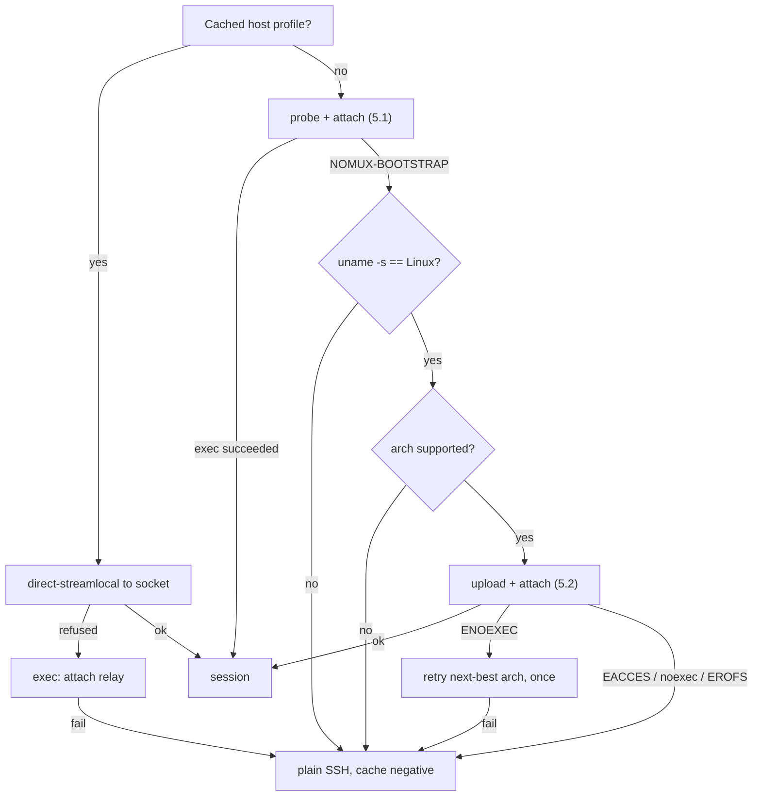

# nomux — Implementation

Low-level detail. Rationale and properties: [DESIGN.md](DESIGN.md).

**Building something against nomux?** §6.6 is frozen across versions and is the only part
a third party may rely on: the five filenames, their permissions, the pidfile's format,
what `list` prints. §2 is versioned instead — `Hello.protocol` refuses a peer built
against another revision — but it is what a second client is written against, with
`crates/nomux/tests/wire-vectors.txt` giving §2.2's table in bytes for a reader who parses
no Rust. Everything else here describes a version, not a promise.

## 1. Layout and conventions

```
crates/nomux/         one package, two targets:
  src/lib.rs          wire protocol: framing, codec, offsets. No I/O, no unsafe.
  src/main.rs         the binary: daemon, attach relay, control surface.
```

`main.rs` declares fourteen further modules and `lib.rs` one, each named for what it owns.
Neither target is published ([DESIGN.md § 2](DESIGN.md#2-scope)).

- Edition 2024, MSRV 1.97.1 (`rust-toolchain.toml`).
- Lints: `[workspace.lints]` in `Cargo.toml` is the list, every entry at `warn`. The deny
  is `-D warnings` on the clippy hook in `.pre-commit-config.yaml`, which gates this tree
  rather than any build of it; test relaxations live in `clippy.toml`.

### Environment

Everything nomux itself reads, with the section that owns each behaviour beside it.
`NOMUX_DEBUG` and `NOMUX_UPDATE_BASELINE` are tested for exactly `1`.

| Variable | Read by | Effect |
| --- | --- | --- |
| `XDG_RUNTIME_DIR` | every mode | First choice of run directory: `$XDG_RUNTIME_DIR/nomux` (§6.3) |
| `XDG_STATE_HOME` | every mode | Second choice: `$XDG_STATE_HOME/nomux/run` (§6.3) |
| `HOME` | every mode | Third choice: `$HOME/.local/state/nomux/run`. Also the child's working directory (§6.1.1) |
| `SHELL` | daemon | The child's login shell, ahead of the password database and `/bin/sh` (§6.1.1) |
| `USER`, `LOGNAME` | daemon | Login name for the linger check, in that order, and only where the password database has no line for this uid (§6.2) |
| `NOMUX_RING_BYTES` | daemon | Ring capacity in bytes. Unparseable or zero falls back to the 4 MiB default; anything above 1 GiB is clamped (§4) |
| `NOMUX_CHAOS_SEED` | the chaos suite | Disconnect-point seed; unset is a fixed default, so a failure reproduces (§9) |
| `NOMUX_DEBUG` | `scripts/build-release.sh` | Also build the unstripped companions (§8) |
| `NOMUX_UPDATE_BASELINE` | `scripts/build-release.sh` | Rewrite `scripts/size-baseline` from this build and skip the growth gate (§8) |

The first three are subject to §6.3's absolute-path rule where they name the run
directory. Going the other way, the daemon sets `TERM` from `Hello`, `NOMUX_SESSION=<id>`
and — where forwarding is on — `SSH_AUTH_SOCK` in the child, and takes `NOMUX_BOOTSTRAP`
back out (§6.1.1).

Off the table, the toolchain's own: `scripts/build-release.sh` reads `CARGO_HOME` and
`CARGO_TARGET_DIR` and sets `RUSTUP_TOOLCHAIN` itself (§8); the fault-injection scripts
extend `RUSTFLAGS` (§9); and the unit tests site scratch directories under `TMPDIR` via
`env::temp_dir()`, the integration tests under `CARGO_TARGET_TMPDIR` (§9).

## 2. Wire protocol

Spoken end-to-end between client and daemon (§7's relay is transparent). Private, with no
negotiation, no reserved space for extensions and nothing carried that nothing reads
([DESIGN.md § 2](DESIGN.md#2-scope)). `Hello.protocol` is the only revision on the wire,
and it refuses a mismatched peer at once, in the bounded skew case of
[DESIGN.md § 6.4](DESIGN.md#64-version-skew).

### 2.1 Framing

```
 0        1                     4                        4+len
 +--------+---------------------+------------------------+
 | type   | len      (u24 BE)   | payload                |
 | u8     | 3 bytes             | len bytes              |
 +--------+---------------------+------------------------+
```

`len` caps at `MAX_PAYLOAD` (256 KiB); larger is a protocol error. All integers big
endian. The header is fixed at 4 bytes so the reader is a two-stage `read_exact`.
*winsize* is four `u16`s — cols, rows, xpixel, ypixel — everywhere it appears.

### 2.2 Messages

| Type | Dir | Name | Payload |
| --- | --- | --- | --- |
| `0x01` | C→D | `Hello` | `u16` protocol, `u8` flags, `u64` out_offset, winsize, `u16` term_len, UTF-8 term bytes |
| `0x02` | D→C | `HelloOk` | `u64` resume_from, `u64` in_applied, `u8` linger (0 unknown, 1 disabled, 2 enabled), `u8` flags |
| `0x03` | C→D | `Input` | `u64` offset, bytes |
| `0x04` | D→C | `InputAck` | `u64` applied_through |
| `0x05` | D→C | `Output` | `u64` offset, bytes |
| `0x06` | C→D | `Resize` | `u16` cols, `u16` rows, `u16` xpixel, `u16` ypixel |
| `0x07` | D→C | `Gap` | `u64` new_base_offset |
| `0x08` | D→C | `Exit` | `i32` status, `u8` kind (0 = exited, 1 = signalled), `u32` since_exit_secs |
| `0x09` | C→D | `Detach` | — |
| `0x0a` | C→D | `Ping` | — |
| `0x0b` | D→C | `Pong` | — |
| `0x0c` | D→C | `Error` | `u16` code (1 protocol, 2 takeover, 3 version, 4 input_gap, 5 internal), UTF-8 message |
| `0x0d` | D→C | `AgentOpen` | `u32` generation |
| `0x0e` | ↔ | `AgentData` | `u32` generation, opaque `ssh-agent` bytes |
| `0x0f` | ↔ | `AgentClose` | `u32` generation |

`Hello` carries the current revision, **8** — `PROTOCOL_VERSION` in
`crates/nomux/src/lib.rs`, bumped on any wire change, compatible ones included.

The session id is **not** in `Hello`: the socket path fixes it warm, and the id handed to
`spawn` or `attach` fixes it cold. Nothing in `Hello` says where the client's *input*
stream stands either — `HelloOk.in_applied` is authoritative and the client fast-forwards
to it (§3). `Hello.out_offset` of `u64::MAX` means *"I have no state, send me whatever you
have"*, used on a fresh app launch to recover scrollback.

`Hello.term_len` counts **bytes**: a `TERM` past the `u16` ceiling is refused rather than
truncated, and one containing a NUL is refused encoding as well as decoding.

The agent generation names one *incarnation* of the single sub-channel §6.7 serves. The
daemon mints it per accepted connection and puts it on `AgentOpen`; the client echoes it
on everything it sends for that channel; the daemon discards any `AgentData` or
`AgentClose` naming a channel it no longer holds. It costs `AgentData` four of its
`MAX_PAYLOAD` bytes, which both ends subtract when they chunk.

`Exit.since_exit_secs` counts whole seconds since the child let go of the terminal,
elapsed against a monotonic clock and saturating at `u32::MAX`.

### 2.3 Flags

Both flag fields are exhaustive: an undefined bit is a protocol error, not a
forward-compatibility case ([DESIGN.md § 2](DESIGN.md#2-scope)), and the same holds for
every other closed set on the wire — `Error.code`, `Exit.kind`, `HelloOk.linger`.

`Hello.flags`:

| Bit | Name | Honoured |
| --- | --- | --- |
| 0 | agent forwarding (§6.7) | Only on the `Hello` that **creates** the session — `SSH_AUTH_SOCK` goes into the child's environment, which cannot be changed afterwards |
| 1 | repaint with `ctrl_l` rather than `winch` (§4.3) | Every attach; it costs nothing to restate, and only the client knows what is on the screen |

`HelloOk.flags`:

| Bit | Name |
| --- | --- |
| 0 | an agent socket is being served, so `AgentOpen` may arrive |

There is no `gap` bit: both ends compute the same predicate instead (§4.2).

## 3. Offsets and exactly-once input

Both directions are byte streams with absolute `u64` offsets, not per-frame counters,
and an offset is that of the frame's **first** byte. Output is at-least-once and
idempotent: the client discards anything below the offset it has already consumed.

Input must be **exactly-once** — replaying a partially applied keystroke buffer into a
shell is how a truncated `rm -rf` gets executed. The daemon's `in_applied` is
authoritative and advances the moment the daemon takes ownership of the bytes, so an
`InputAck` lost with the connection costs nothing: the client is told `in_applied` again
in `HelloOk` and fast-forwards past what it thought was unsent.

- Daemon drops any `Input` fully below `in_applied`; trims a straddling one.
- `Input` above `in_applied` is a gap in the input stream → `Error` + close. The client must not skip.

Ownership, not durability: the master is non-blocking (§6.1), so a child that has stopped
reading leaves input queued indefinitely, and waiting for the write would stall the ack
behind it. The queue is the daemon's own memory, never re-applied and bounded by §4.1;
losing it means losing the daemon, which ends the session anyway. The client owns the
other half of the invariant: an `Input` frame written but not yet read is **not** safe, so
a reconnecting client resends from the daemon's `in_applied` and never from what it
believes it sent.

## 4. Ring buffer

Fixed capacity, allocated once, with `Ring::base()` the oldest offset still retained and
`Ring::end()` the newest written. Capacity defaults to 4 MiB, overridable per daemon with
`NOMUX_RING_BYTES` (§1): an unparseable or zero value falls back to the default instead of
refusing to start, and one past 1 GiB is clamped there.

- The daemon always drains the PTY, attached or not. If the ring is full it advances the base, discarding the oldest bytes; a write larger than the whole ring discards everything retained as well as its own head, so the base accounts for both.
- A client is served `[max(from, base()) .. end()]`.
- Overflow is not a stored flag. Whether a *reader* lost anything depends on where that reader had reached, so it is derived per client by comparing its position against the base — which stays correct across any number of overflows, including ones that happened while it was away.
- Never trimmed to what a client has consumed. A full rolling window is the scrollback a fresh client gets.

### 4.1 Backpressure

The PTY drain must never block on a slow or absent client. Precedence: keep reading the
PTY, drop from the ring's head, so a stalled client causes a gap and never a frozen shell.
Four bounds, each enforced on its own queue:

| Constant | Value | Bound |
| --- | --- | --- |
| `MAX_PENDING_WRITE` | 1 MiB | Past this queued to the client, output stops being queued. The ring absorbs the PTY regardless, so a slow client costs a gap and never a blocked child |
| `ABANDON_PENDING_WRITE` | 8 MiB | Past this the client is not slow but gone, and is dropped; reattaching replays from the ring. The gap between the two figures is clear of the first plus one output chunk, so only the frames that answer a client — an `InputAck` per `Input`, a `Pong` per `Ping`, queued whatever the first bound says — can reach it |
| `MAX_PENDING_INPUT` | 1 MiB | Past this queued for a child that is not reading, the daemon stops **accepting** input: it stops decoding `Input` frames and stops asking the socket for more. Dropping is not available, `in_applied` being exactly-once (§3), and `Error{INPUT_GAP}` would accuse a client that had done nothing wrong. The bytes wait in the kernel's buffer, where the peer blocks on them — §6.7's argument for a saturated agent connection |
| `MAX_PENDING_READ` | 1 MiB | One connection's undecoded receive buffer, bounded by the daemon's own number rather than by whatever the peer set `SO_SNDBUF` to. On a stock host it never binds; [PLAN.md § P4](PLAN.md#p4--test-depth) has why no test pins it |

**The input cap bounds the queue where it grows**: the daemon stops decoding between
frames once `MAX_PENDING_INPUT` is reached, so the queue overshoots by at most one
`MAX_PAYLOAD` frame and the declined bytes wait in the receive buffers of at most two
connections. The poll set does the other half — a saturated daemon stops asking that
connection for `POLLIN` — which throttles the reads polling drives but bounds nothing on
its own, because the takeover path reaches the same decode loop without polling.

A client's own `Ping`, `Resize` and `Detach` therefore queue behind its own stalled input,
and a takeover's final drain goes with the outgoing connection — accepted, since §3 has
the client resending from `in_applied`. A new connection is polled as pending and never
held back by the input cap, so `list` and §6.3's spawn race are unaffected; `nomux kill`
is a signal (§6.5).

**A detaching client's send queue is dropped, not flushed**: everything in it is
per-connection state a reattach recomputes from the ring (§4.2, §6.5). Only departures
with nothing behind them block on a final flush — §6.5's shutdown, and every close that
carries a final `Error`, §6.4's eviction among them.

### 4.2 Attach with `from < base()`

```
resume_from = if out_offset == u64::MAX || out_offset < base() { base() }
              else                                             { min(out_offset, end()) }
gap         = resume_from > out_offset
→ HelloOk{resume_from}, then Output[resume_from..]
```

**The gap is that comparison, and nothing sends it.** Both ends compute it — the daemon
to decide the repaint it owes (§4.3), the client to reset its emulator — so a flag would
be the daemon restating a number the client can see. This is the *attach-time* gap; the
standalone `Gap` frame is for overflow mid-stream, while a client is attached.

`resume_from` is clamped at *both* ends, which is why the no-gap branch carries a `min`:
an `out_offset` above the end is a client claiming output the session never produced,
which unclamped would set `sent_through` past the end of the stream and leave the session
looking dead until the child caught up. Not a gap — nothing was dropped.

### 4.3 Gap handling

On a gap the byte stream is discontinuous and the client's emulator may be
mid-escape-sequence. Recovery, mirroring `dtach -r`:

1. Client resets its emulator locally — `ESC c` is correct but heavy-handed (drops scroll region and charset); `ESC [ ! p` + `ESC [ 2J` + `ESC [ H` is the softer default.
2. Daemon triggers a repaint from the child via a `TIOCSWINSZ` dance: set `cols-1`, then the real `cols`. The resulting two `SIGWINCH`es make most full-screen programs redraw. A terminal one column wide gets neither: there is no narrower size to go to, and a resize to the size already in effect is short-circuited in the kernel instead of signalled.
3. Repaint policy is the client's, restated in each `Hello` (§2.3): `winch` (default) or `ctrl_l` (write `0x0c` to the PTY — better for a bare shell prompt, destructive inside an editor).

`ctrl_l` goes through the same queue as client input rather than straight to the master,
so it cannot overtake keystrokes already accepted or block on a full PTY buffer. It is
not client input, so `in_applied` does not move for it.

The repaint is *owed* at the gap and issued on the first pass that finds the client
holding the whole ring: one repaint for a sustained overrun, whether the gap came from
§4.2's `HelloOk` comparison or from a mid-stream `Gap`. A client that never catches up is
never repainted. Neither step restores a plain shell's lost scrollback, inherent to
byte-stream replay ([DESIGN.md § 10](DESIGN.md#10-rejected-alternatives)
weighs the `libvterm` snapshot).

## 5. Bootstrap

### 5.1 Probe and attach in one round trip

```sh
p=${XDG_DATA_HOME:-$HOME/.local/share}/nomux
exec "$p/nomux-$VER" "$MODE" "$ID" 2>/dev/null
echo "NOMUX-BOOTSTRAP $(uname -s) $(uname -m) $p"
```

`exec` replaces the shell on success, so the `echo` is unreachable unless the binary is
missing or unrunnable. Warm cost: zero extra round trips. `$MODE` is `spawn` or `attach`
([DESIGN.md § 4](DESIGN.md#4-architecture)), a substitution rather than a second command,
the client knowing which because it knows whether it holds a session for this tab. The
fields are `uname`'s — `Linux`, `x86_64` — because `sh` emits the line before any binary
exists; confirming that an *uploaded* artifact runs is `--version`'s job, one line on
stdout and exit 0: `nomux <version> (protocol <revision>)`, the crate's version and the
`PROTOCOL_VERSION` of §2.2.

### 5.2 Upload and attach in one round trip

```sh
p=${XDG_DATA_HOME:-$HOME/.local/share}/nomux
mkdir -p -m 700 "$p" && set -C && cat > "$p/.up.$$" && chmod 755 "$p/.up.$$" \
  && mv -f "$p/.up.$$" "$p/nomux-$VER" && exec "$p/nomux-$VER" "$MODE" "$ID"
```

- Temp-then-`mv` is atomic within one filesystem and avoids `ETXTBSY` — you cannot write over a running binary.
- Version in the filename: an upgraded client cannot break sessions an older daemon still holds.
- Transfer over an **exec channel with `cat`**, not SFTP. `Subsystem sftp` gets disabled on hardened hosts, and modern `scp` is SFTP underneath. SSH channels are 8-bit clean, so no base64 tax.
- Enable `zlib@openssh.com` on this channel: a static binary compresses well, and it needs nothing on the remote.
- **`-m 700` rather than the ambient umask**, since a bare `mkdir -p` creates at `0777 & ~umask` and `umask 002` is the Debian-derived default: without the mode, the directory every later connection `exec`s out of is group-writable with nobody having pointed `$XDG_DATA_HOME` anywhere. It binds only where this call *creates* the directory.
- **`set -C` before the redirect**, `.up.$$` being a predictable name. Under noclobber `>` is `O_CREAT | O_EXCL`, which refuses a symlink — dangling or not — where a plain `cat >` follows it. In a directory another user can write to, that is the difference between one failed bootstrap and choosing where the uploaded bytes land: `~/.ssh/authorized_keys`, `~/.bashrc`, anything this uid can write.
- **The install directory is still created, not checked** — materially weaker than what §6.3 gives the *run* directory. [DESIGN.md § 8](DESIGN.md#8-security-model) states what the two lines above do and do not close, and to whom.

### 5.3 Decision tree



`uname -m` lies on a 32-bit userland over a 64-bit kernel, hence the one ENOEXEC retry. A
`noexec` or read-only home is detected by exec failing, never by parsing mounts, and every
negative is cached per-host so a hardened box is not re-probed on each reconnect. Three
conditions off the tree reach the same fallback: a restricted shell with no `uname` is
plain SSH; `AllowStreamLocalForwarding no` costs only the warm path, leaving the exec
relay; and `KillUserProcesses=yes` without linger kills the daemon at logout, which the
daemon detects and reports (§6.2) rather than works around.

## 6. Daemon

### 6.1 PTY and child

`Pty::spawn` allocates the master, hands the slave to the child as all three stdio
descriptors, and sets `TIOCSWINSZ` from `Hello` before the child can observe it.
`Command::spawn` forks; its `pre_exec` closure calls `setsid`, takes the slave as
controlling terminal, and restores `SIGHUP` to `SIG_DFL`, which § 6.2 leaves ignored in the
daemon. `pty.rs` argues the ordering and the `O_CLOEXEC` flags.

**The SSH channel must not request a PTY.** nomux allocates its own; two stacked line
disciplines give double echo, doubled `\r\n` translation and broken raw mode. That is also
why `TERM` arrives in `Hello` (§ 2.2) and not from sshd.

The master is non-blocking, so input the PTY will not take waits in the daemon's queue.
While that queue is full the daemon stops asking the client for `POLLIN`; what *bounds* it
is the decode loop refusing to go past the cap (§ 4.1).

#### 6.1.1 What the child runs

Whatever a plain `ssh host` would have run, since nomux starts *already inside* an SSH
session: PAM has run, and `HOME`, `USER`, `PATH` and `SSH_*` are already set.

- **Login shell, dash-prefixed**: `execv(shell, ["-bash", ...])`, not `["bash", ...]`. That leading `-` is what sshd does for an interactive session and what causes `/etc/profile` and `~/.bash_profile` to be sourced.
- **Shell selection**: `$SHELL` as inherited, else the password database, else `/bin/sh`. The middle step parses `/etc/passwd` directly, since `getpwuid` in a static musl binary cannot load NSS modules. The cost is not seeing LDAP or NIS users, who fall through to `/bin/sh` as they would with `getpwuid` anyway.
- **Working directory**: `$HOME`, else the directory the attaching connection was in, else `/`. Set explicitly, since the daemon has moved to `/` (§ 6.2).
- **Environment**: inherited wholesale, then `TERM` from `Hello`, `NOMUX_SESSION=<id>` and — with agent forwarding on — `SSH_AUTH_SOCK=$RUNDIR/<id>.agent` (§ 6.7) are set, and `NOMUX_BOOTSTRAP` is scrubbed. Nothing else changes, which leaves `NOMUX_RING_BYTES` (§ 1) visible to a child whose daemon was started with it.
- **No PAM.** It already ran for the SSH login, and the daemon is unprivileged.
- No client-supplied command in v1. A one-shot remote command has no reason to be persistent; it stays on plain SSH.

That environment is a snapshot of the connection that *created* the session, frozen for its
lifetime ([DESIGN.md § 5.3](DESIGN.md#53-transparency)). Indirection through the run
directory (§ 6.6) is the only fix, and only for variables that name a path.

### 6.2 Detachment from the login session

The `daemon` mode holds this itself instead of trusting whoever started it:

```
ignore SIGHUP
leads a session and holds no controlling terminal?  already detached; nothing to do
  else setsid            refused only if we lead a process group
    else fork → parent _exit, child setsid
...                      re-listen, stop signals, <id>.pid, <id>.label, drop the lock
chdir "/"
0/1/2 → /dev/null
```

The test is **no controlling terminal**, not "leads a session": a session leader may still
hold one. `startup::leave_login_session` carries the rest. The fork happens after the socket
is bound and before the pidfile is written, so an id already taken is reported with an exit
status somebody sees, and `nomux kill` (§ 6.6) reads the pid of the survivor. That second
gap is § 6.6's publish window.

Signal dispositions: `SIGHUP` ignored, restored to `SIG_DFL` in the child before `exec`
(§ 6.1). `SIGTERM` and `SIGINT` handled, not ignored (§ 6.5), armed before the pidfile, so
the pid `kill` reads never names a process on the default disposition. `SIGPIPE` ignored by
the Rust runtime and reset for spawned children. `SIGQUIT` is § 6.5's.

`systemd-logind` with `KillUserProcesses=yes` kills the daemon at logout; the only fix is
`loginctl enable-linger $USER`. The daemon reports the state in `HelloOk.linger` (§ 2.3),
reading what `logind` reads: `/run/systemd/system`, then `/var/lib/systemd/linger/<user>`.
A missing marker is a definite *disabled*; only a lookup that fails otherwise is *unknown*,
and **the client must not warn on unknown**. The login name is the password database's
first, then `$USER`, then `$LOGNAME`; empty, or holding `/`, NUL, `.` or `..`, is *unknown*.

### 6.3 Socket

Session ids become filename components, so `rundir::is_valid_session_id` validates them
before anything touches the filesystem:

```
1..=64 bytes, each of [A-Za-z0-9_-], and never a leading `-`
```

That rejects `..`, `/`, `.`, empty, NUL and non-ASCII, so path traversal is impossible by
construction; the leading `-` is the command line's bound. Both ends validate, and an
invalid id is a hard error, never sanitised into something valid.

Path precedence, first **absolute** one winning:

1. `$XDG_RUNTIME_DIR/nomux/<id>.sock` — tmpfs, but removed on last logout unless linger is on.
2. `$XDG_STATE_HOME/nomux/run/<id>.sock`.
3. `$HOME/.local/state/nomux/run/<id>.sock`.

A source naming a relative or empty path is skipped; where none names an absolute one,
every mode fails with that (§ 10).

A `sun_path` is 108 bytes including its terminator, so the directory, a `/`, the id and a
six-byte suffix — `.label` and `.agent`, the joint longest of the five — have to fit in
107. Under `/run/user/1000` that allows an id of 80 and the 64-byte ceiling binds first;
under the fallback the longest is `77 - len($HOME)`. **A refused id is therefore not
necessarily a bad id**, which § 10 turns into an exit code and a client must not cache as a
property of the id. The refusal lands before the `bind`, since `list` and `kill` read an
unbindable address as a *live* session whose files they must not unlink.

Directory `0700`, everything in it `0600`, exact modes and not upper bounds. Filesystem
sockets only, never abstract ones ([DESIGN.md § 8](DESIGN.md#8-security-model)). Every mode
checks the run directory — owner, type and mode — before it resolves the first name in it.
An `AF_UNIX` `connect` to a full backlog blocks instead of being refused, so every connect
is bounded: 2 s for `kill` and the relay, 1 s for the daemon's stale-socket probe, none for
`list`. `rundir.rs` has the rest.

A connection accepted on either of the session's two listeners — this one and § 6.7's agent
socket — is weighed by `SO_PEERCRED` before a byte is read, and one whose uid is not this
process's is closed unanswered and logged (§ 11). **Root gets no exemption**: a session
belongs to the user who started it. A peer the kernel will not describe is refused with it,
and nothing goes back on the wire.

Spawn race (two clients, one id): `flock(LOCK_EX)` on `<id>.lock`; the loser blocks, finds
the socket the winner bound and is told the id is taken (§ 10). A stale socket is one where
`connect` returns `ECONNREFUSED` — unlink and respawn. **`EACCES` is not staleness.** What a
second implementation of `list` or `kill` must obey, in the order the rules bind:

- **Anything that unlinks takes the lock first and holds it to the end** — `list`'s sweep, `kill` (§ 6.6), the daemon's own exit (§ 6.5).
- **The daemon takes it before probing for a stale socket**, and never blocks for it: a sweep descheduled after the same probe would unlink what this daemon has bound since.
- **`spawn` holds it past the successful `connect`, until `<id>.pid` exists**, since the daemon binds before it writes that file (§ 6.2) and a `kill` landing in that window would find a live daemon and no pid. Bounded by the spawn timeout, never fatal.
- **The daemon drops it once `<id>.pid` and the label are written.** One still holding it at `kill`'s 2 s deadline (§ 6.6) would be one nothing could stop.
- **Every acquirer confirms that what it locked is still the file at that path** — `fstat` against `stat`, device and inode — and re-takes it if not, at most twice (`LOCK_ATTEMPTS`); out of attempts it refuses and never proceeds unlocked.
- **`<id>.lock` is unlinked last**, after every other `<id>.*` name and not merely the four the layout freezes: once its name is gone the lock guards nothing, so a later unlink lands on somebody else's new session.
- **A lock no process could obtain is proceeded past without one**, the list being exactly `Errno::ACCESS`, `Errno::PERM` and `Errno::OPNOTSUPP` — each a property of the *file*. Every other errno belongs to the moment and makes a caller wait, skip or refuse.

The daemon refuses to start where the run directory already holds **64** other session ids
(`MAX_SESSIONS`), a backstop under the client-side cap
[DESIGN.md § 5.1](DESIGN.md#51-identity) argues for. The count runs under a `try_lock`, so
two starts can read the same 63 and both proceed: **64 is a backstop a race can cross, not
a ceiling.**

### 6.4 Multiple clients

Exactly one attached client. A second `Hello` on a live session takes over; the previous
connection receives `Error{TAKEOVER}` and closes. Its queued output is dropped first and the
final write is bounded by § 6.5's 500 ms — the arriving client replays the ring anyway. No
read-only mirrors and no session sharing.

**The `Hello` is what takes over, not the `connect`.** A newly accepted connection waits as
*pending* and owns nothing until it greets, since `list` (§ 6.6) and § 6.3's spawn race both
probe with a bare `connect`: were connecting attaching, listing sessions would evict the
user from all of them, permanently, the client being told never to auto-reconnect after
`TAKEOVER`. A connection greeting with anything else is refused on its own terms and the
session keeps its client. Only one may be pending at a time; a second waits in the backlog,
where its `connect` completes and so `list` still reports the session, until the incumbent
greets, hits end of file, or misses its 5 s deadline.

**A `Hello` this daemon cannot answer is refused before the eviction, not after.** The
`Hello.protocol` check runs on the pending connection, ahead of the handshake. Deferred past
the takeover, a newer client's *failed* greeting threw the working client off and dropped
the newcomer too, leaving nobody attached and nobody permitted to reconnect
([DESIGN.md § 6.4](DESIGN.md#64-version-skew)).

**A client's end of file is not a departure.** The relay half-closes on stdin EOF and goes
on draining output (§ 7), so a peer that has stopped *sending* is still owed everything the
child has yet to say. Six things end the connection: a queued write that fails; § 4.1's
`ABANDON_PENDING_WRITE`; the `Exit` going out to a half-closed peer with nothing left owed;
`POLLHUP` or `POLLERR`; a read that fails before end of file; and a `Detach` frame. The
third is what ends `nomux attach <id> < script`: past the child's exit the master leaves the
poll set, so a ring read to its end stays read to its end. Read as a departure, that end of
file cost the script every byte its child produced after it ran out. A half-closed client
holds the session as an attached silent one does, bounded by that same 8 MiB.

### 6.5 Shutdown

**The child's exit is not the daemon's.** `waitpid` → flush the ring to any attached client
→ `Exit` frame → and the session goes on holding the status, the kind and the ring until
`last_detach + IDLE_TIMEOUT` reaps it, seven days from the departure that left it alone.
That is the only deadline there is, so a client that attaches, reads the status and leaves
starts a fresh seven days from *that* moment. A session that never started a PTY is reaped
after 30 s instead. Nothing is written down for the interval: a tombstone would be a sixth
name in the frozen layout ([DESIGN.md § 5.2](DESIGN.md#52-reaping)).

The status is not readable the instant the master reports end of file, so it stays unknown
for up to 2 s (`STATUS_GRACE`). **Past that the daemon synthesises one, and a client author
has to know which:** `Exit{status: 0, kind: Exited}`, indistinguishable on the wire from a
real exit 0 and a *fabrication*. Only a child that closed its terminal without exiting
reaches it, and that process may still be running.

The order is load-bearing: `Exit` is queued only once *that* client's `sent_through` has
reached the end of the ring, and a greeting rewinds `sent_through` to where the client
resumes and clears the per-connection `exit_sent`. So a client that closes the tab on `Exit`
never loses the transcript, and one arriving a week later replays it and is *then* handed
the status.

Reaping is self-inflicted — no cron, no supervisor. `SIGTERM` and `SIGINT` reach the same
exit, so `nomux kill` (§ 6.6) collects the child and unlinks the run files instead of
dropping the daemon where it stands. The final unlink takes `<id>.lock` first (§ 6.3) and
leaves the whole set in place if it cannot.

Everything on the way out is bounded against `nomux kill`'s two seconds: one final flush to
the attached client for at most 500 ms — against the whole call, not per `write` — then
`SIGHUP`, 500 ms, `SIGKILL`. **That sequence is conditional.** `Pty::terminate` sends
nothing at all where the child's process group is already gone and its session is empty, and
skips the `SIGKILL` pass where the grace sees that become true. Each signal that does go out
reaches both the child's process group and, through a `/proc` walk, everything still in its
session; `pty.rs` has why neither alone suffices and what guards each against pid reuse.

`SIGQUIT` is left at its default: a core dump is the only way to get a snapshot out of a
wedged daemon (§ 8), and `SIGKILL` already means "go away now".

### 6.6 Frozen control surface

`nomux kill <id>` and `nomux list` must work against a daemon of *any* version, including
one older than the binary invoking them: they are the escape hatch that makes
[DESIGN.md § 6.4](DESIGN.md#64-version-skew)'s codec retention safe. The contract is
therefore the **on-disk layout**, not a protocol subset:

```
$RUNDIR/<id>.sock    unix socket   0600
$RUNDIR/<id>.pid     daemon pid, ASCII, newline-terminated, 0600
$RUNDIR/<id>.lock    flock target for spawn races, 0600
$RUNDIR/<id>.label   UTF-8 display label, no newline, <= 256 bytes, 0600
$RUNDIR/<id>.agent   ssh-agent socket, 0600 (§ 6.7)
```

The two plain files either mode reads by hand go through one bounded helper
(`rundir::read_prefix`), which reads to the file's end or to that bound and never past it,
and opens `O_NONBLOCK | O_NOFOLLOW` against a FIFO or a symlink left at either name. The two
ends are deliberately asymmetric: a label that reaches its bound is truncated and costs a
column, where a pid body reaching **32 bytes is refused outright**, a prefix ending
mid-number being a smaller, plausible, live pid and not the number on disk.

- Both establish first that the run directory is this user's alone (§ 6.3), before any name in it is read, connected to or signalled. Neither creates it: on a host that has never run a session, `list` prints nothing and exits 0, and `kill` reports the "no such session" that already holds.
- `list` reads the directory and probes each socket with `connect`; `ECONNREFUSED` — or a socket no longer there at all — means stale, and stale entries are unlinked. The probe is safe because connecting is not attaching (§ 6.4).
- Unlinking happens under `<id>.lock`, with the probe repeated once it is held: only there can the answer not change between being read and acted on. An entry whose lock somebody else holds is skipped, that being a session started and not garbage; one whose lock is not *obtainable at all* is collected anyway, per § 6.3 — a collector that stops collecting over the mutex protecting it leaks under exactly the conditions it exists for.
- `kill` takes `<id>.lock` first and holds it to the end, waiting up to 2 s for it — which is what makes it *win* the race against a `spawn`. It then probes the socket, identifies the daemon as **Identification** below has it, sends `SIGTERM`, waits up to 2 s, then `SIGKILL`, and unlinks every `<id>.*` once the session has stopped answering, the lock last.
- **Those graces are not the wall-clock bound, and a client timing `nomux kill` should use the total.** Each stage's deadline is checked *after* the probe preceding it returns, so a stage overruns its grace by up to a whole `PROBE_TIMEOUT` — a `connect` to a full backlog spends all 2 s of it. Five stages compound against a wedged daemon: the lock wait (2 s, no probe), the publish grace, `TERM_GRACE`, `KILL_GRACE`, and the final probe under the lock — **≈14.5 s** worst case, of which refusal paths reach ≈12.5 s. Every ordinary `kill` is a fraction of a second. The probe budget is deliberately *not* clamped to the grace remaining: a probe cut short reports `Unknown`, evidence of neither death nor life, so `kill` would refuse a session it could have collected.
- **A live session's files are never unlinked.** Where the socket answers and the pidfile will not say which process serves it, `kill` exits non-zero and leaves all five alone: removing them takes the socket from a daemon still holding the user's shell, and frees the id for a second daemon to bind over.

`kill` exits non-zero rather than report a "no such session" it did not establish. Five
states do that:

| State | What `kill` prints | Why it refuses |
| --- | --- | --- |
| The socket answers, identification yields nothing | the number, where it came from, what `/proc` said; no repair recommended | the repair that suggests itself is catastrophic half the time |
| The socket could not be *probed* | the errno, the one part anybody can act on | § 6.3 makes that evidence of neither death nor life; only an accepted connection says a session is running |
| Still answering half a second after `SIGKILL` — or with **neither** signal sent, `pidfd_open` having declined the process | which signals went out, or that none did and the errno that declined | the pid signalled is not the process serving the socket, or nothing established what is |
| The probe under the lock answers again | that a daemon bound the id since this call established it was gone | those files are that daemon's |
| `<id>.lock` still held at the 2 s deadline | that another process is starting or removing the session | the postcondition was never established |

**That last row also swallows a real failure:** `EROFS` is not one of § 6.3's three "nobody
can hold this" errnos, so on a read-only run directory the lock reads as *held* and `kill`
blames another process for what is the filesystem. The refusal to unlink is still correct;
only the account of why is wrong.

One further non-zero exit is the case where the session really did stop: the unlink itself
failing. Absence is success, but an `EIO`, an immutable `<id>.lock`, or a filesystem
remounted read-only is reported and not swallowed — a surviving `<id>.lock` is a session
`list` rediscovers and tries to collect on every run from then on. Every path is still
attempted, so one stubborn file does not strand the other four.

#### Identification

**One witness: `<id>.pid`**, the number the daemon published. On its own it is not evidence
— a daemon that died without unlinking leaves its number behind and the kernel reissues pids
— so two questions are asked of it in order:

1. **Does it still name a live process this user may signal?** A number naming nothing is discarded, and there is no second candidate.
2. **Is that process a `nomux daemon <id>`?** Put to `/proc/<pid>/cmdline`, and *parsed* rather than searched: caller-supplied text sits in that same argv, so searching for both words would accept `--label "daemon sess"` from a stranger. The rule, `control::names_daemon_for`, is four steps over the NUL-separated argv: skip `argv[0]`; require `argv[1]` to be exactly `daemon`; skip `--label` **and the argument after it**, anything spelled `--label=…`, and anything else beginning with `-`; the first argument left is the id, which must equal `<id>`. The relay modes fail at step two.

The second question has **three** answers, and keeping the last two apart is load-bearing:
*is*, *is not*, and *could not tell*. Only a positive *is not* declines the pid; refusing on
*could not tell* would strand every session behind `hidepid`. Truncation is asymmetric for
the same reason: a match inside a truncated read is authoritative, and only a *failure* to
match leaves truncation deciding.

**What is signalled is a process, not a number.** A descriptor onto the pid is opened
**before** question 2 is put, and both signals go through it. Only a host with no
`pidfd_open` signals the number itself, and there the reuse is unclosable — nothing else
can pin a process, and the pidfile is frozen as a bare number carrying no baseline to
compare against. Every other failure of that open signals nothing at all; `control.rs` has
which errnos fall where.

| `<id>.pid` | `/proc` | Result |
| --- | --- | --- |
| a live pid | *is*, or *could not tell* | signalled; `list` prints it |
| a live pid | positively *is not* | `kill` refuses; `list` prints `?` |
| a number naming no live process | not asked | `kill` refuses; `list` prints `?` |
| missing, or created but not yet filled | not asked | § 6.2's publish window: re-read up to 2 s, then refused |
| unreadable, not a number, or reaching 32 bytes | not asked | refused at once; waiting changes nothing |

Which process holds the socket's descriptor is deliberately **not** asked: that means
parsing `/proc/net/unix`, and the case it would resolve — a second `nomux daemon <id>` —
§ 6.3's bind already makes unreachable. `list` and `kill` run the identical weighing, so the
number a user reads is the number `kill` would signal.

#### `list` output

Three tab-separated columns per session, one line each, no header:

```
<id>\t<pid>\t<label>\n
```

- **Order is ascending by id**: `rundir::session_ids` sorts and dedups what `read_dir` hands back, which is neither sorted nor stable.
- **`<pid>` is a literal `?`** wherever the identification above yields no pid.
- **`<label>` is empty** where there is no label or it could not be read. Bytes that are not valid UTF-8 arrive as U+FFFD instead of emptying the field, since a read cut at the bound can split a character the daemon wrote whole. The trailing tab is still written, so a line always has three fields and a consumer can split on the count.
- **Dead sessions are collected, not printed.** An entry whose socket refuses is unlinked during the sweep and never reaches stdout, so what `list` prints is the live set.
- **An id this run directory cannot address is named on stderr**, never in the columns, and the exit stays 0. Its files are here and § 6.3 can form no socket address for them, so it is neither probed nor collected — and every id printed above is one a client may hand straight back to `attach`.
- **Exit 0 is not "sessions exist."** No run directory, an empty one, or one `read_dir` could not open prints nothing and exits 0 (§ 10 has the rest of the table).
- `EPIPE` on stdout — `nomux list | head` — stops the printing but **not** the sweep, so a stale session is never left behind because the reader went away.

#### `<id>.label`

Ids are opaque per-tab identifiers ([DESIGN.md § 5.1](DESIGN.md#51-identity)), so a client
that has lost its state would otherwise see only UUIDs. Written once at session creation and
advisory — never parsed, never used for lookup, and a missing or malformed one degrades
`list` and nothing else. It arrives as `nomux spawn <id> --label <text>` or
`nomux daemon <id> --label <text>`, `--label=<text>` accepted too and a second of either
refused (§ 10). `attach` *refuses* it instead of ignoring it; `kill` parses and ignores one.
A command-line flag and not a `Hello` field, the writer belonging to a layout that outlives
the protocol.

The daemon strips **control characters** (`Cc`), **bidi overrides** (`Cf`: U+061C,
U+200E/F, U+202A–U+202E, U+2066–U+2069) and **tag characters** (U+E0000–U+E007F), then
truncates to 256 bytes on a character boundary and trims: `list` writes the value straight to
a terminal, so all three are the Trojan Source hazard in three spellings. The rest of `Cf`
stays — ZWJ and ZWNJ are how Indic scripts and emoji sequences are spelled. Both ends
sanitise, since the writing daemon may be any version, and the same filter guards syslog
(§ 11).

Neither mode opens a session, sends a frame, or reads `PROTOCOL_VERSION`. **These five names,
their permissions and the pidfile's format may never change.** The set is *not* sealed
against growth, which is free only because discovery and collection glob `<id>.*` instead of
enumerating the extensions they know. One rule reads a filename: the id is the part **before
the first `.`** — the first and not the last is what keeps `sess.sock` and `sess2.sock` two
sessions — and only if `is_valid_session_id` accepts it. So a stray file matching
`<valid-id>.<anything>` is discovered as that session and, with nothing listening, collected;
acceptable because this directory is nomux's own. Corollary: a *new* binary can reap an
*old* daemon.

### 6.7 Agent forwarding

The daemon **listens** on `$RUNDIR/<id>.agent`, announces each connection with `AgentOpen`
and pipes `AgentData` both ways until either end closes it; the client answers from its own
key store. Why it owns the socket instead of borrowing sshd's:
[DESIGN.md § 5.4](DESIGN.md#54-agent-forwarding). Mechanics:

- **One connection at a time.** A second peer waits in the listen backlog, neither accepted nor refused, and is greeted when the slot frees. An `ssh-agent` client sends a request and waits for the reply, so serialising costs a bounded wait.
- **Each connection is named**, by the `u32` generation all three frames carry (§ 2.2). The daemon accepts local peers out of band from the client's stream, so the connections holding the one slot in turn are ambiguous in *time*: unnamed, frames still in flight for a peer that ended reach whoever took the slot next. The daemon mints a generation per accept and discards any `AgentData` or `AgentClose` naming a channel it no longer holds. Only the client→daemon direction strictly needs it, and a frame type has one layout in both.
- `AgentOpen` carries only that generation and is not redundant even so: it is the boundary between one peer's exchange and the next, which is what the client opens its own upstream connection on and what tells it what to stamp. Without it a peer that connects and closes without writing crosses the wire as nothing. Optimistic — no ack; a client that cannot serve replies `AgentClose`.
- **Idle connections are given up after 60 s** with no byte moving in *either* direction, measured from the last byte and not the accept, since `ssh(1)` holds one connection across a whole authentication. The client is told with an `AgentClose` — **unless it had already closed that connection itself**, in which case the slot returns silently and the undeliverable rest of the queue is dropped. The window is a generous minute because the daemon parses no agent protocol and the client may be putting a signature in front of a human.
- Payloads are opaque, which is what puts `session-bind@openssh.com` on the client ([DESIGN.md § 5.4](DESIGN.md#54-agent-forwarding)): a byte pipe cannot know which SSH hop the session is on.
- **While detached, connections are accepted and closed immediately**, so a `git push` with no client attached fails fast with the same error as a missing agent instead of hanging until reattach. Likewise the moment a client leaves or is taken over.
- Two hard bounds and no flow control of its own. While the client's write queue is saturated the daemon stops reading the agent socket, leaving the bytes where the peer blocks on them; and a connection whose local peer has stopped reading is closed as soon as a frame *would* take its queue past 256 KiB, tested before the bytes are taken, so 256 KiB is the peak.
- The socket is bound when the session is created and only then — turning forwarding on later would mean changing `SSH_AUTH_SOCK` in a running process. A bind that fails is not fatal: the session starts without forwarding and `HelloOk` says so. A transient `accept` failure costs that one connection; `agent.rs` has the backoff.
- Security, the two consequences this side of the boundary. The socket is `0600` inside the `0700` run directory, the same permissions as sshd's forwarded socket but a longer window, since sshd's dies with the connection and this one lives as long as the session — hence the per-host opt-in. And a connection is weighed by `SO_PEERCRED` and closed unread unless its uid is the daemon's (§ 6.3), as `ssh-agent` itself does: what a peer reaches here is the client's key store. Where sshd forwarding is also active, `SSH_AUTH_SOCK` is set by sshd and then overwritten by the daemon (§ 6.1.1): ours wins.

## 7. Attach relay

The transport behind `nomux spawn <id>` and `nomux attach <id>` on hosts where the client
cannot open a `direct-streamlocal` channel to the socket
([DESIGN.md § 4](DESIGN.md#4-architecture)). Deliberately dumb, which is why it never
needs a version bump:

- `poll` on stdin, stdout and the socket, moving bytes with `splice(2)` and copying
  through a small per-direction buffer where the kernel refuses the pair. No frame is
  parsed and nothing protocol-shaped is held.
- It connects to the session's socket. Where nothing answers, `spawn` starts the daemon
  (§ 6.3) and waits for it; `attach` refuses (§ 10).
- Half-close propagates: EOF on stdin becomes `shutdown(SHUT_WR)` on the socket, and the
  other direction goes on draining. The daemon serves that connection until it owes it
  nothing and closes there (§ 6.4), which ends a relay whose stdin was a file.

All protocol logic is the daemon's. `attach.rs` has how `splice` support is discovered and
the non-blocking mode that forces on the socket.

## 8. Build

Targets:

| Triple | Covers |
| --- | --- |
| `x86_64-unknown-linux-musl` | Most servers |
| `aarch64-unknown-linux-musl` | ARM servers, Apple-silicon VMs, most SBCs |

Two, and the rule for a third is that somebody asks for it: each one costs a build, a
baseline entry and a companion for as long as it ships.

**Size**, because the cold upload happens over cellular. Release profile:
`opt-level = "z"`, `lto = "fat"`, `codegen-units = 1`, `panic = "abort"`,
`strip = "symbols"`. Two gates: **≤ 400 KiB per arch**, and growth past **3%** against the
per-target figure in `scripts/size-baseline` — the budget alone once passed a commit that
grew a target by nearly half. `scripts/build-release.sh` builds both targets, writes
`SHA256SUMS`, prints the signed delta beside each size and exits non-zero on either gate;
`NOMUX_UPDATE_BASELINE=1` rewrites the baseline and skips the growth gate, putting an
accepted size change in a diff a reviewer reads. **No size table is kept here** —
`scripts/size-baseline` is what a build writes and the gate reads.

**No cross toolchain.** `.cargo/config.toml` names `rust-lld` for the two musl targets and
nothing else; a host build still links with the host's `cc`, and nothing that ships is a
host build. Each `rust-std` component carries the musl CRT objects and `libc.a` in
`self-contained/`, so `rustup target add` is the entire setup: no gcc, no zig, no sysroot.
This works only because the tree is pure Rust — rustix runs on its `linux_raw` backend, so
nothing links a C object. `zig cc` produces smaller binaries and is rejected anyway,
pinning no musl version of its own; it is the fallback for the day a dependency needs a C
compiler. `crt-static` is passed explicitly, since not every target this script has built
defaulted to it and a binary with runtime dependencies fails at a stranger's shell.

**The released standard library does not fit.** Both targets overrun the budget against a
precompiled `std`, mostly on panic machinery: formatting, backtrace symbolisation,
`gimli`, `addr2line`. `-Z build-std` alone earns little; `-Cpanic=immediate-abort` is the
entire win and the only configuration that ships. It costs a nightly compiler and panics
that abort without a message, acceptable because § 1's lint wall stands against `unwrap`,
`expect`, `panic` and `indexing_slicing`.

**Reproducibility.** Three `--remap-path-prefix` flags — `$CARGO_HOME`, the sysroot, the
checkout — stop rustc baking absolute paths into panic location strings, and
`scripts/build-release.sh` greps every artifact for all three: two clean builds on one
machine come out byte-identical either way, so only a surviving builder path can show. That
is the producing half of a check whose consuming half does not exist: **the client is meant
to pin a SHA-256 per architecture and verify it after upload, and nothing does that today**
([PLAN.md § P3](PLAN.md#p3--release-process)). A `v*` tag publishes `SHA256SUMS` in the
format `sha256sum -c` reads. Release builds pin a **dated** nightly, a floating one moving
the bytes that hash covers; `scripts/nightly-version` names it and nothing else does, and a
baseline measured by a different compiler is refused.

**Debug companions.** A stripped binary gives § 6.5's `SIGQUIT` core no function names, so
`NOMUX_DEBUG=1` asks for `nomux-<target>.debug` per target: a *second* build with
`-Cstrip=none`, since stripping does not commute and deriving one from the other would
change what ships. Off by default, doubling the build and needing `llvm-tools`; CI sets it
for everything but a pull request. They are published with their own `SHA256SUMS.debug`,
and their correspondence is checked — identical `.text` at an identical address, per
target, per build.

## 9. Testing

What each layer asserts is in the doc comment on the test that asserts it, where it cannot
go stale; every test file opens with the map from a property to itself. The two invariants
that matter: **no duplicated input, ever**, and **no lost output unless a `Gap` was
reported**.

`cargo nextest` is what the hooks and CI run, and it gives every test its own process. No
gate runs plain `cargo test`, which puts every unit test on a thread of one process; the
only `cargo test` a hook runs is `--doc`. The suite holds to the harder shape anyway, so
each process-wide singleton — `rundir::with_umask`, the standard descriptor numbers, the
`SIGSYS` disposition below — is serialised or forked into a child, and every process the
integration suite starts goes through `harness::launch`.

The chaos suite covers what a shell transcript does not: a byte lost inside a CSI or sixel
sequence changes the meaning of everything after it, so the escape-heavy case compares the
reconstructed stream against the exact bytes the child wrote. Seeds come from
`NOMUX_CHAOS_SEED`, and every failure message carries the one that produced it.

A regression test that cannot fail is not a test. Where a fix can no longer be reverted by
hand, the pre-fix behaviour stays compiled behind a `--cfg nomux_fault_*` `const`, so both
paths keep type-checking and no shipped build changes; `scripts/verify-guard.sh
<takeover|hangup-grace>` asserts that the matching guard *fails* under it.

One guard watches for the *syscall*: where the reach it guards is skipped, what was skipped
landed nowhere by construction. The instrument is a seccomp filter trapping one signal at a
pid or its process group — one test installs several, to watch three pids — each on a
thread the test spawns for it. A filter cannot be removed, so the thread ending is what
takes it away; libtest gives every test its own thread today, but that is scheduling and
not a guarantee, and a filter left standing would swallow a later test's signal at a
recycled pid. It is the only seccomp in the tree, and it is never shipped.

## 10. Exit codes

`nomux spawn` and `nomux attach` share one table, one relay (§ 7) differing only in which
of these each can produce. It reports the fate of *the relay*, never of the child:

| Code | Meaning |
| --- | --- |
| 0 | A clean end: a detach, a session that ended with its `Exit` delivered, a greeting the daemon refused (frame-blind, the relay drains to EOF and reports nothing), or stdout closed by its reader |
| 64 | `EX_USAGE`: an unknown option, `--label` on `attach`, or an id this run directory has no room for (see below) |
| 126 | This mode cannot have the session: `spawn` met an id already taken, `attach` one it could not join, or either met a socket that would not answer at all — full backlog, `EACCES`, descriptor limit — and a probe settling neither death nor life is evidence *of* a session (§ 6.3). Also a run directory that is there and refused (§ 6.3): group-writable, another uid's, a symlink, unopenable by its owner |
| 127 | No such session. `attach`: a refused `connect`, a socket no longer there, or a run directory simply absent. `spawn`: a daemon that never bound within the timeout |

The child's status is **not** in this code: `128+n` is the client's convention, and the
status arrives in the `Exit` frame (§ 2.2) the relay cannot read (§ 7).

Only 64 is `sysexits.h`'s. 126 and 127 are the *shell's* exec codes — "found but not
executable" and "not found" — applied to a session. A client runs these over an SSH exec
channel, so they collide with a shell's deliberately: a missing binary also exits 127, a
`noexec` home also exits 126, and § 5.1's `NOMUX-BOOTSTRAP` line tells those apart.

`daemon`, `list` and `kill` share a smaller table:

| Code | Meaning |
| --- | --- |
| 0 | The postcondition holds. For `kill`: no such session, whether stopped and removed or already gone |
| 64 | An id that could not name a session here (`EX_USAGE`). The sole source is `SessionPaths::new` |
| 1 | Everything else |

Only the first of the 64's two refusals is a property of the id. An id outside
`[A-Za-z0-9_-]`, one starting with `-`, or one past 64 bytes fails on every host; one that
overruns `sun_path` fails against *this run directory* alone (§ 6.3). So 64 says the id
cannot name a session in the directory this command found, never that the id is malformed,
and the stderr line carries the directory and both byte counts.

The last row is deliberately coarse: § 6.6's `kill` refusals, § 6.3's run-directory
refusals and `daemon`'s session ceiling all reach it. What a client wants from a non-zero
`kill` is whether the session is still alive, and `list` answers that better than a code.

## 11. Diagnostics

The daemon points its own stdio at `/dev/null` as the last thing startup does (§ 6.2), so
from there on it writes to **syslog** and nowhere else, tagged `nomux`: `user.err` for
failures, `user.info` for a session beginning or ending. What fails *before* that arrives
at the `spawn` that tried to start the session, over the stderr pipe § 6.2 holds open. On a
systemd host:

```sh
journalctl -t nomux           # everything nomux has said
journalctl -t nomux -f        # follow, while reproducing something
journalctl -t nomux -p err    # failures only
```

Elsewhere it lands in the host's system log under whatever name that host keeps; a host
with no syslog gets no logging and starts regardless.

**Session ids are logged; labels and terminal bytes never are.** Ids are opaque and are
what `list` and `kill` take, where syslog is a host-wide sink: a session whose footprint is
otherwise `0600` files inside a `0700` directory does not announce a tab title to everyone
who can read it.

**Every log line goes through `sanitize_text`**, the filter § 6.6 puts a label through,
over the whole assembled line and not the message alone. A journal is read on a terminal
exactly as a listing is; the text beside an id is usually an `io::Error` carrying a path
somebody else chose, and the id is not always validated by the time a startup failure is
reported. A newline is how one datagram becomes two log entries.

One case stays silent whatever the sink: the shipping build compiles panics down to a bare
trap (§ 8), so `SIGQUIT`'s core is what is left (§ 6.5).

## Client-side contract

The client that speaks this protocol is a separate, unreleased project. The server is
useless without the work below, and each item names what this side has already fixed.

- **Transport.** Open a `direct-streamlocal` channel straight to the session socket where
  the host allows it; § 7's relay is the fallback, and both reach the same socket.
- **Bootstrap.** Probe, select an architecture, upload, cache a negative result per host.
  § 5.1's `NOMUX-BOOTSTRAP` line and § 5.2's shell are what this side offers; § 5.3 is the
  decision tree.
- **Version skew.** Retain codecs ([DESIGN.md § 6.4](DESIGN.md#64-version-skew)), and
  never auto-reconnect after `Error{TAKEOVER}` — the daemon has given the session to
  somebody else (§ 6.4).
- **Collecting uploaded binaries.** Nothing here ever unlinks one, so every release leaves
  another artifact in every user's home on every host they have touched
  ([DESIGN.md § 8](DESIGN.md#8-security-model)). The client knows each session's version,
  so it can remove any `nomux-*` neither current nor holding a live session.
- **Gaps.** Reset the emulator when a `Gap` arrives (§ 4.3); the daemon reports the loss
  and reconstructs nothing.
- **The session ceiling.** Eight per host ([DESIGN.md § 5.1](DESIGN.md#51-identity)). The
  daemon's 64 (§ 6.3) is a backstop under it; only the side that knows a tab was opened
  can enforce the real one.
- **Exit status.** The child's status rides in the `Exit` frame the relay cannot read
  (§ 10), with `since_exit_secs` beside it: a status collected as it happened and one
  collected days later are not the same thing to show a user.
- **Agent forwarding.** Answer agent channels from the key store, and set
  `HELLO_AGENT_FORWARD` from a per-host opt-in. The daemon never turns forwarding on by
  itself (§ 6.7).
- **Repaint.** Choose the policy per attach with `HELLO_REPAINT_CTRL_L` (§ 2.3); only the
  client knows whether an editor or a prompt is on screen.
- **Labels.** Mint `--label` on `spawn`, the mode that creates and therefore the one that
  takes it (§ 6.6), so an orphan is recognisable in `nomux list` after the client has lost
  its state.
