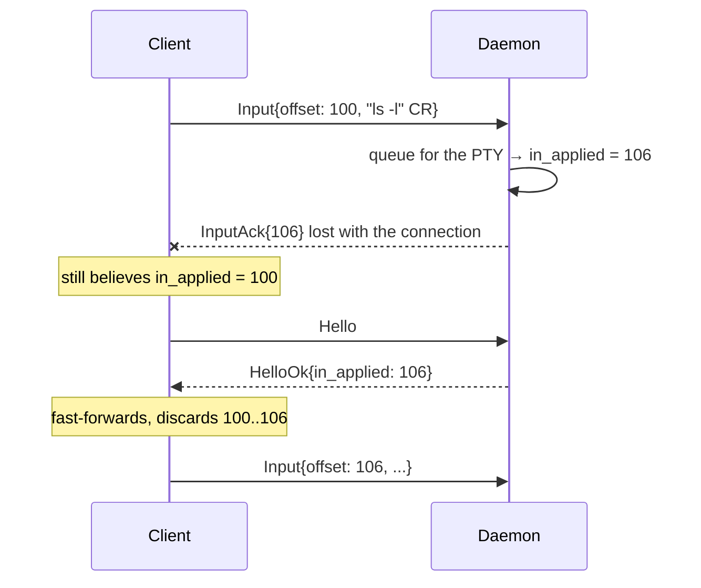
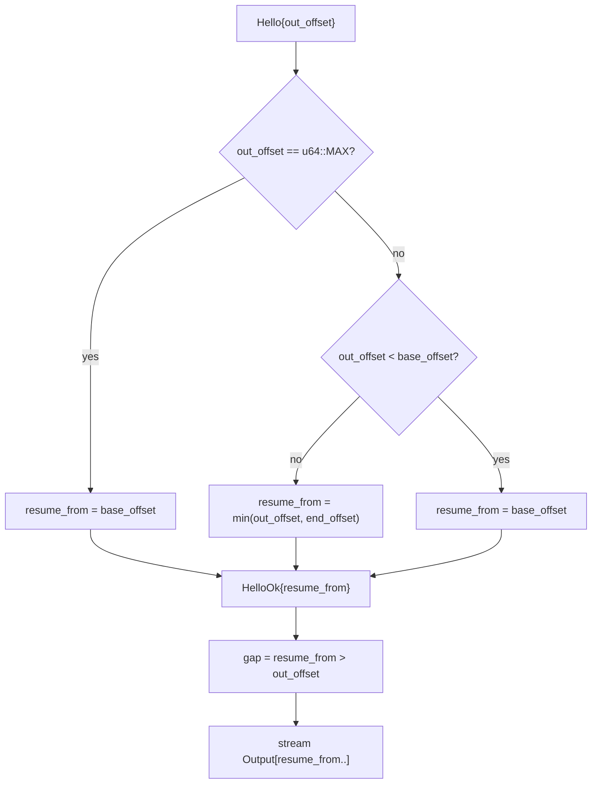
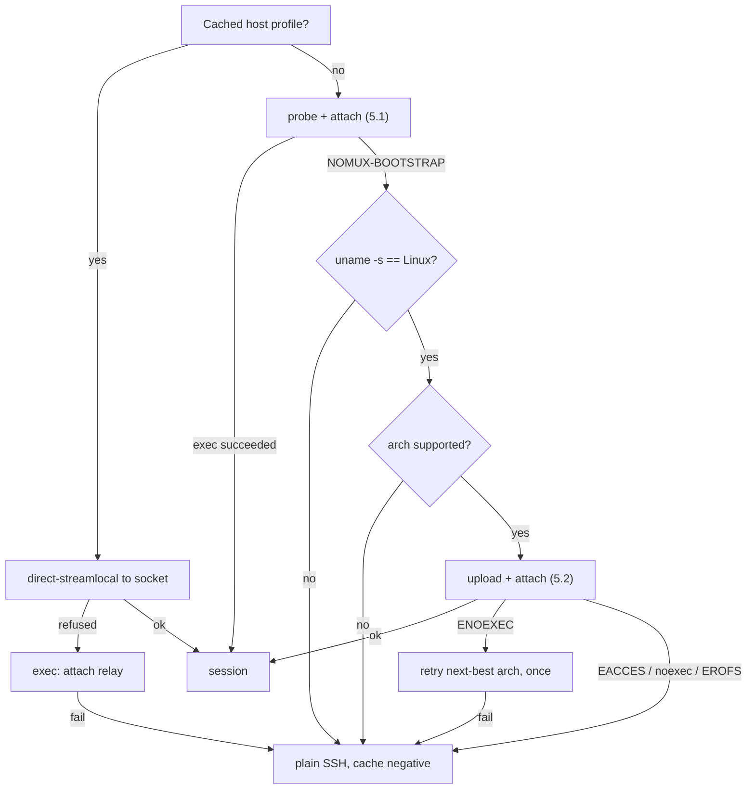
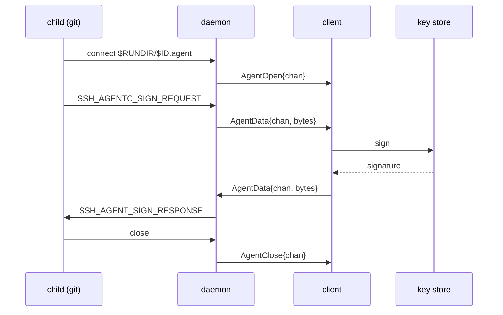

# nomux — Implementation

Low-level detail. Rationale and properties: [DESIGN.md](DESIGN.md).

1. [Layout and conventions](#1-layout-and-conventions) — [where a thing is written down](#where-a-thing-is-written-down), [environment](#environment)
2. [Wire protocol](#2-wire-protocol) — [framing](#21-framing), [messages](#22-messages), [flags](#23-flags)
3. [Offsets and exactly-once input](#3-offsets-and-exactly-once-input)
4. [Ring buffer](#4-ring-buffer) — [backpressure](#41-backpressure), [attach below the base](#42-attach-with-from--base_offset), [gap handling](#43-gap-handling)
5. [Bootstrap](#5-bootstrap) — [probe](#51-probe-and-attach-in-one-round-trip), [upload](#52-upload-and-attach-in-one-round-trip), [decision tree](#53-decision-tree)
6. [Daemon](#6-daemon) — [PTY and child](#61-pty-and-child), [detachment](#62-detachment-from-the-login-session), [socket](#63-socket), [multiple clients](#64-multiple-clients), [shutdown](#65-shutdown), [**frozen control surface**](#66-frozen-control-surface), [agent forwarding](#67-agent-forwarding)
7. [Attach relay](#7-attach-relay)
8. [Build](#8-build)
9. [Testing](#9-testing)
10. [Exit codes](#10-exit-codes)
11. [Diagnostics](#11-diagnostics)

**Building something against nomux?** §6.6 is the only frozen contract here and the
only one a third party may rely on: the five filenames, their permissions, the
pidfile's format, what `list` prints. Everything else describes a version, not a promise.

## 1. Layout and conventions

```
crates/nomux-proto/   wire protocol: framing, codec, offsets. No I/O, no unsafe.
crates/nomux/         the binary: daemon, attach relay, control surface.
```

`nomux-proto` is split out because the client project reimplements or links the same
codec; keeping it I/O-free makes it portable and property-testable in isolation, and it
is the half that can carry `#![forbid(unsafe_code)]`. What belongs there is what is on
the wire: session id validation (§ 6.3) and the agent channel cap (§ 6.7) are daemon
policy, and live in `crates/nomux`.

Neither is published (`publish = false`): a crates.io version would be a semver promise
about an API that is this wire format, which [DESIGN.md § 2](DESIGN.md#2-scope) gives no
stability guarantee. `PROTOCOL_VERSION` answers a peer rather than a resolver.

- Edition 2024, MSRV 1.97.1 (`rust-toolchain.toml`).
- Workspace lints: `clippy::pedantic` + `nursery` + `cargo`, plus `unwrap_used`,
  `expect_used`, `panic`, `indexing_slicing`, `undocumented_unsafe_blocks`. **Every one
  stays at `warn` in `Cargo.toml`**; the deny is `-D warnings` on the clippy hook in
  `.pre-commit-config.yaml`, which gates this tree rather than any build of it. Test
  relaxations live in `clippy.toml`.

### Where a thing is written down

> **Keep the argument where it is, beside the code. Keep the contract in the
> document.**

So a section here states rules, values, formats and orderings, and names the module
that argues for them. A paragraph here explaining *why* a syscall was chosen has
usually been copied out of a doc comment, and the copy is the half that goes stale.

### Environment

Everything nomux reads from the environment, in one place, with the section that owns
each behaviour beside it. The two build variables — `NOMUX_DEBUG` and
`NOMUX_UPDATE_BASELINE` — are tested for exactly `1`; the other two carry a value.

| Variable | Read by | Effect |
| --- | --- | --- |
| `XDG_RUNTIME_DIR` | every mode | First choice of run directory: `$XDG_RUNTIME_DIR/nomux` (§6.3) |
| `XDG_STATE_HOME` | every mode | Second choice: `$XDG_STATE_HOME/nomux/run` (§6.3) |
| `HOME` | every mode | Third choice: `$HOME/.local/state/nomux/run`. Also the child's working directory (§6.1.1) |
| `SHELL` | daemon | The child's login shell, ahead of the password database and `/bin/sh` (§6.1.1) |
| `USER`, `LOGNAME` | daemon | Login name for the linger check, in that order, and only where the password database has no line for this uid (§6.2) |
| `NOMUX_RING_BYTES` | daemon | Ring capacity in bytes. Unparseable or zero falls back to the 4 MiB default; anything above 1 GiB is clamped (§4) |
| `NOMUX_CHAOS_SEED` | the chaos suite | Disconnect-point seed; unset is a fixed default, so a failure reproduces (§9) |
| `NOMUX_DEBUG` | `scripts/build-release.sh` | Also build the unstripped companions (§8) |
| `NOMUX_UPDATE_BASELINE` | `scripts/build-release.sh` | Rewrite `scripts/size-baseline` from this build and skip the growth gate (§8) |

The first three are subject to §6.3's absolute-path rule.

Going the other way, the daemon sets three variables in the child and removes one:
`TERM` from `Hello`, `NOMUX_SESSION=<id>`, `SSH_AUTH_SOCK` where forwarding is on, and
`NOMUX_BOOTSTRAP` taken back out (§6.1.1).

## 2. Wire protocol

Spoken end-to-end between client and daemon (§7 relay is transparent).

Private protocol: client and daemon ship as one unit ([DESIGN.md § 2](DESIGN.md#2-scope)).
No negotiation, no reserved space for extensions, and nothing carried that nothing
reads. `Hello.protocol` exists solely to reject a mismatched peer immediately, in the
bounded skew case of [DESIGN.md § 6.4](DESIGN.md#64-version-skew), and it is the only
revision on the wire: `HelloOk` is sent after that check has passed, so a copy of the
number in the answer could only repeat what the client just said.

### 2.1 Framing

```
 0        1                     4                        4+len
 +--------+---------------------+------------------------+
 | type   | len      (u24 BE)   | payload                |
 | u8     | 3 bytes             | len bytes              |
 +--------+---------------------+------------------------+
```

`len` caps at `MAX_PAYLOAD` (256 KiB); larger is a protocol error. All integers big
endian. Header is fixed 4 bytes so the reader is a two-stage `read_exact`.

*winsize* is four `u16`s — cols, rows, xpixel, ypixel — the same layout everywhere
it appears.

### 2.2 Messages

| Type | Dir | Name | Payload |
| --- | --- | --- | --- |
| `0x01` | C→D | `Hello` | `u16` protocol, `u8` flags, `u64` out_offset, winsize, `u16` term_len, UTF-8 term bytes |
| `0x02` | D→C | `HelloOk` | `u64` resume_from, `u64` in_applied, winsize, `u8` linger (0 unknown, 1 disabled, 2 enabled), `u8` flags |
| `0x03` | C→D | `Input` | `u64` offset, bytes |
| `0x04` | D→C | `InputAck` | `u64` applied_through |
| `0x05` | D→C | `Output` | `u64` offset, bytes |
| `0x06` | C→D | `OutputAck` | — |
| `0x07` | C→D | `Resize` | `u16` cols, `u16` rows, `u16` xpixel, `u16` ypixel |
| `0x08` | D→C | `Gap` | `u64` new_base_offset |
| `0x09` | D→C | `Exit` | `i32` status, `u8` kind (0 = exited, 1 = signalled), `u32` since_exit_secs |
| `0x0a` | C→D | `Detach` | — |
| `0x0b` | C→D | `Ping` | `u64` nonce |
| `0x0c` | D→C | `Pong` | `u64` nonce |
| `0x0d` | D→C | `Error` | `u16` code (1 protocol, 2 takeover, 3 version, 4 input_gap, 5 internal), UTF-8 message |
| `0x0e` | D→C | `AgentOpen` | `u32` chan |
| `0x0f` | ↔ | `AgentData` | `u32` chan, opaque `ssh-agent` bytes |
| `0x10` | ↔ | `AgentClose` | `u32` chan |

`Hello` carries the current revision, **5** — `PROTOCOL_VERSION` in `nomux-proto`,
bumped on any wire change, compatible ones included: a change that leaves the number
alone is one `Hello.protocol` cannot catch, and a client built from an older copy of
this table then misparses rather than being refused. What each revision moved is
`git log` on `crates/nomux-proto/`.

The session id is **not** in `Hello` — it is already fixed by the socket path (warm) or
by the id `spawn` and `attach` were handed (cold). Nor does anything in `Hello` say
where the client's *input* stream stands: `HelloOk`'s `in_applied` is authoritative and
the client fast-forwards to it (§3). `Hello.out_offset` of `u64::MAX` means *"I have no
state, send me whatever you have"*, used on a fresh app launch to recover scrollback.

`Hello.term_len` counts **bytes**, not characters, and the `u16` ceiling of 65535 is a
byte count too. A `TERM` past it is refused rather than truncated: a session opened
under a silently shortened terminal type is one nobody chose.

`Hello.term` may not contain a NUL, refused encoding as well as decoding. U+0000 is
valid UTF-8, so nothing else catches it; let through, it reaches the child's
environment (§6.1.1), where `execve` refuses it and a malformed frame surfaces as
`Error{Internal}` — the host blamed for what the client sent.

`Exit.since_exit_secs` counts whole seconds since the child let go of the terminal,
elapsed rather than stamped: the daemon reads a monotonic clock it can trust and
never a wall clock it cannot, and the client converts against its own. It saturates,
at a width no session reaches — 136 years. It rides on `Exit` and not on `HelloOk`
because `HelloOk` goes out on every attach of every session, where four bytes about a
child that has not exited would mean nothing — the field §2's rule refuses.

### 2.3 Flags

Both flag fields are exhaustive: an undefined bit is a protocol error, not a
forward-compatibility case ([DESIGN.md § 2](DESIGN.md#2-scope)). The same rule covers
every other closed set on the wire — `Error.code`, `Exit.kind` and `HelloOk.linger` —
so an unrecognised value is refused rather than passed through. Both fields are a byte
wide, because two bits and one bit are what they carry.

`Hello.flags`:

| Bit | Name | Honoured |
| --- | --- | --- |
| 0 | agent forwarding (§6.7) | Only on the `Hello` that **creates** the session — `SSH_AUTH_SOCK` goes into the child's environment, which cannot be changed afterwards |
| 1 | repaint with `ctrl_l` rather than `winch` (§4.3) | Every attach; it costs nothing to restate, and only the client knows what is on the screen |

`HelloOk.flags`:

| Bit | Name |
| --- | --- |
| 0 | an agent socket is being served, so `AgentOpen` may arrive |

The linger state is not in that byte but a `u8` field of its own beside it, so its wire
form is the discriminant §2.2 gives it rather than that discriminant shifted. There is
no `gap` bit either: `resume_from > Hello.out_offset` is the same predicate, computed
from a number the client sent and a number it was just told (§4.2).

## 3. Offsets and exactly-once input

Both directions are byte streams with absolute `u64` offsets, not per-frame counters,
and an offset is that of the frame's **first** byte. Output is at-least-once and
idempotent: the client discards anything below its `next_expected` offset.

Input must be **exactly-once** — replaying a partially applied keystroke buffer into
a shell is how a truncated `rm -rf` gets executed. The daemon's `in_applied` is
authoritative, and it advances the moment the daemon takes ownership of the bytes:



Had the client blindly resent its unacked buffer, `ls -l\r` would run twice. Rules:
- Daemon drops any `Input` fully below `in_applied`; trims a straddling one.
- `Input` above `in_applied` is a gap in the input stream → `Error` + close. The client must not skip.
- `OutputAck` is advisory and payload-free. It never trims the ring (§4) and the daemon tracks what it has sent by itself, so what the frame does is **arrive**: it wakes the loop, which lets a replay that stopped on a full socket resume. Where a reconnecting client that lost its own state is told what it holds is `HelloOk`, not this.

Ownership, not durability: the master is non-blocking (§6.1), so a child that has
stopped reading leaves input queued indefinitely, and waiting for the write would stall
the ack behind it. The queue is the daemon's own memory, never re-applied and bounded
by §4.1; losing it means losing the daemon, which ends the session anyway.

The other half of the invariant is the client's: an `Input` frame written but not yet
read is **not** safe, a dropped client's buffered frames going undecoded. So a
reconnecting client resends from the daemon's `in_applied`, never from what it believes
it sent.

## 4. Ring buffer

Fixed capacity, allocated once. `VecDeque<u8>`, drained via `as_slices` to write
without copying.

Capacity defaults to 4 MiB and is overridable per daemon with `NOMUX_RING_BYTES` (§1),
the right value being host-dependent: a machine running the eight sessions DESIGN.md
§5.1 caps at pays it eight times over. An unparseable or zero value falls back to the
default rather than refusing to start, a mistyped tuning variable never costing someone
their session; one that parses positive but past 1 GiB is clamped there, since
`VecDeque::with_capacity` answers a request it cannot serve by aborting the process.

```
        base_offset                              end_offset
             |                                        |
             v                                        v
   ..........[========== retained bytes ==============]
   dropped                  capacity
```

- The daemon always drains the PTY, attached or not. If the ring is full it advances `base_offset`, discarding the oldest bytes. A write larger than the whole ring discards everything retained as well as its own head, so `base_offset` accounts for both.
- A client is served `[max(from, base_offset) .. end_offset]`.
- Overflow is not a stored flag. Whether a *reader* lost anything depends on where that reader had reached, so it is derived per client by comparing its position against `base_offset` — which stays correct across any number of overflows, including ones that happened while it was away.
- Never trimmed on ack. A full rolling window is the scrollback a fresh client gets.

### 4.1 Backpressure

The PTY drain must never block on a slow or absent client. Precedence: keep reading
the PTY, drop from the ring's head. A stalled client causes a gap, never a frozen
shell.

Four bounds, each enforced on its own queue:

| Constant | Value | Bound |
| --- | --- | --- |
| `MAX_PENDING_WRITE` | 1 MiB | Past this queued to the client, output stops being queued. The ring absorbs the PTY regardless, so a slow client costs a gap and never a blocked child |
| `ABANDON_PENDING_WRITE` | 8 MiB | Past this the client is not slow but gone, and is dropped; reattaching replays from the ring. The gap between the two figures is clear of the first plus one output chunk, so only the frames that answer a client — an `InputAck` per `Input`, a `Pong` per `Ping`, queued whatever the first bound says — can reach it |
| `MAX_PENDING_INPUT` | 1 MiB | Past this queued for a child that is not reading, the daemon stops **accepting** input: it stops decoding `Input` frames and stops asking the socket for more. Dropping is not available, `in_applied` being exactly-once (§3), and `Error{INPUT_GAP}` would accuse a client that had done nothing wrong. The bytes wait in the kernel's buffer, where the peer blocks on them — §6.7's argument for a saturated agent channel |
| `MAX_PENDING_READ` | 1 MiB | One connection's undecoded receive buffer, bounded by the daemon's own number rather than by whatever the peer set `SO_SNDBUF` to. On a stock host it never binds; [PLAN.md § P4](PLAN.md#p4--test-depth) has the measurements and why no test pins it |

**The input cap is enforced where the queue grows**, between frames in the decode loop,
and never by the poll set. Holding the client out of `POLLIN` throttles the reads the
poll set drives and nothing else: the takeover path of §6.4.1 reaches the same decode
loop twice without passing through the poll set at all — once to drain the outgoing
connection, once for the input the arriving one pipelined behind its `Hello` — and a
connection promoted with a megabyte already buffered would decode every byte of it.
Each reconnect could inject another queue's worth, and nothing bounds reconnects. So
the queue overshoots by at most the one frame that crossed the cap, `MAX_PAYLOAD`, and
the declined frames wait in the receive buffers of at most two connections, the client
and one pending. `Conn::fill`, `conn::compact` and `Daemon::watch_for` carry the rest:
why no complete frame is stranded there, why a held-back client stays in the poll set
under an *empty* mask instead of leaving it, and why each queue reclaims its consumed
prefix on a ratio rather than at a fixed number of bytes.

The cost is that a client's own control frames — `Ping`, `Resize`, `Detach` — queue
behind its own stalled input, and that a takeover's final drain goes with the outgoing
connection where the queue is full. Both are accepted: those frames were never
acknowledged, so §3 already has the client resending from `in_applied`, the invariant
being exactly-once rather than never-retransmitted. A *new* connection is never held
back *by the input cap*, being polled as pending rather than as the client, so `list`
and the spawn race of §6.3 are unaffected — and `nomux kill` is a signal (§6.5).

### 4.2 Attach with `from < base_offset`



**The gap is that comparison, and nothing sends it.** Every branch above decides it
already, so a flag would be the daemon restating a number the client can see. Both ends
compute it — the daemon to decide the repaint it owes (§4.3), the client to reset its
emulator — and neither reads it off the wire. This is the *attach-time* gap; the
standalone `Gap` frame is for overflow that happens mid-stream, while a client is
attached.

`resume_from` is clamped at *both* ends, which is why the no-gap branch carries a
`min`. An `out_offset` above `end_offset` is a client claiming output the session never
produced, which at face value would set `sent_through` past the end of the stream and
leave the session looking dead until the child caught up. Not a gap: nothing was
dropped, and `resume_from` came *down*.

### 4.3 Gap handling

On a gap the byte stream is discontinuous and the client's emulator may be
mid-escape-sequence. Recovery, mirroring `dtach -r`:

1. Client resets its emulator locally — `ESC c` is correct but heavy-handed (drops scroll region and charset); `ESC [ ! p` + `ESC [ 2J` + `ESC [ H` is the softer default.
2. Daemon triggers a repaint from the child via a `TIOCSWINSZ` dance: set `cols-1`, then the real `cols`. The resulting two `SIGWINCH`es make most full-screen programs redraw. A terminal one column wide gets the second alone — there is no narrower size to go to, and a zero-column terminal is not a thing to hand a child — which leaves the repaint weaker there than everywhere else, and is accepted: nobody drives a one-column terminal, and the client picks `ctrl_l` where this shape does not suit it.
3. Repaint policy is the client's, restated in each `Hello` (§2.3): `winch` (default) or `ctrl_l` (write `0x0c` to the PTY — better for a bare shell prompt, destructive inside an editor). Only the client knows whether the user is looking at an editor or a prompt, and it costs nothing to say so on every attach.

`ctrl_l` goes through the same queue as client input rather than straight to the
master, so it cannot overtake keystrokes already accepted or block on a full PTY
buffer. It is not client input, so `in_applied` does not move for it.

The repaint is *owed* at the gap and issued later, on the first pass that finds the
client holding the whole ring — one policy for both ways a gap is reached, §4.2's
`HelloOk` comparison and the mid-stream `Gap` frame, which holds a sustained overrun to
one repaint rather than one per gap. A repaint issued mid-overflow paints into bytes the
next overflow discards, so the coalesced one is the only one the client can ever see; a
client that never catches up is never repainted. Neither step restores a plain shell's
lost scrollback, inherent to byte-stream replay and accepted
([PLAN.md § Deferred by decision](PLAN.md#deferred-by-decision) weighs the `libvterm`
snapshot).

## 5. Bootstrap

### 5.1 Probe and attach in one round trip

```sh
p=${XDG_DATA_HOME:-$HOME/.local/share}/nomux
exec "$p/nomux-$VER" "$MODE" "$ID" 2>/dev/null
echo "NOMUX-BOOTSTRAP $(uname -s) $(uname -m) $p"
```

`exec` replaces the shell on success, so the `echo` is unreachable unless the binary
is missing or unrunnable. Warm cost: zero extra round trips.

`$MODE` is `spawn` or `attach`, and the client always knows which, because it knows
whether it already holds a session for this tab. It is a substitution and not a second
command: `spawn` creates the session *and* attaches to it in the one `exec` (§6.3),
where a spawn followed by an attach would cost a round trip on every cold start.

The fields are `uname`'s — `Linux`, `x86_64` — because `sh` emits the line before any
binary exists. Confirming that an *uploaded* artifact runs is `--version`'s job, which
answers from the installed binary and carries the protocol revision besides.

### 5.2 Upload and attach in one round trip

```sh
p=${XDG_DATA_HOME:-$HOME/.local/share}/nomux
mkdir -p -m 700 "$p" && set -C && cat > "$p/.up.$$" && chmod 755 "$p/.up.$$" \
  && mv -f "$p/.up.$$" "$p/nomux-$VER" && exec "$p/nomux-$VER" "$MODE" "$ID"
```

- Temp-then-`mv` is atomic within one filesystem and avoids `ETXTBSY` — you cannot write over a running binary.
- Version in the filename: an upgraded client cannot break sessions an older daemon still holds.
- Transfer over an **exec channel with `cat`**, not SFTP. `Subsystem sftp` gets disabled on hardened hosts, and modern `scp` is SFTP underneath. SSH channels are 8-bit clean, so no base64 tax.
- Enable `zlib@openssh.com` on this channel: ~3× on a static binary, requiring nothing on the remote.
- **`-m 700` rather than the ambient umask.** A bare `mkdir -p` creates at `0777 & ~umask`, and `umask 002` is the Debian-derived default — harmless only because the user's primary group is their own, which on a host with a shared one it is not. Without the mode the directory every later connection `exec`s out of is group-writable with nobody having pointed `$XDG_DATA_HOME` anywhere — [DESIGN.md § 8](DESIGN.md#8-security-model)'s threat, arriving by itself. It binds only where this call *creates* the directory; one that already exists keeps whatever it had.
- **`set -C` before the redirect**, because `.up.$$` is a name that can be predicted. Under noclobber `>` is `O_CREAT | O_EXCL`, which refuses a symlink — dangling or not — where a plain `cat >` follows it. In a directory another user can write to that is the difference between replacing the binary the victim `exec`s and choosing where the uploaded bytes land: `~/.ssh/authorized_keys`, `~/.bashrc`, anything this uid can write. A planted name now costs one failed bootstrap, retried under a fresh pid. `rundir::write_private` unlinks before it writes and `read_prefix` opens `O_NOFOLLOW` (§6.3): the standard is the tree's already, and this was the line not holding it.
- **The install directory is still created, not checked**, which is a materially weaker guarantee than §6.3 gives the *run* directory; what the two lines above do and do not close, and to whom, is [DESIGN.md § 8](DESIGN.md#8-security-model)'s to state.

### 5.3 Decision tree



`uname -m` lies on a 32-bit userland over a 64-bit kernel, hence the one ENOEXEC
retry. All negative results are cached per-host so a hardened box is not re-probed
on every reconnect.

## 6. Daemon

### 6.1 PTY and child

Via `rustix` rather than raw `libc`, so almost none of this needs `unsafe`.

1. `openpt(O_RDWR | O_NOCTTY | O_CLOEXEC)`, `unlockpt`, `ptsname`.
2. Master is set non-blocking.
3. Parent opens the slave `O_RDWR | O_NOCTTY | O_CLOEXEC` and hands it to the child as all three stdio descriptors.
4. Parent sets the initial `TIOCSWINSZ` from `Hello`, before the child can observe it, so the shell's first prompt is already laid out correctly.
5. `fork`. In the child, before `exec`: `setsid()`, acquire the slave as controlling terminal via `ioctl_tiocsctty`, restore `SIGHUP` to `SIG_DFL` (§6.2 leaves it ignored in the daemon, and an ignored disposition survives `exec`). Only async-signal-safe calls, which is why the open is not among them.
6. Parent closes **its own** slave descriptors — the copy in this frame and the three the `Command` borrowed. The master reports `EIO`, which is how the session learns the child is gone, only once no descriptor onto the slave is left in this process, so a copy outliving the spawn is a child that exits without the daemon ever noticing.

`O_CLOEXEC` on both ends is what keeps them out of the child; without it every process
the user runs holds a writable descriptor onto its own PTY master. The child keeps its
stdio regardless, `dup2` onto 0/1/2 clearing the flag on the copies.

The event loop is `poll` over {master, listener, attached client, pending
connection, the stop-signal self-pipe (§6.5), agent socket, one fd per agent
channel}. The *pending* entry is a connection accepted but not yet greeted, and it is
what makes "connecting is not attaching" (§6.4) work, a liveness probe from `list` not
being allowed to evict anyone. The set is variable-length and each entry is tagged with
what it belongs to rather than read back by position.

The master **must** be non-blocking. A child that stops reading fills the PTY's input
buffer, and in raw mode the line discipline throttles rather than discarding, so a
blocking `write` would park the whole event loop in the kernel. Unwritten input waits in
the daemon's queue instead; the poll set asks for `POLLOUT` only while there is something
to write, and stops asking the client for `POLLIN` once that queue is full (§4.1).

**The SSH channel must not request a PTY.** nomux allocates its own; two line
disciplines stacked would give double echo, doubled `\r\n` translation and broken raw
mode. The channel is a raw byte pipe and nomux owns the only PTY — which is also why
`TERM` arrives in `Hello` (§2.2) rather than from sshd.

#### 6.1.1 What the child runs

Whatever a plain `ssh host` would have run, because nomux is *already inside* an SSH
session and inherits its setup: PAM has run, and `HOME`, `USER`, `PATH` and `SSH_*` are
already in the environment.

- **Login shell, dash-prefixed**: `execv(shell, ["-bash", ...])`, not `["bash", ...]`. That leading `-` is what sshd does for an interactive session and what causes `/etc/profile` and `~/.bash_profile` to be sourced. Omitting it yields a stunted environment that users correctly perceive as broken.
- **Shell selection**: `$SHELL` as inherited, else the password database, else `/bin/sh`. The middle step is `/etc/passwd` parsed directly rather than `getpwuid`: in a static musl binary those are the same thing, since NSS modules cannot be loaded into a static executable, and doing it in Rust keeps the lookup safe and testable. The cost is not seeing LDAP or NIS users, who fall through to `/bin/sh` — as they would with `getpwuid` anyway.
- **Working directory**: `$HOME`, else the directory the attaching connection was in, else `/`. The daemon itself has already moved to `/` (§6.2), so this has to be set explicitly or the shell would start there.
- **Environment**: inherited wholesale. Remove `NOMUX_BOOTSTRAP`, set `TERM` from `Hello`, `NOMUX_SESSION=<id>`, and — when agent forwarding is enabled — `SSH_AUTH_SOCK=$RUNDIR/<id>.agent` (§6.7). Change nothing else, which leaves `NOMUX_RING_BYTES` (§1) in the child's environment on a daemon that was started with it set.
- **`NOMUX_BOOTSTRAP` is vestigial, not a client contract.** Nothing in this tree sets it, and what §5.1's probe emits is `NOMUX-BOOTSTRAP` on *stdout*, a different thing. No client is obliged to set it; the scrub stays so that a wrapper which does export it cannot reach the child.
- **No PAM.** It already ran for the SSH login, and the daemon is unprivileged.
- No client-supplied command in v1. A one-shot remote command has no reason to be persistent; it stays on plain SSH.

The environment is a snapshot of the connection that *created* the session, frozen for
its lifetime: a later reconnect may carry a different agent socket, `DISPLAY` or
`AcceptEnv` values the child can never see, a running process's environment not being
mutable. Indirection through the run directory (§6.6) is the only fix, and only for
variables that name a path.

### 6.2 Detachment from the login session

The `daemon` mode holds this itself rather than trusting whoever started it:

```
ignore SIGHUP
leads a session and holds no controlling terminal?  already detached; nothing to do
  else setsid            refused only if we lead a process group
    else fork → parent _exit, child setsid
...                      re-listen, stop signals, <id>.pid, <id>.label, drop the lock
chdir "/"
0/1/2 → /dev/null        last of all, so everything above still has a stderr
```

The test is **no controlling terminal**, not "leads a session" — a session leader may
still hold one — and it is put to `/dev/tty`, which *is* that terminal by definition.
`setsid` is asked before it is needed, so "already done" is told apart from "cannot be
done" and the ordinary path stays fork-free; only a process-group leader is refused.
`startup::leave_login_session` and `startup::has_controlling_terminal` carry the
argument, including why `ENXIO` is the only definite no and why `TIOCNOTTY` is not used.

`SIGHUP` is ignored before any of that, and there it is load-bearing rather than
tidy: the manoeuvre itself provokes one at the forked child, which is still in the
hung-up terminal's foreground group for the few instructions before its own
`setsid`. Inherited as ignored, that race cannot be lost.

The fork happens after the socket is bound, so a session that already exists is still
reported with an exit status somebody sees, and before the pidfile is written, so
`nomux kill` (§6.6) reads the pid of the process that survived. The survivor then calls
`listen` again on the descriptor it inherited, `listen` installing a backlog rather than
keeping the one in force (§6.3); it also re-stamps `SO_PEERCRED`, which nothing reads
today. A failure is discarded rather than propagated, a queue at the wrong depth not
being a reason to refuse a session otherwise ready to serve.

`spawn` arranges the first two lines for the daemon it starts — `setsid` in its own
`pre_exec`, stdin and stdout to `/dev/null` through `Stdio::null()` — because until its
own `setsid` a hangup would take the session with it, and until it redirects its stdio
it holds the *relay's* descriptors, where anything it writes lands mid-frame. Stderr is
the exception, `Stdio::piped()`: everything that fails before
`startup::release_startup_state` is written there and arrives at the `spawn` that
created the session, and the pipe reaching end of file says the daemon got past that
point, after which it has syslog (§11).

`chdir "/"` and the `/dev/null` redirection are that same
`startup::release_startup_state`, past the pidfile and the spawn lock. The chdir comes
after the run-directory paths are resolved and the socket is bound, the child having its
own working directory (§6.1.1); it buys a session that cannot keep a removable or
network mount busy for a week.

Signal dispositions: `SIGHUP` ignored, and restored to `SIG_DFL` in the child before
`exec` (§6.1). `SIGTERM` and `SIGINT` handled rather than ignored (§6.5), armed
immediately after the detachment above and before the pidfile is written, so the pid
`nomux kill` reads never names a process still on the default disposition. `SIGPIPE`
ignored by the Rust runtime at startup and reset for spawned children. `SIGQUIT` is
§6.5's. Nothing but `SIGHUP` needs anything in the child.

`systemd-logind` with `KillUserProcesses=yes` kills the daemon at logout regardless,
and the only real fix is `loginctl enable-linger $USER`. The daemon detects the state
and reports it in `HelloOk.linger` (§2.3) rather than working around it. Detection
reads the files `logind` itself reads — `/run/systemd/system` for "is this a `logind`
host at all", then `/var/lib/systemd/linger/<user>` — rather than running
`loginctl show-user -p Linger`, a D-Bus round trip that can block for its full 25-second
timeout on a broken bus. Absence of the marker is a definite *disabled*; only a lookup
that fails otherwise is *unknown*, and the client must not warn on unknown.

The login name is the password database's first, then `$USER`, then `$LOGNAME` — the
environment being the fallback for directory-backed accounts with no line in
`/etc/passwd` (§6.1.1 has why NSS is not reachable from a static binary). It is joined
onto a system directory, so an empty one, or one holding `/` or NUL, or `.` or `..`, is
refused and the state is *unknown*. Most distributions ship `KillUserProcesses=no`,
where nothing reaps the session at logout and `setsid` alone suffices.

### 6.3 Socket

Session ids come from the client and are used directly as filename components, so they
are validated before touching the filesystem — `rundir::is_valid_session_id`, which
lives with the layout rather than with the codec, the id not being on the wire (§ 2.2):

```
1..=64 bytes, each of [A-Za-z0-9_-], and never a leading `-`
```

The character rule rejects `..`, `/`, `.`, empty, NUL and non-ASCII outright, so path
traversal is impossible by construction rather than by escaping. The leading `-` is the
*command line's* bound rather than the filesystem's: `main` reads any argument beginning
with `-` as an option before a mode sees it, so `nomux attach -abc123` exits 64 as an
unknown option, and an id a conforming client could mint but never spawn, attach or kill
is refused in the grammar instead. Both ends validate — the client before minting, the
daemon before use — and an invalid id is a hard error, never sanitised into something
valid, since silently rewriting an id would attach the user to the wrong session.

Path precedence:

1. `$XDG_RUNTIME_DIR/nomux/<id>.sock` — tmpfs, but removed on last logout unless linger is on.
2. `$XDG_STATE_HOME/nomux/run/<id>.sock`, default `~/.local/state/nomux/run/`.

A source that does not name an **absolute** path is not a source: it is skipped, an
empty value included, and where none of `XDG_RUNTIME_DIR`, `XDG_STATE_HOME` and `HOME`
names one there is no run directory to resolve and every mode fails with that (§10).
The resolved directory is held for the session's whole life while §6.2 moves the
process to `/` partway through it, so a relative one would name two different
directories either side of that move.

`SessionPaths::new` applies a second refusal, and it depends on which source the run
directory came from: a `sun_path` is 108 bytes including its terminator, so the
directory, a `/`, the id and `.label` — six bytes, the longest of the five suffixes,
with `.agent` the same length — have to fit in 107. Under `$XDG_RUNTIME_DIR` at
`/run/user/1000` that leaves room for an id of 80 and the 64-byte ceiling above is what
binds. Under the fallback it does not: `$HOME/.local/state/nomux/run` is 23 bytes past
`$HOME`, so the longest id that fits is `77 - len($HOME)` — 63 bytes for a home of 14,
one short of an id the same client mints happily on the same host with
`XDG_RUNTIME_DIR` set. **A refused id is therefore not necessarily a bad id**, which is
what §10 has to turn into an exit code and what a client must not cache as a property
of the id. Taking the bound against `.label` leaves `<id>.sock` a byte shorter still,
which is what lets §6.6's probe read every `connect` failure it is not told about as a
live session rather than as an address it could not build.

It is refused there rather than at the `bind` that would meet it, because `list` and
`kill` read an unbindable address as a *live* session whose files they must not unlink,
so every attempt would leave a `<id>.lock` behind from the command whose job is to
collect it. The cost is that files already sitting at such an id are beyond both modes,
`list` dropping the id and `kill` answering 64, so they stay there for good
([PLAN.md § P1](PLAN.md#p1--known-gaps)). Nothing here creates that state.

Directory `0700`, socket `0600`, and the three plain files — pidfile, lock, label —
`0600` as well. Every one of those is exact rather than an upper bound: the umask is
suppressed around each creating call, since `mkdir`, `bind` and `open` all subtract
it, and a `<id>.lock` created `0400` under `umask 0200` is one no later process can
open at all, which loses the mutex the control surface rests on. Filesystem sockets
only, never abstract ones ([DESIGN.md § 8](DESIGN.md#8-security-model)).

The backlog is the host's ceiling rather than a number this program picks: `-1`, what
`UnixListener::bind` passes on Linux, is not a length but a request `listen(2)` clamps
to `net.core.somaxconn` — 4096 where this was measured. The re-listen of §6.2 restates
it and must not restate it as a literal; a *successful* re-listen at 128 is what once
shrank the queue 32-fold. An `AF_UNIX` `connect` to a full backlog blocks rather than
being refused, so every connect here is bounded, through one call:
`rundir::connect_within`, at 2 s for `list`, `kill` and the relay, and at 1 s for the
daemon's own stale-socket probe.

The directory is *checked* rather than merely created, because on every run but the
first it already exists and that says nothing about what it is. It is opened
`O_DIRECTORY | O_NOFOLLOW` and `fstat`ed, and four things are refused outright: a
symlink, a non-directory, one belonging to another uid, and one that group or other can
write to — whoever had that could have left a socket of their own at a session id about
to be connected to, and no later `chmod` un-plants it. Every other mode is *repaired* to
exactly `0700` through the descriptor already checked, which covers a group- or
other-readable mode, an owner bit an odd umask left missing, and `setgid` or `sticky`.
The one mode that cannot be repaired is one the owner cannot *open*, there being no
descriptor to `fchmod` through, and that is refused as a judgement on the mode rather
than as an `EACCES` from a syscall.

The check belongs to every mode that touches the directory, before the first name in
it is resolved: `spawn` before its *first* `connect`, not only on the way to starting a
daemon; `attach` before its own; `list` before it reads the directory; `kill` before it
reads a pid and signals it; the daemon before it binds. Checking after connecting
checks only the case where nothing was planted — with a socket already at the path, the
relay hands the user's keystrokes to whoever bound it. Only `spawn` and the daemon
*create* the directory; the other three check without creating, being asked what
sessions exist or to join one, which must not be what brings the directory into being.

The run files are then opened by name rather than relative to that descriptor, there
being no `bindat(2)`, and the check above is what closes the race for all five. What
stays open is a *parent* somebody else can write to — an `XDG_RUNTIME_DIR` pointed at a
shared directory — where the whole run directory can be swapped between the check and
the next `bind`. No descriptor helps there.

Spawn race (two clients spawning the same id at once): `flock(LOCK_EX)` on `<id>.lock`;
the loser blocks there, then finds the socket the winner bound and is told the id is
taken (§10) rather than handed a session it did not create. Only a process that spawns
its own daemon polls, and only for its own. A stale socket is one where `connect`
returns `ECONNREFUSED` — unlink and respawn. `EACCES` is not staleness.

`SpawnLock`, `SessionPaths::acquire`, `removal_order` and `no_lock_here` in `rundir.rs`
argue each of the rules below where the call is, including why a `try_lock` and not a
wait and why `ENOLCK` is grouped where it is. What follows is what a second
implementation of `list` or `kill` must obey, in the order the rules bind:

- **Anything that unlinks takes the lock first and holds it to the end.** That is `list`'s sweep and `kill` (§6.6), and the daemon's own exit (§6.5).
- **The daemon takes it before it probes for a stale socket**, and never blocks for it. Without that ordering a sweep that probed the same socket and was then descheduled unlinks what this daemon has bound in the meantime.
- **`spawn` holds it past the `connect` that succeeds, until `<id>.pid` exists.** The daemon binds before it writes that file (§6.2), so releasing at the `connect` would make "the lock is free" mean something weaker than "the id is unclaimed", and a `kill` landing inside that window finds a live daemon and no pid to signal. The wait is bounded by the spawn timeout and is never fatal.
- **The daemon drops it the instant the pidfile exists.** One still holding it at `kill`'s 2 s deadline (§6.6) would be one nothing could stop.
- **Every acquirer confirms that what it locked is still the file at that path** — `fstat` against `stat`, device and inode — and goes back for the real one if it is not. `flock` attaches to an inode and `<id>.lock` is itself collected, so the name and the mutex are two different things.
- **`<id>.lock` is unlinked last** of the five. From the moment its name is gone the caller's lock guards nothing, so an unlink still to come would land on a session somebody else has legitimately brought up — silently, for `<id>.label` and for the `<id>.agent` socket the child's `SSH_AUTH_SOCK` points at.
- **A lock no process could obtain is proceeded past without one**, and the list is exactly `EACCES`, `EPERM` and `ENOTSUP` — `<id>.lock` at a mode nothing can open, a uid nothing here may write as, a filesystem that does not implement `flock`. Each is a property of the *file*, so a lock this caller cannot get is one no caller can be holding. Every other errno makes a caller wait, skip or refuse, because it is a property of the moment instead and says nothing about who holds the inode. The escape hatch of §6.6 has to collect a dead session on any host, and refusing on the three above would buy nothing.

One further refusal is decided in that same region: the daemon counts the distinct
session ids already in the run directory and refuses to start past **64** —
`MAX_SESSIONS`, eight times the cap of 8 that
[DESIGN.md § 5.1](DESIGN.md#51-identity) argues for and leaves to the client. It counts
names and not siblings, so a directory of dead sessions `list` would collect refuses one
that could have started, and the refusal names both commands. Its own id never counts
against it, and a directory that will not read is not a refusal. The count is taken
before the bind and inside the spawn lock's region, but that lock is a `try_lock` and a
daemon that cannot take it goes on without one, so two starts can read the same 63 and
both proceed: **64 is a backstop a race can cross, not a ceiling.** A refusal unlinks
`<id>.lock` where this process created it and still holds it — the daemon's own here,
`attach::create`'s on a failed spawn or an expired `SPAWN_TIMEOUT` — since
`session_id_of` counts a bare lock as a session, so leaving it would ratchet the
backstop against itself on every rejected spawn.

### 6.4 Multiple clients

Exactly one attached client. A second `Hello` on a live session takes over; the
previous connection receives `Error{TAKEOVER}` and closes.

**The `Hello` is what takes over, not the `connect`.** A newly accepted connection
waits as *pending* and owns nothing until it greets. This is not a nicety: `list`
probes every socket with a bare `connect` to decide which daemons are alive (§6.6), and
so does the spawn race in §6.3, so if connecting counted as attaching, listing sessions
would evict the user from all of them — permanently, the client being told never to
auto-reconnect after `TAKEOVER`. A connection that greets with anything other than
`Hello` is refused on its own terms and the session keeps its client. Only one
connection may be pending at a time: the listener leaves the poll set while that slot
is taken, so a second waits in the backlog — where its `connect` completes, so `list`
reports the session throughout — until the incumbent greets, reaches end of file, or
misses its 5 s deadline.

**A `Hello` this daemon cannot answer is refused before the eviction, not after.** The
`Hello.protocol` check therefore runs on the pending connection rather than inside the
handshake, which only runs once the takeover has happened: deferred there, a newer
client's *failed* greeting threw the working client off with `Error{TAKEOVER}` and then
dropped the newcomer too, leaving nobody attached and no client permitted to reconnect.
The one place [DESIGN.md § 6.4](DESIGN.md#64-version-skew)'s skew story touches the daemon.

The eviction's final write is bounded by a deadline (§6.5's 500 ms), the connection
being replaced usually being one that has *stopped reading*. Its queued output is
dropped first; the arriving client replays it from the ring anyway.

No read-only mirrors and no session sharing — there is one client per session by
construction.

#### 6.4.1 Event ordering

Within one `poll` iteration the client is serviced **before** the listener. A single
wakeup can report both a readable client and a pending connection; accepting first would
replace `self.client`, dropping the outgoing `Conn` while a frame it had delivered was
still unread in the socket buffer — input vanished whenever a reconnect landed in the
same iteration as a keystroke. The `Hello` handler drains the outgoing connection once
more just before the eviction, covering the window between the poll returning and the
greeting being parsed.

A failing client socket is **never** propagated out of the event loop: client I/O
errors detach the client and nothing more. Treating the `ECONNRESET` an unclean
disconnect produces as a daemon error terminated the session over exactly the case
this project exists to survive.

### 6.5 Shutdown

**The child's exit is not the daemon's.** `waitpid` → flush the ring to any attached
client → `Exit` frame → and then the session goes on being a session, holding the
status, the kind and the ring, until the rule that reaps an idle live one reaps it too:
`last_detach + IDLE_TIMEOUT`, seven days from the departure that left it alone.
`Daemon::detach_deadline` is the only deadline there is, so a client that attaches, reads
the status and leaves starts a fresh seven days from *that* moment. The run files go when
the daemon goes; nothing is written down for the interval, a tombstone being a sixth name
in the layout §6.6 freezes ([DESIGN.md § 5.2](DESIGN.md#52-reaping) weighs the cost).

The unlink is a collection like any other and takes `<id>.lock` first (§6.3),
leaving the whole set in place if it cannot: a `spawn` may be blocked on that lock
at this moment. Leftover files are something `spawn` recovers from by itself and the
next `list` clears; a mutex removed from under it is not.

`waitpid` is not instantaneous here. Linux closes the child's descriptors in `do_exit`
*before* the task becomes reapable, so the PTY master reports end of file while
`waitpid` still answers "not yet" — often, not rarely — and resolving the status there
would report `exit 3` as `exit 0`. It stays unknown until `waitpid` yields it, retried
each pass for up to 2 s (`STATUS_GRACE`).

**Past that deadline the daemon synthesises a status, and a client author has to know
which one.** Only a child that closed its terminal without exiting reaches it — a program
that daemonises itself does exactly this — so the client is sent
`Exit{status: 0, kind: Exited}` rather than left on a connection that goes quiet. It is
indistinguishable on the wire from a real exit 0, and it is a *fabrication*: the process
may still be running.

The order is load-bearing and the code enforces it in one place: `pump_output` queues
`Exit` only once *that* client's `sent_through` has reached the end of the ring, and a
greeting rewinds `sent_through` to where the client resumes and clears the
per-connection `exit_sent`. So a client that closes the tab on `Exit` never loses the
transcript, and one arriving a week later replays it and is *then* handed the status.
Telling the two apart is `since_exit_secs`'s job (§2.2) and nothing else's.

Idle reaping ([DESIGN.md § 5.2](DESIGN.md#52-reaping)) is self-inflicted, not
external: the daemon stamps `last_detach` on losing a client and arms a `poll`
timeout against it. On expiry it sends `SIGHUP` then, after a grace period, `SIGKILL`,
and exits through the same path, naming in syslog (§11) the rule that fired. No cron, no
supervisor, nothing to install. A session nobody ever attaches to is reaped after 30 s
instead: a daemon spawned by a connection that died mid-handshake has no client coming.

Both signals go out **twice**, neither reach alone covering the session: the child's
process group first, in a single syscall, then a walk of `/proc` over everything still
in its session, which is what reaches the backgrounded jobs a shell with job control
has put in groups of their own. Both address the child by *number* — a pgid and a
session id are pids — and both are guarded by the start time in field 22 of
`/proc/<pid>/stat`, read when the child is spawned: a number the kernel has reissued
since must not be signalled. `pty::terminate` and `Pty::pid_reissued` carry the
argument for each.

`SIGTERM` and `SIGINT` reach the same exit. A handler writes one byte to a self-pipe
whose read end is in the poll set, and the loop leaves on its next pass — so
`nomux kill` (§6.6) collects the child's process group and session, and unlinks the run
files, rather than dropping the daemon where it stands. A self-pipe rather than
`signalfd`, which reports only *blocked* signals and so wants a process-wide
`sigprocmask` surviving `exec` into the child. `poll` returning `EINTR` loses nothing.

The budget is `nomux kill`'s two seconds, and everything on the way out is bounded
against them: a final flush to the attached client for at most 500 ms — against the
whole call, not per `write`, or a peer reading a trickle would reset it — and then
`SIGHUP`, 500 ms, `SIGKILL`, each to both reaches above. One flush, not several: the
iteration the signal lands in sets `stopping` at its top and still runs, so whatever the
client is owed is queued before the flush that delivers it, but the listener and the
pending connection are skipped from there on. The ordinary case measures at 10 to 15 ms
from the signal to the run files being unlinked.

`SIGQUIT` is deliberately left at its default. Its action is a core dump, which is
the only way left to get a snapshot out of a daemon that has wedged (§8), and `SIGKILL`
— which nothing can handle — already means "go away now" for anyone who does not
want one.

### 6.6 Frozen control surface

`nomux kill <id>` and `nomux list` must work against a daemon of *any* version,
including one older than the binary invoking them. They are the escape hatch that
makes the N-1 codec policy in [DESIGN.md § 6.4](DESIGN.md#64-version-skew) safe.

The contract is therefore the **on-disk layout**, not a protocol subset:

```
$RUNDIR/<id>.sock    unix socket   0600
$RUNDIR/<id>.pid     daemon pid, ASCII, newline-terminated, 0600
$RUNDIR/<id>.lock    flock target for spawn races, 0600
$RUNDIR/<id>.label   UTF-8 display label, no newline, <= 256 bytes, 0600
$RUNDIR/<id>.agent   ssh-agent socket, 0600 (§6.7)
```

The two plain files either mode reads by hand — `<id>.pid` and `<id>.label` — go
through one bounded helper and are never read whole, opened `O_NONBLOCK | O_NOFOLLOW`
against a FIFO or a symlink left at either name. The two ends are deliberately
asymmetric: a label that reaches its bound is truncated and costs a column, where a pid
body reaching **32 bytes is refused outright**, a prefix ending mid-number being a
smaller, plausible, live pid rather than the number on disk. `rundir::read_prefix`
argues both, and why one read of a regular file is enough.

- Both establish first that the run directory is this user's alone (§6.3), before any name in it is read, connected to or signalled. Neither creates it: on a host that has never run a session, `list` prints nothing and exits 0, and `kill` reports the "no such session" that already holds.
- `list` reads the directory and probes each socket with `connect`; `ECONNREFUSED` — or a socket that is no longer there at all — means stale, and stale entries are unlinked. The probe is safe because connecting is not attaching (§6.4) — it costs a live session nothing.
- Unlinking happens under `<id>.lock`, and the probe is repeated once it is held, since that is the only point at which the answer cannot change between being read and being acted on. An entry whose lock somebody else holds is skipped: it is a session being started rather than garbage, and it stays collectable for as long as it stays dead. An entry whose lock is not *obtainable at all* is collected anyway, per §6.3 — a collector that stops collecting because of the mutex protecting it leaks under exactly the conditions it exists for.
- `kill` takes `<id>.lock` first and holds it to the end, so nothing can spawn into the id it is removing; then probes the socket, identifies the daemon as **Identification** below has it, sends `SIGTERM`, waits up to 2 s, then `SIGKILL`, and unlinks every `<id>.*` once the session has actually stopped answering, the lock last. It waits up to 2 s for that lock, which is what makes it *win* the race against a `spawn` creating the session rather than merely lose it. That budget has to cover a healthy spawn — a `fork`, an `exec` and a `bind` — and, since the daemon takes this same lock before it probes for a stale socket (§6.3), the probe in front of that bind as well: a start wedged there holds the lock across it, and holds off `list`'s collection of the id as much as it holds off this.
- **A live session's files are never unlinked.** Where the socket answers and the pidfile will not say which process serves it, `kill` exits non-zero and leaves all five alone. Removing them there takes the socket away from a daemon that is still holding the user's shell: the session answers nothing, appears in no listing, and the id is free for a second daemon to bind over.
- `kill` exits non-zero rather than reporting a "no such session" it did not establish. Four states do that, and each is honest rather than ideal. The first is the identification below coming back with nothing — the pidfile naming no live process, or naming one `/proc` positively rules out. The refusal prints the number, where it came from and what `/proc` said about it, and recommends nothing, since the repair that suggests itself, removing the pidfile, is the catastrophic one half the time. The second is a socket that could not be *probed* at all, which §6.3 makes evidence of neither death nor life. The third is a session still answering half a second after `SIGKILL`, which nothing survives — so the pid that was signalled is not the process serving it, and its files are left alone for the same reason as above. The fourth is a lock still held at the 2 s deadline. That deadline is shorter than the five seconds a `spawn` spends waiting for a daemon that never starts, so a spawn parked on that timeout makes `kill` report a session that by then does not exist. The spawn is about to fail, and its own failure is the better account of what happened. **That fourth arm also swallows a real failure, and it is a wart rather than a design.** A read-only run directory cannot have `<id>.lock` opened at all, and `EROFS` is not one of the three errnos §6.3 reads as "nobody can hold this", so the lock reads as *held*: `kill` reports the session as being started or removed by another process, when nothing holds anything and the fault is the filesystem. The refusal to unlink is still correct there; only the account of why is wrong, and it points at the one place a user cannot check.
- One further non-zero exit is not about establishing anything, and is the one case where the session really did stop: the unlink itself failing. Absence is success — they go in one order, and a collection often finishes one that was interrupted — but an `EIO`, an immutable `<id>.lock`, or a filesystem remounted read-only since the lock was taken is reported rather than swallowed. A directory that was *already* read-only never reaches here: the lock cannot be opened on one, so that fails two steps earlier, as the arm above has it. Every path is still attempted, so one stubborn file does not strand the other four, and the first real failure is what `kill` exits on. Silence here would be worse than it sounds: exit status is the caller's only account of whether the session went, and a surviving `<id>.lock` is a session `list` rediscovers and tries to collect on every run from then on.

#### Identification

**One witness: `<id>.pid`**, the number the daemon published. Read on its own it is not
evidence, because a daemon that died without unlinking leaves its number behind and the
kernel is free to reissue it, so two questions are asked of it in order:

1. **Does it still name a live process this user may signal?** A number naming nothing is discarded outright, and there is no second candidate to fall back to.
2. **Is that process a `nomux daemon <id>`?** Put to `/proc/<pid>/cmdline`, and *parsed* rather than searched: a labelled session's daemon runs `nomux daemon <id> --label <text>`, so caller-supplied text sits in that same argv and a search for both words would accept `--label "daemon sess"` from a stranger. The rule, `control::names_daemon_for`, is four steps over the NUL-separated argv: skip `argv[0]`; require `argv[1]` to be exactly `daemon`; skip `--label` **and the argument after it**, anything spelled `--label=…`, and anything else beginning with `-`; the first argument left is the id, which must equal `<id>`. The relay modes beside it — `nomux spawn <id>` and `nomux attach <id>` — fail at step two, so no reissued number wears the words by accident.

The second question has **three** answers, and keeping the last two apart is the
load-bearing part: *is*, *is not*, and *could not tell* — `hidepid`, or a command line
that ran past the buffer. Only a positive *is not* declines the pid. Refusing on *could
not tell* would strand every session whose daemon sits behind `hidepid`, where
accepting on it costs only the case where `/proc` is unreadable **and** the number has
been reissued. Truncation is asymmetric for the same reason: a match found inside a
read that stopped at the buffer is authoritative — which is what keeps a session with a
long `--label` killable — and only a *failure* to match leaves truncation deciding.

| `<id>.pid` | `/proc` | Result |
| --- | --- | --- |
| a live pid | *is*, or *could not tell* | signalled; `list` prints it |
| a live pid | positively *is not* | `kill` refuses; `list` prints `?` |
| a number naming no live process | not asked | `kill` refuses; `list` prints `?` |
| missing, or created but not yet filled | not asked | §6.2's publish window: re-read for up to 2 s, then refused if it still says nothing |
| unreadable, not a number, or past 32 bytes | not asked | refused at once — waiting cannot change any of the three |

What is deliberately **not** asked is which process holds the socket's descriptor:
matching a `sockfs` inode means parsing `/proc/net/unix` on the one surface that has to
keep working anywhere, and what that gives up — telling this daemon from a second
`nomux daemon <id>` — §6.3's bind already makes unreachable.

`list` and `kill` run the identical weighing, so the number a user reads is the number
`kill` would signal. That matters most where `kill` refuses, since it recommends no
repair there.

#### `list` output

Three tab-separated columns per session, one line each, no header:

```
<id>\t<pid>\t<label>\n
```

- **Order is ascending by id**: `rundir::session_ids` sorts and dedups what `read_dir` hands back, which is neither sorted nor stable. It costs §8's budget 4.3 KiB on `x86_64` and 3.9 KiB on `aarch64`.
- **`<pid>` is a literal `?`** wherever the identification above yields no pid — the same weighing `kill` uses, so the number shown is the number that would be signalled.
- **`<label>` is empty** where there is no label, where it could not be read, or where it was not valid UTF-8. The trailing tab is still written, so a line always has three fields and a consumer can split on the count.
- **Dead sessions are collected, not printed.** An entry whose socket refuses is unlinked during the sweep and never reaches stdout, so what `list` prints is the live set.
- **Exit 0 is not "sessions exist."** No run directory, an empty one, or one `read_dir` could not open prints nothing and exits 0 (§10 has the rest of the table).
- `EPIPE` on stdout — `nomux list | head` — stops the printing but **not** the sweep, so a stale session is never left behind because the reader went away.

#### `<id>.label`

It exists because ids are opaque per-tab identifiers
([DESIGN.md § 5.1](DESIGN.md#51-identity)), so a client that has lost its state would
otherwise see only UUIDs. Written once at session creation and advisory — never parsed,
never used for lookup, and a missing or malformed one degrades `list` and nothing else.

It arrives as `nomux spawn <id> --label <text>` or `nomux daemon <id> --label <text>`,
`--label=<text>` accepted as well as the two-word form and a second of either refused
(§10): the two modes that create a session are the two that take one. `attach` *refuses*
it rather than ignoring it, and `kill` parses and ignores one, what the frozen surface
accepts not being this change's to narrow. A command-line flag rather than a `Hello`
field, the writer being part of a layout that exists to outlive the protocol.

The daemon strips **control characters** (`Cc`), **bidi overrides** (`Cf`: U+061C,
U+200E/F, U+202A–U+202E, U+2066–U+2069) and **tag characters** (U+E0000–U+E007F), then
truncates to 256 bytes on a character boundary and trims. `list` writes the value
straight to a terminal, so all three are one hazard in three spellings — the Trojan
Source class. The rest of `Cf` is deliberately kept: ZWJ and ZWNJ are how Indic scripts
and emoji sequences are spelled. Both ends sanitise, the writing daemon being any
version, and the same filter guards syslog (§11), which is read on a terminal too.

Neither opens a session, sends a frame, or reads `PROTOCOL_VERSION`. What is frozen is
what is written above: **these five names, their permissions and the pidfile's format
may never change**, and everything version-dependent lives behind the socket. The set
is *not* sealed against growth, and that is only free because discovery and collection
glob rather than enumerate: a binary that named the extensions it knew would leave the
one it did not, and its `list`, scanning a directory whose only remaining name was that
one, would never learn the id, so the `kill` that would clear it could never be typed.

Both work from `<id>.*` instead, so a name added later costs an older binary nothing.
One rule reads it: the id is the part of a filename **before the first `.`**, and it is
only an id if `is_valid_session_id` accepts it. Splitting at the first dot rather than
the last is what keeps `sess.sock` and `sess2.sock` two sessions rather than one prefix
of the other; validating before anything is derived is what keeps a name here from
naming a path, a probe or a signal it should not. The glob is therefore the contract: a
stray file whose name parses as `<valid-id>.<anything>` is discovered as that session
and, nothing listening, collected — acceptable because this directory is nomux's own,
created at `0700` and holding nothing else. Corollary: a *new* binary can reap an *old*
daemon, so recovery does not depend on the old binary still being on the host.

### 6.7 Agent forwarding

nomux forwards `ssh-agent` itself rather than borrowing sshd's forwarded socket.
The daemon **listens** on `$RUNDIR/<id>.agent` and proxies each connection to the
client as a sub-channel; the client answers from its own key store.



Why the daemon owns the socket rather than borrowing or refreshing sshd's, and why
that is worth a sub-channel in a protocol that otherwise refuses to multiplex:
[DESIGN.md § 5.4](DESIGN.md#54-agent-forwarding). Mechanics:

- Channel ids are `u32`, allocated by the daemon — the only opener — from a cursor that advances and, at `u32::MAX`, wraps onto an id no live channel holds. So a close/open pair crossing in flight still cannot alias, and a session that opens and closes four billion channels goes on serving rather than refusing for the rest of its life: with eight live at most, one of any nine candidates is always free.
- `AgentOpen` is optimistic: no ack. A client that cannot serve replies `AgentClose`.
- At most `MAX_AGENT_CHANNELS` (8) concurrent; at the cap the oldest channel the client has already closed gives up its slot, and past that the daemon closes the connection immediately rather than queueing.
- Payloads are opaque. The daemon never parses the agent protocol — it is a byte pipe, exactly like the PTY stream. Which is what puts `session-bind@openssh.com` on the client: a byte pipe cannot know which SSH hop the session is on, so a client that re-originates to the real agent without synthesising that binding gets destination-constrained keys refused, or used with their constraint unapplied ([DESIGN.md § 5.4](DESIGN.md#54-agent-forwarding)).
- **While detached, connections are accepted and closed immediately.** A `git push` with no client attached fails fast with the same error as a missing agent, rather than hanging until reattach. The same applies the moment a client leaves or is taken over: every open channel is dropped, since nothing can answer a signature request any more, and the waiting process should learn that now rather than at reattach.
- No flow control of its own, but two hard bounds. While the client's write queue is saturated the daemon stops reading agent sockets, leaving the bytes in the kernel's buffer where the peer blocks on them; and a channel whose local peer has stopped reading is closed as soon as a frame *would* take its queue past 256 KiB, rather than held on the client's behalf. The bound is tested before the bytes are taken, so 256 KiB is the peak a channel reaches and not the point it is noticed past — which is what makes the eight-channel product 2 MiB as written. An agent exchange is a few hundred bytes, so both limits are two orders of magnitude clear of real traffic.
- A transient `accept` failure — `EMFILE`, `ECONNABORTED` — costs that one connection and nothing else. Only a bind failure degrades the session, because only a bind failure is permanent; dropping the listener on a passing error would leave `SSH_AUTH_SOCK` in the child pointing at a socket nobody serves. It does cost the listener its place in the poll set for `ACCEPT_BACKOFF`, exactly as § 6.3's does and for that section's reason: a descriptor shortage leaves the connection queued and the descriptor readable, so a listener kept in the set answers the same failure every pass. The two are held out separately — an agent's shortage must not take the session's listener with it, which would be an attach that cannot get in.
- The socket is bound when the session is created, and only then. Turning forwarding on later would mean changing `SSH_AUTH_SOCK` in a running process, which is not possible; the client re-creating the session is the only path.
- A socket that cannot be bound is not fatal. The session starts without forwarding and `HelloOk` says so, because a session without an agent is worth having and one that refuses to start is not.

- Security, the two consequences this side of the boundary: the socket is `0600` inside the `0700` run directory, so reachable only by the session's own user — the same permissions as sshd's forwarded socket, but a longer window, since sshd's dies with the connection and this one lives as long as the session does, which is why forwarding is opt-in per host. And where sshd forwarding is also active, `SSH_AUTH_SOCK` is set by sshd and then overwritten by the daemon (§6.1.1): ours wins. The policy that follows is [DESIGN.md § 5.4](DESIGN.md#54-agent-forwarding)'s.

## 7. Attach relay

`nomux spawn <id>` and `nomux attach <id>` when `direct-streamlocal` is unavailable —
one relay and two answers to an id nothing is serving, which is the whole of the
difference between the modes. Deliberately dumb:

- `poll` on stdin/stdout and the socket, moving bytes with `splice(2)` and falling back to a userspace copy.
- No frame parsing. A small userspace buffer per direction, used only where `splice` is unavailable; nothing protocol-shaped is ever held.
- Connects to the session's socket. Where nothing answers, `spawn` starts the daemon (§6.3) and waits for it, and `attach` refuses (§10) rather than quietly handing back a session the client never had.
- Half-close propagation: EOF on stdin → `shutdown(SHUT_WR)` on the socket, keep draining the other direction.

Protocol logic exists only in the daemon. The relay must never need a version bump.

`splice` needs one end of each pair to be a pipe, which under sshd our stdio is on some
builds and not others, so it is discovered by trying — one refused syscall per
direction, latched off for the rest of the run. Measured over 2 MiB each way: 68
syscalls and no userspace copy where stdio is a pipe, against 544 where it is a
socketpair and the fallback takes over.

The two paths cannot interleave: `splice` is attempted only while that direction's
buffer is empty and never puts anything into it, so a direction is either draining
userspace bytes or moving kernel pages. `SPLICE_F_NONBLOCK` applies only to the pipe end
of the pair, so the socket has to be non-blocking too, or a splice into a full socket
parks the whole relay in the kernel with the other direction unserved.

## 8. Build

Targets:

| Triple | Covers |
| --- | --- |
| `x86_64-unknown-linux-musl` | Most servers |
| `aarch64-unknown-linux-musl` | ARM servers, Apple-silicon VMs, most SBCs |

Two, and the rule for a third is that somebody asks for it: every target is a build, a
baseline entry and a companion to carry for as long as it ships. `armv7`, `riscv64gc`,
`ppc64le` and `s390x` are omitted on those terms.

Size matters because the cold upload happens over cellular. Release profile:
`opt-level = "z"`, `lto = "fat"`, `codegen-units = 1`, `panic = "abort"`,
`strip = "symbols"`. Budget **≤ 400 KiB per arch**, and a growth gate at **3%** against
the per-target baseline in `scripts/size-baseline`: the budget alone once passed a commit
that grew armv7 by nearly half in one step. `scripts/build-release.sh` builds both
targets, writes `SHA256SUMS`, prints the signed delta beside each size, and exits
non-zero on either gate. `NOMUX_UPDATE_BASELINE=1` rewrites the baseline from that build
and skips the growth gate, putting an accepted size change in the diff a reviewer reads.

**No size table is kept here.** `scripts/size-baseline` is what a build writes and what
the gate reads, and every prose copy of those numbers has gone stale at least once.

**No cross toolchain.** `rust-lld` links both, including the host target, and each
`rust-std` component ships the musl CRT objects and `libc.a` beside it in
`self-contained/`. So `rustup target add` is the entire setup: no gcc, no zig, no
sysroot. This works because the tree is pure Rust — rustix is on its `linux_raw`
backend, so nothing links a C object. `zig cc` produces binaries 8–19% smaller and is
rejected anyway, pinning no musl version of its own; it remains the fallback for the day
a dependency needs a real C compiler. `crt-static` is passed explicitly rather than left
to each target's spec, which `riscv64gc` did not default to while it shipped.

**The released standard library does not fit.** Both musl targets overrun the budget
against a precompiled `std`, the panic machinery — formatting, backtrace symbolisation,
`gimli`, `addr2line` — being most of it. `-Z build-std` **alone earns little**;
`-Cpanic=immediate-abort` is the entire win. So it is not an opt-in profile but the only
configuration that ships, and the cost is a nightly compiler and panics that abort
without a message — acceptable because §1's lint wall stands against `unwrap`, `expect`,
`panic` and `indexing_slicing` on every commit.

Builds are reproducible, and three `--remap-path-prefix` flags — `$CARGO_HOME`, the
sysroot, the checkout — are what make them so, rustc baking absolute paths into panic
location strings. `scripts/build-release.sh` checks it the only way that means anything,
by grepping each artifact for those three paths, since two clean builds on one machine
are byte-identical whether or not the paths were remapped.

Reproducibility is the producing half of a check whose consuming half does not exist
yet. **The client is meant to pin a SHA-256 per architecture and verify it after
upload; nothing does that today** ([PLAN.md § P3](PLAN.md#p3--release-process)). The
producing half is settled: a `v*` tag publishes `SHA256SUMS` as a release asset beside
the binaries it covers, in the format `sha256sum -c` reads. Release builds pin a
**dated** nightly regardless, a floating one moving the bytes that hash is taken over.
`scripts/nightly-version` holds the dated name and is the only way to name a compiler;
`scripts/size-baseline` records the compiler that measured it, and a tree whose baseline
was measured by any other is refused outright, a delta across two compilers measuring
the compilers. `NOMUX_UPDATE_BASELINE=1` is the one way past that check.

**Debug companions.** A stripped binary gives § 6.5's `SIGQUIT` core no function names,
so `NOMUX_DEBUG=1` asks the build for `nomux-<target>.debug` per target — the same build
with `-Cstrip=none`, carrying `.symtab` and the DWARF the shipping binary drops. Off by
default because it doubles the build and needs `llvm-tools`; CI sets it for everything
but a pull request. They are published beside the binaries they describe, with their own
`SHA256SUMS.debug`; `SHA256SUMS` names only the ones that ship, since `sha256sum -c`
fails on a file it cannot open.

A companion is a **second build**, not the shipping binary with symbols added back or
stripped afterwards: stripping does not commute — rustc strips at link time and
`llvm-strip` after it, and the two ELFs differ — so deriving one from the other would
change what ships, which is what the checksums and the baseline are taken over. Their
correspondence is an inference the script checks rather than assumes: identical `.text`
at an identical address, per target, per build.

## 9. Testing

What each layer asserts is in the doc comment on the test that asserts it, which is
where it cannot go stale; every test file opens with the map from a property to itself.

The two invariants that matter: **no duplicated input, ever**, and **no lost output
unless a `Gap` was reported**.

**Both runners have to pass**, which is a constraint on the tests: `cargo nextest`
gives every test a process, `cargo test` gives all the unit tests one, so any
process-wide singleton — the umask `rundir::with_umask` sets around a create, the
standard descriptor numbers — is shared by threads that know nothing about each other,
and each such case has to be serialised or forked into a child.
[PLAN.md § P2](PLAN.md#p2--structure) is the same rule for descriptors a `fork`
duplicated.

The chaos suite covers what a shell transcript does not: a byte lost inside a CSI or
sixel sequence changes the meaning of everything after it, so the escape-heavy case
compares the reconstructed stream against the exact bytes the child wrote. Its emitter
pauses briefly every few hundred rounds, without which the child outruns the client and
the daemon coalesces the run into two or three maximum-size frames, leaving almost
nowhere for a disconnect to land. Seeds come from `NOMUX_CHAOS_SEED`, and every failure
message carries the seed that produced it.

A regression test that cannot fail is not a test. The event ordering of §6.4.1 can no
longer be reverted by hand, so the pre-fix ordering lives behind
`--cfg nomux_fault_injection` — a `const` rather than a `#[cfg]` block, so both
orderings stay type-checked and the shipped binary is unaffected — and
`scripts/verify-takeover-guard.sh` asserts that the guard *fails* under it. The bug only
bites when the input and the `Hello` that evicts its sender land in one wakeup, so
`--cfg nomux_fault_settle` forces that interleaving alone and the script runs the guard
under both, its header saying which run must pass and which must fail.

## 10. Exit codes

`nomux spawn` and `nomux attach` share one table, being one relay (§7) that differs
only in which of these codes each can produce and never in what one means. It reports
the fate of *the relay*, not of the child:

| Code | Meaning |
| --- | --- |
| 0 | The relay ended cleanly: the client detached, the session ended and the `Exit` frame was delivered, or the relay's own stdout was closed by its reader |
| 64 | Malformed invocation (`EX_USAGE`), `--label` on `attach` included, or an id this run directory has no room for — the smaller table below has the difference |
| 126 | This mode cannot have the session: `spawn` found the id already taken, `attach` found one it could not join (permissions, protocol), **or the run directory itself was refused** (§6.3) — group-writable, another uid's, unopenable, or not resolvable at all — where no session is involved and neither mode gets as far as one |
| 127 | No such session: `attach` on an id nothing answers for, or a `spawn` whose daemon never started |

The child's own status is **not** propagated through this exit code, and the
`128+n` convention is the client's to apply. The status arrives in the `Exit` frame
(§2.2), which the relay cannot read without parsing frames — precisely what §7
forbids, because protocol logic must exist in exactly one place.

Two conventions meet in that table, and only one of them is `sysexits.h`: 64 is
`EX_USAGE` and is the only code borrowed from it, where 126 and 127 are the *shell's*
exec codes — "found but not executable" and "not found" — applied to a session rather
than a command. These are what a client runs over an SSH exec channel, so they reach it
exactly where a shell's own would, and they collide with a shell's deliberately: a
missing binary also exits 127 and a `noexec` home also exits 126. §5.1's
`NOMUX-BOOTSTRAP` line is what tells those apart, on stdout rather than in the status.

`daemon`, `list` and `kill` share a smaller table:

| Code | Meaning |
| --- | --- |
| 0 | The postcondition holds: for `kill`, that there is no such session — whether it was stopped and its files removed, or already gone before the command ran |
| 64 | An id that could not name a session here (`EX_USAGE`) — the sole source is `SessionPaths::new`, which refuses both an id outside the character rule and one too long for this run directory's `sun_path` (§6.3) |
| 1 | Everything else |

The 64 covers two refusals that read differently to whoever gets it, and only the
first is a property of the id. An id outside `[A-Za-z0-9_-]`, one starting with `-`, or
one past 64 bytes, fails on every host and is the client's own bug; an id that overruns
`sun_path` fails against *this run directory* alone (§6.3). So the code says the id
cannot name a session in the directory this command found, never that the id is
malformed, and the stderr line carries the directory and both byte counts. A client that
caches it as the latter caches its way out of ids that work.

That last row is deliberately coarse. §6.6 lists the five `kill` states behind it; the
run-directory refusals of §6.3 reach it from all three modes, as does the session
ceiling from `daemon`. Splitting them would add a third convention to a surface §6.6
freezes, for a private contract with one consumer, and buy resolution the stderr line
already carries in words — `EX_TEMPFAIL`, the fit that suggests itself, means *"user is
invited to retry"*, which for every one of those states but the held lock would be
recommending the harm.

What a client actually wants from a non-zero `kill` is whether the session is still
alive, and that question has a better answer than an exit code: `list`, which is
the same frozen surface and exists to answer it. So the contract here stays binary
— zero means established, non-zero means not — which is the form that cannot rot.

## 11. Diagnostics

The daemon redirects its own stdio to `/dev/null` as the last thing startup does
(§6.2), so from there on it writes to **syslog** and nowhere else, tagged `nomux`:
`user.err` for failures, `user.info` for a session beginning or ending. What fails
*before* that point arrives at the `spawn` that tried to start the session, over the
stderr pipe §6.2 holds open; an `attach` on an id nothing answers for fails at the
caller the same way (§10). On a systemd host:

```sh
journalctl -t nomux           # everything nomux has said
journalctl -t nomux -f        # follow, while reproducing something
journalctl -t nomux -p err    # failures only
```

Elsewhere it lands in the host's system log under whatever name that host keeps. A host
with no syslog at all gets no logging and starts regardless.

**Session ids are logged; labels and terminal bytes never are.** Ids are opaque and are
what `list` and `kill` take, where syslog is a host-wide sink and a session whose whole
footprint is otherwise `0600` files inside a `0700` directory does not announce a tab
title to everyone who can read it. One case stays silent whatever the sink: the shipping
build compiles panics down to a bare trap (§8), so an abort produces no message to
forward, and `SIGQUIT`'s core is what is left (§6.5).
