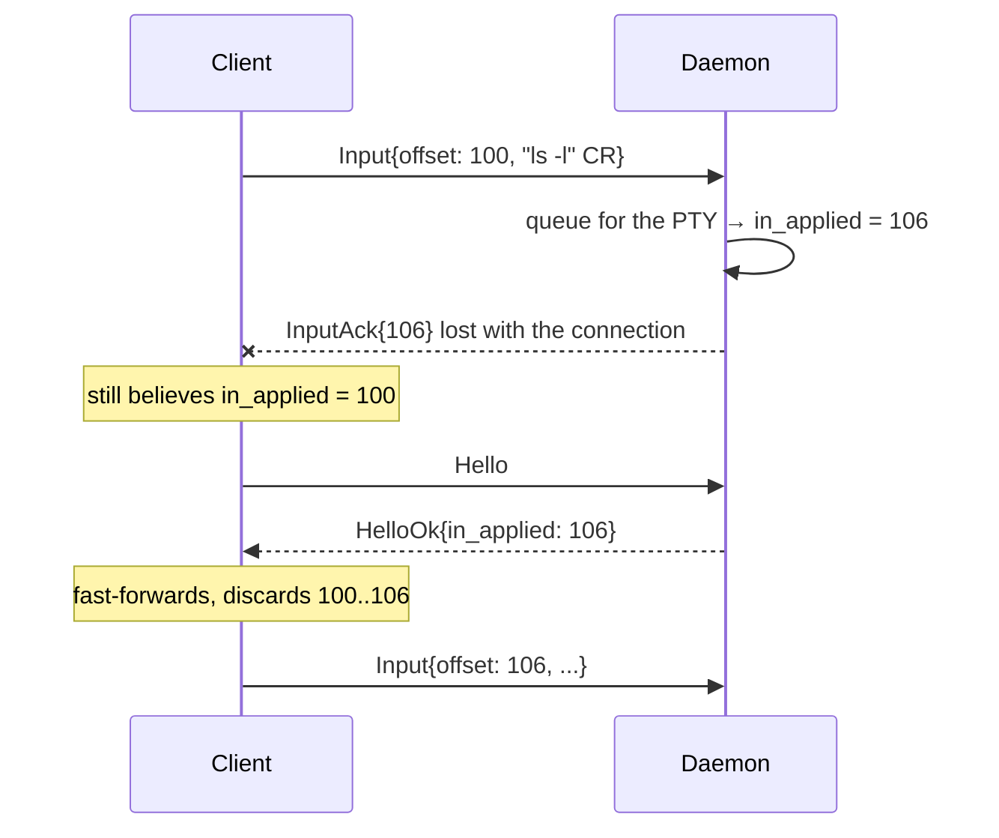
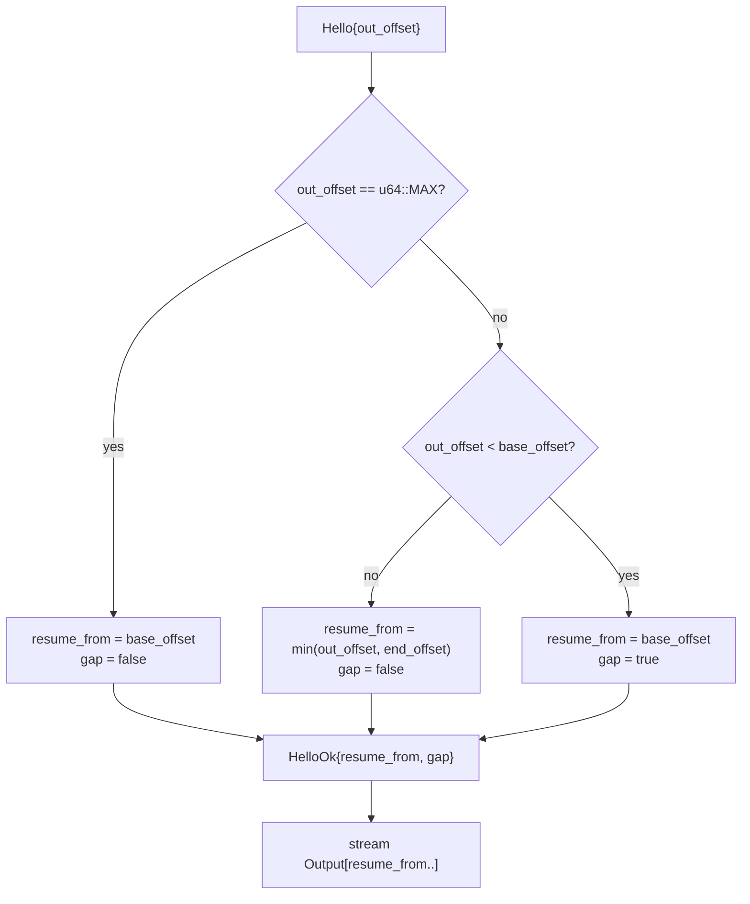
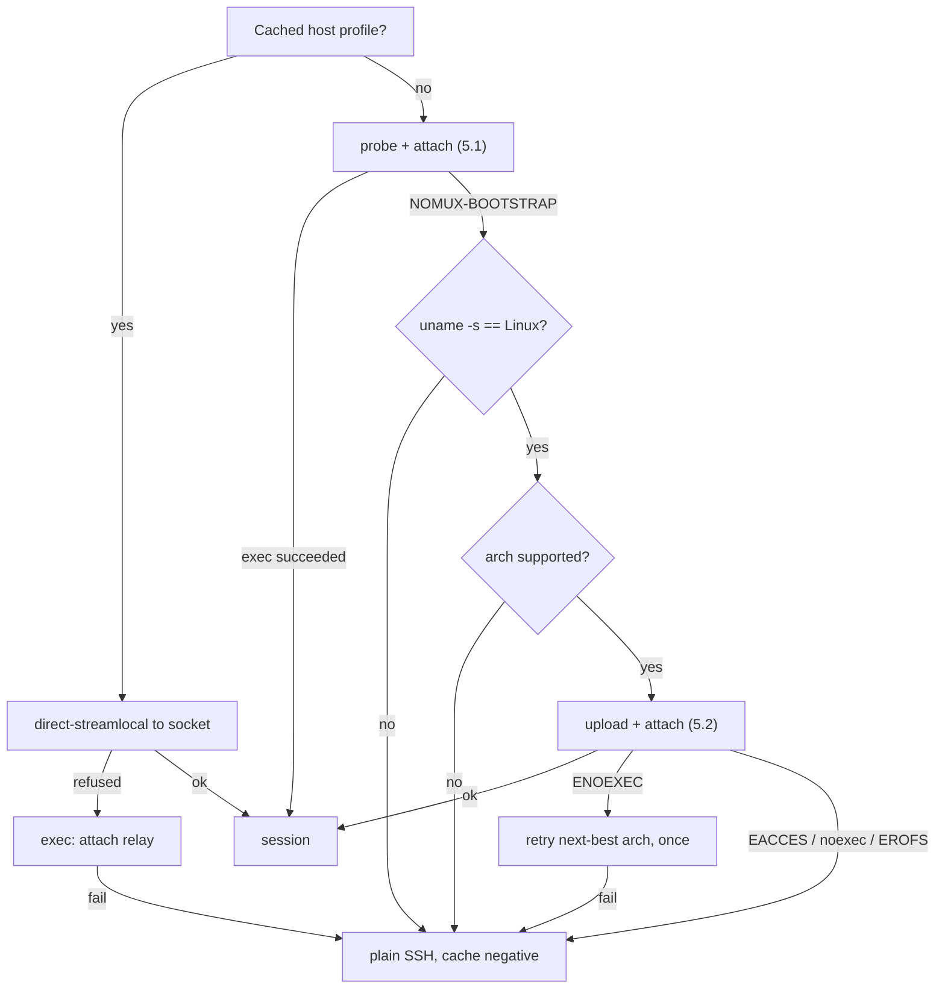
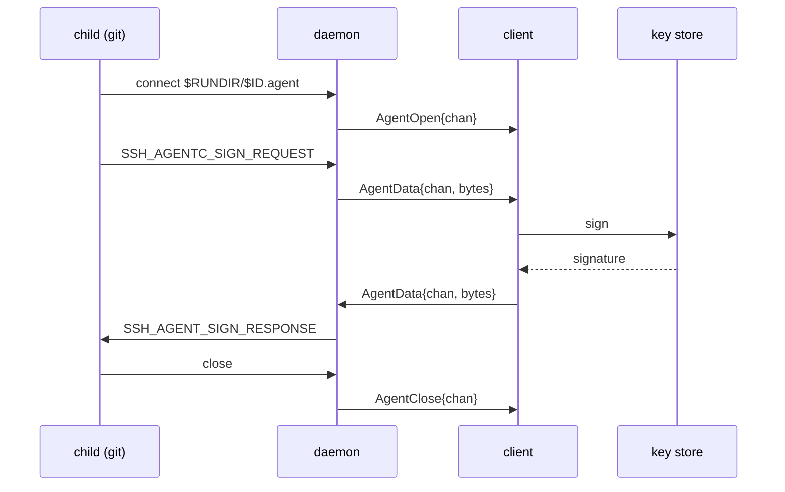

# nomux — Implementation

Low-level detail. Rationale and properties: [DESIGN.md](DESIGN.md).

This is a reference rather than a narrative: §2.2, §6.6 and §10 are looked up, and
the sections cross-refer constantly. Hence the index.

1. [Layout](#1-layout)
2. [Wire protocol](#2-wire-protocol) — [framing](#21-framing), [messages](#22-messages), [flags](#23-flags)
3. [Offsets and exactly-once input](#3-offsets-and-exactly-once-input)
4. [Ring buffer](#4-ring-buffer) — [backpressure](#41-backpressure), [attach below the base](#42-attach-with-from--base_offset), [gap handling](#43-gap-handling)
5. [Bootstrap](#5-bootstrap) — [probe](#51-probe-and-attach-in-one-round-trip), [upload](#52-upload-and-attach-in-one-round-trip), [decision tree](#53-decision-tree)
6. [Daemon](#6-daemon) — [PTY and child](#61-pty-and-child) ([what it runs](#611-what-the-child-runs)), [detachment](#62-detachment-from-the-login-session), [socket](#63-socket), [multiple clients](#64-multiple-clients) ([event ordering](#641-event-ordering)), [shutdown](#65-shutdown), [control surface](#66-frozen-control-surface), [agent forwarding](#67-agent-forwarding)
7. [Attach relay](#7-attach-relay)
8. [Build](#8-build)
9. [Testing](#9-testing)
10. [Exit codes](#10-exit-codes)

## 1. Layout

```
crates/nomux-proto/   wire protocol: framing, codec, offsets. No I/O, no unsafe.
crates/nomux/         the binary: daemon, attach relay, probe.
```

`nomux-proto` is split out because the client project reimplements or links the same
codec; keeping it I/O-free makes it portable and property-testable in isolation.

- Edition 2024, MSRV 1.97.1 (`rust-toolchain.toml`).
- Workspace lints: `clippy::pedantic` + `nursery` + `cargo`, plus `unwrap_used`,
  `expect_used`, `panic`, `indexing_slicing`, `undocumented_unsafe_blocks`.
  Test relaxations live in `clippy.toml`.

## 2. Wire protocol

Spoken end-to-end between client and daemon (§7 relay is transparent).

Private protocol: client and daemon ship as one unit ([DESIGN.md § 2](DESIGN.md#2-scope)).
There is no negotiation and no reserved space for extensions. `Hello.protocol` exists
solely to reject a mismatched peer immediately, which happens only in the bounded
skew case of [DESIGN.md § 6.4](DESIGN.md#64-version-skew).

### 2.1 Framing

```
 0        1                     4                        4+len
 +--------+---------------------+------------------------+
 | type   | len      (u24 BE)   | payload                |
 | u8     | 3 bytes             | len bytes              |
 +--------+---------------------+------------------------+
```

`len` caps at `MAX_PAYLOAD` (256 KiB); larger is a protocol error. All integers big
endian. Header is fixed 4 bytes so the reader is a two-stage `read_exact`.

*winsize* is four `u16`s — cols, rows, xpixel, ypixel — the same layout everywhere
it appears.

### 2.2 Messages

| Type | Dir | Name | Payload |
| --- | --- | --- | --- |
| `0x01` | C→D | `Hello` | `u16` protocol, `u16` flags, `u64` out_offset, winsize, `u16` term_len, UTF-8 term bytes |
| `0x02` | D→C | `HelloOk` | `u16` protocol, `u64` resume_from, `u64` in_applied, winsize, `u8` flags |
| `0x03` | C→D | `Input` | `u64` offset, bytes |
| `0x04` | D→C | `InputAck` | `u64` applied_through |
| `0x05` | D→C | `Output` | `u64` offset, bytes |
| `0x06` | C→D | `OutputAck` | `u64` consumed_through |
| `0x07` | C→D | `Resize` | `u16` cols, `u16` rows, `u16` xpixel, `u16` ypixel |
| `0x08` | D→C | `Gap` | `u64` new_base_offset |
| `0x09` | D→C | `Exit` | `i32` status, `u8` kind (0 = exited, 1 = signalled) |
| `0x0a` | C→D | `Detach` | — |
| `0x0b` | C→D | `Ping` | `u64` nonce |
| `0x0c` | D→C | `Pong` | `u64` nonce |
| `0x0d` | D→C | `Error` | `u16` code (1 protocol, 2 takeover, 3 version, 4 input_gap, 5 internal), UTF-8 message |
| `0x0e` | D→C | `AgentOpen` | `u32` chan |
| `0x0f` | ↔ | `AgentData` | `u32` chan, opaque `ssh-agent` bytes |
| `0x10` | ↔ | `AgentClose` | `u32` chan |

Both handshake frames carry the current revision, **3** — `PROTOCOL_VERSION` in
`nomux-proto`. It is bumped on any wire change, compatible ones included: a change
that leaves the number alone is one `Hello.protocol` cannot catch, and a client
built from an older copy of this table then misparses rather than being refused.

The session id is **not** in `Hello` — it is already fixed by the socket path
(warm) or the `attach <id>` argument (cold).

`Hello.out_offset` of `u64::MAX` means *"I have no state, send me whatever you have"*
— used on a fresh app launch to recover scrollback.

Nothing in `Hello` says where the client's *input* stream stands. `HelloOk`'s
`in_applied` is authoritative and the client fast-forwards to it (§3), so a claim
from the client would be one the daemon has no use for.

`Hello.term_len` counts **bytes**, not characters: `term` is UTF-8, so a name whose
characters are multi-byte costs more than it reads, and the `u16` ceiling of 65535
is a byte count too. A `TERM` past it is refused rather than truncated — a session
opened under a silently shortened terminal type is one nobody chose, and neither end
can see it happen.

`Hello.term` may not contain a NUL, refused encoding as well as decoding. U+0000 is
valid UTF-8, so nothing else catches it; let through, it reaches the child's
environment (§6.1.1), where `execve` refuses it and a malformed frame surfaces as
`Error{Internal}` — the host blamed for what the client sent.

### 2.3 Flags

Both flag fields are exhaustive: an undefined bit is a protocol error, not a
forward-compatibility case ([DESIGN.md § 2](DESIGN.md#2-scope)). The same rule
covers every other closed set on the wire — `Error.code`, `Exit.kind` and the
linger field below — so an unrecognised value is refused rather than passed
through. A peer that emits one was built from a different tree than this.

`Hello.flags`:

| Bit | Name | Honoured |
| --- | --- | --- |
| 0 | agent forwarding (§6.7) | Only on the `Hello` that **creates** the session — `SSH_AUTH_SOCK` goes into the child's environment, which cannot be changed afterwards |
| 1 | repaint with `ctrl_l` rather than `winch` (§4.3) | Every attach; it costs nothing to restate, and only the client knows what is on the screen |

`HelloOk.flags`:

| Bit | Name |
| --- | --- |
| 0 | `gap` — output was dropped before `resume_from` |
| 1–2 | linger state: 0 unknown, 1 disabled, 2 enabled (§6.2) |
| 3 | an agent socket is being served, so `AgentOpen` may arrive |

## 3. Offsets and exactly-once input

Both directions are byte streams with absolute `u64` offsets, not per-frame
counters. Offsets are the offset of the frame's **first** byte.

Output is at-least-once and idempotent: the client discards anything below its
`next_expected` offset.

Input must be **exactly-once** — replaying a partially applied keystroke buffer into
a shell is how a truncated `rm -rf` gets executed. The daemon's `in_applied` is
authoritative, and it advances the moment the daemon takes ownership of the bytes:



Had the client blindly resent its unacked buffer, `ls -l\r` would run twice. The
absolute offset lets the daemon drop the overlap precisely — a partial overlap is
trimmed, not rejected.

Rules:
- Daemon drops any `Input` fully below `in_applied`; trims a straddling one.
- `Input` above `in_applied` is a gap in the input stream → `Error` + close. The client must not skip.
- `OutputAck` is advisory. It never trims the ring (§4); it exists so a reconnecting client that lost its own state can be told where it was.

Ownership, not durability: the master is non-blocking (§6.1), so a child that has
stopped reading leaves input queued for as long as it likes, and waiting for the
write would stall the ack behind it. The queue is in the daemon's own memory and is
never re-applied, so the client's invariant holds; and losing it means losing the
daemon, which ends the session anyway. Bounded, though — §4.1 says by what, and what
the daemon does instead once it is full.

The other half of the invariant is the client's. An `Input` frame that was written
but not yet read is **not** safe — though not for the reason it looks like. A client
that closes with data still unread by the peer does make the kernel send RST, but on
AF_UNIX that discards nothing already delivered: the daemon still reads every byte
and *then* sees `ECONNRESET`. What loses the frames is the daemon's own answer to
that error, which is to drop the client without decoding what the failing `fill`
had just buffered — the right answer for a connection that is going away regardless,
and the reason the loss is real. So a reconnecting client resends from the daemon's
`in_applied`, never from what it believes it sent.
`crates/nomux/tests/chaos.rs` exercises exactly this.

## 4. Ring buffer

Fixed capacity, allocated once. `VecDeque<u8>`, drained via `as_slices` to write
without copying.

Capacity defaults to 4 MiB and is overridable per daemon with `NOMUX_RING_BYTES`.
The right value is host-dependent — a machine running the DESIGN.md §5.1 cap of eight sessions
pays it eight times over — and an unparseable or zero value falls back to the
default rather than refusing to start, since a mistyped tuning variable should never
cost someone their session. One that parses and is positive but larger than the daemon
can serve is clamped to 1 GiB instead, since nothing on that path rejects it and
`VecDeque::with_capacity` answers a request it cannot serve by aborting the process.

```
        base_offset                              end_offset
             |                                        |
             v                                        v
   ..........[========== retained bytes ==============]
   dropped                  capacity
```

- The daemon always drains the PTY, attached or not. If the ring is full it advances `base_offset`, discarding the oldest bytes. A write larger than the whole ring discards everything retained as well as its own head, so `base_offset` accounts for both.
- A client is served `[max(from, base_offset) .. end_offset]`.
- Overflow is not a stored flag. Whether a *reader* lost anything depends on where that reader had reached, so it is derived per client by comparing its position against `base_offset` — which stays correct across any number of overflows, including ones that happened while it was away.
- Never trimmed on ack. A full rolling window is the scrollback a fresh client gets.

### 4.1 Backpressure

The PTY drain must never block on a slow or absent client. Precedence: keep reading
the PTY, drop from the ring's head. A stalled client causes a gap, never a frozen
shell.

The queue *to* that client is bounded twice over, at two different meanings of "not
keeping up". Past **1 MiB** pending, output stops being queued: the ring goes on
absorbing the PTY regardless, so what a slow client costs is a gap and never a
blocked child. Past **8 MiB** it is no longer slow but gone, and the daemon drops it.
The second bound is needed because the first does not cover everything: holding back
*output* still leaves the frames that answer a client — an `InputAck` per `Input`, a
`Pong` per `Ping` — which are not optional and are queued regardless, so a peer that
writes without ever reading grows the queue without bound. The gap between the two
figures is deliberate: it is well clear of the first plus one output chunk, so only
unanswered control frames can reach it. Dropping such a client costs a working one
nothing, since reattaching replays from the ring.

The input direction cannot be answered that way. `in_applied` is authoritative and
exactly-once (§3), so a byte the daemon has acknowledged has to reach the PTY:
dropping it is not available, and refusing it with `Error{INPUT_GAP}` would accuse a
client that had done nothing wrong. So the daemon stops **accepting** input once a
megabyte is queued for a child that is not taking it: it stops decoding `Input` frames,
and it stops asking the socket for more. The bytes wait in the kernel's buffer, where
the peer blocks on them — the same argument §6.7 makes for a saturated agent channel.

Those two are not one bound, and only the first is the bound. Holding the client out of
`POLLIN` throttles the reads the poll set drives and nothing else: the takeover path of
§6.4.1 reaches the same decode loop twice without passing through the poll set at all —
once to drain the outgoing connection, once for the input the arriving one pipelined
behind its `Hello` — and a connection promoted with a megabyte already buffered would
decode every byte of it. Each reconnect could inject another queue's worth, and nothing
bounds reconnects. **The cap is enforced where the queue grows**, between frames in the
decode loop; the poll set only keeps the socket from being drained to no purpose while
it holds.

What that leaves is bounded on both sides. The queue overshoots by at most the one
frame that crossed the cap, so `MAX_PAYLOAD`. The frames the decode loop declined stay
in that connection's receive buffer, which has a megabyte cap of its own, and there are
at most two connections — the client and one pending. No complete frame is stranded
there: a decode that stops mid-buffer is not announced by a second `POLLIN`, the socket
having reported those bytes once already, so "buffered and no longer saturated" is
itself an event the loop acts on — and the `POLLOUT` that drained the queue is what has
just made it true.

The client stays in the poll set with an *empty* mask rather than being left out of it.
`POLLHUP` and `POLLERR` are reported whatever the mask says, and that is the point:
they are the only way to learn that a held-back peer has died. A read is not an answer
to them — a receive buffer at its cap makes filling a no-op, so it never reaches the
zero-length read that would notice. So the loop lets the client go on the spot, which
cannot spin: that descriptor is out of the set on the very next pass. It is also what
stamps the idle-reaping deadline and fails the agent's waiting callers (§6.7) when the
peer dies, rather than whenever the child next happens to read. Nothing can wedge
either, because a non-empty queue is exactly what puts the master in the set asking for
`POLLOUT`, and draining it re-arms the client on the pass after.

What that receive-buffer cap is *for* is bounding one connection's buffered input by
the daemon's own number rather than by whatever the peer set `SO_SNDBUF` to. It
converts a peer-chosen bound into a fixed one, not an unbounded one into a bound, and
on a stock host it never binds at all — [PLAN.md § P4](PLAN.md#p4--test-depth) has the
measurements and why no test pins it.

The cost is that a client's own control frames — `Ping`, `Resize`, `Detach` — queue
behind its own stalled input. That is accepted; it is being held back on input, and
nothing that has to work regardless goes through this path. The same applies to the
final drain a takeover performs: with the queue full, the outgoing connection's last
frames go with it. They were never acknowledged, so §3 already has the client resending
them from `in_applied` — the invariant is exactly-once, not never-retransmitted. A
*new* connection is never held back, since it is polled as pending rather than as the
client, so `list` and the spawn race of §6.3 are unaffected — and `nomux kill` is a
signal (§6.5).

### 4.2 Attach with `from < base_offset`



At attach time the gap is reported by `HelloOk`'s flag alone; the standalone `Gap`
frame is for overflow that happens *mid-stream*, while a client is attached.

`resume_from` is clamped at *both* ends, which is why the no-gap branch carries a
`min`. An `out_offset` above `end_offset` is a client claiming output the session
never produced; taken at face value it would set the daemon's `sent_through` past
the end of the stream, and the session would then look dead until the child happened
to write enough to catch up. It is not reported as a gap, because nothing was
dropped — there was never anything there.

### 4.3 Gap handling

On `gap = true` the byte stream is discontinuous and the client's emulator may be
mid-escape-sequence. Recovery, mirroring `dtach -r`:

1. Client resets its emulator locally — `ESC c` is correct but heavy-handed (drops scroll region and charset); `ESC [ ! p` + `ESC [ 2J` + `ESC [ H` is the softer default.
2. Daemon triggers a repaint from the child via a `TIOCSWINSZ` dance: set `cols-1`, then the real `cols`. The resulting two `SIGWINCH`es make most full-screen programs redraw. A terminal one column wide gets the second alone — there is no narrower size to go to, and a zero-column terminal is not a thing to hand a child — which leaves the repaint weaker there than everywhere else, and is accepted: nobody drives a one-column terminal, and the client picks `ctrl_l` where this shape does not suit it.
3. Repaint policy is the client's, restated in each `Hello` (§2.3): `winch` (default) or `ctrl_l` (write `0x0c` to the PTY — better for a bare shell prompt, destructive inside an editor). Only the client knows whether the user is looking at an editor or a prompt, and it costs nothing to say so on every attach.

`ctrl_l` goes through the same queue as client input rather than straight to the
master, so it cannot overtake keystrokes already accepted or block on a full PTY
buffer. It is not client input, so `in_applied` does not move for it.

Neither restores a plain shell's lost scrollback. That is inherent to byte-stream
replay and accepted; see [DESIGN.md § 10](DESIGN.md#10-open-questions) for the
`libvterm` snapshot alternative.

## 5. Bootstrap

### 5.1 Probe and attach in one round trip

```sh
p=${XDG_DATA_HOME:-$HOME/.local/share}/nomux
exec "$p/nomux-$VER" attach "$ID" 2>/dev/null
echo "NOMUX-BOOTSTRAP $(uname -s) $(uname -m) $p"
```

`exec` replaces the shell on success, so the `echo` is unreachable unless the binary
is missing or unrunnable. Warm cost: zero extra round trips.

There is a **second** probe with the same prefix and a different vocabulary, and the
client must not confuse them. The line above is emitted by `sh` before any binary
exists, so its fields are `uname`'s: `Linux`, `x86_64`, `armv7l`. The `nomux probe`
subcommand is emitted by an already-installed binary, and reports Rust's
compile-time constants instead — lowercase `linux`, and `arm` where `uname -m` says
`armv7l`:

```
NOMUX-BOOTSTRAP linux aarch64 /home/u/.local/share/nomux
```

That difference is deliberate. The shell probe answers "what should I upload?", so
it has to describe the *host*; `nomux probe` answers "what is actually installed
here?", so it describes the *artifact*, which is the only question worth asking
after an upload. A client that parses both needs the mapping in both directions.

### 5.2 Upload and attach in one round trip

```sh
p=${XDG_DATA_HOME:-$HOME/.local/share}/nomux
mkdir -p "$p" && cat > "$p/.up.$$" && chmod 755 "$p/.up.$$" \
  && mv -f "$p/.up.$$" "$p/nomux-$VER" && exec "$p/nomux-$VER" attach "$ID"
```

- Temp-then-`mv` is atomic within one filesystem and avoids `ETXTBSY` — you cannot write over a running binary.
- Version in the filename: an upgraded client cannot break sessions an older daemon still holds.
- Transfer over an **exec channel with `cat`**, not SFTP. `Subsystem sftp` gets disabled on hardened hosts, and modern `scp` is SFTP underneath. SSH channels are 8-bit clean, so no base64 tax.
- Enable `zlib@openssh.com` on this channel: ~3× on a static binary, requiring nothing on the remote.
- **The install directory is created, not checked**, which is a materially weaker guarantee than §6.3 gives the *run* directory; what that costs, and to whom, is [DESIGN.md § 8](DESIGN.md#8-security-model)'s to state.

### 5.3 Decision tree



`uname -m` lies on a 32-bit userland over a 64-bit kernel, hence the one ENOEXEC
retry. All negative results are cached per-host so a hardened box is not re-probed
on every reconnect.

## 6. Daemon

### 6.1 PTY and child

Via `rustix` rather than raw `libc`, so almost none of this needs `unsafe`.

1. `openpt(O_RDWR | O_NOCTTY | O_CLOEXEC)`, `grantpt`, `unlockpt`, `ptsname`.
2. Master is set non-blocking.
3. Parent opens the slave `O_RDWR | O_NOCTTY | O_CLOEXEC` and hands it to the child as all three stdio descriptors.
4. Parent sets the initial `TIOCSWINSZ` from `Hello`, before the child can observe it, so the shell's first prompt is already laid out correctly.
5. `fork`. In the child, before `exec`: `setsid()`, acquire the slave as controlling terminal via `ioctl_tiocsctty`, restore `SIGHUP` to `SIG_DFL` (§6.2 leaves it ignored in the daemon, and an ignored disposition survives `exec`). Only async-signal-safe calls, which is why the open is not among them.
6. Parent closes **its own** slave descriptors — the copy in this frame and the three the `Command` borrowed. The master reports `EIO`, which is how the session learns the child is gone, only once no descriptor onto the slave is left in this process, so a copy outliving the spawn is a child that exits without the daemon ever noticing.

`O_CLOEXEC` on both ends is what keeps them out of the child. Without it every
process the user runs holds a writable descriptor onto its own PTY master, and
anything that walks `/proc/self/fd` — or writes to a descriptor it did not open —
can inject output into the stream or read the user's keystrokes. The child keeps
its stdio regardless, because `dup2` onto 0/1/2 clears the flag on the copies.

The event loop is `poll` over {master, listener, attached client, pending
connection, the stop-signal self-pipe (§6.5), agent socket, one fd per agent
channel}. The *pending* entry is a connection accepted but not yet greeted, and it is
load-bearing rather than incidental: it is what makes "connecting is not attaching"
(§6.4) work, since a liveness probe from `list` must not evict anyone.

The master **must** be non-blocking. A child that stops reading fills the PTY's
input buffer, and in raw mode the line discipline throttles rather than discarding
— so a blocking `write` parks the whole event loop inside the kernel until the
child reads again, freezing output for a session whose only fault was a `sleep`.
Unwritten input waits in the daemon's queue instead, and the poll set asks for
`POLLOUT` only while there is something to write — and stops asking the client for
`POLLIN` once that queue is full (§4.1).

The poll set is variable-length and each entry is tagged with what it belongs to,
rather than being read back by position. Agent forwarding makes the size depend on
how many channels are live, and an index-arithmetic slip there would silently
apply one descriptor's readiness to another.

**The SSH channel must not request a PTY.** nomux allocates its own; if sshd
allocated one too there would be two line disciplines stacked, giving double echo,
doubled `\r\n` translation and broken raw mode. The channel is a raw byte pipe and
nomux owns the only PTY — which is also why `TERM` arrives in `Hello` (§2.2) rather
than from sshd.

#### 6.1.1 What the child runs

Whatever a plain `ssh host` would have run, because nomux is *already inside* an SSH
session and inherits its setup rather than reconstructing it. PAM has run, and
`HOME`, `USER`, `PATH` and `SSH_*` are already in the environment.

- **Login shell, dash-prefixed**: `execv(shell, ["-bash", ...])`, not `["bash", ...]`. That leading `-` is what sshd does for an interactive session and what causes `/etc/profile` and `~/.bash_profile` to be sourced. Omitting it yields a stunted environment that users correctly perceive as broken.
- **Shell selection**: `$SHELL` as inherited, else the password database, else `/bin/sh`. The middle step is `/etc/passwd` parsed directly rather than `getpwuid`: in a static musl binary those are the same thing, since NSS modules cannot be loaded into a static executable, and doing it in Rust keeps the lookup safe and testable. The cost is not seeing LDAP or NIS users, who fall through to `/bin/sh` — as they would with `getpwuid` anyway.
- **Working directory**: `$HOME`, else the directory the attaching connection was in, else `/`. The daemon itself has already moved to `/` (§6.2), so this has to be set explicitly or the shell would start there.
- **Environment**: inherited wholesale. Remove `NOMUX_BOOTSTRAP`, set `TERM` from `Hello`, `NOMUX_SESSION=<id>`, and — when agent forwarding is enabled — `SSH_AUTH_SOCK=$RUNDIR/<id>.agent` (§6.7). Change nothing else, which leaves `NOMUX_RING_BYTES` (§4) in the child's environment on a daemon that was started with it set.
- **No PAM.** It already ran for the SSH login, and the daemon is unprivileged.
- No client-supplied command in v1. A one-shot remote command has no reason to be persistent; it stays on plain SSH.

The environment is a snapshot of the connection that *created* the session, frozen
for its lifetime — a later reconnect may carry a different agent socket, `DISPLAY`
or `AcceptEnv` values that the child can never see, because a running process's
environment cannot be mutated. Indirection through the run directory (§6.6) is the
only available fix, and only for variables that name a path.

### 6.2 Detachment from the login session

The `daemon` mode holds this itself rather than trusting whoever started it:

```
ignore SIGHUP
leads a session and holds no controlling terminal?  already detached; nothing to do
  else setsid            refused only if we lead a process group
    else fork → parent _exit, child setsid
chdir "/"
0/1/2 → /dev/null
```

The test is **no controlling terminal**, not "leads a session" — a session leader may
still hold one — and it is put to `/dev/tty`, which *is* that terminal by definition,
rather than to any descriptor the daemon happens to hold. `setsid` is then asked
before it is needed, so that "already done" is told apart from "cannot be done" and
the ordinary path stays fork-free; only a process-group leader is genuinely refused,
and the way out of that is a child that is not one. Two shapes reach that refusal:
`nomux daemon <id>` typed at a shell, where job control makes the daemon its own
process group's leader, and `ssh -t host 'nomux daemon <id>'`, where it leads the
session itself, because `bash -c` with a single command `exec`s in place rather than
forking. With dash as `/bin/sh` the shell forks and that second shape does not arise,
so it is shell-dependent, and bash is the common case.
`startup::leave_login_session` and `startup::has_controlling_terminal` carry the
argument for each — why `ENXIO` is the only definite no, and why `TIOCNOTTY` is
deliberately not used.

The fork happens after the socket is bound, so a session that already exists is still
reported with an exit status somebody sees, and before the pidfile is written, so
`nomux kill` (§6.6) reads the pid of the process that survived rather than of the one
that started.

What the fork costs is the socket's account of who owns it. `SO_PEERCRED` on a
listening socket is stamped at `listen(2)`, from the process performing it, so from
the fork until the survivor listens for itself the credentials §6.6 reads off a
connection are the parent's — and that is a number the kernel is free to reissue the
moment the parent `_exit`s. So the survivor calls `listen` again on the descriptor it
inherited — which works, and that is the non-obvious part: `unix_listen` accepts a
socket already in `TCP_LISTEN` rather than refusing it, and re-runs `init_peercred` on
it. Both halves of that were measured on this kernel, that the stamp moves to the
caller and that a connection queued in between survives the call. Restating the
backlog is part of the same call and is §6.3's. A failure is discarded rather than
propagated: it leaves the socket named after the half that left, which costs §6.6 one
of its two witnesses and leaves it the pidfile — not a reason to refuse a session that
is otherwise ready to serve.

`SIGHUP` is ignored before any of that, and there it is load-bearing rather than
tidy: the manoeuvre itself provokes one at the forked child, which is still in the
hung-up terminal's foreground group for the few instructions before its own
`setsid`. Inherited as ignored, that race cannot be lost.

`attach` arranges both for the daemon it spawns — `setsid` in its own `pre_exec`,
`/dev/null` through `Stdio::null()` on the `Command` — and keeps doing so, because
the daemon cannot reach either soon enough. Until it runs its own `setsid` a hangup
would take the session with it, and until it redirects its own stdio it holds the
*relay's* descriptors, where anything it writes lands in the middle of the client's
frame stream.

The classic second fork is deliberately absent, and the conditional one above is not
it. The conditional fork exists to reach a state `setsid` cannot reach from a
process-group leader; the classic one exists to leave the daemon a *non*-session-leader
so it cannot acquire a controlling terminal by opening a tty. That second purpose is
not needed here: a controlling terminal is acquired only by opening one *without*
`O_NOCTTY`, and this binary opens exactly three ttys — the PTY master, its slave
(§6.1), and `/dev/tty` for the probe above — all three with it. The property is held by
construction at the three lines that could break it, rather than by a fork whose reason
would have to be rediscovered.

`chdir "/"` happens after the run-directory paths are resolved and the socket is
bound, and the child is given its own working directory (§6.1.1) — otherwise the
shell would start in `/` instead of the user's home. What it buys is that a session
running for a week cannot keep a removable or network mount busy.

`SIGHUP` is ignored in the daemon — first thing, for the reason above — and restored
to `SIG_DFL` in the child before `exec` (§6.1). `SIGTERM` and `SIGINT` are handled
instead of ignored (§6.5), armed immediately after the detachment above and before
the pidfile is written, so that the pid `nomux kill` reads never names a process
still on the default disposition. Neither needs anything in the child, and neither
does `SIGPIPE`, which the Rust runtime ignores at startup and resets for spawned
children.

`systemd-logind` with `KillUserProcesses=yes` kills the daemon at logout regardless.
The only real fix is `loginctl enable-linger $USER`. The daemon detects the state
and reports it through `HelloOk` flags (§2.3); it does not attempt to work around
it.

Detection reads the files `logind` itself reads — `/run/systemd/system` for "is
this a `logind` host at all", then `/var/lib/systemd/linger/<user>` — rather than
running `loginctl show-user -p Linger`. Two `stat` calls and a read of `/etc/passwd`
for the login name, all on the session-start path, versus a D-Bus round trip that can
block for its full 25-second timeout on a busy
or broken bus and turn "linger is off" into "the session would not start". Absence
of the marker is a definite *disabled*; only a lookup that fails for some other
reason is *unknown*, and the client must not warn on unknown.

Most distributions ship `KillUserProcesses=no`, where nothing reaps the session at
logout and `setsid` alone suffices.

### 6.3 Socket

Session ids come from the client and are used directly as filename components, so
they are validated before touching the filesystem — `nomux_proto::is_valid_session_id`:

```
1..=64 bytes, each of [A-Za-z0-9_-]
```

This rejects `..`, `/`, `.`, empty, NUL and non-ASCII outright, so path traversal is
impossible by construction rather than by escaping. Both ends validate: the client
before minting, the daemon before use. An invalid id is a hard error, never sanitised
into something valid — silently rewriting an id would attach the user to the wrong
session.

Path precedence:

1. `$XDG_RUNTIME_DIR/nomux/<id>.sock` — tmpfs, but removed on last logout unless linger is on.
2. `$XDG_STATE_HOME/nomux/run/<id>.sock`, default `~/.local/state/nomux/run/`.

A source that does not name an **absolute** path is not a source: it is skipped, and
where none of `XDG_RUNTIME_DIR`, `XDG_STATE_HOME` and `HOME` names one there is no run
directory to resolve and every mode fails with that (§10). The XDG specification
requires it anyway, and this daemon needs it for a reason of its own — the resolved
directory is held for the session's whole life while §6.2 moves the process to `/`
partway through it, so a relative one would mean the caller's working directory while
the session was starting and the root afterwards: the socket bound in one place, the
agent socket and the exit-time cleanup looking in another. An empty value is not
absolute either, which is the whole of the check.

The rule above is the whole of what a client can check, and it is not the whole of
what the daemon enforces. `SessionPaths::new` applies a second refusal that depends on
which of those two the run directory came from: a `sun_path` is 108 bytes including
its terminator, so the directory, a `/`, the id and `.label` — six bytes, the longest
of the five suffixes, with `.agent` the same length — have to fit in 107. Under
`$XDG_RUNTIME_DIR` at `/run/user/1000` that leaves room for an id of 80 and the
64-byte ceiling above is what binds. Under the fallback it does not:
`$HOME/.local/state/nomux/run` is 23 bytes past `$HOME`, so the longest id that fits
is `77 - len($HOME)` — 63 bytes for a home of 14, one short of an id the same client
mints happily on the same host with `XDG_RUNTIME_DIR` set. A refused id is therefore
not necessarily a bad id, which is what §10 has to turn into an exit code and what a
client must not cache as a property of the id.

It is refused there, where both halves are known, rather than at the `bind` that would
meet it: an address that can never be formed is not a session that failed to start but
one that can never exist, and `list` and `kill` read an unbindable address as a *live*
session whose files they must not unlink — so every attempt would leave a `<id>.lock`
behind, from the command whose job is to collect it. What the early refusal costs
instead is that files already sitting at such an id are beyond both modes: `list`
drops the id rather than reporting it and `kill` answers 64, so they stay there for
good ([PLAN.md § P1](PLAN.md#p1--known-gaps)). Nothing here creates that state; the
layout §6.6 freezes is managed by binaries that did not create it. The bound is taken
against `.label` so that `<id>.sock` is a byte shorter still, which is what lets the
probe in §6.6 read every `connect` failure it is not told about as a live session
rather than as an address it could not build.

Directory `0700`, socket `0600`, and the three plain files — pidfile, lock, label —
`0600` as well. Every one of those is exact rather than an upper bound: the umask is
suppressed around each creating call, since `mkdir`, `bind` and `open` all subtract
it, and a `<id>.lock` created `0400` under `umask 0200` is one no later process can
open at all, which loses the mutex the control surface rests on. Filesystem sockets
only, never abstract ones ([DESIGN.md § 8](DESIGN.md#8-security-model)).

The backlog is the host's ceiling rather than a number this program picks. `-1` is
what `UnixListener::bind` passes on Linux, and it is not a length: `listen(2)` takes
its argument as a signed `int` and casts it to unsigned before clamping to
`net.core.somaxconn`, so it asks for more than any host can give and gets exactly the
ceiling — 4096 where this was measured. The re-listen of §6.2 has to restate it,
because `listen` installs a backlog rather than keeping the one in force, and it must
not restate it as a literal. An `AF_UNIX` `connect` to a *full*
backlog blocks rather than being refused, and every mode here connects: a queue the
daemon has stopped draining then parks `list`, `kill` and every attach on that id
inside the kernel, with no timeout on any of them
([PLAN.md § P1](PLAN.md#p1--known-gaps)). Writing 128 for "what std uses" shrank the
queue 32-fold for one commit, and it was a *successful* re-listen that did it.

The directory is *checked* rather than merely created, because on every run but the
first it already exists, and that it exists says nothing about what it is. It is
opened `O_DIRECTORY | O_NOFOLLOW` and `fstat`ed: a symlink or a non-directory is
refused, so is one belonging to another uid, and so is one that group or other can
write to — whoever had that could have left a socket of their own at a session id
about to be connected to, and no later `chmod` un-plants it. Refusal here is hard,
where everything else in the daemon degrades: a run directory that is not what it
claims to be is not somewhere to start a session.

Every other mode is *repaired* to exactly `0700`, through the descriptor already
checked rather than through the path. That covers a group- or other-readable mode,
which discloses the ids and the labels and grants nothing else; an owner bit that is
missing rather than spare, which an odd umask under an older version leaves behind;
and `setgid` or `sticky`, harmless in themselves but not the stated mode. The one
mode that cannot be repaired is one the owner cannot *open* — there is no descriptor
to `fchmod` through, and a `chmod` by name would resolve the path the `O_NOFOLLOW`
exists to stop resolving twice — so that is refused, and reported as a judgement on
the mode rather than as an `EACCES` from a syscall.

The check belongs to every mode that touches the directory, before the first name in
it is resolved: `attach` before its *first* `connect`, not only on the way to
spawning a daemon; `list` before it reads the directory; `kill` before it reads a pid
and signals it; the daemon before it binds. Checking after connecting checks only the
case where nothing was planted — with a socket already at the path, the relay hands
the user's keystrokes to whoever bound it. `list` and `kill` check without creating:
being asked what sessions exist must not be what brings the run directory into
existence, so a host that has never run one lists nothing and exits 0.

The run files are then opened by name rather than relative to that descriptor.
There is no `bindat(2)`, so the socket and the agent socket — the two that decide
who a session talks to — have to be resolved by path whichever way the other three
go, and a layout in which three of the five are addressed race-free reads as though
the race were closed. What closes it is the check itself: in a directory this user
owns and nobody else can write to, only this user's own processes can put a name in
it. What stays open is a *parent* somebody else can write to — an `XDG_RUNTIME_DIR`
pointed at a shared directory — where the whole run directory can be swapped
between the check and the next `bind`. No descriptor helps there, because the
`bind` needs the path either way.

Spawn race (two clients attaching at once): `flock(LOCK_EX)` on `<id>.lock`; the
loser blocks there, then finds the socket the winner bound and connects to it. Only
a process that spawns its own daemon polls, and only for its own. A stale socket is one where `connect`
returns `ECONNREFUSED` — unlink and respawn. `EACCES` is not staleness.

The daemon takes that same lock on its own account, and never blocks for it. It takes
it *before* it probes for a stale socket, because everything from that probe to its
pidfile decides on the evidence `list` and `kill` decide on — a refused `connect`
means a dead daemon whose socket and pidfile are removed, which is exactly what a
collection does one `connect` earlier — so without it a sweep that probed a stale
socket and was then descheduled unlinks what this daemon has bound in the meantime.
`attach` never reached that state, because it holds this lock across the whole
spawn; a `nomux daemon <id>` started by hand, which §6.2 is
written for, held nothing. It is a `try_lock` rather than a wait because on the
ordinary path the holder *is* the attach that spawned this process, and waiting would
park the session's own creation until that attach gave up — so what closes is every
interleaving where the lock was free to be taken, and a lock already held is no worse
than the nothing that was held before. It goes the instant the pidfile exists: a
daemon still holding it at `kill`'s 2 s deadline (§6.6) would be one nothing could
stop.

The lock is held past the `connect` that succeeds, until `<id>.pid` exists. The
daemon binds its socket before it writes that file (§6.2), so a `connect` that
succeeds says the id is claimed and not that anything on disk says so yet; releasing
there would make "the lock is free" mean something weaker than "the id is
unclaimed", and `kill` taking it inside that window finds a live daemon and no pid
to signal. The wait is bounded by the same spawn timeout and is never fatal — the
pidfile belongs to `kill`, not to the relay.

`<id>.lock` is also one of the files garbage collection removes (§6.6), and that
makes the lock and the file two different things: `flock` attaches to the inode,
so a lock held on a file that has since been unlinked is a lock nobody else can
see, and whoever asks next creates a fresh file at the same path and locks that
instead. Two processes, a mutex each, two daemons for one session. Both sides
therefore obey one protocol. Collection takes the lock before it removes anything
and skips what it cannot get. Every acquirer, having got the lock, confirms that
what it locked is still the file at that path — `fstat` against `stat`, comparing
device and inode — and goes back for the real one if it is not. And the lock is
removed **last** of the five: from the moment its name is gone the caller's lock
guards nothing, so an unlink still to come lands on a session the next acquirer has
legitimately brought up in the meantime — silently, in the case of `<id>.label` and
of the `<id>.agent` socket the child's `SSH_AUTH_SOCK` points at.

A lock that cannot be had *at all* — `<id>.lock` will not open, the filesystem does
not implement `flock`, the run directory is read-only or over quota — is answered by
proceeding without one, deliberately. The reason to take a mutex is that somebody
else might hold it, and a lock this process cannot obtain by any means is one no
other process here can be holding either: every one of them reaches it through the
same call, on the same file, under the same uid. Refusing would buy nothing and
would cost the escape hatch of §6.6, which must be able to collect a dead session on
any host. What is given up is serialisation against a concurrent attach, which is
what this layout had before the lock existed and which the daemon's own `bind` still
backstops by refusing an id whose socket already answers. Only `EWOULDBLOCK` — a
lock somebody is genuinely holding — makes a caller wait, skip or refuse.

### 6.4 Multiple clients

Exactly one attached client. A second `Hello` on a live session takes over; the
previous connection receives `Error{TAKEOVER}` and closes.

**The `Hello` is what takes over, not the `connect`.** A newly accepted connection
waits as *pending* and owns nothing until it greets. This is not a nicety: `list`
probes every socket with a bare `connect` to decide which daemons are alive (§6.6),
and so does the spawn race in §6.3. If connecting counted as attaching, listing
sessions would evict the user from all of them — permanently, since the client is
told never to auto-reconnect after `TAKEOVER`. A connection that greets with
anything other than `Hello` is refused on its own terms and the session keeps its
client. Only one connection may be pending at a time; a second replaces it.

**A `Hello` this daemon cannot answer is refused before the eviction, not after.**
The `Hello.protocol` check therefore runs on the pending connection rather than
inside the handshake it would otherwise be part of. Deferred to the handshake — which
only runs once the takeover has already happened — a newer client's *failed* greeting
threw the working client off with `Error{TAKEOVER}` and then dropped the newcomer
too, leaving the session running with nobody attached. That is worse than losing a
handshake: the rule above tells a client never to auto-reconnect after a takeover, so
the session the user was in went quiet until they went looking for it by hand. This
is the one place [DESIGN.md § 6.4](DESIGN.md#64-version-skew)'s skew story touches
the daemon, and it is why it is safe.

The eviction's final write is bounded by a deadline. The connection being replaced
is usually one that has *stopped reading* — that is what a takeover recovers from —
and an unbounded blocking write to it would park the entire daemon in the kernel:
no PTY drained, no client served, no reaping, until a peer that may never read
again decides to. Its queued output is dropped first; the arriving client replays
it from the ring anyway.

No read-only mirrors and no session sharing — there is one client per session by
construction, and the takeover case exists only to recover from a half-dead
connection the daemon has not yet noticed.

#### 6.4.1 Event ordering

Within one `poll` iteration the client is serviced **before** the listener. A single
wakeup can report both a readable client and a pending connection; accepting first
would replace `self.client`, dropping the outgoing `Conn` while a frame it had
already delivered was still unread in the socket buffer. Input vanished whenever a
reconnect landed in the same iteration as a keystroke — reliably, under load.
The `Hello` handler additionally drains the outgoing connection once more, just
before the eviction, covering the narrower window between the poll returning and
the greeting being parsed.

A failing client socket is **never** propagated out of the event loop. A client that
closes with output still queued makes the kernel send RST, so the next read yields
`ECONNRESET`; treating that as a daemon error terminated the session over exactly
the kind of unclean disconnect this project exists to survive. Client I/O errors
detach the client and nothing more.

### 6.5 Shutdown

Child exit → `waitpid` → flush the ring to any attached client → `Exit` frame →
unlink run files → exit. Linger briefly (5 s) so a client reconnecting into the
race still collects the final output and status.

The unlink is a collection like any other and takes `<id>.lock` first (§6.3),
leaving the whole set in place if it cannot: an attach may be blocked on that lock
at this moment, waiting to learn what this exit is about to tell it. Leftover files
are something that attach recovers from by itself — a socket whose `connect` is
refused is one it replaces — and the next `list` clears them. A mutex removed from
under it is not.

`waitpid` is not instantaneous here and the order above hides a trap. Linux closes
the child's descriptors in `do_exit` *before* the task becomes reapable, so the PTY
master reports end of file while `waitpid` still answers "not yet" — often, not
rarely. Resolving the status at end of file therefore invents one, and reports
`exit 3` as `exit 0`. The status stays unknown until `waitpid` yields it, retried
each pass for up to 2 s; only a child that closed its terminal without exiting —
a program that daemonises itself — reaches that deadline, and it has no status to
report by then.

The order is load-bearing and the code enforces it in one place: `Exit` is queued
by the output pump, only once everything the child wrote has been queued ahead of
it. A client that closes the tab on `Exit` and is handed it first — which is what
happens if the handshake sends it — loses the whole transcript, including whatever
the child said on its way out.

Idle reaping ([DESIGN.md § 5.2](DESIGN.md#52-reaping)) is self-inflicted, not
external: the daemon stamps `last_detach` on losing a client and arms a `poll`
timeout against it. On expiry it sends `SIGHUP` then, after a grace period,
`SIGKILL`, and exits through the same path. No cron, no supervisor, nothing to
install.

Both signals go out **twice**, because neither reach alone covers the session: the
child's process group first, then a walk of `/proc` over everything still in its
session. The group is the cheap one and gets the ordinary case in a single syscall
— `setsid` in the child's `pre_exec` (§6.1) made it its own group leader — and the
walk is what reaches the backgrounded jobs a shell with job control has put in
groups of their own. The walk is ordered second because it costs a directory scan
and a read per process, and on most shutdowns the common case is already over
before it runs.

Both reaches address the child by *number* — a pgid and a session id are pids — and
both are guarded by the start time in field 22 of `/proc/<pid>/stat`, read when the
child is spawned: a number the kernel has reissued since must not be signalled.
`pty::terminate` and `Pty::pid_reissued` carry the argument for each — why the
group `SIGKILL` is conditional where the walk's is not, why the guard is asked
twice, and why a *missing* `/proc/<pid>` is deliberately not read as a reissue.

A session nobody ever attaches to is reaped after 30 s rather than the idle
timeout: a daemon spawned by a connection that died mid-handshake has no client
coming and would otherwise sit there for a week.

`SIGTERM` and `SIGINT` reach the same exit. A handler writes one byte to a
self-pipe whose read end is in the poll set, and the loop leaves on its next pass —
so `nomux kill` (§6.6) collects the child's process group and session, and unlinks
the run files, rather than dropping the daemon where it stands. Closing the PTY master hides the
difference for the ordinary case, because the kernel then delivers `SIGHUP` to the
foreground process group on the way out; what it does not cover is a backgrounded
process that ignores the hangup.

A self-pipe rather than `signalfd`, which reports only *blocked* signals and so
wants a process-wide `sigprocmask` — and a blocked mask survives `exec`, so §6.1
would have to unblock it again in the child or leave the user's shell permanently
deaf to `SIGTERM`. `poll` returning `EINTR` loses nothing: the handler wrote its
byte before the syscall returned, and the next pass finds the pipe readable.

The budget is `nomux kill`'s two seconds, and everything on the way out is bounded
against them: a final flush to the attached client for at most 500 ms — against the
whole call, not per `write`, or a peer reading a trickle would reset it — and then
`SIGHUP`, 500 ms, `SIGKILL`, each to both reaches above. An overrun would mean the daemon
being `SIGKILL`ed mid-shutdown, which is the bug this closes, wearing a hat.

One flush, not several, and the iteration the signal lands in is arranged so it cannot
become several. `stopping` is set at the top of that iteration and the rest of it still
runs, so whatever the client is owed is queued before the flush that delivers it — but
the listener and the pending connection are skipped from that point on. A takeover
arriving in the same wakeup would otherwise evict the client with a bounded 500 ms
flush of its own, and a protocol error in the same wakeup would spend another, both on
top of the one the shutdown itself performs: three, against a budget for two. What
remains cannot double up, because the paths that flush early also take the client with
them — after a `reject` or a client dropping out, the shutdown finds none. So the worst
case is 500 ms of flush plus the 500 ms of `SIGHUP` grace. The ordinary case — an
attached client and a shell that goes when asked — measures at 10 to 15 ms from the
signal to the run files being unlinked.

`SIGQUIT` is deliberately left at its default. Its action is a core dump, which is
the only way left to get a snapshot out of a daemon that has wedged, and `SIGKILL`
— which nothing can handle — already means "go away now" for anyone who does not
want one.

### 6.6 Frozen control surface

`nomux kill <id>` and `nomux list` must work against a daemon of *any* version,
including one older than the binary invoking them. They are the escape hatch that
makes the N-1 codec policy in [DESIGN.md § 6.4](DESIGN.md#64-version-skew) safe.

The contract is therefore the **on-disk layout**, not a protocol subset:

```
$RUNDIR/<id>.sock    unix socket   0600
$RUNDIR/<id>.pid     daemon pid, ASCII, newline-terminated, 0600
$RUNDIR/<id>.lock    flock target for spawn races, 0600
$RUNDIR/<id>.label   UTF-8 display label, no newline, <= 256 bytes, 0600
$RUNDIR/<id>.agent   ssh-agent socket, 0600 (§6.7)
```

The two plain files either mode reads by hand — `<id>.pid` and `<id>.label` — go
through one bounded helper and are never read whole, opened `O_NONBLOCK | O_NOFOLLOW`
so that a FIFO left at either name cannot park the escape hatch in `open(2)` and a
symlink cannot send it elsewhere. What somebody dropped in the run directory does not
get to decide how much memory `list` faults in either: an allocation that fails under
§8's `-Cpanic=immediate-abort` is an abort with no message, not an error the escape
hatch could report and go on from. The two
ends of that bargain are deliberately asymmetric. A label that reaches its bound is
truncated, and costs a column; a pid body that reaches **32 bytes is refused
outright**, because a prefix ending mid-number is not the number in the file but a
smaller, plausible, live one — `" "*25 + "32770419\n"` reads back as 3277041 — and
what the prefix cannot settle it does not get to answer. The layout puts a pid and a
newline there, eleven bytes at the widest; nothing legitimate reaches the bound.

- Both establish first that the run directory is this user's alone (§6.3), before any name in it is read, connected to or signalled. Neither creates it: on a host that has never run a session, `list` prints nothing and exits 0, and `kill` reports the "no such session" that already holds.
- `list` reads the directory and probes each socket with `connect`; `ECONNREFUSED` — or a socket that is no longer there at all — means stale, and stale entries are unlinked. The probe is safe because connecting is not attaching (§6.4) — it costs a live session nothing.
- Unlinking happens under `<id>.lock`, and the probe is repeated once it is held, since that is the only point at which the answer cannot change between being read and being acted on. An entry whose lock somebody else holds is skipped: it is a session being started rather than garbage, and it stays collectable for as long as it stays dead. An entry whose lock is not *obtainable at all* is collected anyway, per §6.3 — a collector that stops collecting because of the mutex protecting it leaks under exactly the conditions it exists for.
- `kill` takes `<id>.lock` first and holds it to the end, so nothing can spawn into the id it is removing; then probes the socket, identifies the daemon from the two witnesses below, sends `SIGTERM`, waits up to 2 s, then `SIGKILL`, and unlinks all five files once the session has actually stopped answering. It waits up to 2 s for that lock, which is what makes it *win* the race against an attach creating the session rather than merely lose it. That budget has to cover a healthy spawn — a `fork`, an `exec` and a `bind` — and, since the daemon takes this same lock before it probes for a stale socket (§6.3), the blocking `connect` in front of that bind as well: a start wedged there holds the lock across it, and holds off `list`'s collection of the id as much as it holds off this.
- **Which process gets signalled has two witnesses, and neither is senior.** `SO_PEERCRED` on the probe connection names the process that called `listen` (§6.2), which no name in a directory can forge; `<id>.pid` names what the daemon published. Each is the only account of a state the other cannot describe. The socket names nobody where a `connect` failed for a reason that is not death; where the peer sits in a pid namespace this process cannot see, the kernel writing 0 into that field and 0 being read as "will not say" rather than as a pid; and in exactly one phase of the bind-to-publish window — between §6.2's fork and the survivor's own `listen`, where the credentials still name a parent that has `_exit`ed. Before that fork and after that `listen` it names the daemon perfectly well, which is why the window costs a witness rather than the answer. The file names the wrong process where a dead daemon's number outlived it and the kernel handed that number to somebody else. So each is discarded when it names no live process, which settles both ordinary shapes, and a disagreement between two *live* numbers is put to `/proc/<pid>/cmdline`: this session's daemon runs `nomux daemon <id>`, and no reissued number wears that by accident. Only a positive answer identifies, and the weighing is not symmetric: `<id>.pid`'s candidate is taken whenever it *is* a `nomux daemon <id>`, however the socket's answered — both wearing it is §6.2's fork and nothing else, one image and two halves, and there the file is right by construction, since the pid is published after the fork by the half that survives — while the socket's is taken only where it is one and the file's positively is not. Everything else refuses. So "it is not the daemon" and "I could not tell" are kept apart — the first, said of a daemon, is what strands a healthy session — and the asymmetry has a direction worth reading off before implementing it: a socket candidate that could not be asked does not sink the file's positive answer, while a *file* candidate that could not be asked sinks the socket's, since the file is the half §6.2's fork leaves right and an unread `/proc` is no ground for ruling it out. `list` weighs the same two the same way and prints `?` where they cannot be reconciled, so the number a user reads is the number `kill` would signal.
- **A live session's files are never unlinked.** Where the socket answers and *neither* witness will say which process serves it, `kill` exits non-zero and leaves all five alone. Removing them there takes the socket away from a daemon that is still holding the user's shell: the session answers nothing, appears in no listing, and the id is free for a second daemon to bind over. The one benign reason for that state is the daemon's own bind-to-publish window (§6.2), so a pidfile that is *missing or still empty* is waited out for 2 s — even where the socket has already named somebody, since a second witness one interval away is worth more than the interval — while a mode that hides it, a body that is not a pid, and a body that runs past 32 bytes are settled at once, on the socket's word where there is one, since waiting cannot change any of the three.
- `kill` exits non-zero rather than reporting a "no such session" it did not establish. Four states do that, and each is honest rather than ideal. Two are the identification above: neither witness yields a live pid, and two live candidates of which neither is a `nomux daemon <id>` — where the refusal prints both numbers and what each came from, and recommends nothing, since the repair that suggests itself, removing the pidfile, is the catastrophic one exactly half the time. The third is a session still answering half a second after `SIGKILL`, which nothing survives — so the pid that was signalled is not the process serving it, and the five files are left alone for the same reason as above. The fourth is a lock still held at the 2 s deadline. That deadline is shorter than the five seconds an attach spends waiting for a daemon that never starts, so an attach parked on that timeout makes `kill` report a session that by then does not exist. The attach is about to fail, and its own failure is the better account of what happened.
- One further non-zero exit is not about establishing anything, and is the one case where the session really did stop: the unlink itself failing. Absence is success — the five go in one order, and a collection often finishes one that was interrupted — but a read-only run directory, an `EIO`, or an immutable `<id>.lock` is reported rather than swallowed. Every path is still attempted, so one stubborn file does not strand the other four, and the first real failure is what `kill` exits on. Silence here would be worse than it sounds: exit status is the caller's only account of whether the session went, and a surviving `<id>.lock` is a session `list` rediscovers and tries to collect on every run from then on.

`<id>.label` exists because ids are opaque per-tab identifiers
([DESIGN.md § 5.1](DESIGN.md#51-identity)). Without it, a client that has lost its
state sees only UUIDs and cannot tell the user which session was which. It is
written once at session creation and is advisory — never parsed, never used for
lookup, and a missing or malformed label degrades `list` output but nothing else.

It arrives as `nomux attach <id> --label <text>`, which `attach` passes to the
daemon it spawns; a later attach to a live session ignores it, because the label
belongs to the session rather than to the connection. A command-line flag rather
than a `Hello` field because the writer is part of the frozen on-disk layout and
should not depend on the protocol that layout exists to outlive. The daemon strips
control characters and truncates to 256 bytes on a character boundary: the value is
a tab title typed by a human, `list` writes it straight to a terminal, and a label
containing `ESC ]0;` would otherwise retitle the window of whoever ran it.

Neither opens a session, sends a frame, or reads `PROTOCOL_VERSION`. What is frozen is
what is written above: **these five names, their permissions and the pidfile's format
may never change**, and everything version-dependent lives behind the socket. The set
is not sealed against *growth* — it was four names until `<id>.agent` arrived — and the
promise is stated over the existing five rather than over the layout as a whole because
that is the part anything can be built against.

Growth is not free, and the bill goes to whoever is older. Both discovery and
collection name the extensions they know: a binary that predates a name collects the
four it knows and leaves the fifth — one file per collected session, for as long as
the two versions share a host — and its `list`, scanning a directory whose only
remaining name is the one it has never heard of, never learns that id at all, so the
`kill` that would clear it can never be typed. A sixth name would do both again, and
matching `<id>.*` in each place is what would close it — cheap now, impossible once a
binary in the wild depends on the enumeration.

Corollary: a *new* binary can reap an *old* daemon, so recovery does not depend on
the old binary still being present on the host.

### 6.7 Agent forwarding

nomux forwards `ssh-agent` itself rather than borrowing sshd's forwarded socket.
The daemon **listens** on `$RUNDIR/<id>.agent` and proxies each connection to the
client as a sub-channel; the client answers from its own key store.



Why the daemon owns the socket rather than borrowing or refreshing sshd's, and why
that is worth a sub-channel in a protocol that otherwise refuses to multiplex:
[DESIGN.md § 5.4](DESIGN.md#54-agent-forwarding). Mechanics below.

- Channel ids are `u32`, allocated by the daemon — the only opener — monotonically and never reused within a session, so a close/open pair crossing in flight cannot alias.
- `AgentOpen` is optimistic: no ack. A client that cannot serve replies `AgentClose`.
- At most `MAX_AGENT_CHANNELS` (8) concurrent; beyond that the daemon closes immediately rather than queueing.
- Payloads are opaque. The daemon never parses the agent protocol — it is a byte pipe, exactly like the PTY stream.
- **While detached, connections are accepted and closed immediately.** A `git push` with no client attached fails fast with the same error as a missing agent, rather than hanging until reattach. The same applies the moment a client leaves or is taken over: every open channel is dropped, since nothing can answer a signature request any more, and the waiting process should learn that now rather than at reattach.
- No flow control of its own, but two hard bounds. While the client's write queue is saturated the daemon stops reading agent sockets, leaving the bytes in the kernel's buffer where the peer blocks on them; and a channel whose local peer has stopped reading is closed once its queue passes 256 KiB, rather than held on the client's behalf. An agent exchange is a few hundred bytes, so both limits are two orders of magnitude clear of real traffic.
- A transient `accept` failure — `EMFILE`, `ECONNABORTED` — costs that one connection and nothing else. Only a bind failure degrades the session, because only a bind failure is permanent; dropping the listener on a passing error would leave `SSH_AUTH_SOCK` in the child pointing at a socket nobody serves.
- The socket is bound when the session is created, and only then. Turning forwarding on later would mean changing `SSH_AUTH_SOCK` in a running process, which is not possible; the client re-creating the session is the only path.
- A socket that cannot be bound is not fatal. The session starts without forwarding and `HelloOk` says so, because a session without an agent is worth having and one that refuses to start is not.

Security — the two consequences that are this side of the boundary; the policy that
follows from them is [DESIGN.md § 5.4](DESIGN.md#54-agent-forwarding)'s:

- The socket is `0600` inside the `0700` run directory, so reachable only by the session's own user — the same permissions as sshd's forwarded socket, but a longer window: sshd's dies with the connection, this one lives as long as the session does. That is the point of it ([DESIGN.md § 5.4](DESIGN.md#54-agent-forwarding)), and it is why forwarding is opt-in per host.
- If sshd forwarding is also active, `SSH_AUTH_SOCK` is set by sshd and then overwritten by the daemon (§6.1.1). Ours wins.

## 7. Attach relay

`nomux attach <id>` when `direct-streamlocal` is unavailable. Deliberately dumb:

- `poll` on stdin/stdout and the socket, moving bytes with `splice(2)` and falling back to a userspace copy.
- No frame parsing. A small userspace buffer per direction, used only where `splice` is unavailable; nothing protocol-shaped is ever held.
- Spawns the daemon (§6.3) if the socket is absent, then connects.
- Half-close propagation: EOF on stdin → `shutdown(SHUT_WR)` on the socket, keep draining the other direction.

Protocol logic exists only in the daemon. The relay must never need a version bump.

`splice` needs one end of each pair to be a pipe, and whether that holds is a
property of the host, not of this code: under sshd our stdio is a pipe on some
builds and a socketpair on others, while the peer is always a unix socket. So it is
discovered by trying — one refused syscall per direction, latched off for the rest
of the run — rather than by probing. Measured over 2 MiB in each direction: 68
syscalls and no userspace copy at all where stdio is a pipe, against 544 where it is
a socketpair and the fallback takes over.

Two paths through the one component that must never break is worth being uneasy
about, so they cannot interleave: `splice` is attempted only while that direction's
buffer is empty, and a `splice` never puts anything into it. A direction is
therefore either draining userspace bytes or moving kernel pages, never both, and
the choice cannot reorder them.

`SPLICE_F_NONBLOCK` applies only to the pipe end of the pair, so the socket has to
be non-blocking too — otherwise a splice into a full socket parks the whole relay
in the kernel with the other direction unserved. That is what makes the buffered
write path live rather than the dead code it was when the socket blocked.

## 8. Build

Targets:

| Triple | Covers |
| --- | --- |
| `x86_64-unknown-linux-musl` | Most servers |
| `aarch64-unknown-linux-musl` | ARM servers, Apple-silicon VMs, most SBCs |
| `armv7-unknown-linux-musleabihf` | Older SBCs |
| `riscv64gc-unknown-linux-musl` | Emerging |

`ppc64le` / `s390x` are deliberately omitted until asked for.

`scripts/build-release.sh` builds all four, writes `SHA256SUMS`, and exits non-zero
if any binary misses the budget. It also holds each size against the per-target
baseline recorded in `scripts/size-baseline`, prints the signed delta beside the
size, and fails a target that has grown more than 3% against it — the cap alone passed
a commit that grew armv7 by nearly half in one step, since the result still fitted it.
Sizes are not repeated here: `scripts/size-baseline` is what a build writes and what
the gate reads, and every prose copy of those numbers has gone stale at least once.
armv7 still carries that regression against the other three
([PLAN.md § P1](PLAN.md#p1--known-gaps)). `NOMUX_UPDATE_BASELINE=1` rewrites the
baseline from that build and skips the growth gate, which puts an accepted size change
in the diff a reviewer reads.

**No cross toolchain.** `rust-lld` links all four, including the host target, and
each `rust-std` component ships the musl CRT objects and `libc.a` beside it in
`self-contained/`. So `rustup target add` is the entire setup: no gcc, no zig, no
sysroot. This works because the tree is pure Rust — rustix is on its `linux_raw`
backend, so nothing links a C object. `zig cc` was evaluated as the documented
alternative and rejected: it produces binaries 8–19% smaller than `rust-lld` against
rust's bundled musl, but its own musl version is not pinned by
`rust-toolchain.toml`, which works directly against the reproducibility requirement
below. It remains the fallback for the day a dependency needs a real C compiler.
`riscv64gc-unknown-linux-musl` is the one target of the four whose spec does not
default to `crt-static`; left alone it attempts a dynamic link and fails on
`-lgcc_s`.

Size matters because the cold upload happens over cellular. Release profile:
`opt-level = "z"`, `lto = "fat"`, `codegen-units = 1`, `panic = "abort"`,
`strip = "symbols"`. Budget ≤ 400 KiB per arch.

**The released standard library does not fit.** Measured, same source:

| Target | stable 1.97.1 |
| --- | --- |
| `x86_64-unknown-linux-musl` | 493 KiB |
| `aarch64-unknown-linux-musl` | 440 KiB |
| `armv7-unknown-linux-musleabihf` | 472 KiB |
| `riscv64gc-unknown-linux-musl` | 442 KiB |

Every stable figure is over the 400 KiB budget, armv7 included. Re-measure with
`NOMUX_STABLE_STD=1 sh scripts/build-release.sh` rather than trusting the table.

The panic machinery — formatting, backtrace symbolisation, `gimli`, `addr2line` —
is most of that, and it cannot be dropped from a precompiled `std` however the
release profile is tuned. `-Z build-std` **alone earns little** — still comfortably
over the budget; `-Cpanic=immediate-abort` is the entire win. So it is not an opt-in
profile, it is the only configuration that ships, and the cost is a nightly
compiler and panics that abort without a message. That is acceptable only because
the lint wall in `Cargo.toml` already denies `unwrap`, `expect`, `panic` and
`indexing_slicing`. `NOMUX_STABLE_STD=1` builds against the pinned stable toolchain
instead, and is expected to fail the size gate; it exists to keep that cost visible.

Builds are reproducible, and `scripts/build-release.sh` checks it the only way that
means anything — by grepping each artifact for the builder's `$CARGO_HOME`,
sysroot and checkout path, since two clean builds on one machine are byte-identical
whether or not the paths were remapped. Three `--remap-path-prefix` flags are what
make it true — for `$CARGO_HOME`, the sysroot and the checkout — because rustc bakes
absolute paths into panic location strings, and an unremapped binary contains the
builder's home directory 56 times over.

Reproducibility is the producing half of a check whose consuming half does not exist
yet. **The client is meant to pin a SHA-256 per architecture and verify it after
upload; nothing does that today** — where `SHA256SUMS` goes once
`scripts/build-release.sh` has written it, and what is missing before a client could
read one, is [PLAN.md § P3](PLAN.md#p3--release-process)'s. Release builds must pin a
**dated** nightly regardless, since a floating one moves the bytes that hash would be
taken over. `scripts/nightly-version` holds the dated name, and `NOMUX_NIGHTLY` in the
environment overrides that file for a build that is not a release — a one-off against
a newer compiler, say. A release may not take the override, for the same reason the
pin is dated at all.

## 9. Testing

What each layer asserts is in the doc comment on the test that asserts it, which is
where it cannot go stale. This table is the map from a property to the file:

| Layer | Where |
| --- | --- |
| Codec | `crates/nomux-proto/` |
| Wire format | `crates/nomux-proto/tests/wire.rs` |
| Ring buffer | `src/ring.rs`, `tests/session.rs` |
| Exactly-once input | `tests/chaos.rs` |
| Session | `tests/session.rs` |
| Frames from the client | `tests/session.rs` |
| Gap | `tests/session.rs`, `tests/chaos.rs` |
| Backpressure | `tests/session.rs` |
| Chaos | `tests/chaos.rs` |
| Agent forwarding | `tests/session.rs` |
| Relay | `tests/session.rs` |
| Detachment | `tests/session.rs` |
| Shutdown | `tests/session.rs` |
| Run directory | `src/rundir.rs`, `tests/session.rs` |
| Spawn lock | `tests/spawn_lock.rs`, `src/rundir.rs` |
| Command line | `tests/spawn_lock.rs` |
| Control surface | `tests/spawn_lock.rs` |
| Session identity | `tests/spawn_lock.rs` |

The two invariants that matter: **no duplicated input, ever**, and **no lost output
unless a `Gap` was reported**.

The chaos suite covers what a shell transcript does not. A byte lost inside a CSI
or sixel sequence does not lose a character, it changes the meaning of everything
after it — so the escape-heavy case compares the reconstructed stream against the
exact bytes the child wrote, rather than looking for a marker in it. Its emitter
pauses briefly every few hundred rounds, without which the child outruns the
client, the daemon coalesces the run into two or three maximum-size frames, and
there is almost nowhere for a disconnect to land. Seeds come from
`NOMUX_CHAOS_SEED`, and every failure message carries the seed that produced it.

A regression test that cannot fail is not a test. The event ordering of §6.4.1 can
no longer be reverted by hand — the code that made it wrong does not compile any
more — so the pre-fix ordering lives behind `--cfg nomux_fault_injection`, and
`scripts/verify-takeover-guard.sh` asserts that the guard *fails* under it. It is a
`const` rather than a `#[cfg]` block so both orderings stay type-checked and the
shipped binary is unaffected either way.

The bug only bites when the input and the `Hello` that evicts its sender land in one
wakeup, which is otherwise a matter of microseconds, so `--cfg nomux_fault_settle`
forces that interleaving alone and the script runs the guard under both. Its header
says which run must pass and which must fail.

## 10. Exit codes

`nomux attach` reports the fate of *the relay*, not of the child:

| Code | Meaning |
| --- | --- |
| 0 | The relay ended cleanly: the client detached, the session ended and the `Exit` frame was delivered, or the relay's own stdout was closed by its reader |
| 64 | Malformed invocation (`EX_USAGE`), or an id this run directory has no room for — the smaller table below has the difference |
| 126 | Session exists but is unattachable (permissions, protocol) |
| 127 | No such session and spawn failed |

The child's own status is **not** propagated through this exit code, and the
`128+n` convention is the client's to apply. The status arrives in the `Exit` frame
(§2.2), which the relay cannot read without parsing frames — precisely what §7
forbids, because protocol logic must exist in exactly one place. The client is also
the side that can do something useful with it; a relay exit code is invisible to
the user behind an SSH exec channel.

Two conventions meet in that table, and only one of them is `sysexits.h`. 64 is
`EX_USAGE` and is the only code borrowed from it. 126 and 127 are the *shell's*
exec codes — "found but not executable" and "not found" — applied to a session
rather than a command, which reads as an analogy and is one: `attach` is what a
client runs over an SSH exec channel, so these reach it exactly where a shell's own
would. They therefore collide with a shell's, and deliberately: a missing binary
also exits 127 and a `noexec` home also exits 126. Nothing has to tell those apart
from the codes, because §5.1's `NOMUX-BOOTSTRAP` line is what distinguishes them,
and it arrives on stdout rather than in the status.

`daemon`, `list` and `kill` share a smaller table:

| Code | Meaning |
| --- | --- |
| 0 | The postcondition holds: for `kill`, that there is no such session — whether it was stopped and its five files removed, or already gone before the command ran |
| 64 | An id that could not name a session here (`EX_USAGE`) — the sole source is `SessionPaths::new`, which refuses both an id outside the character rule and one too long for this run directory's `sun_path` (§6.3) |
| 1 | Everything else |

The 64 covers two refusals that read differently to whoever gets it, and only the
first is a property of the id. An id outside `[A-Za-z0-9_-]`, or past 64 bytes, fails
on every host and is the client's own bug. An id that overruns `sun_path` fails against
*this run directory* — the same id is accepted on the same host when
`XDG_RUNTIME_DIR` is set, since the fallback under `$HOME` is the longer path (§6.3).
So what the code says is that the id cannot name a session in the directory this
command found, never that the id is malformed, and the stderr line carries the
directory and both byte counts because that is where the difference is. A client that
caches it as the latter caches its way out of ids that work.

That last row is deliberately coarse, and §6.6 lists the five states behind it: a live
session neither witness will identify, two live candidates and nothing to tell which
serves it, a session still answering after `SIGKILL`, a spawn lock still held at the
2 s deadline, and an unlink that failed over a session that did stop. Two more reach
the same row without being any of the five, and both belong to §6.3 rather than to
`kill`: a run directory that is not this user's alone, and one that cannot be resolved
at all, because none of `XDG_RUNTIME_DIR`, `XDG_STATE_HOME` and `HOME` names an
absolute path. All three modes reach both. The temptation is to give each a
code of its own out of the range `EX_USAGE` came from, and it is worth writing down why
that is refused. `EX_TEMPFAIL` is the fit that suggests itself and is wrong for three
of the five: it means *"user is invited to retry"*, and none of the three that turn on
which process the pidfile named clears on its own — a retry either refuses identically
or, where the two signals have already gone to a stranger, sends them again, so the
code would be recommending the harm. Only the held lock is genuinely temporary.
Splitting the rest would add a third convention to a surface §6.6
freezes, for a private contract with one consumer, and buy resolution the stderr
line already carries in words.

What a client actually wants from a non-zero `kill` is whether the session is still
alive, and that question has a better answer than an exit code: `list`, which is
the same frozen surface and exists to answer it. So the contract here stays binary
— zero means established, non-zero means not — which is the form that cannot rot.
