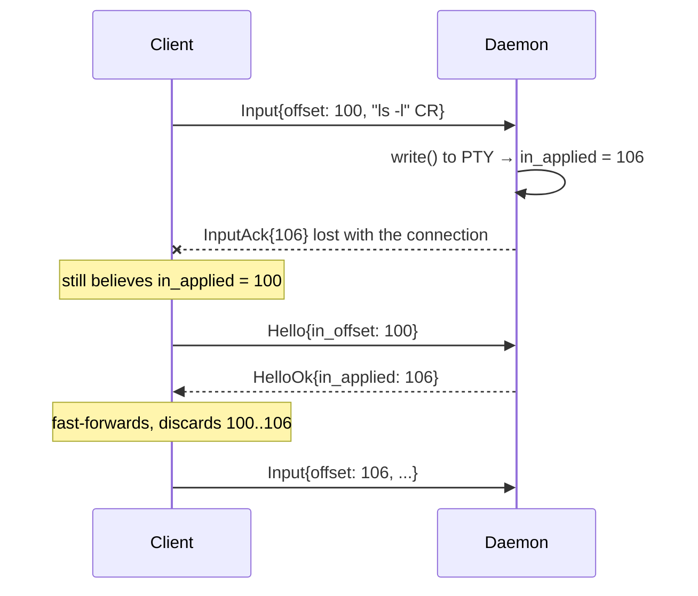
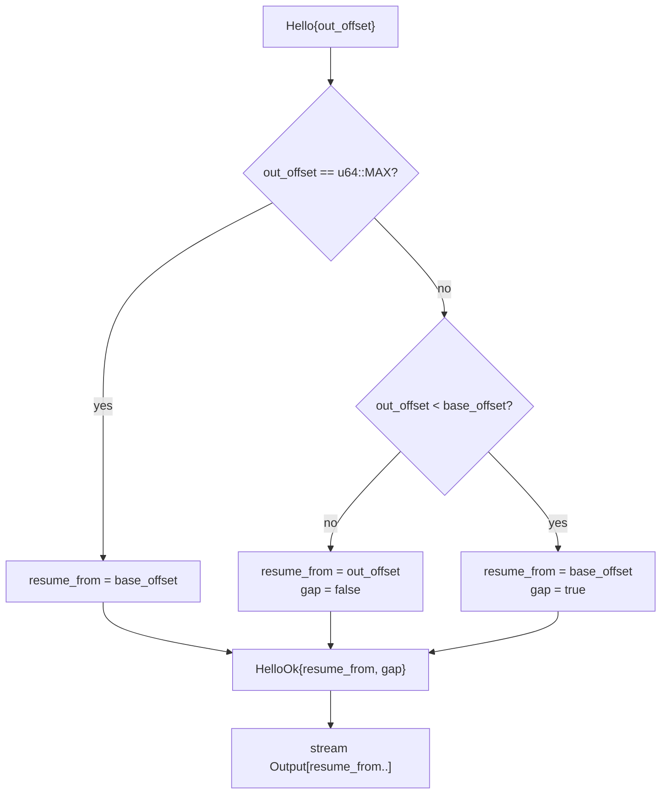
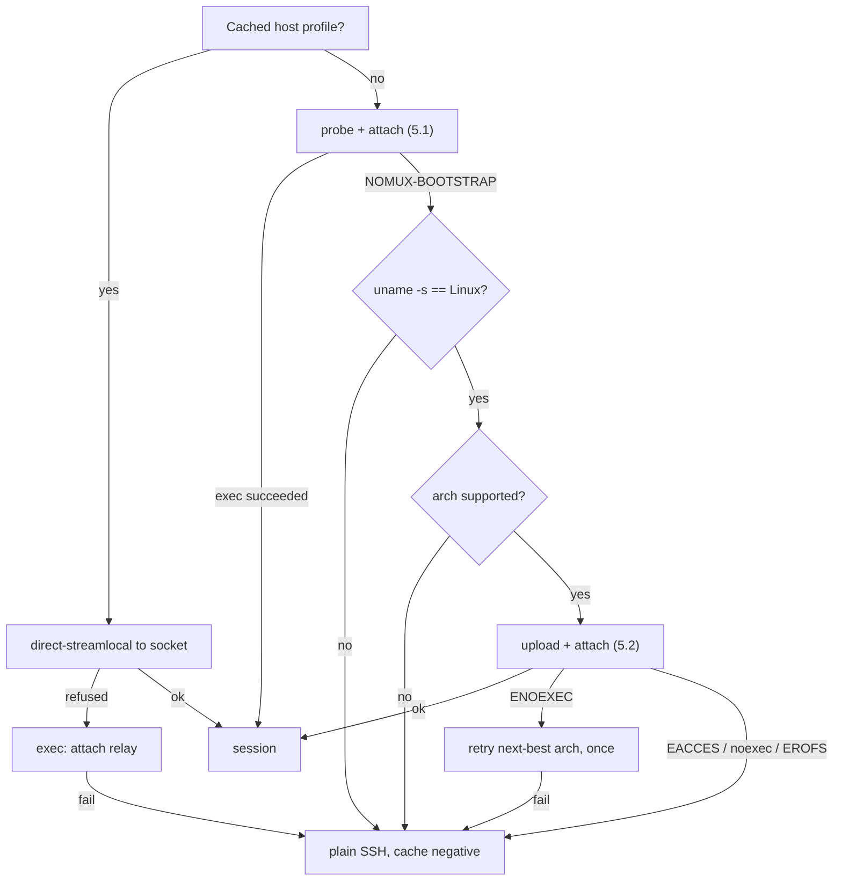
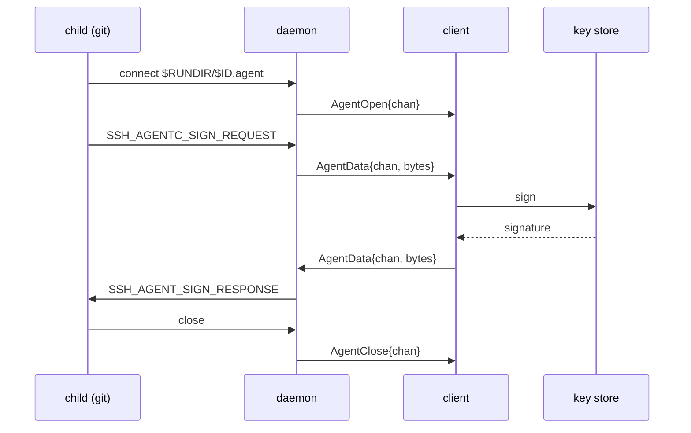

# nomux — Implementation

Low-level detail. Rationale and properties: [DESIGN.md](DESIGN.md).

## 1. Layout

```
crates/nomux-proto/   wire protocol: framing, codec, offsets. No I/O, no unsafe.
crates/nomux/         the binary: daemon, attach relay, probe.
```

`nomux-proto` is split out because the client project reimplements or links the same
codec; keeping it I/O-free makes it portable and property-testable in isolation.

- Edition 2024, MSRV 1.97.1 (`rust-toolchain.toml`).
- Workspace lints: `clippy::pedantic` + `nursery` + `cargo`, plus `unwrap_used`,
  `expect_used`, `panic`, `indexing_slicing`, `undocumented_unsafe_blocks`.
  Test relaxations live in `clippy.toml`.

## 2. Wire protocol

Spoken end-to-end between client and daemon (§7 relay is transparent).

Private protocol: client and daemon ship as one unit ([DESIGN.md § 2](DESIGN.md#2-scope)).
There is no negotiation and no reserved space for extensions. `Hello.proto` exists
solely to reject a mismatched peer immediately, which happens only in the bounded
skew case of [DESIGN.md § 6.4](DESIGN.md#64-version-skew).

### 2.1 Framing

```
 0        1                     4                        4+len
 +--------+---------------------+------------------------+
 | type   | len      (u24 BE)   | payload                |
 | u8     | 3 bytes             | len bytes              |
 +--------+---------------------+------------------------+
```

`len` caps at `MAX_PAYLOAD` (256 KiB); larger is a protocol error. All integers big
endian. Header is fixed 4 bytes so the reader is a two-stage `read_exact`.

*winsize* is four `u16`s — cols, rows, xpixel, ypixel — the same layout everywhere
it appears.

### 2.2 Messages

| Type | Dir | Name | Payload |
| --- | --- | --- | --- |
| `0x01` | C→D | `Hello` | `u16` proto, `u16` flags, `u64` out_offset, `u64` in_offset, winsize, `u16` term_len, term bytes |
| `0x02` | D→C | `HelloOk` | `u16` proto, `u64` resume_from, `u64` in_applied, winsize, `u8` flags |
| `0x03` | C→D | `Input` | `u64` offset, bytes |
| `0x04` | D→C | `InputAck` | `u64` applied_through |
| `0x05` | D→C | `Output` | `u64` offset, bytes |
| `0x06` | C→D | `OutputAck` | `u64` consumed_through |
| `0x07` | C→D | `Resize` | `u16` cols, `u16` rows, `u16` xpixel, `u16` ypixel |
| `0x08` | D→C | `Gap` | `u64` new_base_offset |
| `0x09` | D→C | `Exit` | `i32` status, `u8` kind (0 = exited, 1 = signalled) |
| `0x0a` | C→D | `Detach` | — |
| `0x0b` | ↔ | `Ping` | `u64` nonce |
| `0x0c` | ↔ | `Pong` | `u64` nonce |
| `0x0d` | D→C | `Error` | `u16` code, UTF-8 message |
| `0x0e` | D→C | `AgentOpen` | `u32` chan |
| `0x0f` | ↔ | `AgentData` | `u32` chan, opaque `ssh-agent` bytes |
| `0x10` | ↔ | `AgentClose` | `u32` chan |

The session id is **not** in `Hello` — it is already fixed by the socket path
(warm) or the `attach <id>` argument (cold).

`Hello.out_offset` of `u64::MAX` means *"I have no state, send me whatever you have"*
— used on a fresh app launch to recover scrollback.

### 2.3 Flags

Both flag fields are exhaustive: an undefined bit is a protocol error, not a
forward-compatibility case ([DESIGN.md § 2](DESIGN.md#2-scope)).

`Hello.flags`:

| Bit | Name | Honoured |
| --- | --- | --- |
| 0 | agent forwarding (§6.7) | Only on the `Hello` that **creates** the session — `SSH_AUTH_SOCK` goes into the child's environment, which cannot be changed afterwards |
| 1 | repaint with `ctrl_l` rather than `winch` (§4.3) | Every attach; it costs nothing to restate, and only the client knows what is on the screen |

`HelloOk.flags`:

| Bit | Name |
| --- | --- |
| 0 | `gap` — output was dropped before `resume_from` |
| 1–2 | linger state: 0 unknown, 1 disabled, 2 enabled (§6.2) |
| 3 | an agent socket is being served, so `AgentOpen` may arrive |

## 3. Offsets and exactly-once input

Both directions are byte streams with absolute `u64` offsets, not per-frame
counters. Offsets are the offset of the frame's **first** byte.

Output is at-least-once and idempotent: the client discards anything below its
`next_expected` offset.

Input must be **exactly-once** — replaying a partially applied keystroke buffer into
a shell is how a truncated `rm -rf` gets executed. The daemon's `in_applied` is
authoritative, advanced only after `write(2)` to the PTY master returns:



Had the client blindly resent its unacked buffer, `ls -l\r` would run twice. The
absolute offset lets the daemon drop the overlap precisely — a partial overlap is
trimmed, not rejected.

Rules:
- Daemon drops any `Input` fully below `in_applied`; trims a straddling one.
- `Input` above `in_applied` is a gap in the input stream → `Error` + close. The client must not skip.
- `OutputAck` is advisory. It never trims the ring (§4); it exists so a reconnecting client that lost its own state can be told where it was.

`in_applied` advances when the daemon takes ownership of the bytes — when they are
queued for the PTY master — not when `write(2)` for them returns. The master is
non-blocking (§6.1), so those are different moments: a child that has stopped
reading leaves input queued for as long as it likes. The queue is in the daemon's
own memory and is never re-applied, so the client's invariant holds; and losing it
means losing the daemon, which ends the session anyway.

The other half of the invariant is the client's. An `Input` frame that was written
but not yet read is **not** safe: a client that closes with output still queued
makes the kernel send RST, which discards the socket's buffers in both directions.
So a reconnecting client resends from the daemon's `in_applied`, never from what it
believes it sent. `crates/nomux/tests/chaos.rs` exercises exactly this.

## 4. Ring buffer

Fixed capacity, allocated once. `VecDeque<u8>`, drained via `as_slices` to write
without copying.

Capacity defaults to 4 MiB and is overridable per daemon with `NOMUX_RING_BYTES`.
The right value is host-dependent — a machine running the §5.1 cap of eight sessions
pays it eight times over — and an unparseable or zero value falls back to the
default rather than refusing to start, since a mistyped tuning variable should never
cost someone their session.

```
        base_offset                              end_offset
             |                                        |
             v                                        v
   ..........[========== retained bytes ==============]
   dropped                  capacity
```

- Writer (PTY reader task) always drains the PTY, attached or not. If full, it advances `base_offset`, discarding oldest bytes, and sets `gap_pending`.
- Reader (client writer task) serves `[max(from, base_offset) .. end_offset]`.
- Never trimmed on ack. A full rolling window is the scrollback a fresh client gets.

### 4.1 Backpressure

The PTY drain must never block on a slow or absent client. Precedence: keep reading
the PTY, drop from the ring's head. A stalled client causes a gap, never a frozen
shell.

### 4.2 Attach with `from < base_offset`



At attach time the gap is reported by `HelloOk`'s flag alone; the standalone `Gap`
frame is for overflow that happens *mid-stream*, while a client is attached.

### 4.3 Gap handling

On `gap = true` the byte stream is discontinuous and the client's emulator may be
mid-escape-sequence. Recovery, mirroring `dtach -r`:

1. Client resets its emulator locally — `ESC c` is correct but heavy-handed (drops scroll region and charset); `ESC [ ! p` + `ESC [ 2J` + `ESC [ H` is the softer default.
2. Daemon triggers a repaint from the child via a `TIOCSWINSZ` dance: set `cols-1`, then the real `cols`. The resulting two `SIGWINCH`es make most full-screen programs redraw.
3. Repaint policy is the client's, restated in each `Hello` (§2.3): `winch` (default) or `ctrl_l` (write `0x0c` to the PTY — better for a bare shell prompt, destructive inside an editor). Only the client knows whether the user is looking at an editor or a prompt, and it costs nothing to say so on every attach.

`ctrl_l` goes through the same queue as client input rather than straight to the
master, so it cannot overtake keystrokes already accepted or block on a full PTY
buffer. It is not client input, so `in_applied` does not move for it.

Neither restores a plain shell's lost scrollback. That is inherent to byte-stream
replay and accepted; see [DESIGN.md § 10](DESIGN.md#10-open-questions) for the
`libvterm` snapshot alternative.

## 5. Bootstrap

### 5.1 Probe and attach in one round trip

```sh
p=${XDG_DATA_HOME:-$HOME/.local/share}/nomux
exec "$p/nomux-$VER" attach "$ID" 2>/dev/null
echo "NOMUX-BOOTSTRAP $(uname -s) $(uname -m) $p"
```

`exec` replaces the shell on success, so the `echo` is unreachable unless the binary
is missing or unrunnable. Warm cost: zero extra round trips.

### 5.2 Upload and attach in one round trip

```sh
p=${XDG_DATA_HOME:-$HOME/.local/share}/nomux
mkdir -p "$p" && cat > "$p/.up.$$" && chmod 755 "$p/.up.$$" \
  && mv -f "$p/.up.$$" "$p/nomux-$VER" && exec "$p/nomux-$VER" attach "$ID"
```

- Temp-then-`mv` is atomic within one filesystem and avoids `ETXTBSY` — you cannot write over a running binary.
- Version in the filename: an upgraded client cannot break sessions an older daemon still holds.
- Transfer over an **exec channel with `cat`**, not SFTP. `Subsystem sftp` gets disabled on hardened hosts, and modern `scp` is SFTP underneath. SSH channels are 8-bit clean, so no base64 tax.
- Enable `zlib@openssh.com` on this channel: ~3× on a static binary, requiring nothing on the remote.

### 5.3 Decision tree



`uname -m` lies on a 32-bit userland over a 64-bit kernel, hence the one ENOEXEC
retry. All negative results are cached per-host so a hardened box is not re-probed
on every reconnect.

## 6. Daemon

### 6.1 PTY and child

Via `rustix` rather than raw `libc`, so almost none of this needs `unsafe`.

1. `openpt(O_RDWR | O_NOCTTY | O_CLOEXEC)`, `grantpt`, `unlockpt`, `ptsname`.
2. `fork`. In the child: `setsid()`, open the slave `O_NOCTTY | O_CLOEXEC` (acquiring it as controlling terminal via `ioctl_tiocsctty`), `dup2` slave → 0/1/2, restore `SIGHUP` to `SIG_DFL` (§6.2 leaves it ignored in the daemon, and an ignored disposition survives `exec`), `execv`.

`O_CLOEXEC` on both ends is what keeps them out of the child. Without it every
process the user runs holds a writable descriptor onto its own PTY master, and
anything that walks `/proc/self/fd` — or writes to a descriptor it did not open —
can inject output into the stream or read the user's keystrokes. The child keeps
its stdio regardless, because `dup2` onto 0/1/2 clears the flag on the copies.
3. Parent sets the initial `TIOCSWINSZ` from `Hello` before the first read.
4. Master is set non-blocking; the event loop is `poll` over {master, listener, client fd, agent socket, one fd per agent channel}.

The master **must** be non-blocking. A child that stops reading fills the PTY's
input buffer, and in raw mode the line discipline throttles rather than discarding
— so a blocking `write` parks the whole event loop inside the kernel until the
child reads again, freezing output for a session whose only fault was a `sleep`.
Unwritten input waits in the daemon's queue instead, and the poll set asks for
`POLLOUT` only while there is something to write.

The poll set is variable-length and each entry is tagged with what it belongs to,
rather than being read back by position. Agent forwarding makes the size depend on
how many channels are live, and an index-arithmetic slip there would silently
apply one descriptor's readiness to another.

**The SSH channel must not request a PTY.** nomux allocates its own; if sshd
allocated one too there would be two line disciplines stacked, giving double echo,
doubled `\r\n` translation and broken raw mode. The channel is a raw byte pipe and
nomux owns the only PTY — which is also why `TERM` arrives in `Hello` (§2.2) rather
than from sshd.

### 6.1.1 What the child runs

Whatever a plain `ssh host` would have run, because nomux is *already inside* an SSH
session and inherits its setup rather than reconstructing it. PAM has run, and
`HOME`, `USER`, `PATH` and `SSH_*` are already in the environment.

- **Login shell, dash-prefixed**: `execv(shell, ["-bash", ...])`, not `["bash", ...]`. That leading `-` is what sshd does for an interactive session and what causes `/etc/profile` and `~/.bash_profile` to be sourced. Omitting it yields a stunted environment that users correctly perceive as broken.
- **Shell selection**: `$SHELL` as inherited, else the password database, else `/bin/sh`. The middle step is `/etc/passwd` parsed directly rather than `getpwuid`: in a static musl binary those are the same thing, since NSS modules cannot be loaded into a static executable, and doing it in Rust keeps the lookup safe and testable. The cost is not seeing LDAP or NIS users, who fall through to `/bin/sh` — as they would with `getpwuid` anyway.
- **Working directory**: `$HOME`, else the directory the attaching connection was in, else `/`. The daemon itself has already moved to `/` (§6.2), so this has to be set explicitly or the shell would start there.
- **Environment**: inherited wholesale. Remove nomux scaffolding, set `TERM` from `Hello`, `NOMUX_SESSION=<id>`, and — when agent forwarding is enabled — `SSH_AUTH_SOCK=$RUNDIR/<id>.agent` (§6.7). Change nothing else.
- **No PAM.** It already ran for the SSH login, and the daemon is unprivileged.
- No client-supplied command in v1. A one-shot remote command has no reason to be persistent; it stays on plain SSH.

The environment is a snapshot of the connection that *created* the session, frozen
for its lifetime — a later reconnect may carry a different agent socket, `DISPLAY`
or `AcceptEnv` values that the child can never see, because a running process's
environment cannot be mutated. Indirection through the run directory (§6.6) is the
only available fix, and only for variables that name a path.

### 6.2 Detachment from the login session

```
fork → parent _exit
  setsid
    chdir "/"
    close inherited fds; 0/1/2 → /dev/null
    ignore SIGHUP, SIGPIPE
```

The classic second fork is deliberately absent. Its only purpose is to leave the
daemon a non-session-leader so it cannot acquire a controlling terminal by opening
a tty — but a controlling terminal is acquired only by opening one *without*
`O_NOCTTY`, and this binary opens exactly two ttys, both with it (§6.1). The
property is held by construction at the two lines that could break it, rather than
by a fork whose reason would have to be rediscovered.

`chdir "/"` happens after the run-directory paths are resolved and the socket is
bound, and the child is given its own working directory (§6.1.1) — otherwise the
shell would start in `/` instead of the user's home. What it buys is that a session
running for a week cannot keep a removable or network mount busy.

`SIGHUP` is ignored in the daemon and restored to `SIG_DFL` in the child before
`exec`, since an ignored disposition survives `exec` and a child that shrugs off
`SIGHUP` would leave reaping to `SIGKILL` alone. `SIGPIPE` needs nothing: the Rust
runtime ignores it at startup and resets it for spawned children.

`systemd-logind` with `KillUserProcesses=yes` kills the daemon at logout regardless.
The only real fix is `loginctl enable-linger $USER`. The daemon detects the state
and reports it through `HelloOk` flags (§2.3); it does not attempt to work around
it.

Detection reads the files `logind` itself reads — `/run/systemd/system` for "is
this a `logind` host at all", then `/var/lib/systemd/linger/<user>` — rather than
running `loginctl show-user -p Linger`. Two `stat` calls on the session-start path,
versus a D-Bus round trip that can block for its full 25-second timeout on a busy
or broken bus and turn "linger is off" into "the session would not start". Absence
of the marker is a definite *disabled*; only a lookup that fails for some other
reason is *unknown*, and the client must not warn on unknown.

Most distributions ship `KillUserProcesses=no`, where the double-fork alone suffices.

### 6.3 Socket

Session ids come from the client and are used directly as filename components, so
they are validated before touching the filesystem — `nomux_proto::is_valid_session_id`:

```
1..=64 bytes, each of [A-Za-z0-9_-]
```

This rejects `..`, `/`, `.`, empty, NUL and non-ASCII outright, so path traversal is
impossible by construction rather than by escaping. Both ends validate: the client
before minting, the daemon before use. An invalid id is a hard error, never sanitised
into something valid — silently rewriting an id would attach the user to the wrong
session.

Path precedence:

1. `$XDG_RUNTIME_DIR/nomux/<id>.sock` — tmpfs, but removed on last logout unless linger is on.
2. `$XDG_STATE_HOME/nomux/run/<id>.sock`, default `~/.local/state/nomux/run/`.

Directory `0700`, socket `0600`. Filesystem sockets only — never abstract sockets,
which are namespace- rather than permission-scoped and would be reachable by any
local user.

Spawn race (two clients attaching at once): `flock(LOCK_EX | LOCK_NB)` on
`<id>.lock`; the loser polls for the socket. A stale socket is one where `connect`
returns `ECONNREFUSED` — unlink and respawn. `EACCES` is not staleness.

### 6.4 Multiple clients

Exactly one attached client. A second `Hello` on a live session takes over; the
previous connection receives `Error{TAKEOVER}` and closes.

**The `Hello` is what takes over, not the `connect`.** A newly accepted connection
waits as *pending* and owns nothing until it greets. This is not a nicety: `list`
probes every socket with a bare `connect` to decide which daemons are alive (§6.6),
and so does the spawn race in §6.3. If connecting counted as attaching, listing
sessions would evict the user from all of them — permanently, since the client is
told never to auto-reconnect after `TAKEOVER`. A connection that greets with
anything other than `Hello` is refused on its own terms and the session keeps its
client. Only one connection may be pending at a time; a second replaces it.

The eviction's final write is bounded by a deadline. The connection being replaced
is usually one that has *stopped reading* — that is what a takeover recovers from —
and an unbounded blocking write to it would park the entire daemon in the kernel:
no PTY drained, no client served, no reaping, until a peer that may never read
again decides to. Its queued output is dropped first; the arriving client replays
it from the ring anyway.

No read-only mirrors and no session sharing — there is one client per session by
construction, and the takeover case exists only to recover from a half-dead
connection the daemon has not yet noticed.

### 6.4.1 Event ordering

Within one `poll` iteration the client is serviced **before** the listener. A single
wakeup can report both a readable client and a pending connection; accepting first
would replace `self.client`, dropping the outgoing `Conn` while a frame it had
already delivered was still unread in the socket buffer. Input vanished whenever a
reconnect landed in the same iteration as a keystroke — reliably, under load.
`accept` additionally drains the outgoing connection once more, covering the
narrower window between the poll returning and the accept running.

A failing client socket is **never** propagated out of the event loop. A client that
closes with output still queued makes the kernel send RST, so the next read yields
`ECONNRESET`; treating that as a daemon error terminated the session over exactly
the kind of unclean disconnect this project exists to survive. Client I/O errors
detach the client and nothing more.

### 6.5 Shutdown

Child exit → `waitpid` → flush the ring to any attached client → `Exit` frame →
unlink run files → exit. Linger briefly (default 5 s) so a client reconnecting into
the race still collects the final output and status.

The order is load-bearing and the code enforces it in one place: `Exit` is queued
by the output pump, only once everything the child wrote has been queued ahead of
it. A client that closes the tab on `Exit` and is handed it first — which is what
happens if the handshake sends it — loses the whole transcript, including whatever
the child said on its way out.

Idle reaping ([DESIGN.md § 5.2](DESIGN.md#52-reaping)) is self-inflicted, not
external: the daemon stamps `last_detach` on losing a client and arms a `poll`
timeout against it. On expiry it sends `SIGHUP` then `SIGKILL` to the child's process
*group* — not just the child, or backgrounded grandchildren survive — and exits
through the same path. No cron, no supervisor, nothing to install.

### 6.6 Frozen control surface

`nomux kill <id>` and `nomux list` must work against a daemon of *any* version,
including one older than the binary invoking them. They are the escape hatch that
makes the N-1 codec policy in [DESIGN.md § 6.4](DESIGN.md#64-version-skew) safe.

The contract is therefore the **on-disk layout**, not a protocol subset:

```
$RUNDIR/<id>.sock    unix socket   0600
$RUNDIR/<id>.pid     daemon pid, ASCII, newline-terminated
$RUNDIR/<id>.lock    flock target for spawn races
$RUNDIR/<id>.label   UTF-8 display label, no newline, <= 256 bytes
$RUNDIR/<id>.agent   ssh-agent socket, 0600 (§6.7)
```

- `list` reads the directory and probes each socket with `connect`; `ECONNREFUSED` means stale, and stale entries are unlinked. The probe is safe because connecting is not attaching (§6.4) — it costs a live session nothing.
- `kill` reads the pidfile, sends `SIGTERM`, waits up to 2 s, then `SIGKILL`, then unlinks all five files.

`<id>.label` exists because ids are opaque per-tab identifiers
([DESIGN.md § 5.1](DESIGN.md#51-identity)). Without it, a client that has lost its
state sees only UUIDs and cannot tell the user which session was which. It is
written once at session creation and is advisory — never parsed, never used for
lookup, and a missing or malformed label degrades `list` output but nothing else.

It arrives as `nomux attach <id> --label <text>`, which `attach` passes to the
daemon it spawns; a later attach to a live session ignores it, because the label
belongs to the session rather than to the connection. A command-line flag rather
than a `Hello` field because the writer is part of the frozen on-disk layout and
should not depend on the protocol that layout exists to outlive. The daemon strips
control characters and truncates to 256 bytes on a character boundary: the value is
a tab title typed by a human, `list` writes it straight to a terminal, and a label
containing `ESC ]0;` would otherwise retitle the window of whoever ran it.

Neither opens a session, sends a frame, or reads `PROTOCOL_VERSION`. This layout is
frozen: filenames, permissions and pidfile format may never change. Everything
version-dependent lives behind the socket.

Corollary: a *new* binary can reap an *old* daemon, so recovery does not depend on
the old binary still being present on the host.

### 6.7 Agent forwarding

nomux forwards `ssh-agent` itself rather than borrowing sshd's forwarded socket.
The daemon **listens** on `$RUNDIR/<id>.agent` and proxies each connection to the
client as a sub-channel; the client answers from its own key store.



Why not refresh a symlink to sshd's socket on each attach: that requires reading the
new connection's environment, which means running a process, which the warm resume
path (§5.3) deliberately does not do. A socket the daemon owns is stable for the
session's whole life, never dangles, and needs no environment at all.

Mechanics:

- Channel ids are `u32`, allocated by the daemon — the only opener — monotonically and never reused within a session, so a close/open pair crossing in flight cannot alias.
- `AgentOpen` is optimistic: no ack. A client that cannot serve replies `AgentClose`.
- At most `MAX_AGENT_CHANNELS` (8) concurrent; beyond that the daemon closes immediately rather than queueing.
- Payloads are opaque. The daemon never parses the agent protocol — it is a byte pipe, exactly like the PTY stream.
- **While detached, connections are accepted and closed immediately.** A `git push` with no client attached fails fast with the same error as a missing agent, rather than hanging until reattach. The same applies the moment a client leaves or is taken over: every open channel is dropped, since nothing can answer a signature request any more, and the waiting process should learn that now rather than at reattach.
- No flow control of its own, but two hard bounds. While the client's write queue is saturated the daemon stops reading agent sockets, leaving the bytes in the kernel's buffer where the peer blocks on them; and a channel whose local peer has stopped reading is closed once its queue passes 256 KiB, rather than held on the client's behalf. An agent exchange is a few hundred bytes, so both limits are two orders of magnitude clear of real traffic.
- A transient `accept` failure — `EMFILE`, `ECONNABORTED` — costs that one connection and nothing else. Only a bind failure degrades the session, because only a bind failure is permanent; dropping the listener on a passing error would leave `SSH_AUTH_SOCK` in the child pointing at a socket nobody serves.
- The socket is bound when the session is created, and only then. Turning forwarding on later would mean changing `SSH_AUTH_SOCK` in a running process, which is not possible; the client re-creating the session is the only path.
- A socket that cannot be bound is not fatal. The session starts without forwarding and `HelloOk` says so, because a session without an agent is worth having and one that refuses to start is not.

Security:

- The socket is `0600` inside the `0700` run directory, so reachable only by the session's own user — the same exposure as sshd's forwarded socket.
- **It works without `ForwardAgent`**, which means it bypasses a deliberate user decision. It must therefore be opt-in per host, defaulting off, and the client must never enable it silently.
- If sshd forwarding is also active, `SSH_AUTH_SOCK` is set by sshd and then overwritten by the daemon (§6.1.1). Ours wins.
- Better than `ssh -A` in one respect: because the client holds the keys and sees each request, it *can* prompt per signature or show which session is asking. Plain agent forwarding is unconditionally silent.

## 7. Attach relay

`nomux attach <id>` when `direct-streamlocal` is unavailable. Deliberately dumb:

- `poll` on stdin/stdout and the socket, moving bytes with `splice(2)` and falling back to a userspace copy.
- No frame parsing, no buffering beyond the pipe.
- Spawns the daemon (§6.3) if the socket is absent, then connects.
- Half-close propagation: EOF on stdin → `shutdown(SHUT_WR)` on the socket, keep draining the other direction.

Protocol logic exists only in the daemon. The relay must never need a version bump.

`splice` needs one end of each pair to be a pipe, and whether that holds is a
property of the host, not of this code: under sshd our stdio is a pipe on some
builds and a socketpair on others, while the peer is always a unix socket. So it is
discovered by trying — one refused syscall per direction, latched off for the rest
of the run — rather than by probing. Measured over 2 MiB in each direction: 68
syscalls and no userspace copy at all where stdio is a pipe, against 544 where it is
a socketpair and the fallback takes over.

Two paths through the one component that must never break is worth being uneasy
about, so they cannot interleave: `splice` is attempted only while that direction's
buffer is empty, and a `splice` never puts anything into it. A direction is
therefore either draining userspace bytes or moving kernel pages, never both, and
the choice cannot reorder them.

`SPLICE_F_NONBLOCK` applies only to the pipe end of the pair, so the socket has to
be non-blocking too — otherwise a splice into a full socket parks the whole relay
in the kernel with the other direction unserved. That is what makes the buffered
write path live rather than the dead code it was when the socket blocked.

## 8. Build

Targets:

| Triple | Covers |
| --- | --- |
| `x86_64-unknown-linux-musl` | Most servers |
| `aarch64-unknown-linux-musl` | ARM servers, Apple-silicon VMs, most SBCs |
| `armv7-unknown-linux-musleabihf` | Older SBCs |
| `riscv64gc-unknown-linux-musl` | Emerging |

`ppc64le` / `s390x` are deliberately omitted until asked for.

`scripts/build-release.sh` builds all four, writes `SHA256SUMS`, and exits non-zero
if any binary misses the budget.

**No cross toolchain.** `rust-lld` links all four, including the host target, and
each `rust-std` component ships the musl CRT objects and `libc.a` beside it in
`self-contained/`. So `rustup target add` is the entire setup: no gcc, no zig, no
sysroot. This works because the tree is pure Rust — rustix is on its `linux_raw`
backend, so nothing links a C object. `zig cc` was evaluated as the documented
alternative and rejected: it produces binaries 8–19% smaller than `rust-lld` against
rust's bundled musl, but its own musl version is not pinned by
`rust-toolchain.toml`, which works directly against the reproducibility requirement
below. It remains the fallback for the day a dependency needs a real C compiler.
`riscv64gc-unknown-linux-musl` is the one target of the four whose spec does not
default to `crt-static`; left alone it attempts a dynamic link and fails on
`-lgcc_s`.

Size matters because the cold upload happens over cellular. Release profile:
`opt-level = "z"`, `lto = "fat"`, `codegen-units = 1`, `panic = "abort"`,
`strip = "symbols"`. Budget ≤ 400 KiB per arch.

**The released standard library does not fit.** Measured, same source:

| Target | stable 1.97.1 | + `build-std` + `panic=immediate-abort` |
| --- | --- | --- |
| `x86_64-unknown-linux-musl` | 492 KiB | 147 KiB |
| `aarch64-unknown-linux-musl` | 439 KiB | 138 KiB |
| `armv7-unknown-linux-musleabihf` | 471 KiB | 141 KiB |
| `riscv64gc-unknown-linux-musl` | 442 KiB | 121 KiB |

The panic machinery — formatting, backtrace symbolisation, `gimli`, `addr2line` —
is most of that, and it cannot be dropped from a precompiled `std` however the
release profile is tuned. `-Z build-std` **alone earns nothing** (476 KiB → 447 KiB,
still over); `-Cpanic=immediate-abort` is the entire win. So it is not an opt-in
profile, it is the only configuration that ships, and the cost is a nightly
compiler and panics that abort without a message. That is acceptable only because
the lint wall in `Cargo.toml` already denies `unwrap`, `expect`, `panic` and
`indexing_slicing`. `NOMUX_STABLE_STD=1` builds against the pinned stable toolchain
instead, and is expected to fail the size gate; it exists to keep that cost visible.

Builds are reproducible: the client pins a SHA-256 per arch and verifies after
upload. Three `--remap-path-prefix` flags are what make that true — for
`$CARGO_HOME`, the sysroot and the checkout — because rustc bakes absolute paths
into panic location strings, and an unremapped binary contains the builder's home
directory 56 times over. Note that the obvious test lies: two builds on one machine
match even without remapping. The real check is grepping the artifact for the
builder's home. Release builds must pin a **dated** nightly (`NOMUX_NIGHTLY`), since
a floating one moves the bytes the client pinned.

## 9. Testing

| Layer | Approach | Where |
| --- | --- | --- |
| Codec | `proptest` round-trip; truncated, oversized and malformed frames must error, never panic. | `crates/nomux-proto/` |
| Ring buffer | Model-based against a reference `VecDeque`, asserting `base_offset` monotonicity and that served ranges are byte-exact. | `src/ring.rs` |
| Exactly-once input | The §3 scenario, replayed from a randomly chosen earlier offset after every disconnect. | `tests/chaos.rs` |
| Session | Spawn daemon → write → sever the socket mid-stream → reattach → assert the output resumes exactly where it left off. | `tests/session.rs` |
| Gap | Capacity forced small; assert `Gap` is emitted and `base_offset` is exact. | `tests/session.rs`, `tests/chaos.rs` |
| Chaos | Randomised disconnect injection, seeded and reproducible, under an escape-heavy full-screen stream and under `yes`. | `tests/chaos.rs` |

The two invariants that matter: **no duplicated input, ever**, and **no lost output
unless a `Gap` was reported**.

The chaos suite covers what a shell transcript does not. A byte lost inside a CSI
or sixel sequence does not lose a character, it changes the meaning of everything
after it — so the escape-heavy case compares the reconstructed stream against the
exact bytes the child wrote, rather than looking for a marker in it. Its emitter
pauses briefly every few hundred rounds, without which the child outruns the
client, the daemon coalesces the run into two or three maximum-size frames, and
there is almost nowhere for a disconnect to land. Seeds come from
`NOMUX_CHAOS_SEED`, and every failure message carries the seed that produced it.

A regression test that cannot fail is not a test. The event ordering of §6.4.1 can
no longer be reverted by hand — the code that made it wrong does not compile any
more — so the pre-fix ordering lives behind `--cfg nomux_fault_injection`, and
`scripts/verify-takeover-guard.sh` asserts that the guard *fails* under it. It is a
`const` rather than a `#[cfg]` block so both orderings stay type-checked and the
shipped binary is unaffected either way.

The script runs the guard twice, because the bug only bites when the input and the
`Hello` that evicts its sender land in one wakeup, and whether that happens is
otherwise a matter of microseconds. `--cfg nomux_fault_settle` pauses the daemon
before each `poll` and forces that interleaving alone: the guard must still pass,
which is what shows the second run fails because of the ordering rather than the
delay.

## 10. Exit codes

`nomux attach` reports the fate of *the relay*, not of the child:

| Code | Meaning |
| --- | --- |
| 0 | The relay ended cleanly: the client detached, or the session ended and the `Exit` frame was delivered |
| 64 | Malformed invocation (`EX_USAGE`) |
| 126 | Session exists but is unattachable (permissions, protocol) |
| 127 | No such session and spawn failed |

The child's own status is **not** propagated through this exit code, and the
`128+n` convention is the client's to apply. The status arrives in the `Exit` frame
(§2.2), which the relay cannot read without parsing frames — precisely what §7
forbids, because protocol logic must exist in exactly one place. The client is also
the side that can do something useful with it; a relay exit code is invisible to
the user behind an SSH exec channel.

This was previously specified the other way round, as "1–125: child's own status,
propagated". Nothing implemented it, and implementing it would have meant teaching
the relay the protocol. The specification was wrong, not the code.
