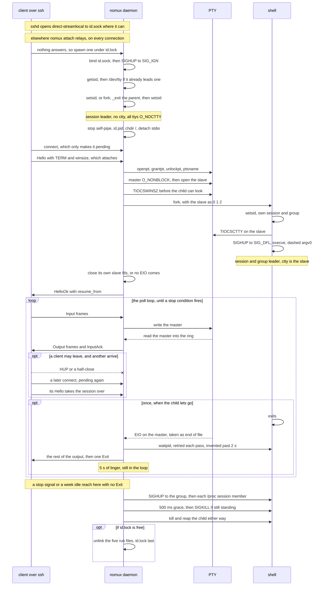

> [!WARNING]
> **Experimental.** This project is AI-generated and has not seen real world usage.

# nomux

A single static Linux binary that runs on an SSH server and keeps a terminal
session alive across the loss of the SSH connection that created it.

Persistence without a multiplexer: no prefix key, no panes, no status bar, no
rewritten `TERM`. Byte-exact passthrough, so sixel, OSC 52, hyperlinks, mouse
reporting and scrollback all work unchanged — up to the ring's capacity; a
disconnect that outlasts it is reported as an explicit gap rather than silently
truncated.

```
nomux daemon <session-id>   Own a PTY session (normally spawned by `attach`)
nomux attach <session-id>   Relay stdio to a session, spawning it if absent
nomux probe                 Report OS, architecture and install path
nomux list                  List sessions in the run directory
nomux kill <session-id>     Terminate a session and unlink its run files

  --label <text>            Display name for `list`, recorded at session creation.
                            Honoured by `daemon` and `attach`; `kill` parses it and
                            ignores it, the label belonging to the session
  --version, -V             Print version and protocol revision
  --help, -h                Print this usage
```

Four properties drive the design:

- **Byte-stream replay, not screen-state sync** — no terminal emulator on the server.
- **Resume over a fresh SSH connection, not a side channel** — inherits ProxyJump, certificates, 2FA, agent forwarding.
- **Zero server-side install** — the client carries the binary and pushes it on first use.
- **No new ports, no new crypto** — the only endpoints are unix sockets at `0600` inside a `0700` directory, one per session, plus one more when agent forwarding is enabled.

**There is nothing to run yet.** This repository is the server half. The SSH client
and terminal emulator that drive it are a separate, unreleased project, and
`nomux attach` speaks a binary frame protocol over stdio rather than a terminal — so
without that client there is no way to get a shell out of this. What works standalone
today is `nomux probe`, `nomux list` and `nomux kill`. The two halves ship as one unit
and are versioned in lockstep, so the wire protocol is private and carries no
stability guarantee.

- [DESIGN.md](DESIGN.md) — problem, properties, architecture, security model, prior art.
- [IMPLEMENTATION.md](IMPLEMENTATION.md) — wire protocol, ring buffer, PTY handling, bootstrap, build.
- [PLAN.md](PLAN.md) — backlog: known gaps, unbuilt features, deferred decisions.

## How it works

One session's whole life, in the calls that make it. The daemon leaves the login
session before it publishes its pid, so no hangup and no keystroke can reach it, and
it opens every terminal `O_NOCTTY` so it never acquires one: the only controlling
terminal here is the child's, taken on the PTY slave in a session of its own. That
detachment and the stop pipe are both best-effort. Topology and states are
[DESIGN.md § 4](DESIGN.md#4-architecture) and [§ 5](DESIGN.md#5-session-lifecycle);
the poll set, and the reasoning behind every call, is
[IMPLEMENTATION.md § 6](IMPLEMENTATION.md#6-daemon).



## Build

Nothing has to be installed by hand: the toolchain is pinned in
`rust-toolchain.toml`, and rustup fetches it on the first command.

```sh
git clone https://github.com/fornwall/nomux && cd nomux
cargo build     # rustup installs the pinned 1.97.1 on first use
cargo test      # the whole suite, doctests included, about 10 s
```

Both runners are supported, and the line above is the one to start with. The tree is
developed against `cargo-nextest` — one more tool, for one property: it runs every
test in its own process, which spares the suite the descriptor sharing that
[PLAN.md § P2](PLAN.md#p2--structure) describes and makes a standing obligation on
new tests.

```sh
cargo install cargo-nextest
cargo clippy --workspace --all-targets
cargo nextest run --workspace
```

Commits are gated by [prek](https://github.com/j178/prek) on shellcheck, formatting,
clippy, tests and doctests:

```sh
prek install            # once, per clone
prek run --all-files    # run the gate manually
```

The hooks trigger on `*.rs`, `*.toml` and `Cargo.lock` — manifests included, because
the lint configuration lives in `Cargo.toml` — and on `*.sh`, because the release
build and the takeover guard are shell and no Rust hook would ever look at them.
Every hook is `language: system`, so prek installs nothing on their behalf:
`shellcheck` and `cargo-nextest` have to be on `$PATH` already, or the first run of
the gate in a fresh clone fails on a missing command rather than on anything in the
tree.

Two things are deliberately left out of the pre-commit gate and run in CI instead,
because both cost far more than a commit should:

```sh
cargo nextest run --workspace --run-ignored all   # includes the 30 s first-attach reap
sh scripts/verify-takeover-guard.sh               # rebuilds under fault injection
```

CI runs a third thing that is in neither list: the whole musl release build below.
It needs a nightly compiler and the two musl targets installed, which makes it the one
check the local hooks genuinely cannot stand in for.

The chaos suite picks its disconnect points from a fixed seed, so a failure
reproduces; `NOMUX_CHAOS_SEED=<n>` explores other interleavings, and every failure
message carries the seed that produced it.

## Release builds

The two shipping binaries come from one script:

```sh
sh scripts/build-release.sh     # → target/dist/, SHA256SUMS, debug companions
```

It builds every musl target, prints a size table with the change against the
per-target baseline in `scripts/size-baseline`, and fails a binary that misses either
the size budget or the growth gate — both numbers are in
[IMPLEMENTATION.md § 8](IMPLEMENTATION.md#8-build). There is no cross toolchain to
install — `rust-lld` links both and each `rust-std` component carries its own
musl objects — but the shipping configuration rebuilds the standard library with
panics compiled out, which needs nightly and its sources:

```sh
nightly=$(cat scripts/nightly-version)
rustup toolchain install "$nightly" --component rust-src,llvm-tools
rustup target add --toolchain "$nightly" \
  x86_64-unknown-linux-musl \
  aarch64-unknown-linux-musl
```

Why the standard library is rebuilt at all, why `scripts/nightly-version` pins a
dated nightly rather than a floating one, and what `NOMUX_STABLE_STD=1`,
`NOMUX_NIGHTLY` and `NOMUX_UPDATE_BASELINE=1` are for are
[IMPLEMENTATION.md § 8](IMPLEMENTATION.md#8-build)'s; when that pin moves is
[PLAN.md § P3](PLAN.md#p3--release-process)'s.

`llvm-tools` is for the debug companions below; `NOMUX_SKIP_DEBUG=1` builds only the
two that ship, for a run that just wants the size table.

Pushing a `v*` tag runs that same build on CI and publishes a release from it: the
two binaries, and `SHA256SUMS` beside them. Verify a download against the file
rather than by eye:

```sh
sha256sum -c SHA256SUMS
```

GitHub computes its own SHA-256 for every release asset at upload time and shows it
in the UI, `gh release view` and the releases API, so the sums can be checked twice
over. The tag has to name the version the binaries report — CI asks the built binary
and fails the release if the two disagree — and what a *client* should do with these
sums, which is the half that does not exist yet, is
[PLAN.md § P3](PLAN.md#p3--release-process)'s.

### Debug companions

The shipping binaries are stripped and abort without a message, so the `SIGQUIT` core
they leave behind names no functions on its own. Each release carries
`nomux-<target>.debug` for that: the same build unstripped, with the symbols and DWARF
the shipping binary drops, and its own `SHA256SUMS.debug`. Nothing needs one to *run*
nomux — they are for reading a core:

```sh
gdb nomux-x86_64-unknown-linux-musl.debug core
```

`SHA256SUMS` deliberately names only the binaries that ship, because
`sha256sum -c` fails on a file it cannot open and nearly everyone downloads only what
they run. Why a companion is a second build rather than the shipping binary stripped
afterwards, and how the two are checked against each other, is
[IMPLEMENTATION.md § 8](IMPLEMENTATION.md#8-build)'s.

## Diagnostics

A daemon has nowhere to write. It redirects its own stdio to `/dev/null` early on
purpose — under `attach` those descriptors are the SSH channel carrying the client's
frame stream, and a diagnostic written there would land in the middle of it — so from
that point on a failure would be silent. Two things answer that.

A session that fails to *start* reports why at the `attach` that tried to start it,
which is where the reason is wanted:

```
$ nomux attach work
nomux: run directory /run/user/1000/nomux: mode 770 lets other users create
       files in it; expected a directory owned by this user, mode 700
```

Everything after that goes to syslog, tagged `nomux`, as `user.err` for failures and
`user.info` for a session beginning or ending. On a systemd host:

```sh
journalctl -t nomux                  # everything nomux has said
journalctl -t nomux -f               # follow, while reproducing something
journalctl -t nomux -p err           # failures only
journalctl -t nomux --since -1h
```

Elsewhere it lands in the system log like anything else — `/var/log/syslog` on
Debian and Ubuntu, `/var/log/messages` on RHEL and Fedora, `logread` under busybox:

```sh
grep nomux /var/log/syslog
```

Reading another user's messages needs privilege, so on a shared host expect to be
root or in `adm`/`systemd-journal`; your own are readable without it. A host with no
syslog at all — a minimal container, typically — silently gets no logging, which is
deliberate: a daemon that refused to start because it could not describe itself would
be worse than one nobody can diagnose.

What is *not* logged is deliberate too. Session ids appear, because they are opaque
and are what `list` and `kill` take. `--label` does not, and neither does a single
byte of terminal traffic: syslog is a host-wide sink, and a session whose whole
footprint is otherwise `0600` files inside a `0700` directory should not announce a
tab title to everyone who can read the system log.

One case stays silent: the shipping build compiles panics down to a bare trap
([IMPLEMENTATION.md § 8](IMPLEMENTATION.md#8-build)), so an abort produces no message
for anything to forward. `SIGQUIT` is left at its default disposition for that reason
— it still dumps core.

## Status

Complete and under test on Linux, and not released: every property above is
implemented in the daemon and covered by the suite, and what is left is the release
process and the client that drives it. The standing state — what works, what is
known to be missing, and what was deferred on purpose — is
[PLAN.md § Status](PLAN.md#status), which is the copy kept current rather than a
second copy that drifts.

## License

[Apache-2.0](LICENSE)
